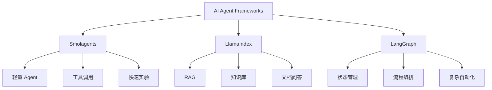

## 一、今天学习目标

今天进入 Hugging Face Agents Course 的第 2 单元：AI 智能体框架。

今天不急着深入代码，核心任务是先建立一张“框架地图”。

我要搞清楚：

- 为什么需要智能体框架
- Smolagents、LlamaIndex、LangGraph 分别是什么
- 它们各自适合解决什么问题
- 我自己的项目未来该怎么选型

---

## 二、一句话理解智能体框架

智能体框架，就是帮助大模型从“只会回答问题”，变成“可以调用工具、执行任务、管理流程、访问资料”的开发框架。

普通 LLM 更像一个会说话的大脑。

Agent 框架让这个大脑拥有：

- 工具调用能力
- 多步骤执行能力
- 外部数据访问能力
- 状态管理能力
- 流程编排能力
- 任务反思和修正能力

---

## 三、为什么需要 Agent 框架？

如果只是普通问答，不一定需要 Agent 框架。

但是如果任务变复杂，就需要框架来帮助大模型完成任务。

| 任务场景 | 普通 LLM 的问题 | Agent 框架的作用 |
|---|---|---|
| 查询网页 | 模型不知道最新信息 | 调用搜索工具 |
| 分析文件 | 模型不能直接读取大量资料 | 接入文档解析和检索 |
| 自动化操作 | 模型只能给建议，不能执行 | 调用工具完成动作 |
| 多步骤任务 | 容易跑偏、忘步骤 | 用流程控制任务 |
| 知识库问答 | 上下文放不下所有资料 | 用 RAG 检索相关内容 |
| 业务流程自动化 | 步骤多、条件多 | 用 Agent 工作流编排 |

---

## 四、三个核心框架地图

| 框架 | 核心定位 | 最擅长什么 | 适合场景 |
|---|---|---|---|
| Smolagents | 轻量级 Agent 框架 | 快速构建简单 Agent | 工具调用、小型智能体、快速实验 |
| LlamaIndex | 数据/RAG 框架 | 连接数据和大模型 | 文档问答、知识库、视频转 SOP |
| LangGraph | 状态图/工作流框架 | 控制复杂 Agent 流程 | 多步骤任务、复杂自动化、多 Agent 协作 |

---

## 五、Smolagents 是什么？

### 1. 一句话理解

Smolagents 是一个轻量级智能体框架，适合快速创建可以调用工具的 Agent。

### 2. 它解决什么问题？

Smolagents 主要解决：

- 让模型理解任务
- 让模型选择工具
- 让模型调用工具
- 让模型根据工具结果继续思考
- 最后输出答案

### 3. 适合做什么？

适合：

- Agent 入门学习
- 快速做 Demo
- 理解工具调用
- 理解 Thought-Action-Observation 流程
- 快速验证一个想法

### 4. 不太适合什么？

不太适合：

- 很复杂的企业流程
- 大规模知识库
- 多节点复杂工作流
- 复杂状态管理

### 5. 我的理解

Smolagents 更像是 Agent 入门工具。

它适合让我先理解：

- Agent 怎么思考
- Agent 怎么调用工具
- Agent 怎么根据工具返回结果继续推理

---

## 六、LlamaIndex 是什么？

### 1. 一句话理解

LlamaIndex 是一个围绕数据和 RAG 的框架，重点是把外部资料变成大模型可以检索、理解、回答的知识系统。

### 2. 它解决什么问题？

大模型本身有几个问题：

- 不知道我的私有资料
- 不能稳定读取大量文档
- 上下文长度有限
- 容易胡说
- 回答没有资料来源

LlamaIndex 主要解决：

- 文档加载
- 文档切分
- 向量化
- 检索
- RAG 问答
- 数据索引
- 知识库搭建

### 3. 适合做什么？

适合：

- B站视频内容整理成 SOP
- Obsidian 知识库问答
- PDF/Word/网页资料总结
- 企业内部文档问答
- 课程知识库
- 客服知识库
- 个人资料库

### 4. 我的理解

LlamaIndex 对我最重要。

因为我现在有大量资料需要沉淀：

- B站课程
- Agent 学习笔记
- SOP
- 项目文档
- 闲鱼资料
- 996tokens 运营文档
- 银行 RPA 经验

这些东西未来都可以用 LlamaIndex 做成自己的知识库。

---

## 七、LangGraph 是什么？

### 1. 一句话理解

LangGraph 是一个用“状态图”控制 Agent 执行流程的框架，适合做复杂、多步骤、可控的智能体工作流。

### 2. 它解决什么问题？

普通 Agent 容易出现：

- 想到哪做到哪
- 步骤不可控
- 中间状态难管理
- 复杂任务容易跑偏
- 出错后不知道怎么恢复

LangGraph 主要解决：

- 流程编排
- 状态管理
- 条件分支
- 循环执行
- 多 Agent 协作
- 人工审核节点
- 复杂任务控制

### 3. 适合做什么？

适合：

- 闲鱼自动化 Agent
- 自动选品流程
- 自动客服流程
- 内容生成流水线
- RPA + LLM 自动化
- 多步骤业务审批
- 复杂 Agent 产品

### 4. 我的理解

LangGraph 更像是 Agent 的流程控制系统。

它不是单纯让模型“回答得更好”，而是让模型按照一套可控流程去完成任务。

这和 RPA 的思想很像。

---

## 八、三个框架怎么选？

| 我的需求 | 优先选择 |
|---|---|
| 快速理解 Agent 如何调用工具 | Smolagents |
| 做简单 Agent Demo | Smolagents |
| 做文档问答 | LlamaIndex |
| 做课程知识库 | LlamaIndex |
| 做视频转 SOP | LlamaIndex |
| 做 Obsidian 知识库问答 | LlamaIndex |
| 做复杂自动化流程 | LangGraph |
| 做闲鱼自动化 Agent | LangGraph + LlamaIndex |
| 做 RPA + 大模型自动化 | LangGraph |
| 做多 Agent 协作系统 | LangGraph |
| 做 996tokens 帮助文档助手 | LlamaIndex |
| 做 996tokens 报错诊断助手 | LangGraph + LlamaIndex |

---

## 九、和我自己项目的关系

### 1. 视频学习转 SOP

适合框架：

- LlamaIndex

原因：

视频文字稿本质上是文档资料。

可以通过 LlamaIndex 做：

- 文本切分
- 重点提取
- 知识检索
- SOP 生成
- 课程知识库

### 2. 闲鱼自动化 Agent

适合框架：

- LangGraph
- LlamaIndex

原因：

闲鱼 Agent 不是简单问答，而是一个完整流程：

1. 抓取商品数据
2. 判断利润
3. 判断竞争度
4. 生成标题
5. 生成文案
6. 判断风险
7. 人工审核
8. 发布商品
9. 回复客户

这个流程需要状态管理，所以 LangGraph 更适合。

如果要接入商品库、话术库、成交记录，就需要 LlamaIndex。

### 3. 996tokens 项目

适合框架：

- 初期不一定需要 Agent 框架
- 后期可以用 LlamaIndex 做帮助文档问答
- 后期可以用 LangGraph 做报错诊断和工单 Agent

可以做的功能：

- 模型选择助手
- API 接入教程助手
- 报错诊断助手
- 价格说明助手
- 用户工单处理助手

### 4. 银行 RPA 工作

适合框架：

- LangGraph

原因：

RPA 本质上就是流程自动化。

如果把 LLM 加进 RPA，就需要：

- 流程节点
- 条件判断
- 工具调用
- 异常处理
- 人工确认
- 状态记录

LangGraph 的状态图思想和 RPA 很接近。

---

## 十、我的学习优先级

从课程顺序看：

1. Smolagents
2. LlamaIndex
3. LangGraph

从我的赚钱和实战角度看：

1. LlamaIndex
2. LangGraph
3. Smolagents

所以我的策略是：

- 课程怎么安排，我先跟着学
- 但心里要知道，未来真正对我最有用的是 LlamaIndex 和 LangGraph
- Smolagents 主要用来理解 Agent 基础机制

---

## 十一、今天真正要掌握什么？

今天不需要掌握所有代码。

今天只需要掌握四个判断。

### 判断 1：什么时候需要 Agent 框架？

当任务需要调用工具、执行步骤、访问外部数据、进行多轮决策时，就需要 Agent 框架。

### 判断 2：什么时候用 Smolagents？

当我想快速做一个简单 Agent Demo，或者理解 Agent 基础机制时，用 Smolagents。

### 判断 3：什么时候用 LlamaIndex？

当任务核心是资料、文档、知识库、检索、问答、SOP 时，用 LlamaIndex。

### 判断 4：什么时候用 LangGraph？

当任务核心是流程、多步骤、状态、分支、自动化、可控执行时，用 LangGraph。

---

## 十二、框架地图

---

## 十三、今日总结

今天的重点不是写很多代码，而是建立 Agent 框架地图。

我的结论：

- Smolagents：适合入门和快速实验
- LlamaIndex：适合知识库、RAG、文档问答、视频 SOP
- LangGraph：适合复杂流程、自动化、多步骤 Agent

对我来说，未来最有价值的是：

- LlamaIndex：把学习资料变成自己的知识库
- LangGraph：把业务流程变成可执行 Agent
- Smolagents：帮助我理解 Agent 的基础原理

---

## 十四、今日金句

我不是在学三个框架的语法。

我是在建立以后做项目时的选型能力。
