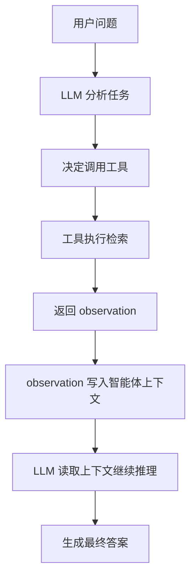
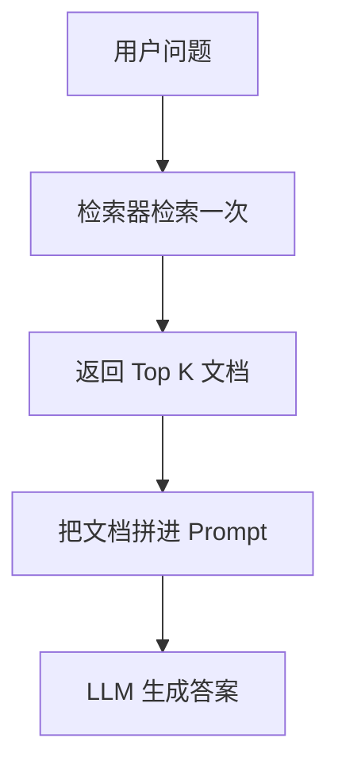
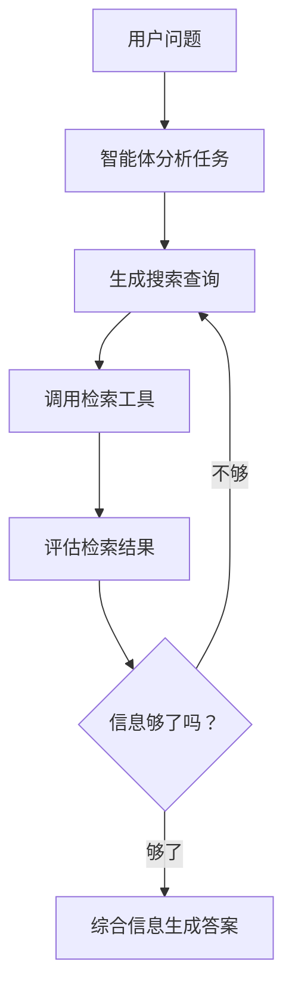
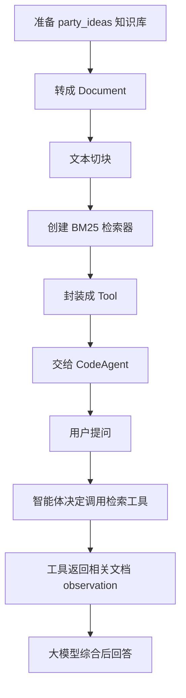

## 1. 本节核心结论

这一节学习的是：如何让智能体具备“查资料”的能力。

普通大模型只能根据已有上下文回答问题，而 RAG 会先从外部知识中检索相关资料，再把检索结果提供给大模型，让模型基于资料生成答案。

智能体驱动的 RAG3，也叫 Agentic RAG，不只是“检索一次然后回答”，而是让智能体自己决定：

- 要不要检索
- 用什么工具检索
- 搜索什么关键词
- 是否需要多次检索
- 检索结果是否相关
- 最后如何综合成答案

一句话总结：

> RAG 是给大模型外挂资料库，Agentic RAG 是让大模型自己学会查资料、判断资料、继续追问资料。

---

## 2. observation 是否会放回 messages？

会。

用户的查询会传给智能体，大模型决定是否调用工具。工具执行之后会返回结果，这个结果通常叫 `observation`。

`observation` 会进入智能体的上下文，也可以理解为继续放入 `messages` 或智能体的 memory 中。下一轮大模型推理时，就能看到这个检索结果。

简化理解：

```python
messages = [
    {"role": "user", "content": "用户的问题"},
    {"role": "assistant", "content": "我需要调用搜索工具"},
    {"role": "tool", "content": "搜索工具返回的 observation"},
    {"role": "assistant", "content": "基于 observation 生成最终回答"}
]
```

在 `smolagents` 里，底层不一定真的叫 `messages`，可能叫 memory、steps、observations 或 agent state，但逻辑是一样的。

执行链路如下：



---

## 3. 传统 RAG 是什么？

传统 RAG 的流程比较固定：



例如用户问：

> 怎么办一场豪华超级英雄主题派对？

传统 RAG 通常会：

1. 把这个问题拿去知识库里检索。
2. 找到最相似的几段资料。
3. 把资料和用户问题一起塞给大模型。
4. 大模型基于资料回答。

## 4. 传统 RAG 的缺点

| 缺点 | 含义 | 举例 |
|---|---|---|
| 通常只检索一次 | 复杂问题一次检索不够 | 派对涉及装饰、娱乐、餐饮，但一次检索可能只搜到装饰 |
| 查询词固定 | 用户怎么问，系统就怎么搜 | 用户说“高端英雄派对”，但资料写的是“luxury superhero gala”，可能搜不到 |
| 过度依赖语义相似 | 只找表面相似内容，容易漏掉间接相关信息 | “蝙蝠侠晚宴布置”可能相关，但不一定排在前面 |
| 不会判断结果质量 | 检索到低质量内容也可能直接塞给模型 | 搜到广告、重复内容、过时内容 |
| 不会主动补查 | 缺少信息时不会继续搜索 | 缺餐饮方案，也不会单独再搜 catering |

传统 RAG 更像：

> 用户问一句，系统查一次，然后回答。

---

## 5. Agentic RAG 是怎么改进的？

Agentic RAG 的关键是：让智能体控制检索流程。

智能体不只是回答问题，它还可以决定如何查资料。



例如用户问：

> 设计一个豪华超级英雄主题派对，包括装饰、娱乐、餐饮。

Agentic RAG 可能会拆成多个检索：

- `luxury superhero party decorations`
- `superhero themed catering ideas`
- `superhero party entertainment ideas`

然后把多次检索结果综合成完整方案。

| 能力 | 传统 RAG | Agentic RAG |
|---|---|---|
| 是否会自己拆问题 | 不会 | 会 |
| 是否会改写搜索词 | 通常不会 | 会 |
| 是否会多次搜索 | 通常不会 | 会 |
| 是否会判断结果是否够用 | 不会 | 会 |
| 是否会选择不同工具 | 通常固定 | 可以 |
| 是否更像人类查资料 | 不像 | 更像 |

---

## 6. DuckDuckGo 是什么？和 smolagents 什么关系？

`DuckDuckGo` 是一个搜索引擎，类似 Google、Bing、百度。

在 `smolagents` 里，`DuckDuckGoSearchTool` 是对 DuckDuckGo 搜索能力的封装。

| 名称 | 作用 |
|---|---|
| DuckDuckGo | 提供网页搜索能力的搜索引擎 |
| DuckDuckGoSearchTool | smolagents 封装好的搜索工具 |
| CodeAgent | 能决定是否调用工具的智能体 |
| InferenceClientModel | 智能体背后的大模型 |

示例代码：

```python
from smolagents import CodeAgent, DuckDuckGoSearchTool, InferenceClientModel

# 初始化搜索工具
search_tool = DuckDuckGoSearchTool()

# 初始化模型
model = InferenceClientModel()

# 创建智能体
agent = CodeAgent(
    model=model,
    tools=[search_tool]
)

# 运行智能体
response = agent.run(
    "Search for luxury superhero-themed party ideas, including decorations, entertainment, and catering."
)

print(response)
```

这段代码的意思是：

1. 创建一个 DuckDuckGo 搜索工具。
2. 创建一个大模型。
3. 创建一个 `CodeAgent`，并把搜索工具交给它。
4. 用户提出任务。
5. 智能体判断需要搜索。
6. 调用搜索工具。
7. 搜索结果作为 observation 返回给智能体。
8. 智能体基于检索结果生成答案。

---

## 7. 智能体的通用套路

智能体的核心套路通常是：

```text
用户任务 -> 模型思考 -> 调用工具 -> 得到 observation -> 再思考 -> 最终回答
```

也可以理解为：

```text
Think -> Act -> Observe -> Think -> Answer
```

只要是工具型智能体，基本都离不开这个循环。

---

## 8. 自定义知识库工具是什么？

DuckDuckGo 是查互联网。

自定义知识库工具是查自己的资料。

例如：

- 公司制度
- 技术文档
- SOP 流程
- 课程笔记
- Obsidian 笔记
- 产品说明书
- 客服知识库
- 银行业务规则

如果你希望智能体回答问题时参考自己的资料，就需要把这些资料做成知识库检索工具。

例如 Alfred 要策划派对，可以准备一个本地知识库：

```text
文档 1：超级英雄派对装饰方案
文档 2：豪华宴会餐饮菜单
文档 3：儿童派对安全清单
文档 4：成人主题派对娱乐流程
文档 5：预算控制模板
```

用户问：

> 给我策划一个豪华超级英雄主题派对。

智能体就可以调用知识库工具：

```python
party_planning_retriever(
    query="luxury superhero party decoration catering entertainment"
)
```

工具返回相关资料后，智能体再进行总结和生成。

---

## 9. 向量数据库是什么？

向量数据库可以简单理解为：

> 把文字变成数字坐标，然后根据“意思相近”来搜索。

例如：

```text
超级英雄派对
漫威主题生日会
蝙蝠侠晚宴布置
```

这些表达不完全一样，但意思相关。向量数据库可以通过语义相似度把它们找出来。

普通关键词搜索更像：

> 你搜“超级英雄”，它就找包含“超级英雄”的内容。

向量搜索更像：

> 你搜“超级英雄派对”，它也可能找到“漫威主题生日会”“复仇者联盟装饰方案”。

---

## 10. BM25 是什么？和向量数据库有什么区别？

课程示例里用了 `BM25Retriever`。

注意：BM25 不是向量数据库，它是关键词检索算法。

| 方法 | 本质 | 特点 |
|---|---|---|
| BM25 | 关键词检索 | 根据关键词、词频、相关度排序 |
| 向量数据库 | 语义检索 | 根据文本意思是否相近来检索 |
| RecursiveCharacterTextSplitter | 文本切块工具 | 把长文档切成小段，方便检索 |

BM25 更像传统搜索：

```text
你搜“超级英雄 派对 餐饮”
它找包含这些关键词最多、最相关的段落。
```

向量搜索更像语义理解：

```text
你搜“高端英雄主题晚宴”
它可能找出“复仇者联盟风格餐桌布置”。
```

所以，课程里如果说“语义搜索”，但代码用的是 BM25，要注意区分：

> BM25 是关键词检索，不是真正的语义向量检索。

---

## 11. RecursiveCharacterTextSplitter 是什么？

`RecursiveCharacterTextSplitter` 是 LangChain 里的文本切分工具。

它的作用是把长文档切成更小的片段。

例如一篇长文档：

```text
派对策划大全.docx
```

可以被切成：

```text
chunk 1：派对主题选择
chunk 2：装饰方案
chunk 3：餐饮设计
chunk 4：娱乐活动
chunk 5：预算控制
```

为什么要切块？

| 不切块的问题 | 切块后的好处 |
|---|---|
| 文档太长，检索不精准 | 返回更具体的相关段落 |
| 容易塞爆模型上下文 | 只返回最相关片段 |
| 成本高 | 成本更低 |
| 噪声多 | 信息更集中 |

---

## 12. 自定义知识库代码

下面这段代码创建了一个派对策划知识库检索工具：

```python
from langchain.docstore.document import Document
from langchain.text_splitter import RecursiveCharacterTextSplitter
from smolagents import Tool
from langchain_community.retrievers import BM25Retriever
from smolagents import CodeAgent, InferenceClientModel


class PartyPlanningRetrieverTool(Tool):
    name = "party_planning_retriever"
    description = "Uses semantic search to retrieve relevant party planning ideas for Alfred's superhero-themed party at Wayne Manor."
    inputs = {
        "query": {
            "type": "string",
            "description": "The query to perform. This should be a query related to party planning or superhero themes.",
        }
    }
    output_type = "string"

    def __init__(self, docs, **kwargs):
        super().__init__(**kwargs)
        self.retriever = BM25Retriever.from_documents(
            docs,
            k=5
        )

    def forward(self, query: str) -> str:
        assert isinstance(query, str), "Your search query must be a string"

        docs = self.retriever.invoke(query)
        return "\nRetrieved ideas:\n" + "".join(
            [
                f"\n\n===== Idea {str(i)} =====\n" + doc.page_content
                for i, doc in enumerate(docs)
            ]
        )


# 模拟派对策划知识库
party_ideas = [
    {"text": "A superhero-themed masquerade ball with luxury decor, including gold accents and velvet curtains.", "source": "Party Ideas 1"},
    {"text": "Hire a professional DJ who can play themed music for superheroes like Batman and Wonder Woman.", "source": "Entertainment Ideas"},
    {"text": "For catering, serve dishes named after superheroes, like 'The Hulk's Green Smoothie' and 'Iron Man's Power Steak.'", "source": "Catering Ideas"},
    {"text": "Decorate with iconic superhero logos and projections of Gotham and other superhero cities around the venue.", "source": "Decoration Ideas"},
    {"text": "Interactive experiences with VR where guests can engage in superhero simulations or compete in themed games.", "source": "Entertainment Ideas"}
]

source_docs = [
    Document(page_content=doc["text"], metadata={"source": doc["source"]})
    for doc in party_ideas
]

# 分割文档以提高搜索效率
text_splitter = RecursiveCharacterTextSplitter(
    chunk_size=500,
    chunk_overlap=50,
    add_start_index=True,
    strip_whitespace=True,
    separators=["\n\n", "\n", ".", " ", ""],
)
docs_processed = text_splitter.split_documents(source_docs)

# 创建检索工具
party_planning_retriever = PartyPlanningRetrieverTool(docs_processed)

# 初始化智能体
agent = CodeAgent(
    tools=[party_planning_retriever],
    model=InferenceClientModel()
)

# 使用示例
response = agent.run(
    "Find ideas for a luxury superhero-themed party, including entertainment, catering, and decoration options."
)

print(response)
```

注意：原代码中 `text_splitter` 前面多了缩进，会导致 `IndentationError`。上面已经修正。

---

## 13. 自定义知识库代码执行逻辑

整体流程如下：



逐步解释：

| 步骤 | 代码 | 作用 |
|---|---|---|
| 定义工具 | `class PartyPlanningRetrieverTool(Tool)` | 创建一个 smolagents 可以调用的工具 |
| 定义工具名 | `name = "party_planning_retriever"` | 智能体识别工具时使用 |
| 描述工具能力 | `description = ...` | 帮助智能体判断什么时候调用工具 |
| 定义输入参数 | `inputs = {"query": ...}` | 规定工具接收一个字符串查询 |
| 创建检索器 | `BM25Retriever.from_documents(docs, k=5)` | 从文档中检索前 5 条相关内容 |
| 执行检索 | `self.retriever.invoke(query)` | 真正查询知识库 |
| 返回结果 | `return "\nRetrieved ideas:\n" + ...` | 把检索结果作为 observation 返回 |
| 创建智能体 | `CodeAgent(...)` | 把模型和工具组合起来 |
| 运行任务 | `agent.run(...)` | 用户给智能体下任务 |

---

## 14. 三个增强能力从哪里体现？

课程里说增强后的智能体能够：

1. 首先检查文档中的相关信息
2. 结合知识库的洞察
3. 在内存中维护对话上下文

对应关系如下：

| 能力 | 代码体现 | 解释 |
|---|---|---|
| 首先检查文档中的相关信息 | `self.retriever.invoke(query)` | 工具先去本地知识库里找相关内容 |
| 结合知识库的洞察 | `agent.run(...)` + 工具返回结果 | 大模型拿到检索结果后，再综合成答案 |
| 在内存中维护对话上下文 | `CodeAgent` 内部机制 | 工具返回的 observation 会进入智能体运行上下文 |

前两个能力在代码中能直接看到。

第三个能力更多是 `smolagents` 框架内部完成的。你没有手动写：

```python
messages.append(observation)
```

但是 `CodeAgent` 内部会维护执行步骤、工具调用结果、历史 observation，然后把这些信息交给下一轮模型。

---

## 15. 这段代码属于什么类型的 RAG？

这段代码属于：

```text
本地知识库检索 + 智能体调用工具 + 大模型生成答案
```

更准确地说，它是 Agentic RAG 的简化版。

它具备：

- 自定义工具
- 本地知识库
- 检索器
- observation
- 智能体调用工具
- 大模型综合回答

但它还不算很强的 Agentic RAG，因为：

- 只有一个工具
- 知识库很小
- 检索策略比较简单
- 没有显式多轮检索
- 没有显式结果验证
- 没有接入网页搜索或其他数据源

---

## 16. Agentic RAG 的高级策略

## 16.1 查询重构

查询重构是指智能体把用户原始问题改写成更适合检索的搜索词。

用户原始问题：

```text
帮我搞一个钢铁侠那种高端派对。
```

智能体改写后：

```text
luxury Iron Man superhero party decorations catering entertainment
```

适用范围：

- 用户问题很口语化
- 用户问题太长
- 用户表达不清楚
- 知识库文档比较正式
- 原始问题和文档用词不一致

## 16.2 多步检索

多步检索是指智能体不是只搜一次，而是根据任务拆成多次检索。

例如用户问：

```text
设计一个豪华超级英雄派对，包括装饰、餐饮、娱乐。
```

智能体可以分三次查：

```text
superhero luxury decoration ideas
superhero themed catering ideas
superhero party entertainment ideas
```

适用范围：

- 问题复杂
- 一个问题包含多个子任务
- 第一次检索结果不够
- 需要逐步补充信息

## 16.3 多源整合

多源整合是指智能体同时使用多个信息来源。

例如：

| 信息来源 | 用途 |
|---|---|
| 本地知识库 | 查询内部资料、课程笔记、SOP |
| DuckDuckGo 网页搜索 | 查询最新信息 |
| 数据库 | 查询结构化数据 |
| API | 查询实时数据 |
| GitHub | 查询代码和 issue |

适用范围：

- 需要内部资料和外部资料结合
- 需要最新信息
- 单一知识库不够
- 要做综合判断

## 16.4 结果验证

结果验证是指智能体在使用检索结果前，先判断结果是否可靠、相关、准确。

它需要判断：

- 内容是否和问题相关
- 内容是否过时
- 不同来源是否冲突
- 是否来自可靠来源
- 是否包含广告或低质量信息

适用范围：

- 金融
- 医疗
- 法律
- 技术部署
- API 价格
- 重要商业决策
- 高风险业务场景

## 16.5 工具选择

工具选择是指智能体根据不同问题选择不同工具。

例如：

| 用户问题 | 应该调用的工具 |
|---|---|
| 最新 AI 新闻 | 网页搜索工具 |
| 公司内部流程 | 本地知识库工具 |
| 查询订单状态 | 数据库工具 |
| 查询天气 | 天气 API |
| 查询代码问题 | GitHub 工具 |

适用范围：

- 智能体拥有多个工具
- 不同工具负责不同任务
- 需要自动判断最佳工具

## 16.6 记忆系统

记忆系统是指智能体保存历史对话、已经检索过的内容、用户偏好和任务状态。

作用：

- 避免重复检索
- 保持多轮对话连续性
- 记住用户偏好
- 支持长期任务

适用范围：

- 多轮客服
- 个人助手
- 长期项目管理
- 学习助手
- 代码开发助手

## 16.7 后备策略

后备策略是指主要检索方式失败后，智能体还能换其他方式继续完成任务。

例如：

- 本地知识库搜不到，就改用网页搜索
- 网页搜索失败，就提示基于已有资料回答
- BM25 搜不到，就换向量搜索
- API 超时，就调用备用 API

适用范围：

- 检索源不稳定
- API 容易失败
- 业务必须有兜底回答
- 用户体验要求较高

---

## 17. 最终复习总结

本节课可以记成三句话：

1. RAG 是让大模型先查资料，再基于资料回答。
2. Agentic RAG 是让智能体自己决定怎么查、查哪里、查几次、结果够不够。
3. 自定义知识库工具就是把自己的文档变成智能体可调用的检索工具。

核心流程：

```text
用户问题
-> 智能体分析
-> 选择检索工具
-> 生成查询词
-> 调用工具
-> 返回 observation
-> observation 进入上下文
-> 大模型基于资料回答
```

自定义知识库流程：

```text
准备文档
-> 转成 Document
-> 文本切块
-> 建立 BM25 或向量检索器
-> 封装成 Tool
-> 交给 CodeAgent
-> 智能体按需调用
```

---

## 18. 易错点

| 易错点 | 正确理解 |
|---|---|
| observation 是不是只返回给用户？ | 不是，它会进入智能体上下文，供下一轮模型使用 |
| BM25 是不是向量数据库？ | 不是，BM25 是关键词检索 |
| DuckDuckGo 是不是 smolagents？ | 不是，DuckDuckGo 是搜索引擎，smolagents 只是封装它为工具 |
| 文档短还需要切块吗？ | 短文档不明显，长文档才更需要切块 |
| Agentic RAG 一定会多次检索吗？ | 不一定，但它具备多次检索的能力 |
| 代码里的 memory 是不是要自己写？ | 简单场景由 CodeAgent 内部维护，复杂场景可以自己设计记忆系统 |

---

## 19. 可以迁移到你自己的项目

这节课的思想可以迁移到很多实际项目。

例如：

| 你的项目 | 可以怎么用 |
|---|---|
| Obsidian 学习笔记 | 把笔记做成知识库，让智能体帮你问答和总结 |
| 银行 RPA SOP | 把流程文档做成知识库，让智能体辅助排查问题 |
| 996tokens 客服 | 把价格、模型、充值、使用教程做成知识库 |
| 闲鱼自动化 Agent | 把选品规则、话术、发货流程做成知识库 |
| B 站课程学习 | 把视频文字稿切块，做成课程问答和 SOP 生成工具 |

这就是 RAG 真正有价值的地方：

> 不是让大模型凭空回答，而是让它基于你的资料、你的流程、你的知识库来回答。

---

## 20. 自测问题

1. 什么是 RAG？
2. observation 会不会进入智能体上下文？
3. 传统 RAG 和 Agentic RAG 的区别是什么？
4. DuckDuckGoSearchTool 的作用是什么？
5. BM25 和向量数据库有什么区别？
6. RecursiveCharacterTextSplitter 的作用是什么？
7. 为什么要把文档切块？
8. 自定义知识库工具的执行流程是什么？
9. 查询重构适合什么场景？
10. 多步检索适合什么场景？
11. 多源整合适合什么场景？
12. 结果验证为什么重要？

