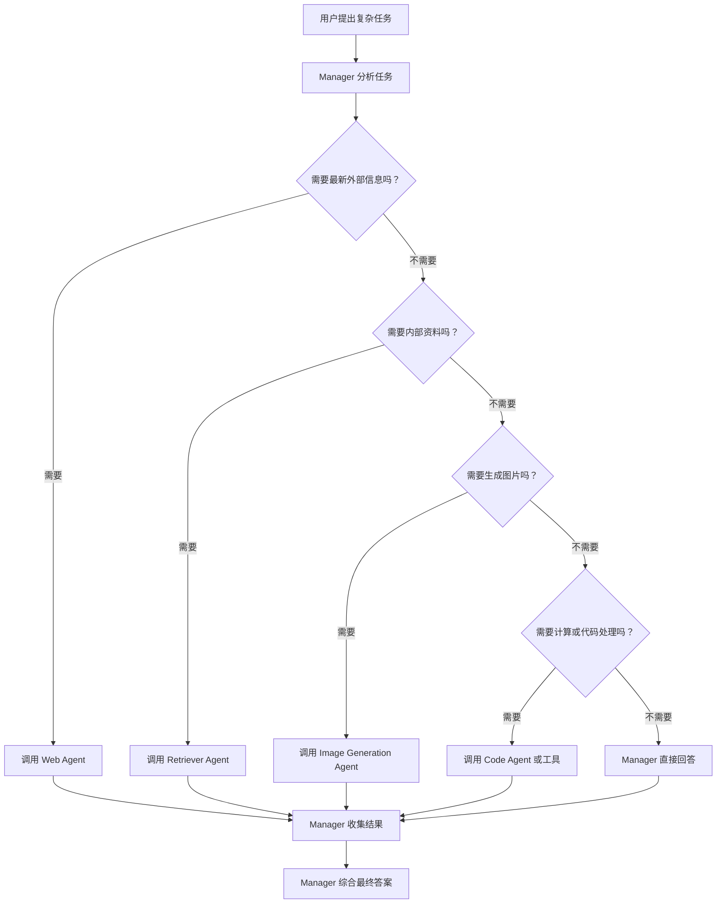

# Day 14：smolagents 多智能体系统

## 一、今天的主题

本节对应 Hugging Face Agents Course 的 smolagents 多智能体系统章节：

[Multi-Agent Systems](https://huggingface.co/learn/agents-course/zh-CN/unit2/smolagents/multi_agent_systems)

这一节的核心不是让一个 Agent 变得更复杂，而是让多个专业 Agent 在一个管理者的协调下共同完成复杂任务。

一句话总结：

```text
Day13 是让一个 Agent 学会检索。
Day14 是让多个 Agent 分工协作，由 Manager / Orchestrator 统一调度。
```

## 二、什么是多智能体系统

多智能体系统由多个专业智能体组成，每个智能体负责自己擅长的一类任务。

例如：

| 智能体 | 负责什么 |
|---|---|
| Web Agent | 浏览网页、搜索互联网信息 |
| Retriever Agent | 从本地知识库或向量数据库检索资料 |
| Image Generation Agent | 生成图片或视觉内容 |
| Code Agent | 计算、画图、处理结构化数据 |
| Manager Agent | 拆解任务、委派任务、收集结果、生成最终答案 |

多智能体系统的价值在于：

```text
复杂任务可以被拆成多个子任务，每个子任务交给最适合的专业智能体。
```

## 三、编排智能体是什么意思

编排智能体，也叫 Orchestrator Agent，可以理解成整个团队的总调度。

它主要负责：

1. 理解用户的复杂任务。
2. 判断任务需要哪些能力。
3. 把子任务交给对应的专业智能体。
4. 收集各个智能体返回的结果。
5. 综合这些结果，生成最终答案。

可以这样理解：

```text
用户给任务
-> 编排智能体分析任务
-> 编排智能体决定调用哪个子智能体
-> 子智能体完成专业工作
-> 结果返回给编排智能体
-> 编排智能体整合最终答案
```

## 四、编排智能体和 Manager Agent 是不是一个意思

在这节课里，基本可以当成同一个意思。

细微区别是：

| 名称 | 更强调什么 |
|---|---|
| Orchestrator Agent | 编排流程、协调步骤 |
| Manager Agent | 管理子智能体、委派任务 |

在 smolagents 的代码语境里，如果一个 Agent 有 `managed_agents=[...]`，它通常就是 Manager Agent，也就是编排智能体。

例如：

```python
manager_agent = CodeAgent(
    model=model,
    tools=[calculate_cargo_travel_time],
    managed_agents=[web_agent],
)
```

这里的 `manager_agent` 就是编排者。

判断依据是：

```text
它是否负责管理其他 Agent？
它是否可以把任务委派给其他 Agent？
它是否负责最终整合结果？
```

如果答案是是，它就是编排智能体。

## 五、多智能体 RAG 中的编排原则

教材里举了一个多智能体 RAG 系统：

```text
Web Agent：用于浏览互联网
Retriever Agent：用于从知识库获取信息
Image Generation Agent：用于生成视觉内容
Manager Agent：负责管理任务委派和结果整合
```

这里的编排原则是：

```text
按能力分工，按任务需要调用对应智能体。
```

可以用下面这张表理解：

| 用户任务需要什么 | 应该调用谁 |
|---|---|
| 最新网页信息 | Web Agent |
| 内部知识库资料 | Retriever Agent |
| 图片或视觉内容 | Image Generation Agent |
| 数学计算、表格、地图 | Code Agent 或工具 |
| 综合多个结果 | Manager Agent |

所以编排不是随便调用，而是：

```text
先判断任务需要什么能力，再把子任务交给最合适的 Agent。
```

## 六、什么时候该干什么事

可以按这个流程判断：



## 七、货运飞机时间计算工具说明了什么

教材给出的工具：

```python
@tool
def calculate_cargo_travel_time(
    origin_coords: Tuple[float, float],
    destination_coords: Tuple[float, float],
    cruising_speed_kmh: Optional[float] = 750.0,
) -> float:
    ...
```

这个例子本质上不是在讲一个 Agent，而是在讲一个确定性工具。

它做的事情是：

1. 输入起点经纬度。
2. 输入终点经纬度。
3. 使用半正矢公式计算地球大圆距离。
4. 增加 10% 路线修正。
5. 根据货运飞机速度计算飞行时间。
6. 再增加 1 小时起飞和降落时间。
7. 返回预估飞行小时数。

这个例子说明：

```text
大模型不应该凭感觉做精确计算。
精确计算应该封装成工具，由 Agent 调用。
```

在多智能体系统里，它的分工可以是：

| 任务 | 谁负责 |
|---|---|
| 找地点、查网页 | Web Agent |
| 计算两地飞行时间 | calculate_cargo_travel_time 工具 |
| 组织整体方案 | Manager Agent |
| 生成地图或表格 | CodeAgent |

所以这个例子真正表达的是：

```text
多智能体系统 = 专业 Agent + 专业工具 + 管理者协调。
```

## 八、为什么上下文窗口会快速填满

如果把所有搜索结果、网页全文、工具日志、子任务推理过程都交给一个 Agent，上下文窗口会很快被填满。

问题包括：

1. 输入 token 变多。
2. 运行速度变慢。
3. 成本上升。
4. 关键信息被噪声淹没。
5. 模型更容易混淆来源。

所以多智能体系统通常不应该把所有原始内容全部塞给 Manager。

更好的做法是：

```text
子 Agent 负责详细搜索和处理。
子 Agent 只把压缩后的关键结果返回给 Manager。
Manager 只负责综合关键结果。
```

## 九、结合结果的原则

这里的“结合”不是简单拼接，而是有选择地汇总。

核心原则：

```text
保留结论、来源、关键数据，压缩过程和噪声。
```

常见结合方式：

| 方式 | 说明 |
|---|---|
| 摘要结合 | 每个子 Agent 返回一段简短结论 |
| 表格结合 | 把地点、时间、来源、分数整理成表格 |
| 分组结合 | 按装饰、餐饮、娱乐等维度分组 |
| Map-Reduce | 多个子任务分别处理，Manager 最后汇总 |
| 引用结合 | 保留 URL、文档名、数据来源 |
| 去重结合 | 同一信息只保留一次 |
| 冲突标注 | 不同来源冲突时标出来，而不是强行合并 |

一个好的返回结果应该像这样：

```text
结论：Sydney 到 Chicago 的货运飞行约需要 X 小时。
来源：Web Agent 找到的地点坐标。
计算：calculate_cargo_travel_time 工具。
备注：已考虑 10% 非直线路线和 1 小时起降时间。
```

而不是：

```text
把所有网页全文和所有搜索日志原样复制给 Manager。
```

## 十、manager_agent.visualize() 怎么理解

`manager_agent.visualize()` 用来查看团队结构。

它不是执行任务，而是展示：

1. 谁是 Manager。
2. Manager 有哪些工具。
3. Manager 管理哪些子 Agent。
4. 每个子 Agent 有哪些工具。
5. Agent 之间是什么层级关系。

可以理解成“团队组织架构图”。

示意结构：

```text
manager_agent | CodeAgent
├── tools:
│   ├── calculate_cargo_travel_time
│   └── final_answer
└── managed_agents:
    └── web_agent | CodeAgent
        ├── description: Browses the web to find information
        └── tools:
            ├── web_search
            ├── visit_webpage
            └── final_answer
```

直观看法：

```text
最上层的是管理者。
缩进在下面的是被管理的子 Agent。
每个 Agent 下面列出它能使用的工具。
```

如果你看到：

```python
managed_agents=[web_agent]
```

就说明这个 `manager_agent` 能管理 `web_agent`，它就是编排智能体。

## 十一、课程资源里的多智能体 RAG 系统配方是什么意思

截图里的资源项：

```text
多智能体 RAG 系统配方 - 构建多智能体 RAG 系统的分步指南
```

意思是：这是一个更完整的 cookbook 教程，教你一步步搭建多智能体 RAG 系统。

它通常会包含：

| 组件 | 作用 |
|---|---|
| Web Search Agent | 查询互联网 |
| Retriever Agent | 查询本地知识库 |
| Image Generation Agent | 生成视觉内容 |
| Manager Agent | 接收用户问题，选择合适 Agent，整合结果 |

可以把它理解成 Day14 的进阶项目：

```text
不是只讲概念，而是教你把多个 Agent 真正组队。
```

## 十二、和 Day13 的关系

Day13 学的是检索智能体：

```text
一个 Agent 调用检索工具，拿到 observation，再生成答案。
```

Day14 学的是多智能体系统：

```text
多个 Agent 各自负责不同能力，由 Manager 统一调度。
```

关系可以这样理解：

```text
Day13：一个会查资料的 Agent。
Day14：一组会分工协作的 Agent 团队。
```

## 十三、今日核心记忆

1. 编排智能体就是总调度。
2. Manager Agent 在本节课里基本等同于 Orchestrator Agent。
3. 多智能体系统的关键是按能力分工。
4. 子 Agent 不应该把所有原始内容都丢给 Manager。
5. Manager 需要的是压缩后的结论、来源和关键数据。
6. `managed_agents=[...]` 是判断管理者角色的重要信号。
7. `visualize()` 可以帮助看清团队结构。
8. 多智能体 RAG 是 Day13 检索智能体的团队化升级。

## 十四、可迁移到自己的项目

| 项目 | 可以设计的多智能体结构 |
|---|---|
| Obsidian 知识库 | Manager + Retriever Agent + Summary Agent |
| 996tokens 客服 | Manager + Web Agent + FAQ Retriever + API Diagnostic Agent |
| 银行 RPA | Manager + 系统查询 Agent + 报表 Agent + 异常诊断 Agent |
| 闲鱼自动化 | Manager + 选品 Agent + 标题 Agent + 风控 Agent + 客服话术 Agent |
| 课程学习助手 | Manager + 网页检索 Agent + 笔记检索 Agent + 复习计划 Agent |

## 十五、参考资料

- [Hugging Face Agents Course：Multi-Agent Systems](https://huggingface.co/learn/agents-course/zh-CN/unit2/smolagents/multi_agent_systems)
- [Hugging Face Cookbook：Multi-agent RAG System](https://huggingface.co/learn/cookbook/multiagent_rag_system)

