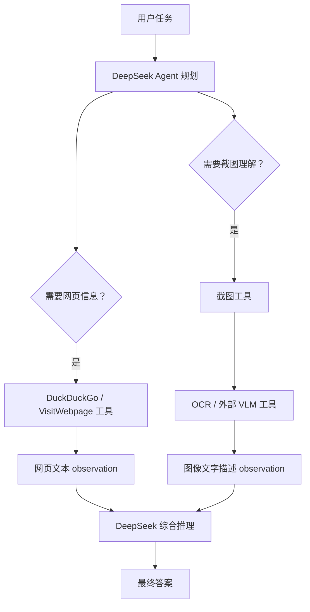

# Day 15：smolagents 视觉智能体与浏览器智能体

## 一、课程链接

Hugging Face Agents Course：

[使用 smolagents 构建视觉智能体](https://huggingface.co/learn/agents-course/zh-CN/unit2/smolagents/vision_agents)

这一节课程的核心是：

```text
让 Agent 不只处理文本，还能处理图片、截图、网页视觉内容。
```

课程官方示例使用的是 GPT-4o 这类强视觉语言模型（VLM）。课程页也明确提示，该节示例需要接入强大的视觉语言模型，并且示例用 GPT-4o API 测试。

你的情况不同：

```text
你不用 gpt-4o。
你使用 DeepSeek API。
```

所以 Day15 不能机械照抄课程代码，而要分清楚：

```text
DeepSeek 适合做推理、规划、工具调用、总结。
视觉理解能力需要额外的视觉模型、OCR 工具、截图解析工具或网页文本工具补上。
```

## 二、这一节到底在学什么

前面几天的 Agent 主要处理文本：

| 天数 | 重点 |
|---|---|
| Day10 | CodeAgent 用 Python 代码调用工具 |
| Day11 | ToolCallingAgent 用 JSON 工具调用 |
| Day12 | 创建工具 |
| Day13 | 检索智能体 / Agentic RAG |
| Day14 | 多智能体系统 |
| Day15 | 视觉和浏览器智能体 |

Day15 的变化是：

```text
Agent 的输入不再只有文字，还可以有图片、网页截图、浏览器当前页面。
```

现实任务中，很多信息不是纯文本：

- 网页布局
- 按钮位置
- 弹窗
- 图表
- PDF 扫描页
- 商品图片
- 身份证件
- 屏幕截图
- 监控画面
- UI 操作状态

如果 Agent 只能读文字，它就看不懂这些内容。

所以视觉智能体的目标是：

```text
让 Agent 能观察图像，并把图像内容纳入推理过程。
```

## 三、什么是 VLM

VLM 是 Vision-Language Model，视觉语言模型。

它能同时处理：

```text
图片 + 文本
```

例如你给它一张图片，再问：

```text
这张图片里的人穿了什么？
网页上哪个按钮是提交按钮？
这张截图中的报错是什么？
这个图表说明了什么趋势？
```

VLM 可以基于图像内容回答。

典型 VLM 能力包括：

| 能力 | 示例 |
|---|---|
| 图像描述 | 描述照片、截图、商品图 |
| OCR | 读取图片中的文字 |
| 图表理解 | 看懂柱状图、折线图、表格截图 |
| UI 理解 | 判断按钮、弹窗、菜单位置 |
| 视觉问答 | 根据图片回答问题 |
| 网页截图理解 | 根据浏览器截图继续操作 |

课程中的 GPT-4o 就属于这类能直接理解图片的模型。

## 四、DeepSeek API 和视觉智能体的关系

根据 DeepSeek 官方 API 文档，DeepSeek API 使用 OpenAI / Anthropic 兼容格式，可以通过修改配置接入 DeepSeek API。它很适合放进 `smolagents` 里，承担对话、推理、JSON 输出、工具调用、任务规划等工作。

参考：

- [DeepSeek API Docs：Your First API Call](https://api-docs.deepseek.com/)
- [DeepSeek API Docs：Models & Pricing](https://api-docs.deepseek.com/quick_start/pricing)

这说明 DeepSeek 很适合做：

- 文本推理
- 工具调用
- Agent 编排
- JSON 输出
- 多轮对话
- 长上下文总结
- 根据工具 observation 生成答案

但是，Day15 课程需要的是视觉输入能力。也就是说，模型不仅要兼容 OpenAI API 格式，还要明确支持 Vision / Image Input / Multimodal message。

注意：DeepSeek 有视觉语言模型相关研究和开源模型，例如 DeepSeek-VL 系列；但这不等于你当前正在调用的 DeepSeek API 端点就一定支持图片输入。真正判断时，要看你的实际模型接口是否支持 `image_url`、base64 图片或多模态 message。

所以如果你当前使用的是类似下面的文本/推理模型：

```text
deepseek-v4-flash
deepseek-v4-pro
deepseek-chat
deepseek-reasoner
```

那就不要默认认为它能像 GPT-4o 一样直接吃图片。

关键判断标准：

```text
你的模型 API 是否支持 image_url / base64 image / multimodal message？
```

如果不支持，就不能直接使用课程里的：

```python
agent.run(..., images=images)
```

即使 smolagents 支持把图片传给 Agent，也要求背后的模型是真正的 VLM。

## 五、使用 DeepSeek 时的正确理解

不要把 Day15 理解成：

```text
只要使用 smolagents，就一定可以让 DeepSeek 看图。
```

更准确的理解是：

```text
smolagents 提供了视觉信息进入 Agent 的机制；
但真正看图的是底层 VLM。
```

所以三者关系是：

```text
smolagents：负责 Agent 流程、工具调用、memory、step_callbacks
VLM：负责理解图像
DeepSeek：如果没有视觉输入能力，则负责文本推理和工具编排
```

在你的 DeepSeek 方案中，推荐架构是：

```text
图片 / 截图
-> OCR / 图像描述工具 / 外部 VLM 工具
-> 结构化文本 observation
-> DeepSeek Agent 推理、决策、总结
```

也就是：

```text
DeepSeek 不直接看图，而是读“图像被工具解释后的文本结果”。
```

## 六、课程中的第一种方法：启动时提供图像

课程第一部分讲的是：

```text
在 agent.run() 开始时，通过 images 参数传入图片。
```

课程示例大意：

```python
from PIL import Image
import requests
from io import BytesIO

images = []
for url in image_urls:
    response = requests.get(url, headers=headers)
    image = Image.open(BytesIO(response.content)).convert("RGB")
    images.append(image)

response = agent.run(
    """
    Describe the costume and makeup in these photos.
    Tell me if the guest is The Joker or Wonder Woman.
    """,
    images=images,
)
```

这段代码表达的思想是：

```text
用户任务 + 图片 一起进入 Agent。
Agent 在执行过程中可以基于这些图片推理。
```

课程中的场景是：

```text
Alfred 要验证派对来宾身份。
来宾声称自己是 Wonder Woman。
但图片看起来可能是 The Joker。
Agent 根据图片中的服装、妆容、人物特征判断身份。
```

这个例子说明：

```text
视觉智能体可以用于身份核验、图像比对、视觉描述和安全判断。
```

## 七、DeepSeek 下如何改造第一种方法

如果 DeepSeek API 不支持图片输入，就不能直接写：

```python
agent.run(task, images=images)
```

推荐改成两步：

```text
第一步：用视觉工具把图片转成文字描述。
第二步：把文字描述交给 DeepSeek Agent 推理。
```

例如：

```python
image_description = describe_image_with_vision_tool(image_path)

response = agent.run(
    f"""
    下面是图像识别工具返回的描述：
    {image_description}

    请判断这个来宾更像 The Joker 还是 Wonder Woman，并说明理由。
    """
)
```

这里的 `describe_image_with_vision_tool` 可以来自：

- 另一个支持视觉的 API
- 本地开源 VLM
- OCR 工具
- 图像分类模型
- 人工标注
- 截图解析服务

这种架构叫：

```text
视觉工具 + 文本 Agent
```

DeepSeek 负责第二步，也就是推理和总结。

## 八、课程中的第二种方法：动态检索图像

课程第二部分讲的是：

```text
Agent 在执行过程中动态获取视觉信息。
```

典型场景：

```text
Agent 正在浏览网页。
它每一步操作后都截取浏览器截图。
截图被保存到当前 ActionStep 的 `observations_images` 中。
下一轮模型可以看到这些截图，并根据截图继续操作。
```

课程页提到 smolagents 的智能体基于 `MultiStepAgent`，运行中会记录不同步骤：

| 步骤 | 作用 |
|---|---|
| SystemPromptStep | 存储系统提示 |
| TaskStep | 记录用户任务和输入 |
| ActionStep | 记录智能体行动、工具结果、日志、截图 |

动态视觉工作流大概是：

```text
Agent 打开网页
-> 执行搜索或点击
-> 浏览器页面变化
-> step_callback 截图
-> 截图保存到 ActionStep.observations_images
-> 下一轮 Agent 读取截图
-> 决定继续点击、搜索、返回或总结
```

## 九、step_callback 是什么

课程中的 `save_screenshot` 是一个 step callback。

它的作用是：

```text
每一步执行之后自动运行一次。
```

在浏览器智能体里，step callback 可以做：

- 截图
- 记录当前 URL
- 清理旧截图
- 保存页面状态
- 把截图加入 memory

课程示例中的关键动作是：

```python
step_log.observations_images = [image.copy()]
```

这表示：

```text
把当前浏览器截图保存到当前步骤的 `observations_images` 里。
```

下一轮模型如果是 VLM，就可以看到这张截图。

## 十、DeepSeek 下如何改造动态截图方法

如果 DeepSeek 不能直接看截图，可以把截图处理成文本。

可选方案：

### 方案 1：截图 -> OCR -> DeepSeek

适合：

- 网页文字很多
- 报错截图
- PDF 扫描件
- 表格截图
- 登录页面提示

流程：

```text
浏览器截图
-> OCR 读取文字
-> 把 OCR 结果作为 observation
-> DeepSeek 根据文字继续推理
```

示意代码：

```python
def save_screenshot_and_ocr(step_log, agent):
    image = take_browser_screenshot()
    text = ocr_image(image)
    step_log.observations = f"当前页面 OCR 结果：\n{text}"
```

### 方案 2：截图 -> 图像描述工具 -> DeepSeek

适合：

- UI 布局
- 商品图
- 人物图
- 视觉比对
- 图表

流程：

```text
截图
-> 外部 VLM 生成图像描述
-> DeepSeek 基于描述继续决策
```

### 方案 3：不用截图，直接读取网页文本

适合：

- 文章页面
- 文档页面
- 搜索结果页
- 静态网页

流程：

```text
访问网页
-> 提取 DOM 文本 / markdown
-> DeepSeek 阅读文本并决策
```

这和 Day13 的 `DuckDuckGoSearchTool`、`VisitWebpageTool` 思路更接近。

### 方案 4：换一个真正支持视觉输入的模型

适合：

- 必须看图
- 必须判断 UI 坐标
- 必须理解复杂截图
- 必须做视觉问答

这时可以让：

```text
VLM 负责看图
DeepSeek 负责推理和编排
```

也可以做多智能体系统：

```text
Manager Agent：DeepSeek
Vision Agent：VLM
Browser Agent：网页工具
Retriever Agent：知识库工具
```

## 十一、视觉智能体和浏览器智能体的区别

| 类型 | 主要输入 | 主要能力 |
|---|---|---|
| 视觉智能体 | 图片、截图 | 看图、描述、OCR、图表理解 |
| 浏览器智能体 | 网页、DOM、截图、URL | 搜索、点击、返回、关闭弹窗、读取网页 |
| 视觉浏览器智能体 | 网页截图 + 浏览器操作 | 像人一样看网页并操作 |

课程里的第二部分其实是：

```text
视觉智能体 + 浏览器自动化工具
```

它不仅要理解截图，还要能执行浏览器动作。

## 十二、课程中的浏览器工具

课程里提到了一些浏览器操作工具：

| 工具 | 作用 |
|---|---|
| `search_item_ctrl_f` | 在当前页面用 Ctrl+F 搜索文本 |
| `go_back` | 浏览器返回上一页 |
| `close_popups` | 关闭弹窗 |
| `DuckDuckGoSearchTool` | 搜索互联网 |
| `save_screenshot` | 每步结束后截图 |

这些工具使 Agent 不只是“读网页”，而是可以：

```text
搜索 -> 打开网页 -> 查找关键词 -> 滚动定位 -> 截图 -> 继续判断
```

这就是浏览器智能体的核心。

## 十三、DeepSeek 下浏览器智能体的推荐架构

如果你坚持使用 DeepSeek API，可以把系统拆成这样：



这个结构的核心是：

```text
DeepSeek 不直接看图，而是看工具处理后的文本化结果。
```

## 十四、什么时候必须用真正的 VLM

下面这些任务，最好使用真正的 VLM：

| 任务 | 为什么 |
|---|---|
| 判断人物穿着、妆容、身份 | 需要看图像细节 |
| 分析 UI 布局和按钮位置 | OCR 不够，需要理解空间结构 |
| 读取复杂图表 | 需要视觉和数据理解 |
| 比较两张图片 | 需要视觉相似度判断 |
| 判断商品瑕疵 | 需要看局部细节 |
| 网页截图导航 | 需要知道页面上哪个元素在哪里 |

如果只用 DeepSeek 文本模型，这些任务会变成：

```text
先让别的工具把图像变成文本，再让 DeepSeek 判断。
```

这能做很多事，但不是完整的视觉理解。

## 十五、什么时候 DeepSeek 足够

如果视觉内容可以被转成文本，DeepSeek 就很合适。

例如：

| 场景 | 可行方案 |
|---|---|
| 截图里主要是报错文字 | OCR 后交给 DeepSeek |
| 网页主要是文章内容 | 提取网页正文后交给 DeepSeek |
| 搜索结果页 | DuckDuckGoSearchTool 返回文本摘要 |
| PDF 扫描件 | OCR 后总结 |
| 表格截图 | OCR / 表格识别后让 DeepSeek 分析 |
| 图片审核初筛 | 视觉分类工具输出标签，DeepSeek 做规则判断 |

DeepSeek 的优势是：

- 长上下文
- 推理总结
- 工具调用
- JSON 输出
- 任务规划
- 多智能体编排

所以它适合做：

```text
视觉工具的上层调度者。
```

## 十六、和前几天课程的关系

| 天数 | 和 Day15 的关系 |
|---|---|
| Day10 CodeAgent | 浏览器智能体通常需要写代码调用工具 |
| Day11 ToolCallingAgent | 视觉工具也可以用 JSON 工具调用 |
| Day12 Tools | OCR、截图、网页访问都要封装成工具 |
| Day13 Retrieval Agent | 网页搜索和图像检索属于检索能力 |
| Day14 Multi-Agent | DeepSeek 可以当 Manager，VLM 可以当 Vision Agent |
| Day15 Vision Agent | 把视觉 observation 加入 Agent 推理链路 |

Day15 可以看成：

```text
工具系统 + 检索系统 + 多智能体系统 + 图像输入
```

## 十七、如果用 DeepSeek，Day15 代码该怎么设计

推荐你不要一上来写“完全视觉浏览器智能体”，而是分三层学习。

### 第 1 层：图像描述已经存在

先模拟一个图像描述工具：

```python
@tool
def describe_guest_image(image_name: str) -> str:
    """
    返回某张来宾图片的文字描述。

    Args:
        image_name: 图片名称，比如 joker_1、wonder_woman_1。
    """
    descriptions = {
        "joker_1": "白色脸妆、绿色头发、红色夸张嘴唇、紫色外套。",
        "wonder_woman_1": "金色头冠、红金胸甲、蓝色裙装、银色护腕。",
    }
    return descriptions.get(image_name, "没有找到图片描述。")
```

DeepSeek 根据这个工具返回的描述判断身份。

这一步学习的是：

```text
视觉结果如何变成 observation。
```

### 第 2 层：截图 OCR

接入 OCR：

```text
截图 -> OCR 文本 -> DeepSeek Agent
```

这一步学习的是：

```text
真实图片如何被工具转换成文本。
```

### 第 3 层：外部 VLM 工具

把真正的 VLM 包装成工具：

```python
@tool
def describe_image_with_vlm(image_path: str) -> str:
    """
    调用外部视觉模型描述图片。

    Args:
        image_path: 本地图片路径。
    """
    ...
```

DeepSeek 调这个工具，拿到图像描述，再做推理。

这一步才接近完整的视觉智能体。

## 十八、Day15 核心流程

视觉智能体的核心流程可以记成：

```text
视觉输入
-> 图像进入 Agent 或工具
-> 模型/工具生成视觉 observation
-> observation 写入 Agent memory
-> Agent 基于视觉信息继续推理
-> 调用更多工具或输出最终答案
```

如果使用 DeepSeek：

```text
视觉输入
-> VLM / OCR / 截图解析工具
-> 文本 observation
-> DeepSeek 推理
-> 最终答案
```

## 十九、易错点

| 易错点 | 正确理解 |
|---|---|
| smolagents 支持 images，就等于 DeepSeek 能看图 | 不对，底层模型必须支持图像输入 |
| DeepSeek API 兼容 OpenAI，就一定兼容 GPT-4o 图像格式 | 不一定，兼容格式不等于能力完全一样 |
| 截图保存到 `observations_images` 后，任何模型都能看 | 不对，只有 VLM 能理解图片 |
| OCR 可以完全替代 VLM | 不完全，OCR 只能读文字，不能可靠理解视觉布局和图像细节 |
| 浏览器智能体就是网页搜索 | 不只是搜索，还包括点击、返回、关闭弹窗、截图、页面状态理解 |
| Day15 必须用 GPT-4o | 课程用 GPT-4o 测试，但你可以用 DeepSeek + 外部视觉工具改造 |

## 二十、你当前学习路线的建议

因为你用 DeepSeek API，我建议 Day15 分两条线学：

### 主线：DeepSeek 可跑通版本

```text
DeepSeek Agent + OCR/图像描述工具 + 文本 observation
```

目标：

```text
理解视觉信息如何被转成 Agent 可用的 observation。
```

### 进阶线：真正 VLM 版本

```text
VLM Agent + images=images + observations_images
```

目标：

```text
理解课程中的原生视觉智能体。
```

如果以后你接入支持图像输入的模型，就可以把 DeepSeek 替换成 VLM，或者让 DeepSeek 做 Manager，VLM 做 Vision Agent。

## 二十一、今日总结

Day15 学的是：

```text
让 Agent 拥有视觉观察能力。
```

课程原版方案：

```text
smolagents + GPT-4o / VLM + images 或 observations_images
```

你的 DeepSeek 方案：

```text
smolagents + DeepSeek + OCR / VLM 工具 / 网页文本提取
```

最重要的一句话：

```text
DeepSeek 可以做视觉智能体的大脑和调度者，但如果 DeepSeek API 本身不支持图片输入，就需要额外工具先把图片变成文本 observation。
```

## 二十二、参考资料

- [Hugging Face Agents Course：使用 smolagents 构建视觉智能体](https://huggingface.co/learn/agents-course/zh-CN/unit2/smolagents/vision_agents)
- [DeepSeek API Docs：Your First API Call](https://api-docs.deepseek.com/)
- [DeepSeek API Docs：Models & Pricing](https://api-docs.deepseek.com/quick_start/pricing)
- [DeepSeek-VL2 paper：Mixture-of-Experts Vision-Language Models](https://arxiv.org/abs/2412.10302)
