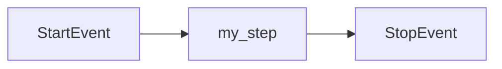
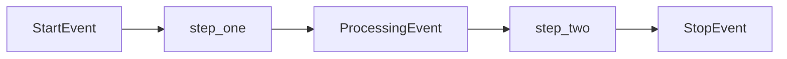
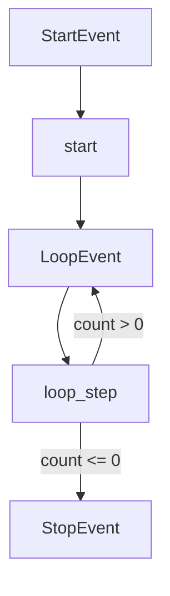
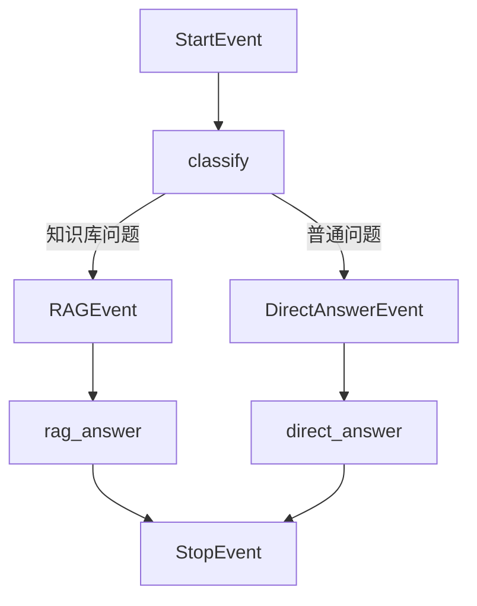
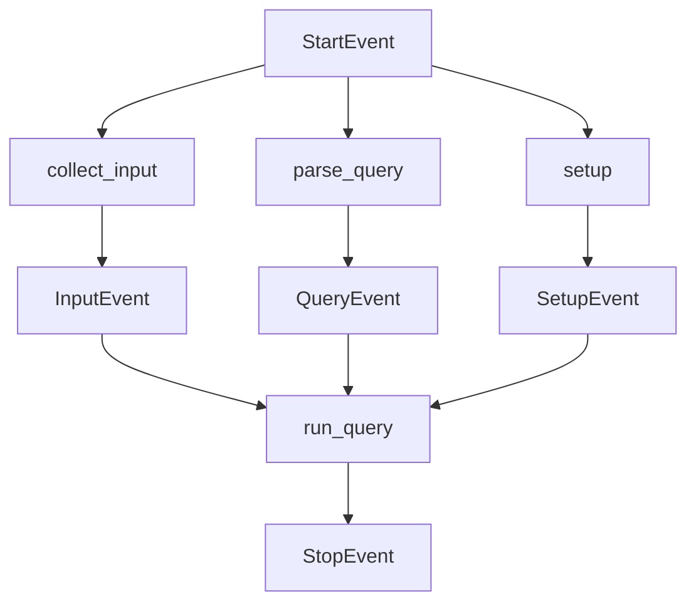
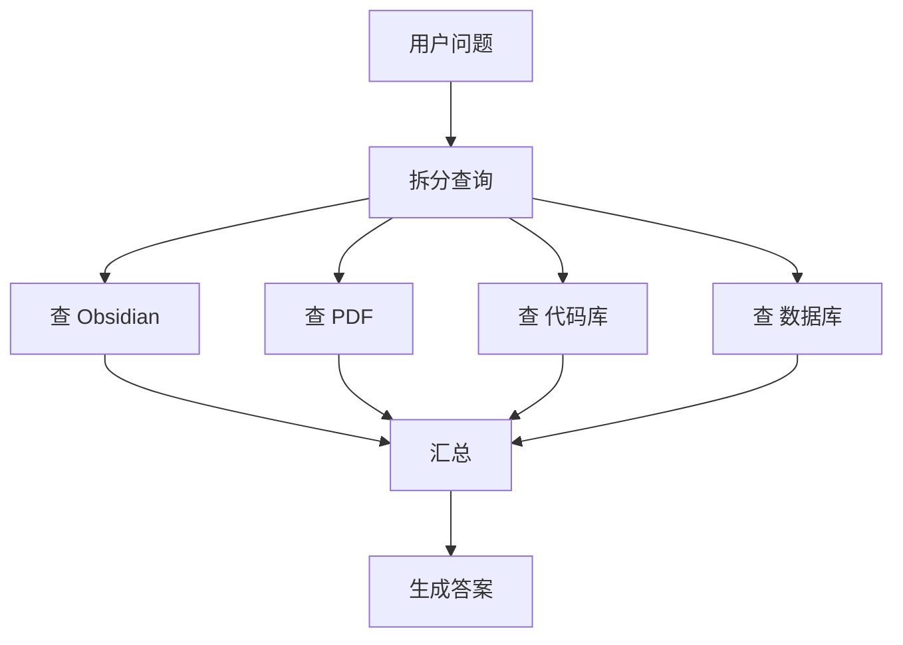
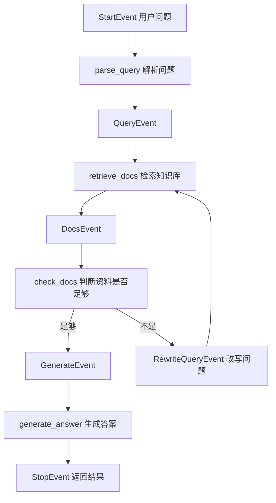

# 第20天：LlamaIndex Workflows 工作流

> 主题：如何创建工作流？工作流之间怎么交互？怎么处理循环和分支？如何处理状态？如何使用多智能体工作流自动化流程？
>
> 课程来源：Hugging Face Agents Course：LlamaIndex Workflows 章节  
> 官方补充：LlamaIndex Agent Workflows 文档

---

## 0. 今天先抓住一句话

**LlamaIndex Workflow = 用 Event 驱动 Step，把复杂的 RAG / Agent 流程拆成多个清楚、可维护、可扩展的步骤。**

普通代码像这样：

```python
result1 = step1(input)
result2 = step2(result1)
result3 = step3(result2)
```

Workflow 的思路是：

```text
StartEvent
  ↓
Step A 收到事件，执行任务
  ↓
返回 Event B
  ↓
Step B 被 Event B 触发
  ↓
返回 Event C
  ↓
直到 StopEvent 结束
```

你可以用银行系统里的“报文流转”来理解：

```text
报文来了 → 某个处理节点收到 → 处理完生成新报文 → 下一个节点继续处理
```

在 LlamaIndex Workflow 里：

```text
Event = 报文 / 信号 / 数据包
Step = 处理节点 / 处理函数
Workflow = 整个流程编排
Context = 流程中的共享状态
StopEvent = 流程结束
```

---

## 1. Workflow 的核心组成

### 1.1 Workflow

`Workflow` 是整个流程的容器。你要创建一个工作流，一般就是定义一个类，继承 `Workflow`。

```python
from llama_index.core.workflow import Workflow

class MyWorkflow(Workflow):
    pass
```

它相当于：

```text
这个类里面放着整个流程的所有步骤。
```

---

### 1.2 Step

`Step` 是真正干活的函数。它用 `@step` 装饰器标记。

```python
from llama_index.core.workflow import step

@step
async def my_step(self, ev):
    ...
```

一个 Step 通常做一件明确的事情，比如：

```text
解析用户问题
加载知识库
检索向量库
调用 LLM
检查答案质量
返回最终结果
```

注意：**Step 一般是 async 异步函数**。

---

### 1.3 Event

`Event` 是步骤之间传递的数据。

比如：

```python
from llama_index.core.workflow import Event

class QueryEvent(Event):
    query: str
```

这表示：

```text
有一个事件叫 QueryEvent，它里面必须带一个 query 字段。
```

后续 Step 可以接收这个事件：

```python
@step
async def retrieve(self, ev: QueryEvent):
    query = ev.query
```

这就是“类型安全通信”：

```text
不是随便传 dict，而是明确规定每个事件带什么数据。
```

---

### 1.4 StartEvent 和 StopEvent

`StartEvent` 和 `StopEvent` 是两个特殊事件。

```python
from llama_index.core.workflow import StartEvent, StopEvent
```

它们的意义是：

```text
StartEvent：工作流开始
StopEvent：工作流结束
```

当你执行：

```python
result = await w.run(query="LlamaIndex 是什么？")
```

系统会自动创建一个 `StartEvent`，里面带着 `query` 这个参数。

当某个 Step 返回：

```python
return StopEvent(result="Hello, world!")
```

工作流就结束，并把 `result` 返回给调用方。

---

## 2. 如何创建最基础的工作流？

### 2.1 安装

课程里写的是：

```bash
pip install llama-index-utils-workflow
```

如果你已经安装了 `llama-index` 或 `llama-index-core`，通常可以直接使用：

```python
from llama_index.core.workflow import StartEvent, StopEvent, Workflow, step
```

如果你用的是官方独立 workflows 包，也可能看到这种安装方式：

```bash
pip install llama-index-workflows
```

学习阶段建议先按课程环境走；真实项目里以你当前 LlamaIndex 版本的官方文档为准。

---

### 2.2 最小工作流代码

你贴的代码里少了一个很关键的 `@step`。完整版本应该是这样：

```python
from llama_index.core.workflow import StartEvent, StopEvent, Workflow, step

class MyWorkflow(Workflow):

    @step
    async def my_step(self, ev: StartEvent) -> StopEvent:
        return StopEvent(result="Hello, world!")

w = MyWorkflow(timeout=10, verbose=False)
result = await w.run()
print(result)
```

执行逻辑是：

```text
w.run()
  ↓
自动产生 StartEvent
  ↓
my_step 接收到 StartEvent
  ↓
my_step 返回 StopEvent
  ↓
工作流结束，返回 Hello, world!
```

流程图：



这就是最小可运行 Workflow。

---

## 3. 多步骤工作流：Step 之间怎么交互？

工作流之间的“交互”，最核心其实是：

```text
Step 和 Step 之间通过 Event 交互。
```

不是 A 函数直接调用 B 函数，而是：

```text
A Step 返回一个 Event
这个 Event 触发能接收它的下一个 Step
```

### 3.1 两步工作流示例

```python
from llama_index.core.workflow import Event, StartEvent, StopEvent, Workflow, step

class ProcessingEvent(Event):
    intermediate_result: str

class MultiStepWorkflow(Workflow):

    @step
    async def step_one(self, ev: StartEvent) -> ProcessingEvent:
        return ProcessingEvent(intermediate_result="Step 1 complete")

    @step
    async def step_two(self, ev: ProcessingEvent) -> StopEvent:
        final_result = f"Finished processing: {ev.intermediate_result}"
        return StopEvent(result=final_result)

w = MultiStepWorkflow(timeout=10, verbose=False)
result = await w.run()
print(result)
```

执行逻辑：

```text
StartEvent
  ↓
step_one
  ↓ 返回 ProcessingEvent
step_two
  ↓ 返回 StopEvent
结束
```

流程图：



这里的关键是：

```python
async def step_one(self, ev: StartEvent) -> ProcessingEvent
```

这行代码告诉 LlamaIndex：

```text
step_one 接收 StartEvent，输出 ProcessingEvent。
```

而：

```python
async def step_two(self, ev: ProcessingEvent) -> StopEvent
```

这行代码告诉 LlamaIndex：

```text
step_two 接收 ProcessingEvent，输出 StopEvent。
```

所以 LlamaIndex 就知道怎么把两个 Step 自动连起来。

---

## 4. 类型提示为什么重要？

LlamaIndex Workflow 依赖类型提示来推断流程。

```python
async def step_one(self, ev: StartEvent) -> ProcessingEvent
```

这不是普通注释，而是流程结构的一部分。

它表达的是：

```text
输入事件类型：StartEvent
输出事件类型：ProcessingEvent
```

如果你类型写错，可能会导致：

```text
某个事件没人处理
某个步骤永远不会被触发
没有 StopEvent，流程无法结束
流程图画不出来
```

所以，写 Workflow 时要养成这个习惯：

```text
每个 Step 都明确写输入 Event 类型和输出 Event 类型。
```

推荐格式：

```python
@step
async def step_name(self, ev: 输入Event) -> 输出Event:
    ...
```

---

## 5. 循环怎么处理？

### 5.1 循环的本质

循环就是：

```text
某个 Step 返回一个会再次触发前面步骤的 Event。
```

普通代码里循环是：

```python
while 条件:
    do_something()
```

Workflow 里循环是：

```text
Step A 收到 LoopEvent
  ↓
如果条件不满足，继续返回 LoopEvent
  ↓
LoopEvent 再次触发 Step A
  ↓
直到条件满足，返回 StopEvent 或下一个 Event
```

---

### 5.2 循环示例

```python
from llama_index.core.workflow import Event, StartEvent, StopEvent, Workflow, step

class LoopEvent(Event):
    count: int

class LoopWorkflow(Workflow):

    @step
    async def start(self, ev: StartEvent) -> LoopEvent:
        return LoopEvent(count=3)

    @step
    async def loop_step(self, ev: LoopEvent) -> LoopEvent | StopEvent:
        if ev.count <= 0:
            return StopEvent(result="循环结束")

        print(f"还需要循环 {ev.count} 次")
        return LoopEvent(count=ev.count - 1)

w = LoopWorkflow(timeout=10, verbose=True)
result = await w.run()
print(result)
```

执行逻辑：

```text
StartEvent
  ↓
start 返回 LoopEvent(count=3)
  ↓
loop_step 返回 LoopEvent(count=2)
  ↓
loop_step 返回 LoopEvent(count=1)
  ↓
loop_step 返回 LoopEvent(count=0)
  ↓
loop_step 返回 StopEvent
  ↓
结束
```

流程图：



这就是 Workflow 里的循环。

---

### 5.3 RAG 里的循环怎么用？

比如你做一个知识库问答。

```text
用户问题
  ↓
检索知识库
  ↓
判断资料是否足够
  ↓
不够：改写问题，再检索
  ↓
够了：生成答案
```

对应到 Workflow：

```text
RetrieveEvent → retrieve
CheckEvent → check_quality
如果资料不够 → RewriteQueryEvent → retrieve
如果资料够了 → GenerateAnswerEvent → StopEvent
```

这就是 Agentic RAG 里常见的“反复检索、反思、修正”。

---

## 6. 分支怎么处理？

### 6.1 分支的本质

分支就是：

```text
同一个 Step 根据条件返回不同的 Event。
不同 Event 会触发不同的后续 Step。
```

普通代码里分支是：

```python
if condition:
    do_a()
else:
    do_b()
```

Workflow 里分支是：

```python
if condition:
    return BranchAEvent(...)
else:
    return BranchBEvent(...)
```

---

### 6.2 分支示例

```python
from llama_index.core.workflow import Event, StartEvent, StopEvent, Workflow, step

class RAGEvent(Event):
    query: str

class DirectAnswerEvent(Event):
    query: str

class BranchWorkflow(Workflow):

    @step
    async def classify(self, ev: StartEvent) -> RAGEvent | DirectAnswerEvent:
        query = ev.query

        if "根据文档" in query or "知识库" in query:
            return RAGEvent(query=query)
        else:
            return DirectAnswerEvent(query=query)

    @step
    async def rag_answer(self, ev: RAGEvent) -> StopEvent:
        return StopEvent(result=f"走 RAG 流程回答：{ev.query}")

    @step
    async def direct_answer(self, ev: DirectAnswerEvent) -> StopEvent:
        return StopEvent(result=f"直接回答：{ev.query}")

w = BranchWorkflow(timeout=10, verbose=True)
result = await w.run(query="根据文档解释 LlamaIndex Workflow")
print(result)
```

流程图：



分支在实际项目里非常有用。

比如你的个人项目可以这么分：

```text
用户问代码问题 → 查代码库 / 日志
用户问学习问题 → 查 Obsidian 笔记
用户问产品问题 → 查产品数据库
用户问闲鱼运营 → 查 SOP 和商品表
```

---

## 7. 并发、汇总和多个事件怎么处理？

这部分对应你前面那张图：

```text
StartEvent 同时触发多个 Step
多个 Step 各自产生 Event
最后某个 Step 等这些 Event 都到齐后再执行
```

比如：

```text
StartEvent
  ↓
同时触发：
- collect_input
- parse_query
- setup
  ↓
分别产生：
- InputEvent
- QueryEvent
- SetupEvent
  ↓
run_query 等三个事件都到了才执行
  ↓
StopEvent
```

### 7.1 多个 Step 同时从 StartEvent 开始

```python
from llama_index.core.workflow import Event, StartEvent, StopEvent, Workflow, step

class InputEvent(Event):
    input_text: str

class QueryEvent(Event):
    query: str

class SetupEvent(Event):
    ready: bool

class ParallelPrepareWorkflow(Workflow):

    @step
    async def collect_input(self, ev: StartEvent) -> InputEvent:
        return InputEvent(input_text=ev.input_text)

    @step
    async def parse_query(self, ev: StartEvent) -> QueryEvent:
        return QueryEvent(query=ev.query.strip())

    @step
    async def setup(self, ev: StartEvent) -> SetupEvent:
        return SetupEvent(ready=True)

    @step
    async def run_query(
        self,
        input_ev: InputEvent,
        query_ev: QueryEvent,
        setup_ev: SetupEvent,
    ) -> StopEvent:
        result = f"输入：{input_ev.input_text}，问题：{query_ev.query}，环境：{setup_ev.ready}"
        return StopEvent(result=result)
```

这段代码的核心点是：

```python
async def run_query(
    self,
    input_ev: InputEvent,
    query_ev: QueryEvent,
    setup_ev: SetupEvent,
) -> StopEvent:
```

它表示：

```text
run_query 需要等 InputEvent、QueryEvent、SetupEvent 都到齐后才能执行。
```

流程图：



---

### 7.2 Fan-out / Fan-in 思想

并发可以理解成两个动作：

```text
Fan-out：把一个任务拆成多个子任务，同时执行
Fan-in：把多个子任务的结果汇总回来
```

比如你要同时检索多个知识源：

```text
用户问题
  ↓
同时检索：
- Obsidian
- PDF 文档
- 代码库
- 数据库
  ↓
汇总结果
  ↓
生成答案
```

概念流程：



这在 RAG 项目里非常常见。

---

## 8. 状态怎么处理？

### 8.1 为什么需要状态？

如果你的流程只有一步，不需要状态。

但只要流程复杂起来，就会出现很多中间数据：

```text
用户原始问题
改写后的问题
检索到的文档
重试次数
当前使用的工具
调用 LLM 的次数
最终答案
错误信息
日志信息
```

如果不用状态，你就会到处传参数：

```python
def step3(query, docs, retry_count, config, user_id, history):
    ...
```

这会越来越乱。

Workflow 里可以用 `Context` 管理共享状态。

---

### 8.2 Context 基础用法

```python
from llama_index.core.workflow import Context, StartEvent, StopEvent, Workflow, step

class StateWorkflow(Workflow):

    @step
    async def query(self, ctx: Context, ev: StartEvent) -> StopEvent:
        await ctx.store.set("query", ev.query)

        query = await ctx.store.get("query")

        return StopEvent(result=f"当前问题是：{query}")
```

这里：

```python
await ctx.store.set("query", ev.query)
```

表示把数据存到上下文。

```python
query = await ctx.store.get("query")
```

表示从上下文里取出来。

---

### 8.3 状态适合放什么？

适合放：

```text
字符串
数字
列表
字典
中间结果
当前步骤结果
重试次数
是否完成
```

不建议放：

```text
数据库连接
大型模型对象
向量库客户端
文件句柄
网络连接
非常大的对象
```

这些更适合放在资源对象、类属性或外部服务里。

---

### 8.4 RAG 状态设计示例

你以后做 RAG Workflow，可以这样设计状态：

```python
await ctx.store.set("original_query", ev.query)
await ctx.store.set("rewritten_query", rewritten_query)
await ctx.store.set("retrieved_docs", docs)
await ctx.store.set("retry_count", retry_count)
await ctx.store.set("final_answer", answer)
```

这样每个 Step 都可以从 `ctx.store` 里取需要的数据。

---

## 9. 多智能体工作流 AgentWorkflow

前面的 Workflow 是你手动定义 Step 和 Event。

但是 LlamaIndex 还提供了 `AgentWorkflow`，它可以更方便地创建多智能体系统。

### 9.1 AgentWorkflow 是什么？

`AgentWorkflow` 可以理解成：

```text
不再由你手写每个 Step，
而是让多个 Agent 组成一个工作流，
每个 Agent 有自己的工具和职责，
它们可以处理任务，也可以把任务交给别的 Agent。
```

比如：

```text
加法 Agent：负责加法
乘法 Agent：负责乘法
搜索 Agent：负责搜索
写作 Agent：负责写作
审核 Agent：负责检查
```

当用户问题进来时，先交给根智能体 `root_agent`。

根智能体可以：

```text
自己处理
调用工具处理
把任务交接给更合适的智能体
返回最终答案
```

---

### 9.2 多智能体示例：加法 Agent + 乘法 Agent

```python
from llama_index.core.agent.workflow import AgentWorkflow, ReActAgent
from llama_index.llms.huggingface_api import HuggingFaceInferenceAPI

# 定义工具
def add(a: int, b: int) -> int:
    """Add two numbers."""
    return a + b

def multiply(a: int, b: int) -> int:
    """Multiply two numbers."""
    return a * b

llm = HuggingFaceInferenceAPI(model_name="Qwen/Qwen2.5-Coder-32B-Instruct")

multiply_agent = ReActAgent(
    name="multiply_agent",
    description="Is able to multiply two integers",
    system_prompt="A helpful assistant that can use a tool to multiply numbers.",
    tools=[multiply],
    llm=llm,
)

addition_agent = ReActAgent(
    name="add_agent",
    description="Is able to add two integers",
    system_prompt="A helpful assistant that can use a tool to add numbers.",
    tools=[add],
    llm=llm,
)

workflow = AgentWorkflow(
    agents=[multiply_agent, addition_agent],
    root_agent="multiply_agent",
)

response = await workflow.run(user_msg="Can you add 5 and 3?")
print(response)
```

这个例子的意思是：

```text
用户问题先进入 multiply_agent
multiply_agent 发现自己擅长乘法，不擅长加法
于是可以把任务交给 add_agent
add_agent 调用 add 工具
最后返回答案 8
```

---

### 9.3 AgentWorkflow 和普通 Workflow 的区别

| 对比项 | 普通 Workflow | AgentWorkflow |
|---|---|---|
| 控制方式 | 你手动写 Step 和 Event | 框架帮你组织 Agent 协作 |
| 适合场景 | 流程清晰、可控性强 | 多个 Agent 分工合作 |
| 复杂度 | 需要自己设计事件流 | 更像配置多个 Agent |
| 优点 | 可控、可调试、可画流程图 | 快速搭建多智能体系统 |
| 例子 | RAG 查询流程 | 搜索 Agent + 写作 Agent + 审核 Agent |

简单说：

```text
普通 Workflow：程序员主导流程。
AgentWorkflow：多个智能体协作完成流程。
```

---

## 10. 多智能体工作流如何共享状态？

AgentWorkflow 也可以使用状态。

比如你想统计工具调用次数：

```python
from llama_index.core.workflow import Context

async def add(ctx: Context, a: int, b: int) -> int:
    cur_state = await ctx.store.get("state")
    cur_state["num_fn_calls"] += 1
    await ctx.store.set("state", cur_state)
    return a + b

async def multiply(ctx: Context, a: int, b: int) -> int:
    cur_state = await ctx.store.get("state")
    cur_state["num_fn_calls"] += 1
    await ctx.store.set("state", cur_state)
    return a * b
```

创建工作流时传入初始状态：

```python
workflow = AgentWorkflow(
    agents=[multiply_agent, addition_agent],
    root_agent="multiply_agent",
    initial_state={"num_fn_calls": 0},
    state_prompt="Current state: {state}. User message: {msg}",
)
```

运行时使用同一个 Context：

```python
ctx = Context(workflow)
response = await workflow.run(user_msg="Can you add 5 and 3?", ctx=ctx)
state = await ctx.store.get("state")
print(state["num_fn_calls"])
```

这表示：

```text
多个 Agent 在同一个 Workflow 里运行时，可以共享同一个状态。
```

---

## 11. 用一个真实 RAG 例子串起来

假设你要做一个“Obsidian 知识库问答助手”。

用户问：

```text
第20天的 LlamaIndex Workflow 是什么意思？
```

你可以设计这样的 Workflow：

```text
StartEvent
  ↓
parse_query：解析问题
  ↓
QueryEvent
  ↓
retrieve_docs：检索 Obsidian 笔记
  ↓
DocsEvent
  ↓
check_docs：判断资料是否足够
  ↓
如果足够 → GenerateEvent
如果不足 → RewriteQueryEvent → retrieve_docs
  ↓
generate_answer：生成答案
  ↓
StopEvent
```

流程图：



这就是一个非常典型的 Agentic RAG Workflow。

---

## 12. 再用你的项目理解 Workflow

你现在有这些方向：

```text
996tokens.com
AI Agent 学习
微信小程序
公众号 AI硅基纪元
喜马拉雅睡前故事
知识星球
Obsidian 笔记体系
```

Workflow 思想可以用在很多地方。

### 12.1 视频转 SOP 工作流

```text
输入 B站视频链接
  ↓
提取字幕
  ↓
总结内容
  ↓
拆成步骤
  ↓
生成 SOP
  ↓
保存到 Obsidian
```

对应 Step：

```text
collect_video
extract_transcript
summarize
build_sop
export_markdown
```

---

### 12.2 闲鱼选品 Agent 工作流

```text
输入品类
  ↓
抓取商品数据
  ↓
分析销量 / 想要数 / 竞争度
  ↓
计算利润
  ↓
生成标题和文案
  ↓
输出上架建议
```

对应 Event：

```text
CategoryEvent
ProductListEvent
ProfitEvent
CopywritingEvent
FinalReportEvent
```

---

### 12.3 996tokens 客服 Agent 工作流

```text
用户咨询
  ↓
判断问题类型
  ↓
价格问题 → 查询价格表
模型问题 → 查询模型说明
故障问题 → 查询日志 / FAQ
充值问题 → 查询订单状态
  ↓
生成答复
  ↓
必要时转人工
```

这里分支就非常重要。

---

## 13. 学习时最容易混淆的点

### 13.1 Event 不是函数

Event 只是数据包，不干活。

```text
Event = 信息
Step = 动作
```

---

### 13.2 Step 不是随便执行的

Step 是否执行，取决于它接收的 Event 有没有出现。

```python
async def retrieve(self, ev: QueryEvent)
```

只有出现 `QueryEvent`，这个 Step 才会执行。

---

### 13.3 StopEvent 不一定只能在最后一个固定函数里返回

任何 Step 只要判断流程该结束了，都可以返回 `StopEvent`。

比如：

```text
用户问题不合法 → 直接 StopEvent
没有检索结果 → 直接 StopEvent
答案已经足够 → 直接 StopEvent
```

---

### 13.4 循环不要无限循环

循环时一定要有终止条件。

比如：

```text
retry_count 最大 3 次
资料足够就停止
LLM 校验通过就停止
超时就停止
```

否则 Workflow 会一直跑，直到 timeout。

---

## 14. 今天应该掌握的代码骨架

### 14.1 单步骨架

```python
class MyWorkflow(Workflow):

    @step
    async def my_step(self, ev: StartEvent) -> StopEvent:
        return StopEvent(result="done")
```

---

### 14.2 多步骨架

```python
class MyEvent(Event):
    value: str

class MyWorkflow(Workflow):

    @step
    async def step_one(self, ev: StartEvent) -> MyEvent:
        return MyEvent(value="hello")

    @step
    async def step_two(self, ev: MyEvent) -> StopEvent:
        return StopEvent(result=ev.value)
```

---

### 14.3 分支骨架

```python
class AEvent(Event):
    value: str

class BEvent(Event):
    value: str

@step
async def classify(self, ev: StartEvent) -> AEvent | BEvent:
    if 条件:
        return AEvent(value="走 A")
    else:
        return BEvent(value="走 B")
```

---

### 14.4 循环骨架

```python
class LoopEvent(Event):
    count: int

@step
async def loop(self, ev: LoopEvent) -> LoopEvent | StopEvent:
    if ev.count <= 0:
        return StopEvent(result="done")
    return LoopEvent(count=ev.count - 1)
```

---

### 14.5 状态骨架

```python
@step
async def step_with_state(self, ctx: Context, ev: StartEvent) -> StopEvent:
    await ctx.store.set("key", "value")
    value = await ctx.store.get("key")
    return StopEvent(result=value)
```

---

### 14.6 AgentWorkflow 骨架

```python
workflow = AgentWorkflow(
    agents=[agent_a, agent_b],
    root_agent="agent_a",
)

response = await workflow.run(user_msg="用户问题")
```

---

## 15. 重点总结

今天这节课真正要记住的是：

```text
1. Workflow 是事件驱动的流程编排。
2. Step 是干活的函数。
3. Event 是步骤之间传递的数据。
4. StartEvent 表示开始，StopEvent 表示结束。
5. 类型提示决定事件怎么流动。
6. 分支 = 根据条件返回不同 Event。
7. 循环 = 返回能重新触发前面步骤的 Event。
8. 状态 = 用 Context / ctx.store 保存流程共享数据。
9. AgentWorkflow = 用多个 Agent 自动协作完成任务。
10. 普通 Workflow 更可控，AgentWorkflow 更适合多智能体协作。
```

一句话复盘：

> **LlamaIndex Workflow 让 RAG / Agent 应用从“一坨大函数”变成“可视化、可扩展、可维护的事件流”。**

---

## 16. 自测问题

### 问题 1：为什么 Step 之间不是直接互相调用？

因为 Workflow 的设计是事件驱动。Step 执行完返回 Event，下一个能接收该 Event 的 Step 会被触发。这样流程更清晰，也更容易做分支、循环和并发。

---

### 问题 2：StartEvent 有什么用？

`StartEvent` 是工作流的入口事件。调用 `w.run(...)` 时，传入的参数会进入 StartEvent。

---

### 问题 3：StopEvent 有什么用？

`StopEvent` 表示工作流结束。它的 `result` 就是最终返回结果。

---

### 问题 4：分支怎么写？

用联合类型返回不同 Event：

```python
async def classify(self, ev: StartEvent) -> AEvent | BEvent:
    if 条件:
        return AEvent(...)
    return BEvent(...)
```

---

### 问题 5：循环怎么写？

让某个 Step 返回自己能够再次接收的 Event，同时设置终止条件。

```python
async def loop(self, ev: LoopEvent) -> LoopEvent | StopEvent:
    if ev.count <= 0:
        return StopEvent(result="done")
    return LoopEvent(count=ev.count - 1)
```

---

### 问题 6：状态怎么保存？

用 `Context`：

```python
await ctx.store.set("query", ev.query)
query = await ctx.store.get("query")
```

---

### 问题 7：AgentWorkflow 解决什么问题？

它用于多个 Agent 协作。不同 Agent 有不同工具和职责，可以自己处理，也可以把任务交接给更合适的 Agent。

---

## 17. 下一步实践建议

你可以按这个顺序练习：

```text
第 1 步：写一个 Hello World 单步 Workflow
第 2 步：写一个两步 Workflow
第 3 步：写一个分支 Workflow
第 4 步：写一个循环 Workflow
第 5 步：加入 Context 状态
第 6 步：写一个简单 RAG Workflow
第 7 步：尝试 AgentWorkflow 多智能体
```

最小练习题：

```text
输入一个问题：
如果包含“知识库”两个字，就走 RAGEvent；
否则走 DirectAnswerEvent；
把 query 存到 ctx.store；
最后返回 StopEvent。
```

这个练习能覆盖：

```text
StartEvent
StopEvent
自定义 Event
Step
分支
状态
```

---

## 18. 参考资料

- Hugging Face Agents Course：LlamaIndex Workflows 章节：<https://huggingface.co/learn/agents-course/zh-CN/unit2/llama-index/workflows>
- LlamaIndex Agent Workflows Introduction：<https://developers.llamaindex.ai/python/llamaagents/workflows/>
- LlamaIndex Branches and Loops：<https://developers.llamaindex.ai/python/llamaagents/workflows/branches_and_loops/>
- LlamaIndex Managing State：<https://developers.llamaindex.ai/python/llamaagents/workflows/managing_state/>
- LlamaIndex Concurrent Execution：<https://developers.llamaindex.ai/python/llamaagents/workflows/concurrent_execution/>
