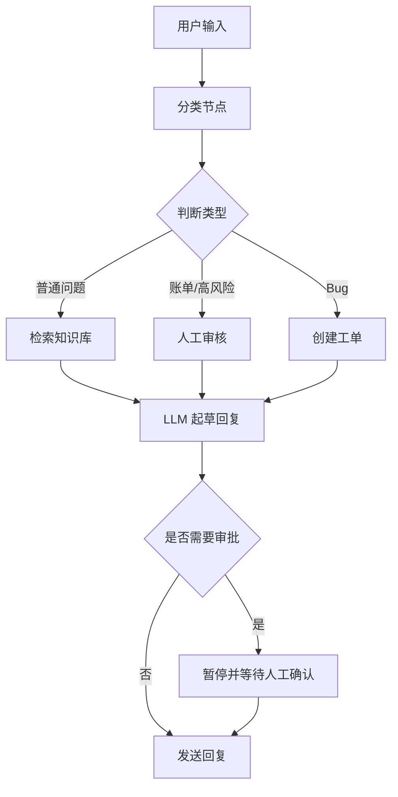

# 第21天：LangGraph 入门与生产级 Agent 流程控制

> 主题：什么是 LangGraph？它和 LangChain 有何不同？什么时候应该使用 LangGraph？为什么它比普通 Python 更适合复杂 Agent 工作流？
>
> 课程来源：
> - Hugging Face Agents Course：LangGraph Introduction
> - Hugging Face Agents Course：When to use LangGraph
>
> 配套代码：
> - `examples/21-langgraph-introduction/`

---

## 0. 今天先抓住一句话

**LangGraph 是一个用“图结构”编排 LLM 应用和智能体工作流的框架。**

它的重点不是让模型更自由，而是让开发者能够明确控制：

- 下一步执行什么；
- 状态如何在步骤之间传递；
- 什么时候进入条件分支；
- 什么时候暂停等待人类确认；
- 出错后如何恢复；
- 如何追踪每一步发生了什么。

一句更直白的话：

```text
LangGraph = 用图来组织“多步骤、有状态、可控、可恢复”的 LLM 应用。
```

---

## 1. 本节模块概览

课程里这一节主要包含：

1. 什么是 LangGraph？何时使用它？
2. LangGraph 的构建模块
3. 邮件分拣管家 Alfred
4. 文档分析智能体 Alfred
5. 随堂测验

这节课的目标不是马上写一个很复杂的 Agent，而是先理解一个核心问题：

> 为什么生产环境里的 Agent 不能只靠“让 LLM 自己想办法”，而需要更明确的流程控制？

---

## 2. 什么是 LangGraph？

LangGraph 是由 LangChain 团队开发的框架，用于管理集成 LLM 的应用程序控制流。

它把一个智能体应用表示成一个有向图。

核心组成：

| 概念 | 含义 | 可以理解成 |
|---|---|---|
| State | 贯穿整个流程的共享状态 | Agent 的工作记忆 |
| Node | 独立处理步骤 | 一个 Python 函数 |
| Edge | 节点之间的连接 | 下一步去哪 |
| Conditional Edge | 条件边 | 根据状态决定下一步 |
| Graph | 完整流程图 | 整个 Agent 工作流 |

例子：

```text
用户输入
  ↓
分类节点
  ↓
根据分类结果路由
  ↓
检索 / 调用工具 / 人工审核 / 生成回复
  ↓
输出结果
```

在 LangGraph 中，每个节点通常是一个函数：

```python
def classify_email(state):
    ...
    return {"classification": "billing"}
```

节点读取当前 `state`，然后返回对 `state` 的更新。LangGraph 负责把这些节点按照图的结构串起来。

---

## 3. LangGraph 和 LangChain 有何不同？

可以这样区分：

| 对比项 | LangChain | LangGraph |
|---|---|---|
| 核心定位 | LLM 应用开发组件库 | Agent / 工作流编排运行时 |
| 主要解决 | 如何连接模型、Prompt、工具、检索器、输出解析器 | 如何控制多步骤流程、状态、分支、循环、暂停和恢复 |
| 抽象层级 | 相对更高层 | 更底层、更可控 |
| 常见用途 | RAG、工具调用、模型调用、普通链式流程 | 长时间运行、有状态、多分支、需要人工介入的 Agent |
| 是否必须一起用 | 不必须 | 不必须 |
| 实际项目中 | 经常和 LangGraph 搭配 | 可以使用 LangChain 的模型、工具等组件 |

课程里的重点：

- LangChain 提供与模型和其他组件交互的标准接口。
- LangGraph 管理这些组件之间的执行流程。
- 两个包是独立的，可以单独使用。
- 真实项目里经常一起出现：LangChain 负责“零件”，LangGraph 负责“流程”。

我的理解：

```text
LangChain 更像工具箱。
LangGraph 更像流程调度器。
```

例如：

- 用 LangChain 调用 OpenAI、检索向量库、封装工具；
- 用 LangGraph 决定先调用谁、后调用谁、失败怎么办、是否让人审批。

---

## 4. 何时应该使用 LangGraph？

当你的应用不是一次简单的 LLM 调用，而是包含多个步骤、多个判断点、状态传递、人工审批或失败恢复时，就适合使用 LangGraph。

课程中提到，LangGraph 表现出色的关键场景包括：

- 需要显式控制流程的多步骤推理过程；
- 需要在步骤之间保持状态持久化的应用程序；
- 结合确定性逻辑与 AI 能力的系统；
- 需要人工介入的工作流；
- 多个组件协同工作的复杂智能体架构。

### 4.1 适合使用 LangGraph 的例子

客服邮件处理：

```text
读取邮件
  ↓
分类：普通问题 / Bug / 账单 / 高风险
  ↓
查知识库 or 创建工单 or 人工审核
  ↓
起草回复
  ↓
必要时人工确认
  ↓
发送
```

文档问答：

```text
输入文档和问题
  ↓
判断文档类型
  ↓
PDF 抽文本 / 表格转文本 / 图片 OCR
  ↓
组织上下文
  ↓
LLM 回答
```

自动化运营流程：

```text
分析数据
  ↓
生成方案
  ↓
人工确认
  ↓
调用 API 执行
  ↓
记录结果
```

### 4.2 不一定需要 LangGraph 的场景

这些场景可以先不用：

- 只做一次 LLM 调用；
- 只是简单 Prompt 生成；
- 临时脚本或一次性实验；
- 没有复杂状态、分支、循环、人工审批；
- 你明确希望 Agent 高度自由探索，而不是严格受控。

---

## 5. 图片2：控制 vs 自由度是什么意思？

图片 2 讲的是设计 AI 应用时的一个核心取舍：

```text
更高自由度                         更强控制
LLM 自己决定怎么做  <---------->   人类/程序明确规定流程
创造性更强                         可预测性更强
更难测试和约束                     更容易调试和上线
```

### 自由度

自由度指的是：你给 LLM 多大的空间自己规划下一步。

例如 Code Agent 可以：

- 自己写代码；
- 自己创建工具；
- 一次行动中调用多个工具；
- 自己决定下一步。

这很灵活，但也更难预测。

### 控制

控制指的是：开发者明确规定流程结构。

例如：

- 先分类，再路由；
- 高风险任务必须人工审批；
- 失败后进入重试或补救流程；
- 某些工具只能在特定节点调用。

### 图片 2 的核心意思

- `smolagents` 里的 Code Agent 更偏“自由度”；
- LangGraph 更偏“控制”；
- 生产环境通常更需要控制，因为你要知道 Agent 为什么这样做、哪里出错、怎么恢复、怎么让人接管。

---

## 6. 如何理解课程中的这句话？

课程里有这样一句话：

> 本质上，只要有可能，作为人类就应该根据每个操作的输出设计行动流程，并据此决定下一步执行什么。在这种情况下，LangGraph 就是你正确的选择。

我的理解：

这句话不是说每一步都要人手动执行，而是说：

> 如果你作为开发者能提前描述清楚流程逻辑，就不要把全部决策都丢给 LLM。

例如客服邮件系统：

- 如果分类结果是“普通问题”，就查知识库并草拟回复；
- 如果分类结果是“账单纠纷”，就进入人工审核；
- 如果分类结果是“Bug”，就创建工单；
- 如果回复置信度低，就暂停并让人确认。

这些规则人类是可以设计出来的。LangGraph 的价值就是把这些规则变成稳定、可运行、可追踪的流程。

核心原则：

```text
能明确控制的地方，就显式控制；
需要 AI 判断的地方，再交给 LLM。
```

这也是为什么课程作者认为 LangGraph 很适合生产环境：生产系统通常需要稳定性、可观察性、状态恢复和人工审批，而不是完全不可预测的自由 Agent。

---

## 7. LangGraph 如何工作？

LangGraph 的基本工作方式：

1. 定义一个状态结构；
2. 定义多个节点函数；
3. 用边连接节点；
4. 用条件边描述分支逻辑；
5. 编译成可运行图；
6. 执行时，LangGraph 在节点之间传递和更新状态。

抽象流程：



---

## 8. 它和普通 Python 有何不同？为什么需要 LangGraph？

用普通 Python 当然也能写流程：

```python
if doc_type == "table":
    text = parse_table(file)
elif doc_type == "image":
    text = ocr(file)
else:
    text = extract_text(file)

answer = llm(text, question)
```

但是系统复杂后，普通 Python 会逐渐变难维护：

- 状态散落在多个变量里；
- 很难从中间步骤恢复；
- 很难记录每一步发生了什么；
- 人工介入要自己写暂停、保存、恢复逻辑；
- 分支、循环、并行、重试会让代码越来越乱；
- 很难把流程可视化给别人看；
- 很难统一接入 traces、监控和调试工具。

LangGraph 的意义不是“Python 做不到”，而是：

> 它把复杂 Agent 常见的流程控制、状态管理、恢复、追踪、人类介入等能力做成了标准抽象。

所以：

```text
普通 Python = 自己手写流程控制。
LangGraph = 专门为 LLM Agent 设计的流程运行时。
```

---

## 9. 状态管理、可视化、traces、人类介入怎么理解？

### 9.1 状态管理

状态就是 Agent 在执行过程中需要记住的东西。

例如邮件 Agent 的状态可能包括：

- 原始邮件内容；
- 发件人信息；
- 邮件分类结果；
- 检索到的知识库内容；
- 草稿回复；
- 是否需要人工审核；
- 当前执行到哪一步。

LangGraph 让每个节点读取当前状态，并返回对状态的更新。这样不同节点不需要互相直接调用，也不需要到处传一堆参数。

### 9.2 持久化

持久化是指：不要让 Agent 的中间状态只存在内存里。

LangGraph 里常见两类持久化：

- **Checkpointer**：保存某个 thread 的图状态快照，适合短期记忆、对话连续性、暂停恢复、故障恢复。
- **Store**：保存跨 thread 的长期数据，例如用户偏好、事实、共享知识。

直观类比：

```text
Checkpointer = 当前任务的存档点。
Store = 长期资料库。
```

### 9.3 可视化

LangGraph 的流程本质是图，所以可以被画出来。

可视化的价值：

- 看清节点之间如何连接；
- 看清哪些节点有分支；
- 和团队沟通 Agent 的流程设计；
- 调试时快速定位流程走错了哪条路径。

### 9.4 日志追踪 traces

Trace 可以理解为一次运行的“执行录像”或“流水账”。

它通常记录：

- 输入是什么；
- 经过了哪些节点；
- 每个节点的输入和输出；
- 调用了哪个模型；
- 调用了哪些工具；
- 工具参数和返回值是什么；
- 哪一步报错；
- 延迟、token、成本等运行指标。

为什么重要？

因为 Agent 出错时，你不能只看最后答案。你需要知道它中间为什么做出那个判断。Trace 就是用来调试、评估和监控 Agent 行为的。

### 9.5 内置的人类介入机制

人类介入就是 Human-in-the-loop。

意思是：当流程走到某些关键点时，系统可以暂停，把当前状态交给人看，等人批准、修改或拒绝后再继续。

典型场景：

- 发邮件前让人确认；
- 转账或下单前让人审批；
- LLM 生成的结果需要人工修改；
- 用户信息缺失，需要暂停询问；
- 高风险任务必须人工接管。

LangGraph 可以通过 `interrupt()` 暂停图执行，并依赖持久化保存当前状态。之后使用同一个 `thread_id` 恢复执行。

---

## 10. 配套代码说明

代码目录：

```text
examples/21-langgraph-introduction/
```

包含文件：

| 文件 | 作用 |
|---|---|
| `01_basic_state_graph.py` | 最小 LangGraph：State、Node、Edge |
| `02_document_router_graph.py` | 文档类型条件路由：文本 / 表格 / 图片 |
| `03_email_triage_graph.py` | 邮件分拣工作流：分类、检索、工单、人工审核 |
| `04_human_interrupt_demo.py` | `interrupt()` 人类介入和恢复执行示例 |
| `05_visualize_mermaid.py` | 输出 Mermaid 图，帮助理解可视化 |

运行方式：

```bash
pip install -r examples/21-langgraph-introduction/requirements.txt
python examples/21-langgraph-introduction/01_basic_state_graph.py
python examples/21-langgraph-introduction/02_document_router_graph.py
python examples/21-langgraph-introduction/03_email_triage_graph.py
python examples/21-langgraph-introduction/04_human_interrupt_demo.py
python examples/21-langgraph-introduction/05_visualize_mermaid.py
```

这些示例默认不调用真实 LLM，也不需要 API Key。它们用规则函数模拟 LLM 判断，方便先理解 LangGraph 的结构。

---

## 11. 记忆卡片

### LangGraph 是什么？

一个用于编排 LLM 应用和智能体工作流的图框架，重点是控制流、状态和生产可用性。

### LangGraph 和 LangChain 有何不同？

LangChain 偏组件集成，LangGraph 偏流程编排。两者独立，但常一起使用。

### 什么时候用 LangGraph？

当 Agent 有多步骤、状态传递、条件分支、循环、人工介入、持久化或可观察性需求时。

### 什么时候不用？

单次 LLM 调用、非常简单的脚本、没有状态和分支的流程，不一定需要 LangGraph。

### 图片 2 的核心意思？

AI 应用需要在“自由度”和“控制”之间取舍。LangGraph 更偏控制，适合生产环境。

### 为什么普通 Python 不够？

普通 Python 能实现流程，但复杂 Agent 还需要标准化的状态、持久化、可视化、trace、人类介入、恢复和调试能力。LangGraph 把这些能力打包成框架。

---

## 12. 我的理解

LangGraph 最适合这样的问题：

> 我知道这个任务大概应该怎么走，但其中某些步骤需要 LLM 的理解、生成或判断能力。

也就是说，它不是让 LLM 完全自由发挥，而是让人类设计流程骨架，让 LLM 在合适的节点发挥能力。

可以把 LangGraph 想成：

- 人类负责设计路线图；
- LangGraph 负责按路线图调度执行；
- LLM 负责处理路线图中需要智能判断的节点；
- LangSmith / traces 负责记录和调试执行过程；
- Human-in-the-loop 负责在关键节点把控制权交还给人。

这就是生产环境智能体框架的核心：

```text
不是追求 Agent 看起来多聪明，
而是追求它可靠、可控、可恢复、可解释。
```

---

## 参考资料

- [Hugging Face Agents Course - 欢迎来到 LangGraph 的世界](https://huggingface.co/learn/agents-course/zh-CN/unit2/langgraph/introduction)
- [Hugging Face Agents Course - 什么是 LangGraph？何时使用 LangGraph？](https://huggingface.co/learn/agents-course/zh-CN/unit2/langgraph/when_to_use_langgraph)
- [LangGraph 官方文档 - Overview](https://docs.langchain.com/oss/python/langgraph/overview)
- [LangGraph 官方文档 - Persistence](https://docs.langchain.com/oss/python/langgraph/persistence)
- [LangGraph 官方文档 - Interrupts](https://docs.langchain.com/oss/python/langgraph/interrupts)
- [LangGraph 官方文档 - LangSmith Observability](https://docs.langchain.com/oss/python/langgraph/observability)
- [LangGraph 官方文档 - Thinking in LangGraph](https://docs.langchain.com/oss/python/langgraph/thinking-in-langgraph)
