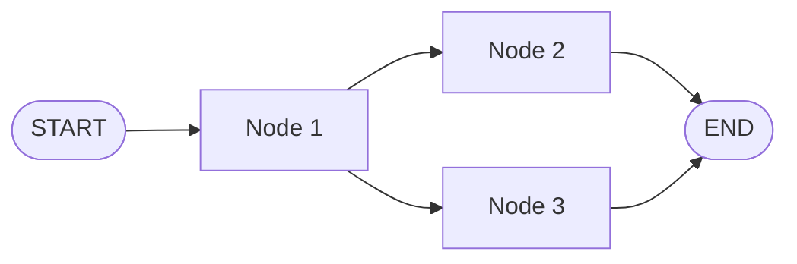

# 第22天：LangGraph 核心构建模块

> 主题：LangGraph 的核心构建模块是什么？State、Node、Edge、StateGraph 分别负责什么？State 应该怎么设计？
>
> 课程来源：
> - Hugging Face Agents Course：LangGraph 的核心构建模块
>
> 配套代码：
> - `examples/22-langgraph-building-blocks/`

---

## 0. 今天先抓住一句话

**LangGraph 应用 = State + Node + Edge + StateGraph。**

也就是：

```text
State 保存流程中的信息
Node 处理某一步任务
Edge 决定下一步去哪
StateGraph 把所有节点和边组织成完整工作流
```

图片里的流程可以理解成：

```text
START
  ↓
Node 1
  ↓
根据当前 State 做判断
  ↓
Node 2 或 Node 3
  ↓
END
```

LangGraph 应用程序从入口开始，根据执行情况流向不同函数，直到抵达 `END`。

---

## 1. LangGraph 的四个核心构建模块

| 构建模块 | 作用 | 对应代码 |
|---|---|---|
| State | 保存应用运行过程中的共享信息 | `TypedDict` / `MessagesState` |
| Node | 执行某一步操作 | Python 函数 |
| Edge | 连接节点，决定流程怎么走 | `add_edge` / `add_conditional_edges` |
| StateGraph | 容纳整个工作流 | `StateGraph(State)` |

这四个东西组合起来，就是 LangGraph 的基本心智模型。

---

## 2. 状态（State）

State 是 LangGraph 中的核心概念，表示流经应用程序的所有信息。

课程里的最小例子：

```python
from typing_extensions import TypedDict

class State(TypedDict):
    graph_state: str
```

这个状态只有一个字段：`graph_state`。

调用图时，输入也是一个状态：

```python
graph.invoke({"graph_state": "Hi, this is Lance."})
```

节点执行后，会返回状态更新：

```python
return {"graph_state": state["graph_state"] + " I am"}
```

LangGraph 会把节点返回的更新合并回当前 State。

---

## 3. State 设计为什么难？

你提出的问题很关键：

> State 是用户自定义的，但谁也没有上帝视角，怎么知道一开始要设计哪些字段？

这是 LangGraph 里最重要、也最容易踩坑的问题。

答案不是“一开始就设计完美”，而是遵循几个原则，让 State 能够随着流程演进。

### 3.1 不要先设计字段，先设计流程

先画流程，再设计 State。

不要一开始就问：

```text
我需要哪些字段？
```

应该先问：

```text
这个任务会经过哪些步骤？
每个步骤需要什么输入？
每个步骤会产生什么输出？
哪些输出会被后面的步骤继续使用？
```

例如邮件 Agent：

```text
读取邮件
  ↓
分类
  ↓
检索文档 / 创建工单 / 人工审核
  ↓
起草回复
  ↓
发送或暂停
```

然后再推导 State：

| 步骤 | 需要读什么 | 会写什么 |
|---|---|---|
| 读取邮件 | `email_content`, `sender_email` | 无或 `normalized_email` |
| 分类 | `email_content`, `sender_email` | `classification` |
| 检索 | `classification` | `search_results` |
| 起草回复 | `email_content`, `classification`, `search_results` | `draft_response` |
| 人工审核 | `draft_response`, `classification` | `approved`, `edited_response` |
| 发送 | `draft_response` 或 `edited_response` | `final_status` |

这样 State 就不是凭空想出来的，而是从流程中长出来的。

---

## 4. 好的 State 设计原则

### 原则 1：只保存跨节点需要的信息

如果某个数据只在一个节点内部使用，就不要放进 State。

应该放进 State 的：

- 后续节点需要用；
- 需要恢复执行；
- 需要调试追踪；
- 需要人工审核；
- 计算成本高，不想重复计算；
- 外部系统返回的重要结果。

不一定放进 State 的：

- 临时变量；
- 可以随时重新计算的格式化文本；
- Prompt 模板；
- 一次性中间字符串；
- 不会被后续节点使用的局部结果。

### 原则 2：State 存原始数据，不存格式化 Prompt

好的写法：

```python
class EmailState(TypedDict):
    email_content: str
    classification: dict
    search_results: list[str]
```

在节点里临时拼 Prompt：

```python
prompt = f"""
Email: {state["email_content"]}
Classification: {state["classification"]}
Search Results: {state["search_results"]}
"""
```

不好的写法：

```python
class EmailState(TypedDict):
    final_prompt: str
```

为什么？

因为 Prompt 是表现形式，不是业务事实。把原始数据留在 State 里，后续节点可以用不同方式格式化；调试时也更清楚。

### 原则 3：字段名要表达业务含义

课程里的：

```python
graph_state: str
```

适合教学，但不适合真实项目。

真实项目里更推荐：

```python
email_content: str
classification: EmailClassification | None
search_results: list[str]
draft_response: str | None
```

字段名越贴近业务，节点越容易维护。

### 原则 4：先小后大，允许迭代

不要试图第一版就把 State 设计完美。

可以先从最小字段开始：

```python
class EmailState(TypedDict, total=False):
    email_content: str
    classification: dict
    draft_response: str
```

当你发现新节点需要更多信息，再补字段：

```python
class EmailState(TypedDict, total=False):
    email_content: str
    sender_email: str
    classification: dict
    search_results: list[str]
    customer_history: dict
    draft_response: str
    approved: bool
    final_status: str
```

### 原则 5：把状态分成几类思考

设计 State 时，可以用这个清单：

| 类型 | 例子 | 是否常放入 State |
|---|---|---|
| 输入数据 | 用户问题、邮件正文、文件路径 | 是 |
| LLM 判断结果 | 分类、意图、置信度 | 是 |
| 工具结果 | 检索结果、API 返回、工单 ID | 是 |
| 生成内容 | 草稿回复、总结、计划 | 是 |
| 控制字段 | 当前步骤、是否需要人工审核、重试次数 | 经常是 |
| 调试信息 | 错误信息、执行历史、trace id | 视情况 |
| 临时格式化文本 | 拼好的 Prompt、临时字符串 | 通常不是 |

---

## 5. 节点（Nodes）

Nodes 是 Python 函数。每个节点做三件事：

1. 接收当前 State；
2. 执行某些操作；
3. 返回 State 更新。

课程示例：

```python
def node_1(state):
    print("---Node 1---")
    return {"graph_state": state["graph_state"] + " I am"}

def node_2(state):
    print("---Node 2---")
    return {"graph_state": state["graph_state"] + " happy!"}

def node_3(state):
    print("---Node 3---")
    return {"graph_state": state["graph_state"] + " sad!"}
```

这里每个节点都只更新 `graph_state`。

真实应用里，节点可以包含：

- LLM 调用：生成文本或做出决策；
- 工具调用：查询数据库、调用 API、读文件；
- 条件逻辑：根据状态判断下一步；
- 人工干预：暂停流程，让人审批或补充信息。

### 好节点的特征

一个好节点应该尽量做到：

- 只负责一个清晰动作；
- 输入来自 State；
- 输出是 State 的局部更新；
- 不要偷偷依赖太多全局变量；
- 外部副作用要谨慎，例如发邮件、扣款、写数据库；
- 如果可能重复执行，注意幂等性。

---

## 6. 边（Edges）

Edges 连接节点，并定义图中的可能路径。

### 6.1 直接边

直接边表示：每次都从 A 到 B。

```python
builder.add_edge(START, "node_1")
builder.add_edge("node_2", END)
```

含义：

```text
START 一定进入 node_1
node_2 执行完一定结束
```

### 6.2 条件边

条件边表示：根据当前 State 决定下一步去哪。

课程示例：

```python
import random
from typing import Literal

def decide_mood(state) -> Literal["node_2", "node_3"]:
    user_input = state["graph_state"]

    if random.random() < 0.5:
        return "node_2"

    return "node_3"
```

连接方式：

```python
builder.add_conditional_edges("node_1", decide_mood)
```

实际项目中，一般不会用随机数，而是根据 State：

```python
def route_email(state) -> Literal["search_docs", "human_review", "bug_tracking"]:
    if state["classification"]["urgency"] == "high":
        return "human_review"
    if state["classification"]["intent"] == "bug":
        return "bug_tracking"
    return "search_docs"
```

---

## 7. 状态图（StateGraph）

StateGraph 是包含整个 agent 工作流的容器。

课程示例：

```python
from langgraph.graph import StateGraph, START, END

builder = StateGraph(State)

builder.add_node("node_1", node_1)
builder.add_node("node_2", node_2)
builder.add_node("node_3", node_3)

builder.add_edge(START, "node_1")
builder.add_conditional_edges("node_1", decide_mood)
builder.add_edge("node_2", END)
builder.add_edge("node_3", END)

graph = builder.compile()
```

调用：

```python
graph.invoke({"graph_state": "Hi, this is Lance."})
```

可能输出：

```text
---Node 1---
---Node 3---
{"graph_state": "Hi, this is Lance. I am sad!"}
```

---

## 8. 图的可视化

LangGraph 可以把图可视化。

课程里的写法：

```python
from IPython.display import Image, display

display(Image(graph.get_graph().draw_mermaid_png()))
```

在普通 Python 脚本里，也可以直接输出 Mermaid：

```python
print(graph.get_graph().draw_mermaid())
```

然后粘贴到 Obsidian 的 Mermaid 代码块里。

示意图：



---

## 9. State 更新和 Reducer

LangGraph 节点返回的不是完整 State，而是 State 的局部更新。

例如当前 State：

```python
{"foo": 1, "bar": ["hi"]}
```

节点返回：

```python
{"foo": 2}
```

更新后：

```python
{"foo": 2, "bar": ["hi"]}
```

默认情况下，同名字段会被覆盖。

如果你希望列表字段被追加，而不是覆盖，可以用 reducer。

```python
from typing import Annotated
from operator import add

class State(TypedDict):
    graph_state: str
    history: Annotated[list[str], add]
```

这样节点返回：

```python
{"history": ["node_1"]}
```

会追加到已有 `history`，而不是覆盖。

这对保存执行历史、消息列表、检索片段很有用。

---

## 10. 代码对应关系

代码目录：

```text
examples/22-langgraph-building-blocks/
```

包含文件：

| 文件 | 作用 |
|---|---|
| `01_course_mood_graph.py` | 复现课程里的 Node 1 → Node 2 / Node 3 → END |
| `02_state_design_principles.py` | 用邮件 Agent 展示 State 怎么从流程推导出来 |
| `03_state_updates_and_reducers.py` | 演示默认覆盖更新和 reducer 追加更新 |
| `04_email_workflow_blocks.py` | 用 State、Node、Edge、StateGraph 组成小型邮件工作流 |
| `05_mermaid_visualization.py` | 输出 Mermaid 图，方便粘贴到 Obsidian |

运行方式：

```bash
pip install -r examples/22-langgraph-building-blocks/requirements.txt
python examples/22-langgraph-building-blocks/01_course_mood_graph.py
python examples/22-langgraph-building-blocks/02_state_design_principles.py
python examples/22-langgraph-building-blocks/03_state_updates_and_reducers.py
python examples/22-langgraph-building-blocks/04_email_workflow_blocks.py
python examples/22-langgraph-building-blocks/05_mermaid_visualization.py
```

---

## 11. 记忆卡片

### LangGraph 的核心构建模块是什么？

State、Node、Edge、StateGraph。

### State 是什么？

State 是流经整个应用程序的共享信息，是节点之间传递和更新的数据结构。

### Node 是什么？

Node 是 Python 函数，接收 State，执行操作，返回 State 更新。

### Edge 是什么？

Edge 定义节点之间的连接路径。直接边固定流转，条件边根据 State 决定下一步。

### StateGraph 是什么？

StateGraph 是工作流容器，用来注册节点、连接边，并编译成可调用的 graph。

### State 怎么设计？

先画流程，再推导字段。只保存跨节点需要的信息，存原始数据，不存临时格式化 Prompt；字段命名要贴近业务，并允许迭代。

---

## 12. 我的理解

LangGraph 的核心不是某个神秘算法，而是把复杂 Agent 应用拆成：

```text
数据怎么流动？
每一步做什么？
下一步怎么选？
什么时候结束？
```

State 是“数据流”，Node 是“处理步骤”，Edge 是“路线选择”，StateGraph 是“整张地图”。

而 State 设计的关键不是预知未来，而是通过流程分析不断收敛：

```text
先把任务拆成步骤
再列出每步需要读什么、写什么
最后把跨步骤需要的数据放进 State
```

如果你能把这套方法练熟，后面构建邮件智能体、文档分析智能体、多智能体工作流时，就不会被复杂流程绕晕。

---

## 参考资料

- [Hugging Face Agents Course - LangGraph 的核心构建模块](https://huggingface.co/learn/agents-course/zh-CN/unit2/langgraph/building_blocks)
- [LangGraph 官方文档 - Graph API](https://docs.langchain.com/oss/python/langgraph/graph-api)
- [LangGraph 官方文档 - Thinking in LangGraph](https://docs.langchain.com/oss/python/langgraph/thinking-in-langgraph)
