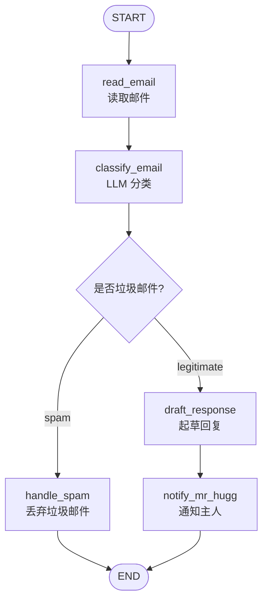
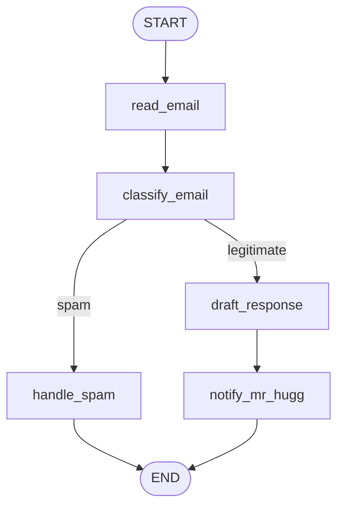

# 第23天：构建第一个 LangGraph 邮件处理工作流

> 主题：如何把 State、Node、Edge、StateGraph 组合起来，构建一个真实可运行的 LangGraph 工作流？
>
> 课程来源：
> - Hugging Face Agents Course：构建你的第一个 LangGraph
>
> 本节关键词：
> - 邮件处理工作流
> - LLM 分类
> - 条件路由
> - 状态更新
> - `END`
> - Langfuse trace
> - Mermaid 可视化

---

## 0. 今天先抓住一句话

**第 23 天是把前面学过的 LangGraph 零件拼成第一个完整工作流。**

前两天我们分别理解了：

```text
Day21：为什么需要 LangGraph
Day22：LangGraph 的核心构建模块 State / Node / Edge / StateGraph
Day23：把这些模块组合成一个邮件处理流程
```

这一节不是在做一个完整生产级 Agent，而是在用 Alfred 管家处理邮件的例子，学习如何把 LLM 决策放进一个可控的流程里。

课程里的流程可以概括为：

```text
收到邮件
  ↓
读取邮件
  ↓
LLM 判断是不是垃圾邮件
  ↓
如果是垃圾邮件：丢弃
如果是合法邮件：起草回复
  ↓
通知主人查看草稿
  ↓
END
```

核心思想：

```text
不是让 LLM 自己随便决定做什么，
而是让 LLM 在指定节点里做判断，
再由 LangGraph 根据判断结果控制下一步流程。
```

---

## 1. 这节课到底在讲什么？

这节课做了一个 Alfred 邮件处理系统。Alfred 需要完成这些事：

1. 阅读 incoming emails；
2. 将邮件分类为 spam 或 legitimate；
3. 如果是 legitimate 邮件，就起草初步回复；
4. 当邮件合法时，向 Mr. Hugg / Mr. Wayne 发送信息，这里只是打印展示。

课程特别强调：这个示例还不能算完整 Agent。

原因是：

```text
它没有调用外部工具。
```

它更像是：

```text
LLM 工作流 / LLM workflow
```

而不是：

```text
Tool-using Agent / 能调用工具的智能体
```

但这正好适合入门，因为我们可以先专注学习 LangGraph 的工作流结构。

---

## 2. 工作流总览

这个工作流有 5 个主要节点：

| 节点 | 作用 |
|---|---|
| `read_email` | 读取并打印邮件基本信息 |
| `classify_email` | 调用 LLM 判断是否为垃圾邮件 |
| `handle_spam` | 如果是垃圾邮件，移动到垃圾邮件处理分支 |
| `draft_response` | 如果是合法邮件，调用 LLM 起草回复 |
| `notify_mr_hugg` | 把邮件和草稿展示给主人 |

对应流程图：



这个图很重要，因为它体现了 LangGraph 的核心价值：

```text
让 LLM 应用从“线性脚本”变成“有状态、有分支、可观察的流程图”。
```

---

## 3. 第一步：定义 State

课程首先定义 `EmailState`。

State 用来保存整个邮件处理过程中需要跨节点传递的信息。

课程里的核心字段包括：

```python
class EmailState(TypedDict):
    email: Dict[str, Any]
    is_spam: Optional[bool]
    draft_response: Optional[str]
    messages: List[Dict[str, Any]]
```

含义：

| 字段 | 作用 |
|---|---|
| `email` | 当前正在处理的邮件，包含 sender、subject、body |
| `is_spam` | LLM 判断结果：是否垃圾邮件 |
| `draft_response` | 如果是合法邮件，LLM 生成的回复草稿 |
| `messages` | 保存和 LLM 的交互记录，方便后续分析 |

### 3.1 课程示例里有一个小问题

后面的代码实际还使用了：

```python
spam_reason
email_category
```

但是最开始的 `EmailState` 没有声明这两个字段。

Python 的 `TypedDict` 在运行时不一定阻止你这么做，但从工程角度看，这会让状态定义不完整。

更好的写法是：

```python
from typing import Any, Optional
from typing_extensions import TypedDict

class EmailState(TypedDict, total=False):
    email: dict[str, Any]
    is_spam: Optional[bool]
    spam_reason: Optional[str]
    email_category: Optional[str]
    draft_response: Optional[str]
    messages: list[dict[str, Any]]
```

这里使用 `total=False`，表示这些字段不一定一开始全部存在，可以由节点逐步写入。

### 3.2 这个 State 设计在教我们什么？

这节 State 的设计其实是一个很典型的业务流程 State：

```text
输入数据：email
LLM 判断：is_spam, spam_reason, email_category
LLM 生成：draft_response
调试追踪：messages
```

也就是说，State 不是随便写字段，而是根据工作流推导出来的。

推导方式：

| 步骤 | 需要读什么 | 会写什么 |
|---|---|---|
| 读取邮件 | `email` | 无 |
| 分类邮件 | `email` | `is_spam`, `spam_reason`, `email_category`, `messages` |
| 处理垃圾邮件 | `is_spam`, `spam_reason` | 无 |
| 起草回复 | `email`, `email_category` | `draft_response`, `messages` |
| 通知主人 | `email`, `email_category`, `draft_response` | 无 |

---

## 4. 第二步：定义 Nodes

Node 是 Python 函数。

每个节点都遵守这个模式：

```text
接收 State
  ↓
执行一个明确动作
  ↓
返回 State 的局部更新
```

注意：节点不需要返回完整 State，只需要返回它修改的字段。

---

## 5. 节点 1：`read_email`

这个节点负责读取邮件并打印基本信息。

它大概做的是：

```python
def read_email(state: EmailState):
    email = state["email"]
    print(f"Alfred is processing an email from {email['sender']}")
    return {}
```

这个节点返回空字典：

```python
return {}
```

说明它没有更新 State。

它的意义是：

```text
有些节点只是执行动作或记录日志，不一定要修改状态。
```

真实项目中，类似节点可能做：

- 清洗邮件；
- 读取附件；
- 记录日志；
- 做权限检查；
- 标准化输入格式。

---

## 6. 节点 2：`classify_email`

这是本节最核心的节点。

它负责：

1. 从 State 读取邮件；
2. 拼出 prompt；
3. 调用 LLM；
4. 解析 LLM 输出；
5. 更新 State。

逻辑大概是：

```python
def classify_email(state: EmailState):
    email = state["email"]

    prompt = f"""
    Analyze this email and determine if it is spam or legitimate.

    From: {email['sender']}
    Subject: {email['subject']}
    Body: {email['body']}
    """

    response = model.invoke([HumanMessage(content=prompt)])
    response_text = response.content.lower()

    is_spam = "spam" in response_text and "not spam" not in response_text

    return {
        "is_spam": is_spam,
        "messages": [
            {"role": "user", "content": prompt},
            {"role": "assistant", "content": response.content},
        ],
    }
```

这个节点体现了 LangGraph 的一个重要用法：

```text
LLM 节点负责做“不确定判断”，但流程控制仍然交给 LangGraph。
```

也就是说：

```text
是否垃圾邮件：由 LLM 判断
下一步去哪：由路由函数根据 State 决定
```

### 6.1 课程里的解析方式比较粗糙

课程里通过字符串判断：

```python
is_spam = "spam" in response_text and "not spam" not in response_text
```

这适合教学，但真实项目不够稳。

原因：

- 模型可能说 `This is not a spam email.`；
- 模型可能说 `Spam score is low.`；
- 模型可能输出多语言；
- 模型可能格式不统一；
- 字符串包含 `spam` 不代表它一定是垃圾邮件。

更推荐让 LLM 返回结构化 JSON：

```json
{
  "is_spam": false,
  "spam_reason": null,
  "email_category": "inquiry"
}
```

然后用 Pydantic 或 JSON parser 校验。

生产环境里，分类节点最好返回稳定结构，而不是自由文本。

---

## 7. 节点 3：`handle_spam`

如果邮件被判断为垃圾邮件，就进入这个节点。

它的作用是：

```text
记录原因
打印处理结果
结束流程
```

示意：

```python
def handle_spam(state: EmailState):
    print(f"Marked as spam. Reason: {state['spam_reason']}")
    print("The email has been moved to the spam folder.")
    return {}
```

真实项目里，这个节点可能会：

- 调用邮箱 API 把邮件移动到垃圾箱；
- 给邮件打标签；
- 写入垃圾邮件日志；
- 更新数据库状态。

这节课里没有真实工具调用，所以只是打印。

---

## 8. 节点 4：`draft_response`

如果邮件是合法邮件，就进入 `draft_response` 节点。

它负责调用 LLM 起草回复。

它会读取：

```text
email
email_category
```

然后写入：

```text
draft_response
messages
```

示意：

```python
def draft_response(state: EmailState):
    email = state["email"]
    category = state["email_category"] or "general"

    prompt = f"""
    Draft a polite preliminary response.

    From: {email['sender']}
    Subject: {email['subject']}
    Body: {email['body']}
    Category: {category}
    """

    response = model.invoke([HumanMessage(content=prompt)])

    return {
        "draft_response": response.content,
        "messages": state.get("messages", []) + [
            {"role": "user", "content": prompt},
            {"role": "assistant", "content": response.content},
        ],
    }
```

这一点很重要：

```text
一个工作流中可以有多个 LLM 节点。
```

在这个例子里：

```text
classify_email：LLM 做判断
draft_response：LLM 做生成
```

同一个图里，LLM 可以承担不同角色。

---

## 9. 节点 5：`notify_mr_hugg`

这个节点负责把邮件和回复草稿展示给主人。

它读取：

```text
email
email_category
draft_response
```

然后打印：

```text
你收到了一封邮件
邮件主题是什么
邮件类别是什么
我为你准备了回复草稿
```

这个节点本质上是一个“通知节点”。

真实项目里它可以扩展成：

- 发 Slack 消息；
- 发企业微信通知；
- 写入后台待审核任务；
- 发送桌面通知；
- 创建人工审核任务。

这也连接到你后面想做的内容运营 Agent：

```text
生成文章后，不一定直接发布；
可以先进入 notify / review 节点，让人确认。
```

---

## 10. 第三步：定义路由逻辑

课程定义了一个 `route_email`：

```python
def route_email(state: EmailState) -> str:
    if state["is_spam"]:
        return "spam"
    else:
        return "legitimate"
```

这个函数不处理业务动作，只决定下一步走哪条路。

它根据：

```text
state["is_spam"]
```

返回：

```text
"spam"
```

或者：

```text
"legitimate"
```

然后 LangGraph 会根据返回值匹配条件边。

### 10.1 路由函数的关键要求

路由函数返回的字符串，必须和 `add_conditional_edges` 里的 key 对上。

例如：

```python
email_graph.add_conditional_edges(
    "classify_email",
    route_email,
    {
        "spam": "handle_spam",
        "legitimate": "draft_response",
    },
)
```

这里 `route_email` 只能返回：

```text
spam
legitimate
```

否则 LangGraph 不知道下一步去哪。

---

## 11. 第四步：创建 StateGraph 并定义边

接下来把所有节点和边连起来。

课程思路：

```python
email_graph = StateGraph(EmailState)

email_graph.add_node("read_email", read_email)
email_graph.add_node("classify_email", classify_email)
email_graph.add_node("handle_spam", handle_spam)
email_graph.add_node("draft_response", draft_response)
email_graph.add_node("notify_mr_hugg", notify_mr_hugg)

email_graph.add_edge("read_email", "classify_email")

email_graph.add_conditional_edges(
    "classify_email",
    route_email,
    {
        "spam": "handle_spam",
        "legitimate": "draft_response",
    },
)

email_graph.add_edge("handle_spam", END)
email_graph.add_edge("draft_response", "notify_mr_hugg")
email_graph.add_edge("notify_mr_hugg", END)

compiled_graph = email_graph.compile()
```

### 11.1 建议补上 START

课程页面的示例里导入的是：

```python
from langgraph.graph import StateGraph, END
```

但新版 LangGraph 更推荐显式使用：

```python
from langgraph.graph import StateGraph, START, END
```

然后加入口边：

```python
email_graph.add_edge(START, "read_email")
```

完整结构更清楚：

```python
email_graph.add_edge(START, "read_email")
email_graph.add_edge("read_email", "classify_email")
```

或者旧写法可以用：

```python
email_graph.set_entry_point("read_email")
```

我的建议是优先用 `START`，因为它和 `END` 对称，图结构更直观。

### 11.2 compile 是什么？

`compile()` 的作用不是运行图，而是把定义好的图编译成可调用对象。

你可以理解成：

```text
检查图结构
确认节点和边能连起来
生成可执行 graph
允许后续配置 checkpointer、breakpoint、callbacks 等运行参数
```

官方文档也强调：图必须 compile 之后才能使用。

---

## 12. 第五步：运行应用程序

课程准备了两封邮件：

```text
legitimate_email：正常咨询邮件
spam_email：中奖诈骗邮件
```

然后调用：

```python
compiled_graph.invoke(initial_state)
```

初始 State 类似：

```python
{
    "email": legitimate_email,
    "is_spam": None,
    "spam_reason": None,
    "email_category": None,
    "draft_response": None,
    "messages": [],
}
```

执行时，LangGraph 会按图运行：

### 正常邮件路径

```text
START
  ↓
read_email
  ↓
classify_email
  ↓
route_email 返回 legitimate
  ↓
draft_response
  ↓
notify_mr_hugg
  ↓
END
```

### 垃圾邮件路径

```text
START
  ↓
read_email
  ↓
classify_email
  ↓
route_email 返回 spam
  ↓
handle_spam
  ↓
END
```

这就是 LangGraph 的核心能力：

```text
同一个图，根据 State 不同，走不同路径。
```

---

## 13. 第六步：用 Langfuse 做可观察性

后半部分讲 Langfuse。

为什么要用 Langfuse？

因为 LLM 应用不好调试。

你不能只看最终结果，还要看：

- 每一步节点有没有执行；
- 发给 LLM 的 prompt 是什么；
- LLM 返回了什么；
- 为什么路由走了 spam；
- 为什么起草回复是这个内容；
- 哪一步耗时最多；
- 哪一步出错；
- 哪次运行效果好，哪次不好。

Langfuse 可以记录 LangGraph / LangChain 的运行 trace。

课程里的接入方式是：

```python
from langfuse.langchain import CallbackHandler

langfuse_handler = CallbackHandler()

result = compiled_graph.invoke(
    input=initial_state,
    config={"callbacks": [langfuse_handler]},
)
```

这样每次运行会被记录下来，方便之后复盘。

### 13.1 可观察性对生产 Agent 很重要

如果只是学习 Demo，print 就够了。

但如果你要做变现项目，比如：

```text
内容运营 Agent
音频节目生成 Agent
头条发布助手 Agent
公众号写作 Agent
```

就必须知道：

```text
每篇文章是怎么生成的？
用了哪些热点来源？
哪个 prompt 生成了标题？
有没有通过审核？
发给哪个账号？
失败在哪一步？
```

所以 Langfuse / LangSmith / trace 不是装饰品，而是生产系统里的监控和复盘工具。

---

## 14. 图可视化

课程最后展示了：

```python
compiled_graph.get_graph().draw_mermaid_png()
```

这个方法可以把图画出来。

在 Obsidian 里，我们可以直接写 Mermaid：



可视化的意义：

- 帮你检查流程有没有断；
- 帮你看清条件分支；
- 方便和别人解释 Agent 怎么工作；
- 后续流程复杂后，不靠图很容易绕晕。

---

## 15. 这节和普通 Python if/else 有何不同？

你可能会问：

> 这个邮件流程用普通 Python 也能写，为什么要用 LangGraph？

普通 Python 可以这样写：

```python
email = read_email()
classification = classify_email(email)

if classification["is_spam"]:
    handle_spam(email)
else:
    draft = draft_response(email)
    notify_user(draft)
```

这当然能跑。

但 LangGraph 的价值在于：

| 普通 Python | LangGraph |
|---|---|
| 流程写在代码控制流里 | 流程是显式图结构 |
| 状态可能散在多个变量里 | State 统一管理 |
| 调试依赖 print | 可以接 trace / Langfuse / LangSmith |
| 中断恢复要自己写 | 后续可接 checkpointer |
| 人工介入要自己设计 | 后续可用 interrupt |
| 分支复杂后难读 | 图结构更清楚 |
| 很难可视化 | 可直接画图 |

所以这节课虽然简单，但它是在为生产级 Agent 打基础。

---

## 16. 课程代码的几个工程改进点

### 16.1 State 字段要写完整

课程的 `EmailState` 应补充：

```python
spam_reason: Optional[str]
email_category: Optional[str]
```

否则后续代码用了这些字段，但类型定义没有体现。

### 16.2 建议使用 START 入口

新版写法建议：

```python
from langgraph.graph import StateGraph, START, END

email_graph.add_edge(START, "read_email")
```

这样入口明确。

### 16.3 LLM 输出建议结构化

不要只靠：

```python
"spam" in response_text
```

更推荐：

```json
{
  "is_spam": true,
  "spam_reason": "lottery scam",
  "email_category": null
}
```

### 16.4 messages 最好用 reducer

课程里手动写：

```python
new_messages = state.get("messages", []) + [...]
```

这能工作，但 LangGraph 里更专业的做法是给 `messages` 配 reducer，例如 `add_messages`。

这样每个节点只返回新增消息，LangGraph 自动合并。

### 16.5 生产项目要有人工审核

课程里合法邮件会直接起草并通知，但真实项目里不要让 Agent 自动发送。

更合理的是：

```text
draft_response
  ↓
human_review
  ↓
send_email
```

先让人确认，再发送。

---

## 17. 和你未来项目的关系

这节课的邮件处理例子可以迁移到你的内容智能体项目。

### 17.1 内容运营 Agent

对应关系：

| 邮件处理工作流 | 内容运营工作流 |
|---|---|
| read_email | collect_hot_topics |
| classify_email | score_topic |
| handle_spam | discard_low_value_topic |
| draft_response | write_article |
| notify_mr_hugg | human_review |
| END | output_publish_package |

内容运营流程可以是：

```text
采集热点
  ↓
判断热点是否值得写
  ↓
如果不值得：丢弃
如果值得：生成文章
  ↓
人工审核
  ↓
生成发布包
  ↓
END
```

### 17.2 音频生成 Agent

也可以迁移：

```text
输入主题
  ↓
生成文稿
  ↓
判断文稿是否合格
  ↓
如果不合格：重写
如果合格：生成音频
  ↓
人工试听
  ↓
生成发布包
  ↓
END
```

这就是 LangGraph 的价值：同一套思想可以迁移到不同业务。

---

## 18. 本节最重要的心智模型

这一节要记住的不是某一行代码，而是这个模型：

```text
State 保存当前工作流的所有关键信息
Node 执行一个明确步骤
LLM 节点负责判断或生成
Route 函数根据 State 决定下一步
Edge 把节点连接起来
END 表示流程结束
Trace 记录每次运行细节
```

也可以压缩成一句：

```text
LangGraph = 用显式图结构管理 LLM 工作流。
```

---

## 19. 完整改进版伪代码

下面是更适合你以后照着写的结构，不是课程原封不动代码。

```python
from typing import Any, Optional, Literal
from typing_extensions import TypedDict
from langgraph.graph import StateGraph, START, END

class EmailState(TypedDict, total=False):
    email: dict[str, Any]
    is_spam: Optional[bool]
    spam_reason: Optional[str]
    email_category: Optional[str]
    draft_response: Optional[str]
    messages: list[dict[str, Any]]

def read_email(state: EmailState) -> dict:
    email = state["email"]
    print(f"Processing email from {email['sender']}")
    return {}

def classify_email(state: EmailState) -> dict:
    # 真实项目中，这里调用 LLM，并要求返回结构化 JSON
    email = state["email"]
    text = f"{email['subject']} {email['body']}".lower()

    if "won" in text or "lottery" in text or "bank details" in text:
        return {
            "is_spam": True,
            "spam_reason": "Lottery scam pattern",
            "email_category": None,
        }

    return {
        "is_spam": False,
        "spam_reason": None,
        "email_category": "inquiry",
    }

def route_email(state: EmailState) -> Literal["spam", "legitimate"]:
    if state["is_spam"]:
        return "spam"
    return "legitimate"

def handle_spam(state: EmailState) -> dict:
    print(f"Spam reason: {state['spam_reason']}")
    return {}

def draft_response(state: EmailState) -> dict:
    # 真实项目中，这里调用 LLM 起草回复
    return {
        "draft_response": "Thank you for reaching out. I will review this and reply soon."
    }

def notify_user(state: EmailState) -> dict:
    print(state["draft_response"])
    return {}

builder = StateGraph(EmailState)
builder.add_node("read_email", read_email)
builder.add_node("classify_email", classify_email)
builder.add_node("handle_spam", handle_spam)
builder.add_node("draft_response", draft_response)
builder.add_node("notify_user", notify_user)

builder.add_edge(START, "read_email")
builder.add_edge("read_email", "classify_email")
builder.add_conditional_edges(
    "classify_email",
    route_email,
    {
        "spam": "handle_spam",
        "legitimate": "draft_response",
    },
)
builder.add_edge("handle_spam", END)
builder.add_edge("draft_response", "notify_user")
builder.add_edge("notify_user", END)

graph = builder.compile()
```

---

## 20. 记忆卡片

### 这节课做了什么？

用 LangGraph 构建了一个 Alfred 邮件处理工作流：读取邮件、判断垃圾邮件、处理垃圾邮件、起草合法邮件回复、通知主人。

### 为什么这还不算完整 Agent？

因为它没有调用外部工具。它更像一个 LLM 工作流示例。

### 这个工作流的 State 保存了什么？

邮件内容、是否垃圾邮件、垃圾邮件原因、邮件类别、回复草稿、LLM 消息记录。

### 哪个节点最关键？

`classify_email`。它调用 LLM 做分类，并把结果写回 State。

### 条件路由怎么做？

用 `route_email` 根据 `state["is_spam"]` 返回 `"spam"` 或 `"legitimate"`，再由 `add_conditional_edges` 映射到不同节点。

### `END` 是什么？

`END` 是 LangGraph 的终止节点，表示工作流执行完成。

### Langfuse 在这里干什么？

记录 LangGraph / LangChain 的运行 trace，方便调试、监控、复盘。

### 这节最重要的收获是什么？

学会把 LLM 判断放进一个明确、可控、可观察的流程图里。

---

## 21. 我的理解

第 23 天是 LangGraph 学习里的一个分水岭。

Day21 和 Day22 还偏概念：

```text
LangGraph 是什么？
State / Node / Edge 是什么？
```

Day23 开始进入真正的工程思维：

```text
我有一个业务流程，怎么拆成节点？
哪些信息放进 State？
哪个节点调用 LLM？
LLM 输出后怎么决定下一步？
流程结束点在哪里？
如何记录每次运行？
```

这正是你以后做多个智能体给自己打工时最需要的能力。

你要做的不是一个“会聊天的机器人”，而是一组能完成具体任务的工作流：

```text
内容选题 Agent
公众号写作 Agent
头条运营 Agent
音频生成 Agent
数据复盘 Agent
```

这些 Agent 的底层结构都和这节邮件例子类似：

```text
输入
  ↓
分析
  ↓
分支
  ↓
生成
  ↓
审核
  ↓
输出
```

所以这一节要反复看，不是为了记住 Alfred，而是为了记住：

```text
业务流程如何变成 LangGraph 图。
```

---

## 参考资料

- [Hugging Face Agents Course - 构建你的第一个 LangGraph](https://huggingface.co/learn/agents-course/zh-CN/unit2/langgraph/first_graph)
- [LangGraph 官方文档 - Graph API](https://docs.langchain.com/oss/python/langgraph/graph-api)
