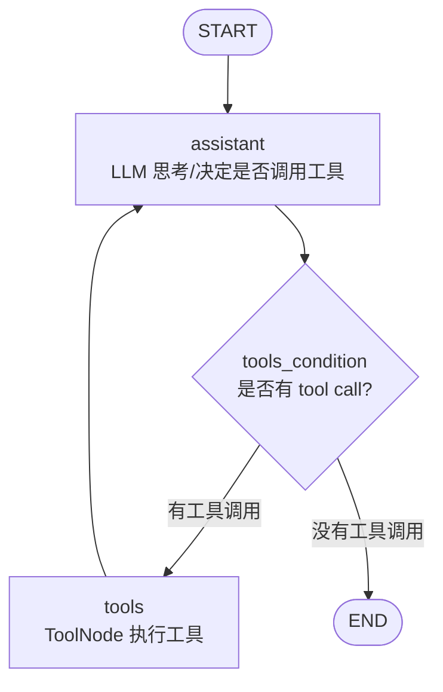
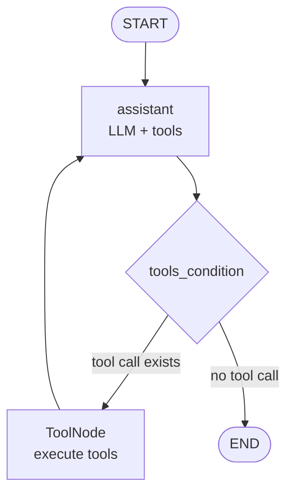

# 第24天：LangGraph 文档分析智能体

> 主题：如何用 LangGraph 构建一个能分析文档、调用工具、保持上下文的文档分析智能体？
>
> 课程来源：
> - Hugging Face Agents Course：文档分析智能体
>
> 本节关键词：
> - 文档分析图
> - ReAct Agent
> - `ToolNode`
> - `tools_condition`
> - `add_messages`
> - 视觉模型 / VLM
> - 工具调用循环

---

## 0. 今天先抓住一句话

**第 24 天是在第 23 天“固定流程图”的基础上，升级出一个能调用工具的文档分析 Agent。**

第 23 天的邮件处理工作流大概是：

```text
读取邮件
  ↓
分类
  ↓
垃圾邮件分支 / 合法邮件分支
  ↓
结束
```

第 24 天的文档分析智能体变成：

```text
用户提出文档相关问题
  ↓
LLM 判断是否需要工具
  ↓
如果需要：调用工具
  ↓
工具结果写回 messages
  ↓
LLM 根据工具结果继续思考
  ↓
直到可以回答
  ↓
END
```

核心变化是：

```text
从固定分支工作流
升级为
LLM + Tools 的 ReAct 循环
```

---

## 1. 这节课到底讲了什么？

这节课构建了一个 Alfred 文档分析智能体。

它的能力包括：

- 接收一个图片或文档路径；
- 根据用户问题决定是否需要分析文档；
- 使用视觉模型从图片中提取文字；
- 对提取出的信息做推理；
- 必要时调用计算工具；
- 保持多轮工具调用上下文；
- 最终给出文档分析结果。

课程示例里给 Alfred 提供了两个工具：

| 工具 | 作用 |
|---|---|
| `extract_text` | 从图片文件中提取文字 |
| `divide` | 做除法计算 |

这两个工具看起来很简单，但它们代表了两类能力：

```text
文档理解能力：extract_text
确定性计算能力：divide
```

这也正是 Agent 和普通 LLM 调用的区别：

```text
LLM 负责理解、规划、综合；
工具负责执行具体、可靠、可验证的动作。
```

---

## 2. 必须要使用文档分析图吗？

不必须。

如果你的任务很简单，比如：

```text
只读取一个 txt 文件
只提取 PDF 文字
只问一个简单问题
只做一次 OCR
```

那么普通 Python 函数、一次 LLM 调用、或者一个简单 RAG 流程就够了。

但如果任务具备下面这些特点，就很适合使用 LangGraph 文档分析图：

- 文档类型可能不同，例如图片、PDF、表格、扫描件；
- 需要多步骤处理，例如先提取文字，再分析，再计算；
- LLM 需要自己判断是否调用工具；
- 工具可能调用多次；
- 工具结果要被后续推理继续使用；
- 需要保存完整对话和工具调用历史；
- 需要调试每一步为什么这么走；
- 未来要加入人工审核、错误恢复、重试、持久化。

所以答案是：

```text
文档分析图不是所有文档任务的必选项，
但它是复杂文档分析 Agent 的推荐结构。
```

我的判断：

```text
简单文档问答：不用 LangGraph 也可以。
复杂文档智能体：建议使用 LangGraph。
生产级文档工作流：强烈建议使用 LangGraph。
```

---

## 3. 这节设计的流程是什么样的？

课程使用的是一个很典型的 ReAct 风格工具调用图。

流程如下：



这张图和第 23 天的邮件图不一样。

第 23 天是固定业务分支：

```text
classify_email
  ↓
spam 或 legitimate
```

第 24 天是工具调用循环：

```text
assistant
  ↓
需要工具吗？
  ↓
需要：tools
  ↓
回到 assistant
  ↓
直到不需要工具
```

这个循环就是 Agent 的基本形态。

---

## 4. 这个流程基于什么原则设计？

这节课最后总结了 4 个原则：

1. 定义清晰的工具，用于特定文档相关任务；
2. 创建强大的状态跟踪器，以保持工具调用之间的上下文；
3. 考虑错误处理机制，应对工具调用失败；
4. 通过 `add_messages` 保持上下文感知能力，确保历史交互连贯。

这 4 个原则不是口号，而是直接体现在代码结构里。

下面逐个拆。

---

## 5. 原则一：定义清晰的工具

原文：

> Define clear tools for specific document-related tasks.

也就是：

```text
工具要职责明确，一个工具只做一类清晰任务。
```

课程里定义了两个工具：

```python
@tool
def extract_text(img_path: str) -> str:
    """
    Extract text from an image file using a multimodal model.
    """
    ...
```

以及：

```python
@tool
def divide(a: int, b: int) -> float:
    """
    Divide a by b.
    """
    return a / b
```

### 5.1 `extract_text` 的职责

`extract_text` 只负责一件事：

```text
从图片里提取文字。
```

它不负责回答用户问题，不负责总结，也不负责做计算。

它只是把图片里的内容变成文本。

这很好，因为工具边界清楚：

```text
图片 -> 文本
```

LLM 后续再基于文本做分析。

### 5.2 `divide` 的职责

`divide` 也只负责一件事：

```text
做除法。
```

为什么文档分析 Agent 里会有除法工具？

因为很多文档分析任务需要计算：

- 表格中两个数的比例；
- 增长率；
- 平均值；
- 人均指标；
- 金额占比；
- 绩效指标。

LLM 可以算，但不稳定。

确定性计算交给工具更可靠。

### 5.3 工具设计好坏的区别

不好的工具：

```python
def analyze_document_and_answer_everything(file, question):
    ...
```

这个工具太大了，职责不清楚。

好的工具：

```python
def extract_text(img_path: str) -> str:
    ...

def divide(a: int, b: int) -> float:
    ...

def summarize_text(text: str) -> str:
    ...

def extract_table(file_path: str) -> list[dict]:
    ...
```

每个工具都像一个稳定的小能力，LLM 决定什么时候调用它们。

### 5.4 在课程中如何体现？

体现在三点：

1. 工具使用 `@tool` 明确声明；
2. 工具参数清楚，例如 `img_path: str`、`a: int, b: int`；
3. 工具通过 `llm.bind_tools(tools)` 交给 LLM，让 LLM 可以按需调用。

核心代码结构是：

```python
tools = [extract_text, divide]
llm_with_tools = llm.bind_tools(tools)
```

这表示：

```text
LLM 不再只是回答问题，
它现在知道自己有哪些工具可以用。
```

---

## 6. 原则二：创建强大的状态跟踪器

原文：

> Create a robust state tracker to maintain context between tool calls.

也就是：

```text
要有一个强壮的 State，负责保存多轮工具调用之间的上下文。
```

课程里定义的状态大概是：

```python
class AgentState(TypedDict):
    input_file: Optional[str]
    messages: Annotated[list[AnyMessage], add_messages]
```

这里有两个核心字段。

| 字段 | 作用 |
|---|---|
| `input_file` | 当前要分析的文档路径 |
| `messages` | 保存用户消息、AI 消息、工具调用和工具结果 |

### 6.1 为什么需要 `input_file`？

文档分析 Agent 经常需要知道：

```text
当前分析的是哪个文件？
```

如果没有这个字段，工具调用可能会失去目标。

例如用户说：

```text
帮我分析这张图片里的报销金额
```

那 Agent 必须知道：

```text
图片路径是什么？
```

所以 `input_file` 是文档分析任务的重要上下文。

### 6.2 为什么需要 `messages`？

因为工具调用不是一次性的。

一个文档分析任务可能会这样走：

```text
用户：这张图片里有哪些项目？
AI：我需要提取图片文字，调用 extract_text
工具：返回图片文字
AI：根据文字回答
用户：那平均每项是多少？
AI：我需要计算，调用 divide
工具：返回计算结果
AI：给出最终结论
```

如果没有 `messages`，AI 就不知道前面发生过什么。

### 6.3 在课程中如何体现？

课程中 `assistant` 节点会读取：

```python
state["messages"]
```

然后调用：

```python
llm_with_tools.invoke([sys_msg] + state["messages"])
```

这表示：

```text
每次 LLM 决策时，都能看到系统提示和历史消息。
```

而工具节点执行结果也会被追加回 `messages`。

这样下一轮 assistant 就能看到：

```text
刚才调用了什么工具；
工具返回了什么；
现在应该继续调用工具，还是直接回答。
```

这就是状态跟踪器的价值。

---

## 7. 原则三：考虑错误处理机制

原文：

> Consider error handling for tool failures.

也就是：

```text
工具调用可能失败，必须提前设计错误处理。
```

课程的 `extract_text` 里有错误处理：

```python
try:
    ...
    return response.content
except Exception as e:
    return ""
```

这说明作者考虑到了：

- 图片路径不存在；
- 图片格式不支持；
- 文件读取失败；
- VLM 调用失败；
- API 超时；
- 模型返回异常。

### 7.1 为什么工具错误很重要？

因为 Agent 一旦进入工具调用，就开始接触真实世界。

真实世界里什么都可能发生：

- 文件不存在；
- 网络断开；
- API 限流；
- 格式不合法；
- 权限不足；
- 工具返回空值；
- 除以 0；
- OCR 结果很差。

如果没有错误处理，整个 Agent 会直接崩掉。

### 7.2 课程里的不足

课程里 `extract_text` 有 `try/except`，但 `divide` 没有处理除以 0。

课程代码：

```python
def divide(a: int, b: int) -> float:
    return a / b
```

更稳的写法应该是：

```python
@tool
def divide(a: int, b: int) -> float:
    """Divide a by b."""
    if b == 0:
        raise ValueError("Cannot divide by zero.")
    return a / b
```

或者返回结构化错误：

```python
@tool
def divide(a: int, b: int) -> dict:
    """Divide a by b."""
    if b == 0:
        return {
            "ok": False,
            "error": "Cannot divide by zero.",
        }
    return {
        "ok": True,
        "result": a / b,
    }
```

### 7.3 在生产 Agent 中应该怎么做？

建议工具统一返回结构：

```python
{
    "ok": True,
    "data": ...,
    "error": None
}
```

失败时：

```python
{
    "ok": False,
    "data": None,
    "error": "file not found"
}
```

这样 LLM 可以根据工具结果继续处理：

```text
文件读取失败 -> 提醒用户重新上传
计算失败 -> 检查输入数字
OCR 失败 -> 建议换清晰图片
```

---

## 8. 原则四：保持上下文感知能力

原文：

> Maintain contextual awareness with the add_messages operator.

也就是：

```text
通过 add_messages 自动追加消息，保持历史交互连贯。
```

这节用了：

```python
from langgraph.graph.message import add_messages

class AgentState(TypedDict):
    input_file: Optional[str]
    messages: Annotated[list[AnyMessage], add_messages]
```

这里的关键是：

```python
Annotated[list[AnyMessage], add_messages]
```

### 8.1 `add_messages` 是什么？

默认情况下，LangGraph 更新 State 时，同名字段会被覆盖。

例如：

```python
{"messages": ["new message"]}
```

可能会覆盖旧的 `messages`。

但对对话历史来说，我们通常不想覆盖，而是追加。

`add_messages` 的作用就是：

```text
把新消息追加到旧消息后面，而不是覆盖整个 messages。
```

### 8.2 为什么文档分析 Agent 必须保留 messages？

因为文档分析常常需要多轮推理。

例如：

```text
第 1 轮：用户问图片里有什么
第 2 轮：工具返回 OCR 文字
第 3 轮：LLM 根据 OCR 回答
第 4 轮：用户追问里面的金额占比
第 5 轮：LLM 调用 divide
第 6 轮：工具返回计算结果
第 7 轮：LLM 汇总结论
```

如果没有消息历史，LLM 就会忘记：

- 用户原始问题是什么；
- 当前文件是什么；
- 已经提取过哪些文字；
- 工具返回过哪些结果；
- 上一轮已经回答了什么。

### 8.3 在课程中如何体现？

体现在三处：

1. `AgentState` 中的 `messages` 使用 `add_messages`；
2. `assistant` 节点把 `state["messages"]` 传给 LLM；
3. `ToolNode` 执行工具后，会把工具返回结果作为消息追加回 State。

所以整个循环是：

```text
assistant 产生 tool call
  ↓
ToolNode 执行工具
  ↓
工具结果追加到 messages
  ↓
assistant 再次读取 messages
  ↓
LLM 基于工具结果继续推理
```

这就是上下文感知。

---

## 9. 课程中的核心代码结构

### 9.1 定义工具

```python
tools = [extract_text, divide]
```

### 9.2 绑定工具到 LLM

```python
llm_with_tools = llm.bind_tools(tools)
```

这一步让 LLM 能够输出 tool call。

### 9.3 定义 State

```python
class AgentState(TypedDict):
    input_file: Optional[str]
    messages: Annotated[list[AnyMessage], add_messages]
```

### 9.4 定义 assistant 节点

```python
def assistant(state: AgentState):
    sys_msg = SystemMessage(content=...)
    return {
        "messages": [
            llm_with_tools.invoke([sys_msg] + state["messages"])
        ]
    }
```

这个节点的作用是：

```text
让 LLM 根据当前上下文决定：
要不要调用工具？
如果调用，调用哪个工具？
如果不调用，直接回答什么？
```

### 9.5 使用 ToolNode

```python
from langgraph.prebuilt import ToolNode

builder.add_node("tools", ToolNode(tools))
```

`ToolNode` 是 LangGraph 提供的预构建节点。

它会自动：

- 读取 AIMessage 里的 tool calls；
- 找到对应工具；
- 执行工具；
- 把工具结果写回 messages。

### 9.6 使用 tools_condition

```python
from langgraph.prebuilt import tools_condition

builder.add_conditional_edges(
    "assistant",
    tools_condition,
)
```

`tools_condition` 会判断：

```text
assistant 最新输出里有没有 tool call？
```

如果有：

```text
进入 tools 节点
```

如果没有：

```text
进入 END
```

这就是 ReAct 工具调用循环的核心。

---

## 10. 完整运行流程

把这些组件连起来后，流程是：

```text
START
  ↓
assistant
  ↓
tools_condition 判断是否有工具调用
  ↓
如果有 tool call：
    tools 执行工具
    工具结果追加到 messages
    回到 assistant
  ↓
如果没有 tool call：
    END
```

Mermaid 表示：



---

## 11. 为什么这个图适合文档分析？

因为文档分析不是固定步骤。

有的问题只需要看图：

```text
这张图里写了什么？
```

流程：

```text
assistant -> extract_text -> assistant -> END
```

有的问题需要提取后计算：

```text
这张发票里，税额占总金额多少？
```

流程：

```text
assistant -> extract_text -> assistant -> divide -> assistant -> END
```

有的问题不需要工具：

```text
你能解释一下“文档分析 Agent”的设计思路吗？
```

流程：

```text
assistant -> END
```

所以文档分析图的优势是：

```text
它不是死板固定流程，
而是让 LLM 根据当前任务选择工具。
```

---

## 12. 和第 23 天的区别

| 对比项 | Day23 邮件工作流 | Day24 文档分析 Agent |
|---|---|---|
| 核心形态 | 固定业务流程 | ReAct 工具调用循环 |
| 分支方式 | 自定义 `route_email` | 预置 `tools_condition` |
| 工具调用 | 没有真实工具 | 有 `ToolNode` 执行工具 |
| 状态重点 | 邮件分类结果、草稿 | 文件路径、messages 历史 |
| LLM 角色 | 分类、起草回复 | 决定是否调用工具、整合结果 |
| 是否更像 Agent | 还不像完整 Agent | 更接近真正 Agent |

第 23 天是在教：

```text
如何做一个固定流程图。
```

第 24 天是在教：

```text
如何做一个带工具调用循环的 Agent 图。
```

---

## 13. 这节对你自己的项目有什么启发？

你想做的内容运营 Agent、音频生成 Agent、发布助手 Agent，都可以借鉴这个结构。

### 13.1 内容运营 Agent

工具可以是：

```text
search_hot_topics
fetch_article
extract_source_summary
score_topic
write_article
check_duplicate
```

图可以是：

```text
assistant
  ↓
根据需要调用热点工具 / 搜索工具 / 写作工具
  ↓
工具结果进入 messages
  ↓
assistant 继续判断
  ↓
输出文章或发布包
```

### 13.2 音频生成 Agent

工具可以是：

```text
generate_script
text_to_speech
inspect_audio
create_publish_package
```

图可以是：

```text
assistant
  ↓
调用写稿工具
  ↓
调用 TTS 工具
  ↓
调用音频检查工具
  ↓
输出发布包
```

### 13.3 发布助手 Agent

工具可以是：

```text
open_platform_dashboard
fill_title
fill_body
upload_cover
save_draft
```

注意：最终发布最好保留人工确认。

---

## 14. 这节课的工程改进建议

课程示例很好，但如果你以后做生产项目，可以这样增强。

### 14.1 工具返回结构化结果

不要只返回字符串。

更推荐：

```python
{
    "ok": True,
    "text": "...",
    "error": None
}
```

失败时：

```python
{
    "ok": False,
    "text": "",
    "error": "file not found"
}
```

### 14.2 工具错误要可恢复

例如：

- OCR 失败：提示用户换清晰图片；
- 除以 0：说明不能计算；
- 文件不存在：让用户重新传文件；
- API 超时：重试一次。

### 14.3 给工具加更明确描述

LLM 选择工具时很依赖工具描述。

好的工具描述应该说明：

- 这个工具做什么；
- 什么时候应该使用；
- 输入参数是什么；
- 返回结果是什么；
- 不适合什么场景。

### 14.4 控制工具权限

文档分析工具通常比较安全。

但如果工具可以：

- 删除文件；
- 发布内容；
- 调用外部平台；
- 花钱；
- 发消息；

就必须加入人工确认。

### 14.5 增加 checkpointer

如果文档分析过程很长，可以加持久化：

```text
中断后恢复
人工审核后继续
失败后从上一步重试
```

---

## 15. 记忆卡片

### 这节课讲了什么？

构建一个带工具调用能力的文档分析 Agent，让 LLM 能根据用户问题决定是否调用工具。

### 必须使用文档分析图吗？

不必须。简单文档任务可以不用；复杂、多步骤、需要工具调用和上下文保持的文档任务建议使用。

### 设计流程是什么？

`START -> assistant -> tools_condition -> tools -> assistant -> ... -> END`。

### 这个流程基于什么原则？

工具职责清晰、状态跟踪强壮、考虑工具错误处理、通过 `add_messages` 保持上下文。

### `ToolNode` 做什么？

自动执行 LLM 产生的 tool calls，并把工具结果写回 messages。

### `tools_condition` 做什么？

判断 assistant 的最新输出里是否有工具调用；有则进入 tools，没有则结束。

### `add_messages` 做什么？

把新消息追加到历史消息中，避免覆盖上下文。

### 为什么文档分析 Agent 需要 messages？

因为工具调用、工具结果、用户追问都要保留，否则 LLM 无法连续推理。

---

## 16. 我的理解

第 24 天真正重要的不是图片 OCR，也不是除法工具，而是这个模式：

```text
LLM 决定要不要用工具
ToolNode 执行工具
工具结果回到 messages
LLM 再基于结果继续推理
```

这就是 Agent 的雏形。

如果说第 23 天是：

```text
人类预先设计好固定流程
```

那第 24 天就是：

```text
人类设计好工具和边界，
LLM 在边界内决定下一步调用哪个工具。
```

这对你的目标很关键。

你想做多个智能体给自己打工，本质上不是让 LLM 乱跑，而是：

```text
给它清晰工具
给它可靠状态
给它错误处理
给它上下文记忆
给它人工确认边界
```

这节课正好教的是这些底层能力。

---

## 参考资料

- [Hugging Face Agents Course - 文档分析智能体](https://huggingface.co/learn/agents-course/zh-CN/unit2/langgraph/document_analysis_agent)
- [LangGraph 官方文档 - Graph API](https://docs.langchain.com/oss/python/langgraph/graph-api)
