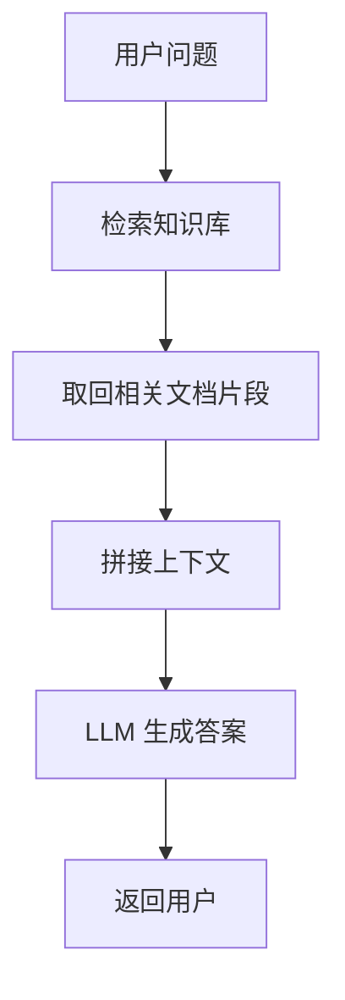
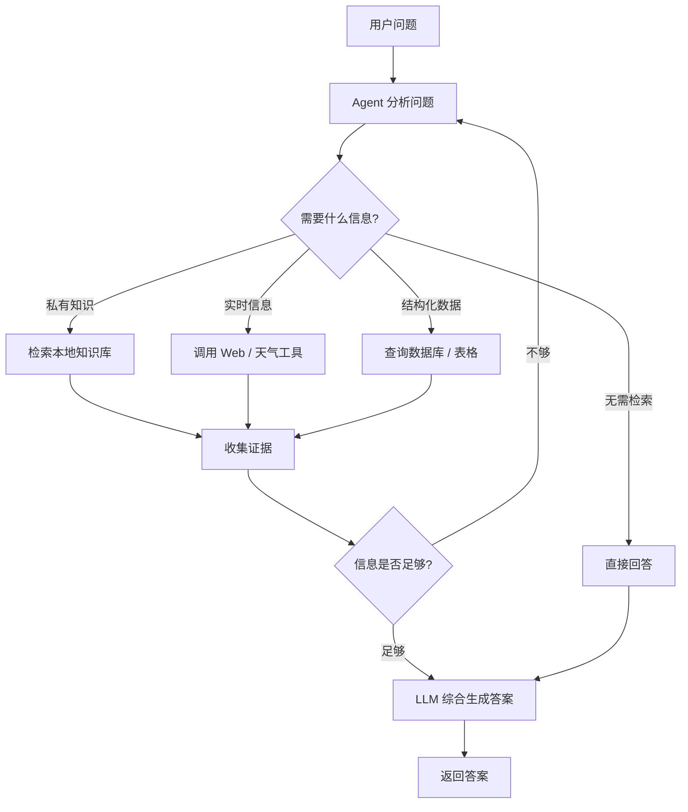

# 第25天：Agentic RAG 用例介绍

> 主题：什么是 Agentic RAG？为什么 Alfred 的晚会助手需要它？它和普通 RAG 有什么区别？
>
> 课程来源：
> - Hugging Face Agents Course：Agentic RAG 用例简介
> - Hugging Face Agents Course：Agentic RAG
>
> 配套代码：
> - `examples/25-agentic-rag-introduction/`

---

## 0. 今天先抓住一句话

**Agentic RAG = 让 Agent 自主决定何时检索、检索哪里、调用哪个工具、如何组合结果。**

普通 RAG 更像固定流水线：

```text
用户问题
  ↓
检索知识库
  ↓
把检索结果塞给 LLM
  ↓
生成答案
```

Agentic RAG 更像一个工具型助手：

```text
用户问题
  ↓
Agent 判断问题类型
  ↓
决定是否检索
  ↓
决定检索哪个数据源 / 调用哪个工具
  ↓
必要时多次检索、搜索、查天气、查宾客信息
  ↓
综合结果
  ↓
回答
```

这一节的重点不是马上写复杂代码，而是理解 Unit 3 的真实用例：

```text
帮助 Alfred 举办一场晚会，并让他能实时回答宾客问题。
```

---

## 1. 这一单元的故事背景

课程设定了一个场景：

你要举办一场极其奢华、盛大的晚会。

晚会包含：

- 豪华宴席；
- 舞者表演；
- 知名 DJ；
- 精致饮品；
- 烟花表演；
- 多位宾客；
- 各种可能发生的现场问题。

Alfred 是负责统筹晚会的智能体。

他需要在晚会中回答问题、处理突发状况、协调信息。

但 Alfred 不能只靠大模型自带知识。

原因很简单：

```text
大模型不知道你的宾客名单。
大模型不知道你的晚会菜单。
大模型不知道当天实时天气。
大模型不知道最新新闻。
大模型不知道你本地文件里的安排。
```

所以 Alfred 必须拥有检索和工具调用能力。

这就是 Agentic RAG 的用武之地。

---

## 2. 晚会核心需求

教材里提到，晚会要体现一种文艺复兴式的综合素养。

也就是要能聊：

- 体育；
- 文化；
- 科学；
- 宾客背景；
- 宾客兴趣；
- 宾客成就；
- 天气变化；
- 活动安排。

同时还要避免敏感话题：

- 政治；
- 宗教；
- 可能引发冲突的信仰分歧。

这说明 Alfred 需要的不只是普通聊天能力，而是：

```text
对晚会私有信息的检索能力
对实时信息的获取能力
对敏感话题的规避能力
对多个工具的选择能力
```

---

## 3. 为什么普通 LLM 不够？

大语言模型虽然有通用知识，但它有几个明显限制：

### 3.1 知识可能过时

例如：

```text
今天晚上是否下雨？
最新新闻是什么？
某个模型最近下载量是多少？
```

这些问题依赖实时信息。

模型训练完成后，它的内部知识不会自动更新。

### 3.2 没有你的私有数据

例如：

```text
今晚有哪些宾客？
每位宾客有什么兴趣？
座位安排是什么？
菜单是什么？
谁和谁适合聊天？
```

这些信息只存在于你的文件、数据库或业务系统里。

LLM 不可能凭空知道。

### 3.3 容易编造

当模型不知道答案时，可能会猜。

但晚会助手不能乱猜。

例如：

```text
某位宾客是否对红酒过敏？
烟花应该几点开始？
天气是否适合户外活动？
```

这些信息如果回答错，可能造成真实问题。

所以我们需要 RAG。

---

## 4. 什么是 RAG？

RAG 是 Retrieval-Augmented Generation，检索增强生成。

基本思想：

```text
不要只依赖模型记忆；
先从可靠数据源检索相关信息；
再把检索结果交给 LLM；
最后由 LLM 基于检索内容生成答案。
```

普通 RAG 流程：



它解决的问题是：

```text
让 LLM 使用你的数据回答问题。
```

---

## 5. 什么是 Agentic RAG？

Agentic RAG 可以理解成：

```text
带有 Agent 决策能力的 RAG。
```

普通 RAG 是固定流程：

```text
每次都检索同一个知识库。
```

Agentic RAG 是动态流程：

```text
Agent 根据问题决定是否检索、检索哪里、调用哪个工具、是否继续检索。
```

教材里说，和传统文档自动问答不同，Alfred 可以自主决定使用任何工具或流程来回答问题。

这句话是本节核心。

也就是说：

```text
普通 RAG：检索是固定步骤。
Agentic RAG：检索是 Agent 可选择的动作。
```

---

## 6. 普通 RAG vs Agentic RAG

| 对比项 | 普通 RAG | Agentic RAG |
|---|---|---|
| 流程 | 固定 | 动态 |
| 检索源 | 通常一个知识库 | 可以多个工具/数据源 |
| 是否总是检索 | 通常是 | 不一定 |
| 是否能多轮检索 | 较弱 | 更强 |
| 是否能调用其他工具 | 通常不做 | 可以 |
| 适合场景 | 文档问答、知识库问答 | 复杂任务、多数据源、实时信息、工具协作 |
| 例子 | 从宾客资料中找答案 | 同时查宾客资料、天气、新闻、活动安排 |

一句话：

```text
普通 RAG 是“检索后回答”。
Agentic RAG 是“为了回答问题，Agent 自己决定要不要检索和怎么检索”。
```

---

## 7. Alfred 为什么需要 Agentic RAG？

Alfred 的任务不是单一文档问答，而是晚会管家。

他可能被问到：

```text
今晚适合几点放烟花？
Alice 喜欢什么话题？
谁适合和 Bob 坐在一起？
有没有最近的 AI 新闻适合作为开场话题？
菜单里有没有适合素食者的菜？
这位宾客对什么领域有研究？
```

这些问题需要不同工具：

| 问题 | 需要的工具 |
|---|---|
| 宾客兴趣 | 宾客资料 RAG |
| 天气情况 | 天气工具 |
| 最新新闻 | Web 搜索 |
| 模型下载量 | Hugging Face Hub 统计工具 |
| 菜单安排 | 菜单知识库 |
| 座位建议 | 宾客关系 + 推理 |

所以 Alfred 不适合只接一个固定知识库。

他需要一个可以动态调度工具的系统。

这就是 Agentic RAG。

---

## 8. Unit 3 后面要构建什么？

教材说，后续会创建：

1. 用于检索最新受邀者详情的 RAG 工具；
2. 网络搜索工具；
3. 天气更新工具；
4. Hugging Face Hub 模型下载统计工具；
5. 最终整合成 Agentic RAG 智能体。

也就是说，Unit 3 的目标不是只做一个向量库。

它真正要做的是：

```text
把多个知识源和工具组织成一个能自主选择工具的 Agent。
```

---

## 9. Agentic RAG 的设计流程

一个典型 Agentic RAG 流程可以这样设计：



这个流程比普通 RAG 更像 Agent。

因为它有：

- 任务判断；
- 工具选择；
- 多源检索；
- 循环；
- 证据整合；
- 最终回答。

---

## 10. Agentic RAG 的核心原则

### 10.1 数据源要拆清楚

不要把所有东西都塞进一个知识库。

应该区分：

```text
宾客资料库
菜单资料库
活动日程
天气 API
Web 搜索
统计工具
```

这样 Agent 才能选择合适工具。

### 10.2 工具描述要清楚

Agent 选择工具时依赖工具描述。

如果工具描述模糊，模型就会乱用。

例如：

不好的描述：

```text
search_info: 搜索信息
```

好的描述：

```text
search_guest_profile: 根据宾客姓名检索其兴趣、职业、成就和社交偏好。
```

### 10.3 检索结果要可追溯

RAG 的结果最好带来源。

例如：

```text
source: guest_profiles.md
chunk_id: guest-alice-001
score: 0.84
```

这样方便检查答案是否可靠。

### 10.4 Agent 不能乱编

如果检索不到，应该说：

```text
我没有找到可靠资料。
```

而不是编造。

### 10.5 工具调用要有边界

不是所有工具都能自动执行。

像搜索、检索、计算可以自动。

像发送消息、发布内容、花钱、删除数据，应该人工确认。

---

## 11. 这节内容和你的项目有什么关系？

你说 `agent-learn` 的目标是做多个智能体给你打工。

Agentic RAG 是非常核心的底层能力。

因为你的智能体会经常遇到这种情况：

```text
模型不知道你的私有数据；
模型不知道实时信息；
模型需要查资料；
模型需要在多个数据源中选择；
模型需要根据查到的信息继续写作或决策。
```

### 11.1 内容运营 Agent

可以用 Agentic RAG：

```text
用户：今天 AI 圈有什么值得写的热点？

Agent：
1. 查热点池
2. 查历史文章，避免重复
3. 查资料来源
4. 评分选题
5. 生成文章
```

### 11.2 头条 / 公众号写作 Agent

可以用：

```text
账号定位知识库
历史爆文库
热点资料库
平台规则库
用户评论库
```

Agent 自己决定查哪个库。

### 11.3 音频生成 Agent

可以用：

```text
选题资料库
脚本模板库
历史播客库
平台发布要求
TTS 参数库
```

Agent 先检索，再生成脚本，再转音频。

---

## 12. 为什么这是变现项目的基础？

单纯 LLM 写作容易同质化。

Agentic RAG 的价值在于：

```text
让你的 Agent 能使用你的数据、你的经验、你的历史内容、你的业务资料。
```

这会形成差异化。

例如两个 Agent 都调用同一个大模型：

```text
普通 Agent：直接让模型写一篇文章。
你的 Agent：先查热点、历史数据、账号风格、读者反馈，再写文章。
```

后者更像真正能干活的员工。

---

## 13. 本节最重要的心智模型

Agentic RAG 不是一个单独技术点，而是一种工作方式：

```text
让 Agent 学会查资料。
```

更准确地说：

```text
让 Agent 根据任务，动态选择资料来源和工具。
```

普通 RAG 解决：

```text
LLM 不知道我的资料怎么办？
```

Agentic RAG 解决：

```text
LLM 怎么自己判断需要查哪些资料、查几次、怎么组合资料？
```

---

## 14. 记忆卡片

### RAG 是什么？

检索增强生成。先检索相关资料，再让 LLM 基于资料回答。

### Agentic RAG 是什么？

让 Agent 自主决定是否检索、检索哪里、调用哪个工具、如何组合结果。

### 为什么 Alfred 需要 Agentic RAG？

因为晚会助手需要处理宾客资料、天气、新闻、菜单、日程等多种信息源。

### 普通 RAG 和 Agentic RAG 的区别？

普通 RAG 是固定检索流程；Agentic RAG 是动态工具选择和多步骤检索流程。

### Unit 3 后续会构建什么？

宾客资料 RAG 工具、Web 搜索工具、天气工具、Hugging Face Hub 统计工具，并整合成 Agentic RAG 智能体。

### 对个人项目有什么价值？

它能让你的智能体使用自己的资料库、历史内容、业务数据和实时信息，而不是只靠模型空想。

---

## 15. 我的理解

第 25 天是 Unit 3 的开场。

它真正想告诉你的不是：

```text
如何写一个向量数据库查询。
```

而是：

```text
为什么一个真正有用的 Agent 必须会检索、会查资料、会选择工具。
```

这和你想做“多个智能体给自己打工”的目标高度相关。

一个能干活的 Agent 不应该只是：

```text
你问一句，它答一句。
```

它应该是：

```text
你给一个目标，
它知道要查哪些资料，
用哪些工具，
避免哪些风险，
最后给你一个可靠产出。
```

这就是 Agentic RAG 的方向。

---

## 参考资料

- [Hugging Face Agents Course - Agentic RAG 用例简介](https://huggingface.co/learn/agents-course/zh-CN/unit3/agentic-rag/introduction)
- [Hugging Face Agents Course - Agentic RAG](https://huggingface.co/learn/agents-course/zh-CN/unit3/agentic-rag/agentic-rag)
- [GitHub 教材源码 - introduction.mdx](https://github.com/huggingface/agents-course/blob/main/units/zh-CN/unit3/agentic-rag/introduction.mdx)
- [GitHub 教材源码 - agentic-rag.mdx](https://github.com/huggingface/agents-course/blob/main/units/zh-CN/unit3/agentic-rag/agentic-rag.mdx)
