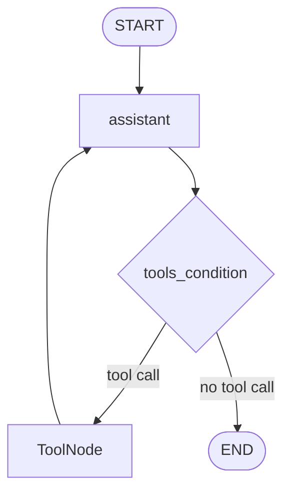

# 第27天：Agentic RAG 工具集成

> 主题：如何为 Alfred 增加外部工具，让它能搜索网页、查询天气、获取 Hugging Face Hub 模型统计？
>
> 课程来源：
> - Hugging Face Agents Course：构建并集成智能体工具
>
> GitHub 原文：
> - `units/zh-CN/unit3/agentic-rag/tools.mdx`
>
> 配套代码：
> - `examples/27-agentic-rag-tools/`

---

## 0. 今天先抓住一句话

**第 27 天是在第 26 天“宾客信息 RAG 工具”的基础上，继续给 Alfred 增加外部世界工具。**

第 26 天：

```text
Alfred 会查宾客资料。
```

第 27 天：

```text
Alfred 会查实时信息、天气、Hugging Face Hub 模型统计。
```

也就是从：

```text
私有数据检索
```

扩展到：

```text
外部世界信息获取
```

这一节的目标是让 Alfred 更像一位真正的晚会主持人：

- 知道最新新闻；
- 能判断烟花是否适合燃放；
- 能和 AI 开发者聊他们最受欢迎的模型；
- 能用不同工具组合回答复杂问题。

---

## 1. 图片上的三个框架是什么意思？

图片里有三个标签：

```text
smolagents
llama-index
langgraph
```

这表示同一个工具集成任务，课程给出了三种框架写法。

这三个标签不是说：

```text
一个 Agent 必须同时使用三种框架。
```

而是说：

```text
同一个功能，可以用 smolagents、LlamaIndex 或 LangGraph 分别实现。
```

你这次希望脚本用图片上的三种方法实现，所以配套代码里我做了三套：

```text
01_smolagents_style_tools.py
02_llama_index_style_tools.py
03_langgraph_style_tools.py
```

它们做同样的事，只是工具包装和 Agent 集成风格不同。

---

## 2. 这节课解决什么问题？

Alfred 已经可以通过第 26 天的 RAG 工具查询宾客信息。

但晚会现场还会出现很多不在宾客数据库里的问题：

```text
现在法国总统是谁？
今晚适合放烟花吗？
Facebook 在 Hugging Face Hub 上最热门的模型是什么？
有什么适合和 AI 开发者聊的最新话题？
```

这些问题需要实时或外部信息。

所以本节给 Alfred 增加三类工具：

| 工具 | 用途 |
|---|---|
| Web Search Tool | 获取实时新闻和全球资讯 |
| Weather Info Tool | 查询天气，帮助安排烟花 |
| Hub Stats Tool | 查询 Hugging Face Hub 模型下载统计 |

这就是 Agentic RAG 的“Tool Use”部分。

---

## 3. 工具一：网络搜索工具

课程首先给 Alfred 增加网页搜索能力。

原因是：

```text
大模型训练知识可能过时。
```

如果 Alfred 要像文艺复兴式主持人一样知道世界动态，它不能只靠模型记忆。

它需要搜索工具。

### 3.1 smolagents 写法

课程使用：

```python
from smolagents import DuckDuckGoSearchTool

search_tool = DuckDuckGoSearchTool()
results = search_tool("Who's the current President of France?")
```

特点：

- `DuckDuckGoSearchTool` 已经封装好；
- 直接实例化；
- 像函数一样调用；
- 适合快速给 Agent 增加搜索能力。

### 3.2 LlamaIndex 写法

课程使用：

```python
from llama_index.tools.duckduckgo import DuckDuckGoSearchToolSpec
from llama_index.core.tools import FunctionTool

tool_spec = DuckDuckGoSearchToolSpec()
search_tool = FunctionTool.from_defaults(tool_spec.duckduckgo_full_search)
response = search_tool("Who's the current President of France?")
```

特点：

- `ToolSpec` 提供一组工具函数；
- `FunctionTool.from_defaults` 把普通函数包装成 LlamaIndex 工具；
- 适合和 LlamaIndex 的 `AgentWorkflow` 集成。

### 3.3 LangGraph 写法

课程使用：

```python
from langchain_community.tools import DuckDuckGoSearchRun

search_tool = DuckDuckGoSearchRun()
results = search_tool.invoke("Who's the current President of France?")
```

特点：

- 使用 LangChain 社区工具；
- 通过 `.invoke()` 调用；
- 后续可以交给 `ToolNode` 执行；
- 适合接入 LangGraph 的工具调用循环。

---

## 4. 工具二：天气信息工具

晚会有烟花表演。

烟花需要考虑天气：

- 是否下雨；
- 风是否太大；
- 温度是否适合户外活动；
- 是否需要调整时间。

课程为了简单，使用虚拟天气 API。

### 4.1 smolagents 写法

核心是继承 `Tool`：

```python
from smolagents import Tool

class WeatherInfoTool(Tool):
    name = "weather_info"
    description = "Fetches dummy weather information for a given location."
    inputs = {
        "location": {
            "type": "string",
            "description": "The location to get weather information for."
        }
    }
    output_type = "string"

    def forward(self, location: str):
        ...
```

smolagents 工具的关键字段：

| 字段 | 作用 |
|---|---|
| `name` | 工具名称 |
| `description` | 工具描述，告诉 Agent 何时使用 |
| `inputs` | 工具参数 schema |
| `output_type` | 输出类型 |
| `forward` | 真正执行工具逻辑 |

### 4.2 LlamaIndex 写法

LlamaIndex 更偏函数包装：

```python
from llama_index.core.tools import FunctionTool

def get_weather_info(location: str) -> str:
    ...

weather_info_tool = FunctionTool.from_defaults(get_weather_info)
```

特点：

```text
先写普通 Python 函数，
再包装成 FunctionTool。
```

### 4.3 LangGraph 写法

LangGraph 通过 LangChain Tool 包装函数：

```python
from langchain_core.tools import Tool

weather_info_tool = Tool(
    name="get_weather_info",
    func=get_weather_info,
    description="Fetches dummy weather information for a given location."
)
```

特点：

```text
工具是 LangChain Tool；
LangGraph 通过 ToolNode 执行工具。
```

---

## 5. 工具三：Hugging Face Hub 统计工具

晚会里有很多 AI 开发者。

Alfred 想通过讨论他们最受欢迎的模型来打动他们。

所以课程创建了一个 Hub Stats 工具：

```text
输入：作者或组织名
输出：该作者下载次数最高的模型
```

### 5.1 核心逻辑

课程使用：

```python
from huggingface_hub import list_models

models = list(
    list_models(
        author=author,
        sort="downloads",
        direction=-1,
        limit=1,
    )
)
```

含义：

- 根据作者名列出模型；
- 按下载量排序；
- 降序；
- 只取第一名。

然后返回：

```text
The most downloaded model by facebook is facebook/esmfold_v1 with xxx downloads.
```

### 5.2 这个工具为什么重要？

因为它代表：

```text
Agent 可以调用平台 API 获取实时统计数据。
```

这和你的变现项目很相关。

以后你可以做：

```text
公众号数据统计工具
头条文章表现统计工具
音频播放量统计工具
用户评论分析工具
```

Hub Stats Tool 是一个模板。

---

## 6. 将工具与 Alfred 集成

这节最后把工具交给 Alfred。

工具包括：

```text
search_tool
weather_info_tool
hub_stats_tool
```

Alfred 可以面对一个问题，自主决定调用哪些工具。

例如：

```text
What is Facebook and what's their most popular model?
```

它可能需要：

1. 搜索 Facebook 是什么；
2. 查询 Hugging Face Hub 上 facebook 下载量最高的模型；
3. 综合两个工具结果回答。

这就是 Agentic RAG 的关键：

```text
不是每个问题都走固定检索流程，
而是由 Agent 决定工具组合。
```

---

## 7. 三种框架的集成方式对比

| 框架 | 工具定义方式 | Agent 集成方式 | 特点 |
|---|---|---|---|
| smolagents | 继承 `Tool` 或使用内置工具 | `CodeAgent(tools=[...])` | 简洁，适合快速实验 |
| LlamaIndex | `FunctionTool.from_defaults` | `AgentWorkflow.from_tools_or_functions` | 适合知识库、Workflow、RAG |
| LangGraph | LangChain `Tool` + `ToolNode` | `StateGraph + tools_condition` | 适合状态流、循环、人工介入 |

### 7.1 smolagents 的核心思路

```text
工具是 Agent 可执行的函数/类。
CodeAgent 自己决定如何调用。
```

### 7.2 LlamaIndex 的核心思路

```text
工具可以来自普通函数。
AgentWorkflow 管理工具调用和推理流程。
```

### 7.3 LangGraph 的核心思路

```text
工具调用是图中的一个节点。
assistant 节点决定是否产生 tool call。
ToolNode 执行工具。
tools_condition 决定是否进入工具节点。
```

LangGraph 的典型图：



---

## 8. 这节课的设计原则

### 8.1 工具要职责单一

每个工具只做一件事：

```text
search_tool：搜索网页
weather_info_tool：查天气
hub_stats_tool：查模型下载统计
```

不要写一个万能工具：

```text
do_everything_tool
```

那会让 Agent 难以选择，也难以调试。

### 8.2 工具描述要清楚

Agent 选择工具时主要看：

```text
name
description
inputs
```

所以描述要告诉模型：

- 这个工具做什么；
- 什么时候使用；
- 输入参数是什么；
- 输出是什么。

### 8.3 外部 API 要有错误处理

Hub Stats Tool 里有：

```python
try:
    ...
except Exception as e:
    return f"Error fetching models for {author}: {str(e)}"
```

这很重要。

真实工具会遇到：

- 网络失败；
- API 限流；
- 查询对象不存在；
- 返回为空；
- 认证失败。

工具不能一失败就让整个 Agent 崩掉。

### 8.4 实时工具结果要谨慎

Web 搜索、天气、Hub 下载量都是实时或近实时数据。

这些结果会变。

所以不要把课程里的输出数字当成固定答案。

例如 `facebook/esmfold_v1` 的下载量每天都可能变化。

---

## 9. 和第 26 天的关系

第 26 天：

```text
宾客资料 RAG 工具
```

第 27 天：

```text
外部世界工具
```

合在一起，Alfred 拥有：

| 能力 | 工具 |
|---|---|
| 查宾客 | `guest_info_retriever` |
| 查实时网页 | `search_tool` |
| 查天气 | `weather_info_tool` |
| 查模型统计 | `hub_stats_tool` |

这才开始接近真正的 Agentic RAG：

```text
私有知识库 + 外部实时工具 + Agent 自主选择
```

---

## 10. 对你的项目有什么启发？

你想做多个智能体给你打工。

第 27 天非常关键，因为它告诉你：

```text
一个 Agent 的能力边界，主要取决于它能调用哪些工具。
```

如果你做内容运营 Agent，可以有：

| 工具 | 作用 |
|---|---|
| `hot_topic_search` | 搜索热点 |
| `platform_rule_lookup` | 查平台规则 |
| `account_style_retriever` | 查账号风格 |
| `article_history_retriever` | 查历史文章避免重复 |
| `cover_prompt_generator` | 生成封面提示词 |
| `publish_package_builder` | 生成发布包 |

如果你做音频 Agent，可以有：

| 工具 | 作用 |
|---|---|
| `script_generator` | 生成文稿 |
| `tts_tool` | 文字转音频 |
| `audio_inspector` | 检查音频时长和格式 |
| `manual_publisher` | 生成发布资料包 |

这就是工具化思维。

---

## 11. 配套代码说明

代码目录：

```text
examples/27-agentic-rag-tools/
```

文件：

| 文件 | 说明 |
|---|---|
| `common_tools.py` | 离线 mock 的搜索、天气、Hub 统计工具函数 |
| `01_smolagents_style_tools.py` | smolagents 风格实现 |
| `02_llama_index_style_tools.py` | LlamaIndex 风格实现 |
| `03_langgraph_style_tools.py` | LangGraph 风格实现 |
| `04_compare_three_styles.py` | 对比三种实现的输出 |
| `05_tools_flow_map.py` | 输出 Mermaid 流程图 |

为了本地稳定运行，配套代码默认不访问外网。

它使用离线 mock 数据模拟：

- DuckDuckGo 搜索；
- 天气 API；
- Hugging Face Hub 模型统计。

这样你先理解结构，后续再替换成真实 API。

---

## 12. 记忆卡片

### 第 27 天讲了什么？

给 Alfred 增加 Web 搜索、天气查询、Hugging Face Hub 统计三个外部工具，并分别展示 smolagents、LlamaIndex、LangGraph 三种实现方式。

### 为什么需要 Web 搜索？

让 Alfred 获取最新新闻和实时世界信息，避免只依赖模型过时知识。

### 为什么需要天气工具？

帮助判断烟花和户外活动是否适合举行。

### 为什么需要 Hub Stats 工具？

让 Alfred 能和 AI 开发者聊他们在 Hugging Face Hub 上最受欢迎的模型。

### 三种框架是一起用吗？

不是。它们是同一功能的三种实现方式。

### 这节课最重要的思想是什么？

Agent 的能力来自工具。工具越清晰、越可靠，Agent 越像能干活的助手。

---

## 13. 我的理解

第 27 天的关键不是 DuckDuckGo，也不是天气 API，更不是 Facebook 的模型下载量。

真正关键的是：

```text
如何把外部能力包装成 Agent 可调用的工具。
```

只要掌握这个思路，你就可以不断给自己的 Agent 加能力：

```text
搜索工具
数据库工具
发布工具
音频工具
图片工具
统计工具
审核工具
```

这就是“让智能体给你打工”的基础。

一个没有工具的 Agent，只能聊天。

一个有可靠工具的 Agent，才能做事。

---

## 参考资料

- [Hugging Face Agents Course - 构建并集成智能体工具](https://huggingface.co/learn/agents-course/zh-CN/unit3/agentic-rag/tools)
- [GitHub 教材源码 - tools.mdx](https://github.com/huggingface/agents-course/blob/main/units/zh-CN/unit3/agentic-rag/tools.mdx)
