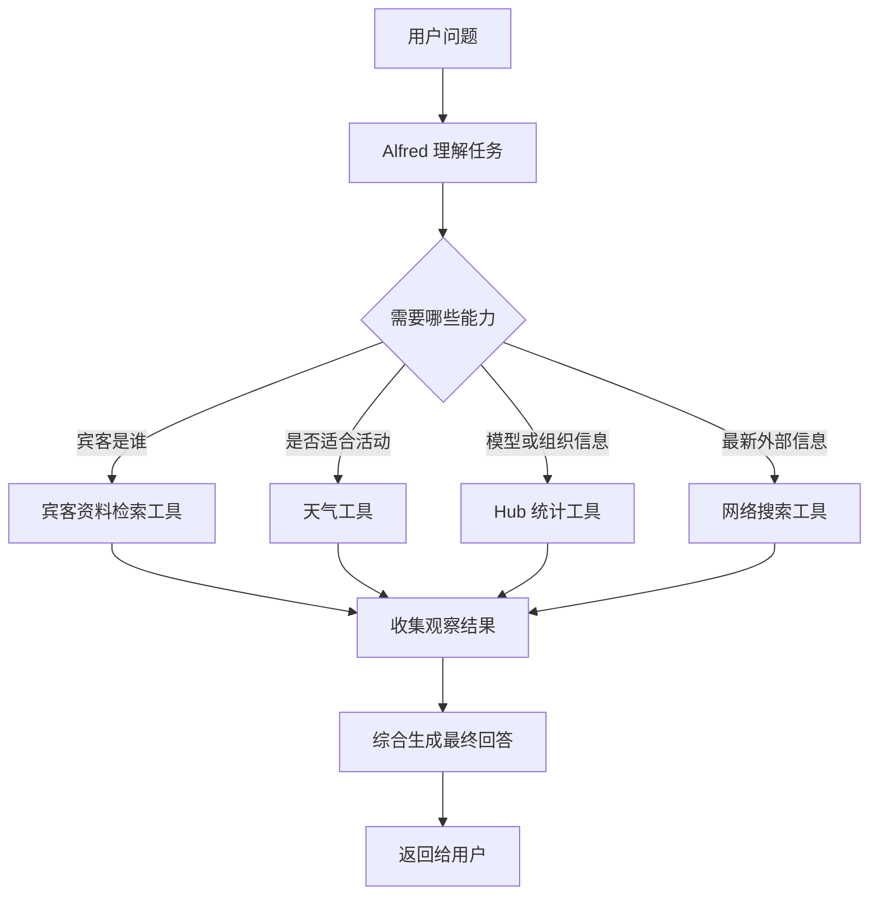
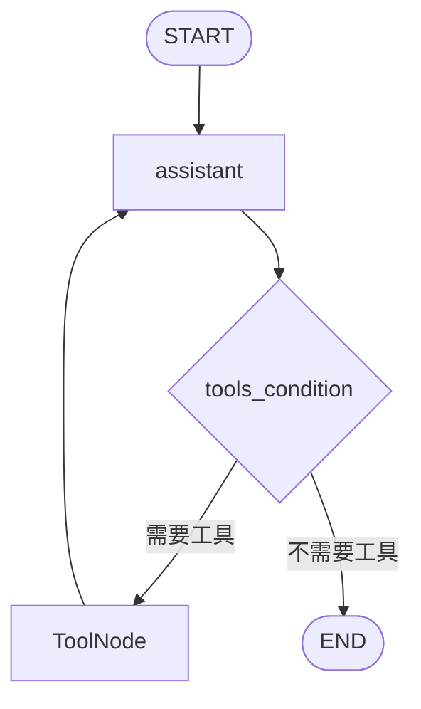

# 第28天：创建 Gala 智能体：端到端 Agentic RAG

> 主题：把前面几天做好的工具组合成一个真正能完成任务的 Alfred 智能体。
>
> 课程来源：
> - Hugging Face Agents Course：创建你的 Gala 智能体
>
> GitHub 原文：
> - `units/zh-CN/unit3/agentic-rag/agent.mdx`
>
> 配套代码：
> - `examples/28-agentic-rag-agent/`

---

## 0. 今天先抓住一句话

**第 28 天是 Unit 3 Agentic RAG 的整合课。**

前几天我们分别做了：

| 天数 | 内容 | 得到的能力 |
|---|---|---|
| Day25 | Agentic RAG 概念 | 明白 Agent 可以自主决定是否检索 |
| Day26 | 宾客资料 RAG 工具 | Alfred 可以查询私有宾客资料 |
| Day27 | 外部工具集成 | Alfred 可以搜索网页、查天气、查 Hub 模型统计 |
| Day28 | 创建 Gala 智能体 | 把所有工具组装成完整 Agent |

所以第 28 天不是讲一个全新的单点技术，而是讲：

```text
如何把多个工具组合成一个端到端可用的智能体。
```

这一步非常关键，因为真实项目里赚钱的不是“单个工具”，而是：

```text
能接收任务、判断步骤、调用工具、整合结果、持续对话的完整工作流。
```

---

## 1. 什么是端到端的示例？

**端到端示例（End-to-End Example）指的是：从用户提出真实问题开始，到系统返回最终可用答案结束，中间完整经过数据、工具、模型、路由、推理和输出的全过程。**

换句话说，它不是只演示一个零件，而是演示整条链路。

### 1.1 不是端到端的例子

下面这些都只能算局部示例：

```text
只演示如何定义一个工具。
只演示如何查询一次向量数据库。
只演示如何调用一次天气 API。
只演示如何把函数包装成 Tool。
```

这些很重要，但它们只是组件。

### 1.2 端到端示例是什么样？

端到端示例会覆盖完整流程：

```text
用户提出任务
→ Agent 理解任务
→ Agent 判断需要哪些工具
→ 调用宾客资料工具 / 搜索工具 / 天气工具 / Hub 统计工具
→ 收集工具返回结果
→ 组织成最终回答
→ 必要时保留上下文，支持下一轮追问
```

例如用户问：

```text
我需要和某位嘉宾聊无线能源的最新进展，帮我准备一下。
```

端到端的 Alfred 不只是回答几句空话，而是会：

1. 识别这个问题涉及某位嘉宾；
2. 查询宾客资料，知道这个人是谁、和用户有什么关系；
3. 判断需要最新信息；
4. 调用网络搜索工具查相关技术进展；
5. 综合资料，生成对话准备建议；
6. 如果用户继续追问“她现在在做什么项目”，还能结合历史上下文理解“她”是谁。

这就是端到端。

### 1.3 为什么端到端示例重要？

因为真实智能体项目最容易失败的地方不是某个函数不会写，而是：

```text
各个组件能不能串起来？
工具调用顺序是否合理？
输出是否真的能解决用户任务？
第二轮追问还能不能接住上下文？
错误时会不会崩？
```

端到端示例就是为了验证这些问题。

---

## 2. 第28天的教材在讲什么？

教材中的目标是创建一个名叫 Alfred 的 Gala 智能体。

Alfred 要服务一场高级晚会，因此它需要综合多种能力：

| 能力 | 对应工具 |
|---|---|
| 查询宾客信息 | `guest_info_tool` |
| 查询实时或外部信息 | `search_tool` |
| 查询天气 | `weather_info_tool` |
| 查询 Hugging Face Hub 模型统计 | `hub_stats_tool` |
| 维持上下文 | 记忆 / Context / Messages |

前面的章节已经分别实现这些工具，所以第 28 天的重点是：

```text
不要重复造工具，而是导入工具，并把它们交给 Agent。
```

这也是工程开发里非常重要的原则：

```text
组件先独立实现和测试，再在顶层工作流中组合。
```

---

## 3. Alfred 的完整能力地图

可以把 Alfred 看成一个工具调度员：



这里最关键的点是：

```text
工具不是固定全部调用，而是按任务需要调用。
```

这就是 Agentic RAG 和传统 RAG 的区别之一。

传统 RAG 常见流程是：

```text
用户问题 → 固定检索 → 拼接上下文 → LLM 回答
```

Agentic RAG 更像：

```text
用户问题 → Agent 判断 → 可选调用多个工具 → 可能多步推理 → 最终回答
```

---

## 4. 三种框架分别怎么实现？

教材给出三种实现方式：

```text
smolagents
LlamaIndex
LangGraph
```

这不是要求一个项目同时使用三种框架，而是告诉你：

```text
同一个 Alfred，可以用不同 Agent 框架搭出来。
```

你学习时应该看三件事：

1. 工具如何注册；
2. Agent 如何决定调用工具；
3. 对话记忆如何处理。

---

## 5. smolagents 版本

### 5.1 核心写法

smolagents 版本的核心是 `CodeAgent`。

整体思路：

```text
准备模型
→ 初始化工具
→ 加载宾客检索工具
→ 把工具列表传给 CodeAgent
→ 调用 alfred.run(query)
```

### 5.2 工具组合

Alfred 拿到的工具包括：

```text
guest_info_tool
weather_info_tool
hub_stats_tool
search_tool
```

这些工具被放进 `CodeAgent(tools=[...])`。

这意味着：

```text
Agent 可以根据问题自己决定调用哪个工具。
```

### 5.3 `add_base_tools=True` 怎么理解？

`add_base_tools=True` 表示给 Agent 添加一些框架内置基础工具。

你可以理解为：

```text
除了你手写的工具，框架还可以给 Agent 一些基础能力。
```

但在生产环境里，要谨慎打开过多工具。

工具越多，Agent 的行动空间越大，也越需要权限控制和日志追踪。

### 5.4 `planning_interval=3` 怎么理解？

`planning_interval=3` 表示 Agent 每执行若干步后进行规划。

可以理解为：

```text
不是一口气乱跑到底，而是定期停下来想一想下一步。
```

这对复杂任务很有用。

---

## 6. LlamaIndex 版本

### 6.1 核心写法

LlamaIndex 版本使用 `AgentWorkflow.from_tools_or_functions`。

整体思路：

```text
准备 LLM
→ 准备工具函数或 FunctionTool
→ 使用 AgentWorkflow 组装
→ await alfred.run(query)
```

### 6.2 为什么 LlamaIndex 适合 RAG？

因为 LlamaIndex 本来就擅长处理：

- 文档；
- 索引；
- 检索器；
- Query Engine；
- 工具化检索；
- Workflow。

所以如果你的 Agent 主要围绕知识库、文档、资料库工作，LlamaIndex 很自然。

例如你的内容生产项目里：

```text
历史文章库
平台规则库
账号风格库
爆款标题库
选题库
```

这些都很适合 LlamaIndex。

### 6.3 LlamaIndex 的记忆

教材里提到 LlamaIndex 使用 `Context` 维持运行上下文。

这说明：

```text
记忆不是默认永远存在，而是你要显式管理。
```

这个思想很重要。

生产环境中不要让 Agent 无限制记住一切。

更好的做法是：

```text
短期对话记忆 + 长期结构化记忆 + 可检索历史记录
```

---

## 7. LangGraph 版本

### 7.1 核心写法

LangGraph 版本把 Agent 看成一张图。

典型流程是：

```text
START
→ assistant 节点
→ tools_condition 判断是否需要工具
→ tools 节点执行工具
→ 回到 assistant
→ 不需要工具时结束
```

对应图：



### 7.2 LangGraph 的核心优势

LangGraph 最适合你想明确控制流程的场景。

例如：

```text
生成文稿 → 人工审核 → 生成音频 → 检查音频 → 生成发布包 → 人工确认 → 发布
```

这个流程不应该完全交给模型自由发挥。

你需要：

- 明确每一步；
- 保存状态；
- 可以中断；
- 可以重试；
- 可以人工介入；
- 可以查看 traces；
- 可以知道失败在哪一步。

这就是 LangGraph 的价值。

### 7.3 LangGraph 的状态

教材里 `AgentState` 主要保存 messages。

它的意思是：

```text
图里的每一步都围绕当前消息历史运行。
```

当 assistant 生成工具调用时，流程进入工具节点。

工具返回结果后，再回到 assistant 继续总结。

---

## 8. 教材中的四个端到端示例

### 8.1 示例一：查找嘉宾信息

用户问某位嘉宾的背景。

Alfred 应该调用：

```text
guest_info_tool
```

流程：

```text
识别人物名
→ 检索宾客资料
→ 总结背景、关系、联系方式等信息
```

这个例子验证的是：

```text
私有数据检索能力是否接入成功。
```

### 8.2 示例二：烟花天气核查

用户问巴黎今晚天气是否适合烟花表演。

Alfred 应该调用：

```text
weather_info_tool
```

流程：

```text
识别地点和活动
→ 查询天气
→ 判断是否适合户外活动
→ 给出建议
```

这个例子验证的是：

```text
工具结果能不能转化成决策建议。
```

不是只说“天气晴朗”，而是进一步回答：

```text
适不适合烟花？
要不要调整安排？
```

### 8.3 示例三：给 AI 研究者留下深刻印象

用户问某个组织最受欢迎的模型。

Alfred 应该调用：

```text
hub_stats_tool
```

流程：

```text
识别组织名
→ 查询 Hugging Face Hub 模型统计
→ 返回最热门模型和下载量
→ 变成可用于聊天的话题
```

这个例子验证的是：

```text
Agent 能否调用平台 API 获取结构化事实。
```

### 8.4 示例四：组合多工具应用

用户要准备和某位嘉宾聊某个技术主题。

Alfred 可能需要同时调用：

```text
guest_info_tool
search_tool
```

甚至还可能结合：

```text
hub_stats_tool
weather_info_tool
```

流程：

```text
识别嘉宾
→ 查询嘉宾资料
→ 搜索相关最新进展
→ 生成对话准备建议
```

这个例子最重要。

因为它证明 Alfred 不是“单工具机器人”，而是：

```text
能组合多个工具解决复杂任务的 Agent。
```

---

## 9. 高级功能：对话记忆

教材最后讲了记忆。

记忆的例子是：

```text
第一轮：Tell me about Lady Ada Lovelace.
第二轮：What projects is she currently working on?
```

第二轮中的 `she` 依赖第一轮上下文。

如果没有记忆，Agent 不知道 `she` 指谁。

### 9.1 smolagents 的记忆

smolagents 示例里需要显式使用：

```text
reset=False
```

含义是：

```text
不要清空上一轮上下文。
```

### 9.2 LlamaIndex 的记忆

LlamaIndex 示例里使用：

```text
Context
```

含义是：

```text
把多轮运行放在同一个上下文对象里。
```

### 9.3 LangGraph 的记忆

LangGraph 的基础状态里保存 messages。

也可以使用专门的 checkpoint / memory 机制。

含义是：

```text
状态图可以把历史消息作为状态的一部分传递。
```

### 9.4 为什么框架不默认永远记忆？

因为记忆有成本和风险：

| 问题 | 说明 |
|---|---|
| 成本 | 上下文越长，token 成本越高 |
| 干扰 | 旧信息可能干扰新任务 |
| 隐私 | 历史对话可能包含敏感内容 |
| 可控性 | 生产系统需要明确知道记住了什么 |
| 检索难度 | 长期记忆不能只靠聊天上下文 |

所以更专业的做法是：

```text
短期上下文用于当前对话；
长期记忆进入数据库或知识库；
重要事实结构化保存；
每次任务按需检索。
```

---

## 10. 第28天和你的变现项目有什么关系？

你之前说想做多个智能体给你打工。

第 28 天其实就是一个非常适合迁移的模板。

### 10.1 内容生产 Agent

可以映射成：

| Alfred 工具 | 内容 Agent 工具 |
|---|---|
| `guest_info_tool` | 账号定位 / 历史文章 / 用户画像检索 |
| `search_tool` | 热点搜索 |
| `weather_info_tool` | 发布时机 / 平台状态检查 |
| `hub_stats_tool` | 爆款数据 / 竞品账号数据查询 |
| memory | 连续选题、账号风格、用户反馈 |

端到端流程：

```text
输入主题
→ 搜索热点
→ 检索账号历史内容
→ 生成选题角度
→ 写文
→ 审核风险
→ 生成标题和封面提示词
→ 输出发布包
```

### 10.2 音频节目 Agent

可以映射成：

```text
输入选题
→ 搜索资料
→ 生成口播稿
→ 调用 TTS
→ 检查音频时长
→ 生成标题、简介、标签
→ 生成发布包
```

注意：

```text
如果平台没有官方发布 API，最后一步可以先做人机协作，而不是强行自动发布。
```

### 10.3 多账号运营 Agent

可以映射成：

```text
账号 A 风格记忆
账号 B 风格记忆
热点采集工具
平台规则工具
内容生成工具
去重工具
发布包工具
人工审核节点
```

这类任务更适合 LangGraph，因为你需要强控制、可追踪、可回滚。

---

## 11. 工程设计原则

### 11.1 工具先独立，再组合

不要一开始就写一个巨大 Agent。

更好的顺序是：

```text
先写 guest 工具
再写 search 工具
再写 weather 工具
再写 stats 工具
最后组合成 Agent
```

每个工具都能单独测试，整体才稳定。

### 11.2 Agent 不是万能函数

Agent 的职责是：

```text
理解任务、选择工具、整合结果。
```

工具的职责是：

```text
稳定完成具体动作。
```

不要让 Agent 自己“想象”外部事实。

需要事实时，就让它调用工具。

### 11.3 多工具任务要有观测记录

生产环境要记录：

```text
用户问了什么
Agent 选了什么工具
工具输入是什么
工具输出是什么
最终回答是什么
哪一步失败了
```

这就是 traces 的价值。

### 11.4 记忆要分层

建议分成三层：

| 层级 | 保存什么 |
|---|---|
| 当前消息 | 本轮对话上下文 |
| 会话记忆 | 当前任务内的重要上下文 |
| 长期记忆 | 用户偏好、账号风格、历史内容、业务数据 |

不要把所有东西都塞进 prompt。

---

## 12. 配套代码说明

代码目录：

```text
examples/28-agentic-rag-agent/
```

文件：

| 文件 | 说明 |
|---|---|
| `common_alfred_tools.py` | 离线版宾客、搜索、天气、Hub 统计工具 |
| `01_smolagents_end_to_end_agent.py` | smolagents 风格端到端 Alfred |
| `02_llama_index_end_to_end_agent.py` | LlamaIndex 风格端到端 Alfred |
| `03_langgraph_end_to_end_agent.py` | LangGraph 风格端到端 Alfred |
| `04_compare_end_to_end_agents.py` | 对比三种框架风格输出 |
| `05_memory_demo.py` | 对话记忆演示 |
| `06_end_to_end_flow_map.py` | Mermaid 流程图 |
| `07_real_openai_compatible_alfred.py` | 真实 OpenAI-compatible API 版 Alfred |

为了学习稳定，代码默认离线运行，不访问真实 API。

它模拟了：

- 查询 Ada 的宾客资料；
- 查询巴黎天气并判断活动适配性；
- 查询 Qwen / Google 的热门模型；
- 为技术对话组合宾客资料和搜索结果；
- 使用记忆理解第二轮追问。

如果你已经配置了项目根目录 `.env`：

```bash
OPENAI_API_KEY=你的 key
OPENAI_BASE_URL=你的 OpenAI-compatible 地址
OPENAI_MODEL=你的模型名
```

可以运行真实大模型版本：

```bash
python3 examples/28-agentic-rag-agent/07_real_openai_compatible_alfred.py
```

这份脚本会真实调用你的大模型接口，并用程序执行工具，再把 Observation 交回模型总结。

它比离线教学版更接近真实 Agent：

```text
用户问题
→ 真实 LLM 判断要不要调用工具
→ Python 执行工具
→ Observation 回到 LLM
→ LLM 生成最终回答
```

需要注意：

- 这会消耗你的模型 API 额度；
- 天气、Hub、搜索工具依赖外网；
- DuckDuckGo Instant Answer 不是完整搜索引擎，生产环境建议换成正式搜索 API；
- 平台发布类动作建议先做人机确认，不要一开始全自动执行。

---

## 13. 记忆卡片

### 第 28 天讲了什么？

把前几天创建的宾客检索、网络搜索、天气、Hub 统计工具组合成完整 Alfred Agent。

### 什么是端到端示例？

从用户真实问题开始，经过 Agent 判断、工具调用、结果整合，到最终回答结束的完整链路。

### Alfred 有哪些工具？

宾客资料工具、网络搜索工具、天气工具、Hub 模型统计工具。

### 三种框架有什么区别？

smolagents 更简洁，LlamaIndex 更适合 RAG 和知识库，LangGraph 更适合明确流程控制和生产级状态管理。

### 为什么要讲记忆？

因为多轮任务里，第二轮问题经常依赖第一轮上下文，Agent 必须知道代词或省略信息指向什么。

### 这一节对真实项目最重要的启发是什么？

不要只做单个工具，要把工具、状态、记忆、流程和输出组合成能完整完成任务的 Agent。

---

## 14. 我的理解

第 28 天是 Agentic RAG 从“能查资料”走向“能办事情”的分水岭。

单个 RAG 工具只能回答：

```text
我查到了什么？
```

完整 Agent 要回答：

```text
我该怎么帮你完成这个任务？
```

这个差别很大。

你以后做变现智能体，也应该按这个思路推进：

```text
先做工具
再做工具路由
再做端到端工作流
再加记忆
再加人工审核
再加日志和评估
最后才考虑自动发布或自动执行高风险动作
```

这样做出来的 Agent 才不是玩具，而是可以逐步接近生产环境的系统。

---

## 参考资料

- [Hugging Face Agents Course - 创建你的 Gala 智能体](https://huggingface.co/learn/agents-course/zh-CN/unit3/agentic-rag/agent)
- [GitHub 教材源码 - agent.mdx](https://github.com/huggingface/agents-course/blob/main/units/zh-CN/unit3/agentic-rag/agent.mdx)
