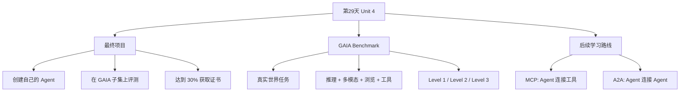

# 第29天：GAIA 智能体评测与最终项目

> 主题：课程最后一个单元，重点从“学习如何构建 Agent”转向“评估 Agent 是否真的能解决真实任务”。
>
> 课程来源：
> - Hugging Face Agents Course：Unit 4 Introduction
> - Hugging Face Agents Course：What is GAIA?
> - Hugging Face Agents Course：Additional readings
>
> 第 29 天没有配套代码，重点是理解智能体评测、GAIA 基准、最终项目和后续学习路线。

---

## 0. 今天先抓住一句话

**第 29 天是从“会写 Agent”走向“会验证 Agent 有没有用”的转折点。**

前面 28 天主要在学：

```text
什么是 Agent
Agent 怎么推理
Agent 怎么调用工具
Agent 怎么做 RAG
Agent 怎么用 smolagents / LlamaIndex / LangGraph 实现
```

第 29 天开始进入最后一个单元：

```text
创建、测试并认证你的智能体。
```

这意味着课程不再只问：

```text
你会不会写 Agent？
```

而是问：

```text
你的 Agent 能不能在真实任务上拿到分数？
```

这个变化很重要。

因为真正能变现、能部署、能给你打工的 Agent，不是看起来很酷的 demo，而是：

```text
能稳定完成任务，并且可以被评估、比较、改进的系统。
```

---

## 1. Unit 4 在课程中的位置

Hugging Face Agents Course 的 Unit 4 是最终项目单元。

课程前面已经讲过：

| 单元 | 重点 |
|---|---|
| Unit 1 | 智能体基础：messages、tools、thought-action-observation |
| Unit 2 | 智能体框架：smolagents、LlamaIndex、LangGraph |
| Unit 3 | Agentic RAG：让 Agent 自主检索和调用工具 |
| Unit 4 | 最终项目：创建、测试和认证你的智能体 |

所以 Unit 4 的定位是：

```text
把前面学过的知识用于真实评测。
```

它不是再讲一个新框架，而是让你开始面对一个更严肃的问题：

```text
怎么证明我的 Agent 真的有能力？
```

---

## 2. 最终挑战是什么？

课程要求你创建自己的智能体，并使用 **GAIA 基准的一个子集** 来评估它。

课程里给出的目标是：

```text
智能体在基准测试中达到 30% 或更高分数。
```

达到这个目标后，你可以获得课程完成证书。

此外，课程还提供学生排行榜，你可以提交自己的成绩，并和其他学习者比较。

这说明最终项目不是简单地“跑通代码”。

它更像：

```text
你做一个 Agent
→ 用统一题目测试
→ 得到分数
→ 和别人比较
→ 继续优化
```

这就是工程化和产品化的味道。

---

## 3. 为什么最后要做评测？

因为 Agent 很容易出现一种错觉：

```text
看起来很聪明，实际上不稳定。
```

比如一个 Agent 可能会：

- 能回答简单问题，但做不了多步骤任务；
- 能调用工具，但工具选择经常错；
- 能搜索网页，但不会判断信息真假；
- 能读文件，但不会整合多个文件；
- 能生成答案，但格式不符合要求；
- 能做一次任务，但无法稳定复现；
- 能在 demo 里表现好，但真实问题一来就崩。

所以最后一个单元的意义是：

```text
把 Agent 放进统一、困难、真实的任务集合里测试。
```

这就像考试。

不是看你平时说自己学得怎么样，而是看你上考场能不能做出来。

---

## 4. 什么是 GAIA？

**GAIA 是一个用于评估通用 AI 助手能力的基准测试。**

它的全名可以理解为：

```text
General AI Assistants Benchmark
```

它评估的不是单一能力，而是多个能力的组合。

课程里提到，GAIA 用来评估 AI 助手在真实世界任务上的表现，这些任务需要组合使用：

| 能力 | 含义 |
|---|---|
| 推理 | 能拆解问题、安排步骤、判断条件 |
| 多模态理解 | 能理解图像、表格、网页、文件等 |
| 网页浏览 | 能查找实时或外部信息 |
| 工具使用 | 能调用搜索、计算、文件处理、浏览器等工具 |

所以 GAIA 特别适合评估 Agent。

因为 Agent 的核心本来就是：

```text
LLM + 工具 + 规划 + 观察 + 多步骤执行
```

---

## 5. GAIA 为什么重要？

GAIA 的价值在于：它测试的是接近真实工作的任务。

很多传统 benchmark 测的是：

```text
模型会不会答题？
模型会不会做选择题？
模型会不会补全代码？
模型会不会读一段文本？
```

但真实工作不是这样。

真实工作经常是：

```text
你先去查一个网页
然后打开相关 PDF
从图片里识别一个信息
再根据另一个网页交叉验证
最后按指定格式返回答案
```

这就是 GAIA 的难点。

它不是测模型“知道多少”，而是测系统“能不能办成事”。

---

## 6. GAIA 的数据规模和能力差距

课程中提到，GAIA 包含：

```text
466 个精心策划的问题
```

这些问题有一个很有意思的特点：

```text
对人类来说概念上简单，
但对当前 AI 系统来说非常困难。
```

课程给出的对比是：

| 系统 | 成功率 |
|---|---|
| 人类 | 约 92% |
| 带插件的 GPT-4 | 约 15% |
| OpenAI Deep Research | 验证集约 67.36% |

这个差距说明一件事：

```text
会聊天的模型，离能自主完成真实复杂任务还有距离。
```

这也是为什么我们要学 Agent。

单纯 LLM 不够。

需要：

- 工具；
- 浏览器；
- 规划；
- 文件处理；
- 多模态；
- 记忆；
- 验证；
- 错误恢复。

---

## 7. GAIA 的四个核心原则

课程把 GAIA 的设计概括为几个核心支柱。

### 7.1 现实世界难度

GAIA 的任务不是为了让模型刷分，而是模拟真实世界问题。

它经常需要：

- 多步骤推理；
- 多跳检索；
- 多模态理解；
- 工具调用；
- 外部信息查找；
- 精确格式输出。

例如不是简单问：

```text
某人是谁？
```

而是问：

```text
根据某张图、某段历史资料、某个网页，找出满足条件的对象，并按指定顺序输出。
```

这更接近真实工作。

### 7.2 人类可解释性

GAIA 的问题虽然对 AI 难，但对人类来说概念上容易理解。

这点很重要。

一个好的 benchmark 不应该只是难到没人知道怎么做。

它应该是：

```text
人类知道怎么一步步查；
但 AI 系统很难稳定完成。
```

这能清楚暴露 AI 系统的短板。

### 7.3 不可游戏化

GAIA 不太容易通过简单套路刷分。

因为很多问题必须真正执行完整任务。

你不能靠背题、猜答案、模板化 prompt 解决。

它要求 Agent 真正去：

```text
找资料
看图
交叉验证
计算
排序
按格式输出
```

这对智能体系统是好事。

因为它逼你做真实能力，而不是做表面包装。

### 7.4 评估简单

GAIA 的答案通常简洁、事实性强、边界明确。

这让评估变得相对容易。

例如答案可能是：

```text
apples, grapes, peaches
```

或者：

```text
某个年份、某个名字、某个数字
```

这比开放式作文好评估得多。

Agent 评测最怕的是：

```text
回答看起来都对，但到底算不算对很难判断。
```

GAIA 尽量避免这种问题。

---

## 8. GAIA 的三个难度等级

GAIA 把任务分成三个递增难度等级。

### 8.1 Level 1：一级任务

特点：

```text
少于 5 个步骤；
工具使用较少；
推理链较短。
```

这类任务适合测试 Agent 的基础能力：

- 能不能理解问题；
- 能不能选择工具；
- 能不能搜索；
- 能不能返回正确格式。

可以理解为 Agent 的入门考试。

### 8.2 Level 2：二级任务

特点：

```text
通常需要 5 到 10 个步骤；
需要更复杂推理；
需要协调多个工具。
```

这类任务会开始考验：

- 任务拆解；
- 中间结果保存；
- 多工具协调；
- 信息验证；
- 错误修正。

如果 Agent 只是简单的一轮工具调用，很容易在 Level 2 卡住。

### 8.3 Level 3：三级任务

特点：

```text
需要长期规划；
需要高级工具集成；
步骤更多；
上下文更长；
错误更容易积累。
```

这类任务最像真实复杂工作。

例如：

```text
先识别图像内容，
再查历史资料，
再查另一个实体的关联信息，
再排序，
最后按严格格式输出。
```

这要求 Agent 具备：

- 长程规划；
- 多轮观察；
- 可靠记忆；
- 失败重试；
- 结果校验；
- 工具链组合。

---

## 9. Hard GAIA 示例拆解

课程给了一个困难 GAIA 问题示例。

问题大意是：

```text
在 2008 年画作《乌兹别克斯坦的刺绣》中展示的水果中，
哪些曾出现在 1949 年 10 月某艘远洋班轮的早餐菜单中，
而这艘船后来被用于电影《最后航程》？
请按画作中从 12 点位置开始顺时针排列的顺序，
用复数形式、逗号分隔输出这些水果。
```

这个问题看起来像一道“查资料题”。

但其实它很难。

### 9.1 难点一：需要结构化响应

它要求：

```text
逗号分隔
复数形式
按顺时针顺序
```

这意味着 Agent 不能只找到答案，还要按格式输出。

真实工作里经常这样：

```text
不是“给我一些信息”，而是“按这个格式交付”。
```

### 9.2 难点二：需要多模态推理

Agent 要分析画作中的水果。

这可能需要：

- 视觉模型；
- 图像 OCR；
- 图像描述；
- 位置识别；
- 顺时针排序。

单纯文本模型不够。

### 9.3 难点三：需要多跳检索

这个问题至少包含几条链：

```text
识别画作里的水果
→ 找到电影《最后航程》使用的远洋班轮
→ 找到该船 1949 年 10 月早餐菜单
→ 判断哪些水果同时出现在画作和菜单里
```

每一步都依赖上一阶段结果。

这就是多跳检索。

### 9.4 难点四：需要正确排序

即使 Agent 找到了水果，也还没结束。

它还要根据画作里的位置：

```text
从 12 点位置开始，按顺时针顺序输出。
```

这要求它不仅知道“有哪些”，还要知道“顺序是什么”。

### 9.5 难点五：需要计划能力

这个题不能随便查。

一个合理计划可能是：

```text
1. 理解问题约束和最终格式；
2. 获取画作图片；
3. 识别画作中的水果及位置；
4. 查电影《最后航程》对应远洋班轮；
5. 查该船 1949 年 10 月早餐菜单；
6. 从菜单中提取水果；
7. 求画作水果和菜单水果的交集；
8. 按画作顺时针顺序排序；
9. 转成复数形式；
10. 输出逗号分隔列表。
```

这已经不是普通问答。

这是一个任务执行系统。

---

## 10. 为什么 GAIA 是 Agent 的理想评测？

GAIA 很适合评测 Agent，因为它天然需要 Agent 的完整能力。

一个能做 GAIA 的 Agent，通常要具备：

| 模块 | 作用 |
|---|---|
| Planner | 把复杂问题拆成步骤 |
| Tool Router | 决定什么时候用什么工具 |
| Browser/Search | 查找网页和外部资料 |
| File Reader | 读取 PDF、表格、文档 |
| Vision/OCR | 理解图像和截图 |
| Calculator/Code | 计算、排序、处理数据 |
| Memory/State | 保存中间结果 |
| Verifier | 检查答案是否符合问题约束 |
| Formatter | 按指定格式输出 |

这就是你之前一直在学的东西。

前面的课程不是孤立的。

它们最后都会汇聚到 GAIA 这种任务上。

---

## 11. 一个面向 GAIA 的 Agent 应该怎么设计？

虽然第 29 天没有代码，但可以从工程角度理解一个 GAIA Agent 的结构。

### 11.1 输入层

负责接收问题、附件、图片、文件、网页链接。

常见输入包括：

- 自然语言问题；
- 图片；
- PDF；
- 网页；
- 表格；
- 音频或视频；
- 外部链接。

### 11.2 任务分析层

负责判断：

```text
这个任务需要哪些能力？
是查资料？
是看图？
是算数？
是比较？
是排序？
是格式化？
```

这一层决定后续工具路线。

### 11.3 规划层

负责生成步骤计划。

例如：

```text
先找实体 A
再找实体 B
再比较 A 和 B
最后按格式输出
```

复杂任务必须有规划。

没有规划，Agent 容易一边查一边迷路。

### 11.4 工具执行层

负责调用工具。

可能包括：

- 搜索工具；
- 浏览器工具；
- PDF 解析工具；
- 图片识别工具；
- OCR 工具；
- Python 计算工具；
- 数据库检索工具；
- API 调用工具。

工具执行层必须返回清晰 Observation。

### 11.5 状态管理层

负责保存中间结果。

例如：

```text
已识别的水果
已找到的船名
已找到的菜单
候选答案列表
最终排序规则
```

状态管理很重要。

没有状态，复杂任务很容易丢上下文。

### 11.6 验证层

负责检查最终答案。

例如：

```text
答案是否是复数？
是否逗号分隔？
是否按顺时针顺序？
是否只包含题目要求的水果？
```

真实 Agent 最后必须有验证。

这一步经常决定能不能拿分。

---

## 12. 30% 分数意味着什么？

课程要求最终项目达到 30%。

这听起来不高，但对 GAIA 这种 benchmark 来说并不简单。

因为 GAIA 不是普通问答。

30% 意味着你的 Agent 至少要能比较稳定地解决一部分真实任务。

换句话说，你的系统至少要做到：

- 基础工具调用能跑通；
- 搜索和检索结果能进入回答；
- 多步骤任务不完全崩；
- 输出格式基本可控；
- 有一定错误处理能力；
- 对简单和中等问题有命中率。

对于学习项目，这是一个合理目标。

它不是要求你做出世界最强 Agent，而是要求你做出：

```text
一个真的能参与评测的 Agent。
```

---

## 13. GAIA 对你做变现 Agent 的启发

你学习这个项目的目标是做多个智能体来给你打工。

GAIA 对这个目标非常有启发。

因为它告诉你：

```text
不要只问 Agent 能不能聊天；
要问 Agent 能不能完成可评估的任务。
```

### 13.1 内容生产 Agent 怎么评估？

不要只看：

```text
它能不能写文章？
```

而要设计指标：

| 指标 | 说明 |
|---|---|
| 选题命中率 | 是否抓到真实热点 |
| 信息准确率 | 是否有事实错误 |
| 风格一致性 | 是否符合账号定位 |
| 标题点击潜力 | 是否有清晰卖点 |
| 平台合规性 | 是否触碰风险规则 |
| 发布准备度 | 是否包含标题、摘要、标签、封面提示词 |

### 13.2 音频 Agent 怎么评估？

可以看：

| 指标 | 说明 |
|---|---|
| 文稿质量 | 是否适合口播 |
| 时长控制 | 是否符合节目长度 |
| TTS 成功率 | 是否成功生成音频 |
| 音频质量 | 是否清晰、无明显异常 |
| 发布包完整性 | 是否生成标题、简介、标签 |

### 13.3 多账号运营 Agent 怎么评估？

可以看：

| 指标 | 说明 |
|---|---|
| 账号区分度 | 两个账号风格是否混淆 |
| 内容去重 | 是否避免重复发相似内容 |
| 热点利用 | 是否跟上热点窗口 |
| 风险控制 | 是否需要人工审核 |
| 执行日志 | 每一步是否可追踪 |

GAIA 的核心精神就是：

```text
把智能体能力转成可测试任务。
```

这对你后面做商业化非常关键。

---

## 14. Additional Readings：接下来应该学什么？

课程最后给了两个重要方向：

```text
MCP
A2A
```

这两个东西都和智能体生态有关。

---

## 15. MCP 是什么？

**MCP 是 Model Context Protocol，模型上下文协议。**

它最早由 Anthropic 推出，是一个开放标准。

课程里把它描述为：

```text
让 AI 模型安全、顺畅地连接外部工具、数据源和应用程序。
```

你可以把 MCP 理解成：

```text
AI Agent 的 USB-C 接口。
```

以前每接一个工具，都要单独写一套集成。

例如：

```text
接 Notion 写一套
接 GitHub 写一套
接浏览器写一套
接数据库写一套
接本地文件写一套
```

MCP 想解决的问题是：

```text
能不能用统一协议，让 Agent 接入不同工具？
```

### 15.1 MCP 对 Agent 为什么重要？

因为 Agent 的能力来自工具。

没有工具，Agent 只能聊天。

有工具，Agent 才能：

- 查资料；
- 操作文件；
- 调数据库；
- 发请求；
- 读网页；
- 操作 SaaS；
- 调用内部系统。

MCP 的意义就是让工具接入更标准化。

### 15.2 MCP 和你有什么关系？

如果你以后要做：

```text
公众号 Agent
今日头条 Agent
音频发布 Agent
资料检索 Agent
运营数据分析 Agent
```

你就会不断遇到：

```text
怎么让 Agent 接工具？
```

MCP 是必须关注的方向。

---

## 16. A2A 是什么？

**A2A 是 Agent-to-Agent 协议。**

课程里提到，A2A 由 Google 开发，是 MCP 的补充。

简单说：

```text
MCP 解决 Agent 连接工具；
A2A 解决 Agent 连接 Agent。
```

### 16.1 为什么需要 A2A？

因为未来很多复杂任务不会只靠一个 Agent 完成。

可能是多个 Agent 协作：

| Agent | 职责 |
|---|---|
| 研究 Agent | 搜集资料 |
| 写作 Agent | 生成内容 |
| 审核 Agent | 检查事实和风险 |
| 设计 Agent | 生成封面和配图 |
| 发布 Agent | 整理发布包 |
| 数据 Agent | 复盘阅读量和转化 |

如果这些 Agent 要协作，就需要一种通信协议。

这就是 A2A 的价值。

### 16.2 A2A 和多智能体系统

你可以把 A2A 理解为：

```text
多智能体协作的通信规则。
```

它关心的问题包括：

- 一个 Agent 如何描述自己的能力；
- 一个 Agent 如何请求另一个 Agent 帮忙；
- 任务状态如何同步；
- 多个 Agent 如何协作完成复杂任务；
- 不同厂商、不同系统的 Agent 如何互操作。

这会是 Agentic AI 的重要方向。

---

## 17. MCP 和 A2A 的区别

| 对比项 | MCP | A2A |
|---|---|---|
| 全称 | Model Context Protocol | Agent-to-Agent |
| 核心问题 | Agent / 模型如何连接工具和数据 | Agent 如何连接另一个 Agent |
| 典型对象 | 文件、数据库、API、SaaS、工具 | 研究 Agent、写作 Agent、审核 Agent |
| 类比 | USB-C 工具接口 | Agent 之间的通信协议 |
| 对你的意义 | 让你的 Agent 能接更多工具 | 让多个 Agent 能分工协作 |

一句话：

```text
MCP 是接工具；
A2A 是接同事。
```

---

## 18. 第29天的知识地图



---

## 19. 学完第29天应该形成的观念

### 19.1 Agent 要以任务结果为中心

不是：

```text
我的 Agent 会聊天。
```

而是：

```text
我的 Agent 能完成什么任务？
完成率是多少？
失败在哪里？
能不能复现？
```

### 19.2 工具调用不是炫技，而是为了完成任务

工具越多不一定越好。

关键是：

```text
工具是否可靠；
Agent 是否会选；
结果是否能验证。
```

### 19.3 评测是改进 Agent 的前提

没有评测，你不知道 Agent 好在哪里、差在哪里。

有评测，你才能迭代：

```text
看失败样例
→ 找原因
→ 改工具
→ 改 prompt
→ 改流程
→ 再测试
```

### 19.4 未来 Agent 会越来越协议化

MCP 和 A2A 说明一个趋势：

```text
Agent 不会只是单个 Python 脚本。
它会接工具、接系统、接其他 Agent。
```

这也是你要继续往生产环境走的方向。

---

## 20. 我的理解

第 29 天的核心不是“GAIA 这个 benchmark 本身”，而是它背后的观念：

```text
智能体必须接受真实任务评测。
```

前面我们已经学会了做工具、做 RAG、做 LangGraph、做端到端 Agent。

但真正有价值的问题是：

```text
它能不能稳定解决问题？
```

GAIA 就是在逼我们面对这个问题。

如果把这个思想迁移到你的变现目标上，就是：

```text
不要只做一个能生成内容的 Agent；
要做一个能被指标评估、能持续改进、能进入工作流的 Agent。
```

这才是从学习走向实战的关键一步。

---

## 21. 记忆卡片

### 第 29 天讲了什么？

Unit 4 的开篇，介绍最终项目、GAIA 评测基准，以及后续应该关注的 MCP 和 A2A。

### GAIA 是什么？

GAIA 是用于评估通用 AI 助手真实任务能力的 benchmark，任务需要推理、多模态理解、网页浏览和工具使用。

### 为什么 GAIA 适合评估 Agent？

因为 GAIA 的任务天然需要 Agent 的核心能力：规划、搜索、工具调用、状态管理、多步骤推理和格式化输出。

### 最终项目目标是什么？

创建自己的智能体，并在 GAIA 子集上达到 30% 或更高分数，以获得课程证书。

### GAIA 有几个难度等级？

三个：Level 1 少步骤少工具；Level 2 多工具协调和 5-10 步推理；Level 3 长期规划和复杂工具集成。

### MCP 是什么？

MCP 是模型上下文协议，可以理解成 Agent 连接外部工具、数据源和应用的通用接口。

### A2A 是什么？

A2A 是 Agent-to-Agent 协议，用于让多个 Agent 之间协作。

### MCP 和 A2A 的区别？

MCP 连接 Agent 和工具；A2A 连接 Agent 和 Agent。

---

## 参考资料

- [Hugging Face Agents Course - Unit 4 Introduction](https://huggingface.co/learn/agents-course/zh-CN/unit4/introduction)
- [Hugging Face Agents Course - What is GAIA?](https://huggingface.co/learn/agents-course/zh-CN/unit4/what-is-gaia)
- [Hugging Face Agents Course - Additional readings](https://huggingface.co/learn/agents-course/zh-CN/unit4/additional-readings)
