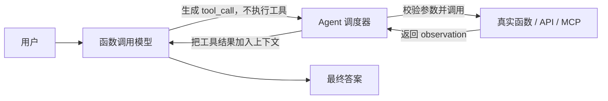
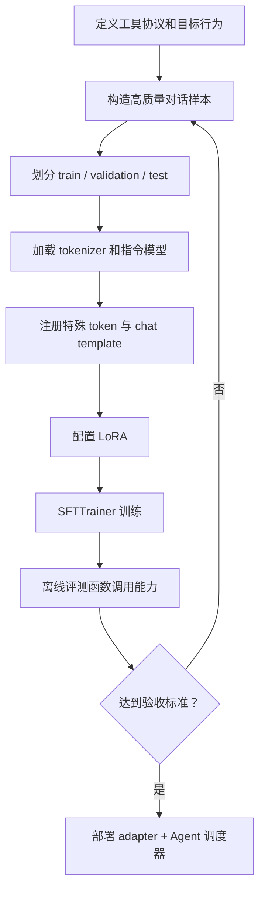
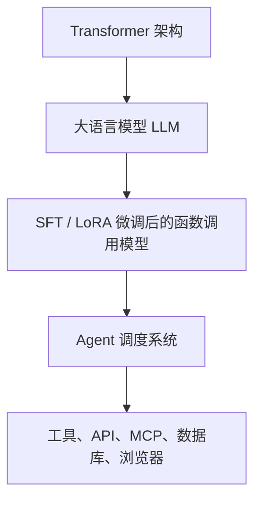

# 第30天：为函数调用微调大语言模型

> 课程范围：Hugging Face Agents Course 附加单元 1 的简介、函数调用与微调部分。
>
> 今天真正要理解的不是“记住几个训练 API”，而是：**如何把 Agent 的工具使用协议，训练成模型本身更稳定的行为。**

---

## 0. 先给出全章结论

普通大模型主要擅长生成自然语言；函数调用模型除了会说话，还被训练成能够：

1. 判断当前问题是否需要工具；
2. 选择正确工具；
3. 按严格格式生成工具名和参数；
4. 在发出工具调用后停止，等待外部程序执行；
5. 读取工具返回的观察结果；
6. 根据真实结果继续推理或生成最终答案。

完整系统不是只有一个模型，而是三部分共同工作：



必须先纠正一个常见误解：

> **函数调用模型不会亲自执行 Python 函数或 API。**

模型只生成“我想调用哪个工具、参数是什么”。真正执行工具的是模型外部的 Agent 程序或调度器。

---

## 1. 这三节教材分别讲了什么？

### 1.1 Introduction：为什么要训练函数调用能力？

在前面的 Agent 课程里，我们通常依靠提示词告诉模型：

```text
你有这些工具。
先思考，再选择工具，然后根据工具结果回答。
```

强模型通常能从提示词中临时学会这个流程，但可能出现：

- 本该调用工具时直接编造答案；
- 选择了错误的工具；
- 参数名称或 JSON 格式错误；
- 发出调用后继续虚构工具结果；
- 拿到工具结果后忽略结果；
- 换一个提示词或任务就不稳定。

附加单元 1 提出的方向是：

```text
不要只在提示词里要求模型使用工具，
还可以在训练数据里直接教会模型如何使用工具。
```

这就是“为函数调用微调模型”。

### 1.2 What is Function Calling：函数调用改变了对话结构

普通对话通常只有两个主要角色：

```python
conversation = [
    {"role": "user", "content": "我需要查询订单"},
    {"role": "assistant", "content": "请告诉我订单号"},
]
```

函数调用需要再表达两类信息：

- **Action / tool call**：模型希望采取的行动；
- **Observation / tool result**：外部工具执行后的结果。

例如：

```python
conversation = [
    {
        "role": "user",
        "content": "查询交易 T1001 的状态",
    },
    {
        "role": "assistant",
        "tool_call": {
            "name": "retrieve_payment_status",
            "arguments": {"transaction_id": "T1001"},
        },
    },
    {
        "role": "tool",
        "name": "retrieve_payment_status",
        "content": {"status": "Paid"},
    },
    {
        "role": "assistant",
        "content": "交易 T1001 已支付。",
    },
]
```

这里最关键的是：第二条消息只是模型生成的调用请求；第三条消息才是外部程序真实执行后放回上下文的结果。

### 1.3 Fine-tuning：怎样让模型学会上述协议？

教材把模型训练概括为三个阶段：

| 阶段 | 目标 | 得到什么 |
|---|---|---|
| 预训练 Pre-training | 在海量文本上学习预测下一个 token | 基础模型 |
| 监督微调 SFT | 学会对话、遵循指令和特定输出格式 | 指令模型或任务模型 |
| 对齐 Alignment | 进一步符合安全、偏好和产品行为 | 更适合实际使用的模型 |

教材选择已经完成指令微调的模型作为起点，而不是从基础模型开始。原因很实际：

```text
基础模型还要先学习“如何听懂并执行指令”；
指令模型已经会聊天，我们只需继续教它“如何调用工具”。
```

因此这次训练更准确地说是：

```text
在已有指令模型上，继续进行函数调用领域的监督微调。
```

---

## 2. 什么是 Transformers？它怎样微调大模型？

这里的 **Transformer** 有两个相关但不同的含义：

1. Transformer 是现代大语言模型常用的神经网络架构；
2. Hugging Face `transformers` 是加载、训练和推理这些模型的 Python 库。

可以把整个训练栈理解为：

| 组件 | 作用 |
|---|---|
| `transformers` | 加载 tokenizer、模型、训练参数和生成接口 |
| `datasets` | 加载、清洗、切分和转换训练数据 |
| `trl.SFTTrainer` | 封装监督微调流程 |
| `peft.LoRA` | 只训练少量适配器参数，降低显存和存储成本 |
| `accelerate` | 协调 CPU、GPU、混合精度和分布式训练 |

### 2.1 API Key 和本地微调不是一回事

你之前在项目 `.env` 中配置的：

```text
OPENAI_API_KEY
OPENAI_BASE_URL
OPENAI_MODEL
```

用于调用远程推理接口。服务商已经在服务器上加载好了模型，你只能发送输入并接收输出。

而 `Transformers + SFTTrainer + LoRA` 做的是：

```text
下载可训练的开源模型权重
→ 在本机、云 GPU 或 Colab 上计算梯度
→ 更新 LoRA adapter
→ 保存训练后的 adapter
```

因此本章真实训练脚本不读取 OpenAI-compatible API 配置。它需要的是：

- 可下载的 Hugging Face 模型；
- PyTorch、Transformers、TRL、PEFT 等依赖；
- 足够的内存、时间和最好是 GPU；
- 如果模型受限，可能还需要 `HF_TOKEN` 登录 Hugging Face。

某些商业模型提供商也有自己的 Fine-tuning API，但那是服务商托管的另一套训练流程，不能直接替代本章的 `SFTTrainer`。

### 2.2 预训练模型已经会什么？

预训练模型已经学会了语言统计规律和大量知识。它的核心任务是：

```text
根据前面的 token，预测下一个 token。
```

例如输入：

```text
北京是中国的
```

模型可能给“首都”较高概率。

微调没有改变“预测下一个 token”这个基本机制。微调改变的是：**在某种上下文出现时，哪些 token 应该获得更高概率。**

### 2.3 微调到底改了什么？

假设训练样本希望模型生成：

```text
<|tool_call|>{"name":"get_weather","arguments":{"city":"杭州"}}</|tool_call|>
```

训练时，模型会依次预测目标序列中的每个 token。预测错误就产生损失，反向传播再调整参数，使正确 token 的概率上升。

可以简化为：

```text
输入上下文
→ 模型预测下一个 token 的概率分布
→ 与正确 token 比较
→ 计算交叉熵损失
→ 反向传播
→ 更新模型权重或 LoRA 适配器
```

训练多轮之后，当模型再次看到类似问题和工具定义时，就更容易输出正确的工具调用格式。

### 2.4 微调不是“把资料复制进模型”

微调更擅长教模型：

- 输出格式；
- 行为模式；
- 语气与风格；
- 工具选择规则；
- 特定领域任务的处理方式。

如果目的是让模型知道每天变化的事实、公司文档或实时热点，通常应优先使用 RAG、数据库或搜索工具，而不是反复微调。

一句话区分：

```text
RAG / 工具解决“现在应该知道什么”；
微调解决“模型应该怎样做”。
```

---

## 3. 为什么需要微调？什么时候不需要？

### 3.1 值得微调的情况

当你遇到以下问题时，微调可能有价值：

- 提示词很长，仍然经常输出错误格式；
- 需要小型本地模型稳定调用固定工具；
- 工具很多，模型选择准确率不够；
- 需要特定行业参数抽取能力；
- 希望降低每次请求的提示词长度和推理成本；
- 需要离线、隐私或私有化部署；
- 需要多个业务使用不同的可切换适配器。

### 3.2 不应急着微调的情况

以下情况先使用提示词、few-shot 示例或现成 tool-calling 模型通常更合理：

- 还没有稳定的业务流程；
- 工具定义每天都在大改；
- 没有高质量训练数据；
- 只有几十个低质量样本；
- 现有 API 模型已经能稳定完成任务；
- 问题其实是工具实现、权限或调度代码出错；
- 只是想给模型补充实时知识。

微调不是 Agent 项目的第一步。更合理的顺序是：

```text
先做可运行基线
→ 收集失败样本
→ 定义评测集
→ 判断提示词是否已到瓶颈
→ 再决定是否微调
```

---

## 4. 什么是 SFTTrainer？

`SFTTrainer` 是 Hugging Face TRL 提供的监督微调训练器。SFT 是 **Supervised Fine-Tuning**，即监督微调。

“监督”的意思是：训练数据中已经给出了期望答案，模型照着正确示例学习。

### 4.1 一条函数调用训练样本

```text
<|user|>杭州今天适合跑步吗？
<|thought|>需要先获取杭州的实时天气。
<|tool_call|>{"name":"get_weather","arguments":{"city":"杭州"}}
<|observation|>{"temperature_c":24,"condition":"小雨"}
<|final|>杭州今天 24℃，有小雨。可以短时慢跑，但建议避雨并注意路滑。
```

这条样本同时教模型：

1. 什么问题需要调用工具；
2. 应选择 `get_weather`；
3. 参数名是 `city`；
4. 工具调用应该使用结构化格式；
5. observation 是外部事实；
6. 最终回答必须依据 observation。

### 4.2 SFTTrainer 帮我们做了什么？

它把很多重复训练工作封装起来：

- 读取标准文本或对话数据集；
- 应用 chat template；
- tokenize 和截断；
- 组成 batch；
- 计算语言模型损失；
- 梯度累积；
- 保存 checkpoint；
- 和 PEFT / LoRA 配合；
- 记录 loss、学习率和训练步数。

但它不会替你解决：

- 数据是否正确；
- 工具协议是否合理；
- 训练集是否泄漏评测答案；
- 模型是否真的会调用工具；
- 线上调度器是否安全。

### 4.3 标准微调步骤



### 4.4 一个真实 SFTTrainer 骨架

```python
from datasets import load_dataset
from peft import LoraConfig
from transformers import AutoModelForCausalLM, AutoTokenizer
from trl import SFTConfig, SFTTrainer

model_id = "HuggingFaceTB/SmolLM2-135M-Instruct"
tokenizer = AutoTokenizer.from_pretrained(model_id)
model = AutoModelForCausalLM.from_pretrained(model_id)
dataset = load_dataset("json", data_files="train.jsonl", split="train")

lora_config = LoraConfig(
    r=16,
    lora_alpha=32,
    lora_dropout=0.05,
    target_modules="all-linear",
    task_type="CAUSAL_LM",
)

training_config = SFTConfig(
    output_dir="outputs/day30-function-calling-lora",
    max_length=1024,
    num_train_epochs=3,
    learning_rate=2e-4,
    completion_only_loss=True,
)

trainer = SFTTrainer(
    model=model,
    args=training_config,
    train_dataset=dataset,
    processing_class=tokenizer,
    peft_config=lora_config,
)
trainer.train()
trainer.save_model()
```

本项目的 `05_real_sfttrainer_lora.py` 在这个骨架上增加了参数、环境检查、数据加载、特殊 token 注册和保存逻辑。

这里的数据文件采用 `prompt` / `completion` 两列。`completion_only_loss=True` 表示只训练模型应该生成的部分，避免让固定工具定义、用户输入和环境 observation 成为主要训练目标。

---

## 5. “真正的生成是如何微调的？”

这是理解微调最关键的问题。

### 5.1 训练阶段：教师强制

训练时，一条目标文本会被 tokenizer 转为 token id：

```text
文本 → [token_1, token_2, token_3, ...]
```

模型看到前面的正确 token，并预测下一个正确 token：

```text
看到 token_1              → 预测 token_2
看到 token_1, token_2     → 预测 token_3
看到 token_1, token_2, 3  → 预测 token_4
```

这种训练方式常叫 **teacher forcing**。每个位置都计算预测误差，最后对大量样本进行反向传播。

### 5.2 推理阶段：自回归生成

推理时没有标准答案，模型必须使用自己刚生成的 token 继续生成：

```text
用户问题
→ 生成 <|tool_call|>
→ 生成 {
→ 生成 "name"
→ 生成 :
→ 生成 "get_weather"
→ ...
```

当程序检测到工具调用结束标记后：

1. 暂停模型生成；
2. 解析 JSON；
3. 校验工具与参数；
4. 执行真实函数；
5. 把结果包装为 observation；
6. 再让模型继续生成最终答案。

### 5.3 训练损失算在哪些 token 上？

常见策略有两种：

| 策略 | 做法 | 特点 |
|---|---|---|
| 全序列损失 | 用户、工具定义、调用、结果、答案都参与损失 | 简单，但可能浪费能力学习固定提示 |
| 只算 completion / assistant | 用户输入被 mask，只训练模型应该生成的部分 | 更聚焦模型输出 |

对于函数调用，通常需要确保模型输出的 `tool_call` 和最终回答参与训练；工具返回值本身是环境给出的，不应让模型学会“凭空生成 observation”。

---

## 6. 什么是 Function Calling？

Function Calling 可以定义为：

> 模型根据用户目标和工具描述，生成结构化的工具调用请求，并在工具结果被送回后继续完成任务。

### 6.1 工具定义

```python
weather_tool = {
    "name": "get_weather",
    "description": "查询指定城市的当前天气",
    "parameters": {
        "type": "object",
        "properties": {
            "city": {"type": "string", "description": "城市名称"},
        },
        "required": ["city"],
    },
}
```

工具描述不是装饰。模型要依靠 `name`、`description`、参数类型和必填字段决定是否调用，以及如何填参数。

### 6.2 模型生成行动

```json
{
  "name": "get_weather",
  "arguments": {
    "city": "杭州"
  }
}
```

### 6.3 调度器执行工具

```python
tool_result = get_weather(city="杭州")
```

### 6.4 将观察送回模型

```json
{
  "temperature_c": 24,
  "condition": "小雨"
}
```

模型再根据 observation 回答，而不是自己猜天气。

### 6.5 函数调用不是普通 JSON 输出

结构化 JSON 只是函数调用的一部分。完整函数调用还需要：

- 向模型提供可用工具定义；
- 让模型判断是否应调用；
- 检查工具是否存在；
- 校验参数 schema；
- 控制权限、超时和重试；
- 执行工具；
- 将 observation 送回模型；
- 防止无限循环；
- 记录 traces 便于排错。

---

## 7. Thought → Act → Observe 循环如何理解？

教材中的循环可以拆成四步：

```text
Thought：判断下一步需要什么信息
Act：生成结构化工具调用并停止
Observe：外部程序执行工具并返回结果
Final / Next Thought：回答，或继续调用另一个工具
```

### 7.1 一个完整例子

用户：

```text
杭州今天 24℃ 且下雨，我跑 5 公里大概需要多少分钟？
先确认天气，再按每公里 6 分钟估算。
```

第一轮：

```text
Thought：需要先确认杭州天气。

Act：
{"name":"get_weather","arguments":{"city":"杭州"}}
```

Agent 调度器执行天气工具，得到：

```text
Observe：
{"temperature_c":24,"condition":"小雨"}
```

第二轮：

```text
Thought：天气符合用户描述，还需要计算 5 × 6。

Act：
{"name":"calculator","arguments":{"expression":"5 * 6"}}
```

计算器返回：

```text
Observe：
{"result":30}
```

最终回答：

```text
杭州当前 24℃、有小雨。按每公里 6 分钟估算，5 公里约需 30 分钟；雨天注意路滑。
```

### 7.2 “Thought” 是否应该展示给用户？

课程使用 Thought 帮助理解和构造训练格式，但生产系统不必把模型的完整内部推理公开给用户。

更稳妥的做法是：

- 内部保留简短决策摘要，例如“需要查询天气”；
- 对外展示工具调用状态和可验证依据；
- 不依赖长篇隐藏思维链作为业务审计记录；
- 以工具参数、工具结果、状态变化和最终答案作为 trace。

真正可审计的是“调用了什么、参数是什么、返回什么、最终依据什么”，而不是一段看似合理的内部独白。

---

## 8. LoRA 到底是什么？

LoRA 全称 **Low-Rank Adaptation，低秩适应**。

它不是另一种大模型，也不是 Agent 框架。它是一种节省资源的模型参数训练方法。

### 8.1 全量微调的问题

假设某一线性层有权重矩阵：

```text
W 的尺寸 = 4096 × 4096
参数数量 = 16,777,216
```

全量微调需要更新整个 `W`，还要为这些参数保存梯度和优化器状态，显存占用很大。

### 8.2 LoRA 的做法

LoRA 冻结原始权重 `W`，只学习一个低秩增量：

```text
W' = W + ΔW
ΔW = B × A
```

如果秩 `r = 16`：

```text
A 的尺寸 = 16 × 4096
B 的尺寸 = 4096 × 16
新增参数 = 131,072
```

与原矩阵相比，训练参数约减少为原来的 `0.78%`。

### 8.3 为什么“低秩”能工作？

直观上，特定任务对模型行为的改变通常不需要重写模型所有知识，只需要沿少量重要方向调整它。

LoRA 用较小的矩阵表达这种调整。它保留基础模型能力，同时用 adapter 学习：

- 什么时候调用工具；
- 应输出什么特殊 token；
- 参数格式如何组织；
- 某个领域中的常用操作模式。

### 8.4 LoRA 并不神秘

可以把基础模型想象成一个已经完成通识教育的人：

```text
基础模型：已有语言和通用知识
LoRA adapter：短期职业培训形成的工作习惯
```

基础模型不变，不同 adapter 可以分别训练成：

- 客服工具调用；
- 财务文档抽取；
- 医疗术语格式化；
- 内容创作风格；
- 你的私有 Agent 工具协议。

### 8.5 LoRA 的优点与代价

| 优点 | 代价 |
|---|---|
| 可训练参数少 | 能力上限仍受基础模型限制 |
| 显存占用低 | rank 太低可能学不充分 |
| adapter 文件较小 | 需要管理基础模型与 adapter 的匹配关系 |
| 可快速切换任务 | 数据差仍会训练出差模型 |
| 可合并进基础模型 | 合并后要重新验证精度与格式 |

---

## 9. 什么是特殊词元 Special Tokens？

特殊词元是 tokenizer 明确认识、具有协议含义的标记。例如：

```text
<|user|>
<|thought|>
<|tool_call|>
<|observation|>
<|final|>
```

教材示例还提到类似：

```text
[AVAILABLE_TOOLS]
[/AVAILABLE_TOOLS]
[TOOL_CALLS]
[TOOL_RESULTS]
[/TOOL_RESULTS]
```

不同模型的标记名称可能不同，关键不是拼写，而是这些标记在 chat template 中承担的角色。

### 9.1 它们解决什么问题？

没有特殊标记时，模型看到的可能只是混在一起的文本：

```text
我要查天气 get_weather 杭州 小雨 最终回答……
```

有了特殊标记，边界变得明确：

```text
<|user|>用户要求
<|thought|>决策摘要
<|tool_call|>外部行动
<|observation|>环境返回
<|final|>最终回答
```

它们像程序协议中的字段名和分隔符，帮助模型区分“谁说的、是什么类型、下一步该做什么”。

### 9.2 只是写几个字符串就行吗？

不完全是。

如果 tokenizer 没有注册这些 token，它们可能被拆成多个普通子词，模型仍可能学习，但边界不够稳定。

通常需要：

```python
special_tokens = {
    "additional_special_tokens": [
        "<|thought|>",
        "<|tool_call|>",
        "<|observation|>",
        "<|final|>",
    ]
}

added = tokenizer.add_special_tokens(special_tokens)
if added:
    model.resize_token_embeddings(len(tokenizer))
```

然后训练数据和推理时的 chat template 必须采用相同协议。

### 9.3 特殊词元不是安全边界

特殊 token 能帮助模型学习格式，但不能代替：

- JSON Schema 校验；
- 工具白名单；
- 权限检查；
- 人工确认；
- 超时和重试；
- 敏感参数过滤。

模型输出 `<|tool_call|>` 不等于这个调用就应该被执行。

---

## 10. 怎样构造函数调用数据集？

### 10.1 一个好样本包含什么？

至少包含：

| 字段 | 作用 |
|---|---|
| 用户请求 | 描述目标和上下文 |
| 可用工具 | 告诉模型可以做什么 |
| 决策或简短 rationale | 解释是否需要工具 |
| tool call | 正确工具与结构化参数 |
| observation | 工具真实或受控模拟结果 |
| final answer | 基于 observation 的答案 |

### 10.2 不能只准备“应该调用工具”的样本

还需要负样本和边界样本：

- 不需要工具，直接回答；
- 缺少必填参数，向用户追问；
- 工具不存在，不能编造工具；
- 工具返回错误，解释并重试或降级；
- 涉及支付、删除、发布时先请求确认；
- 多个工具都相似时选择最合适的一个；
- 工具结果与用户说法冲突时以可验证结果为准。

### 10.3 数据质量原则

```text
协议一致 > 样本数量
参数正确 > 语言华丽
覆盖失败路径 > 只有成功案例
测试集独立 > 训练 loss 很低
真实业务分布 > 随机编造大量样本
```

---

## 11. 验收标准是什么？

训练完成不能只看 loss。函数调用模型要按端到端任务验收。

### 11.1 离线指标

| 指标 | 检查什么 | 示例 |
|---|---|---|
| 格式合法率 | tool call 是否能解析 | JSON parse success rate |
| 工具选择准确率 | 是否选对工具 | 天气问题是否选 weather |
| 参数名称准确率 | key 是否正确 | `city` 而非 `location_name` |
| 参数值准确率 | 是否提取正确实体 | 杭州不能变成上海 |
| 必填参数完整率 | schema 必填字段是否齐全 | 是否缺少订单号 |
| 不调用准确率 | 无需工具时是否克制 | “你好”不应调用搜索 |
| 停止正确率 | 发出 action 后是否等待结果 | 不得虚构 observation |
| 观察依据率 | 答案是否忠于工具结果 | 工具说小雨，不能回答晴天 |
| 多步任务成功率 | 多轮调用是否完成目标 | 搜索后计算再汇总 |
| 错误恢复率 | 工具失败时是否合理处理 | 重试、换工具或告知失败 |

### 11.2 线上工程指标

- 端到端成功率；
- P50 / P95 延迟；
- 每个成功任务的 token 与 API 成本；
- 工具失败率和重试率；
- 高风险操作的人工确认覆盖率；
- 无限循环和最大步数触发率；
- 用户撤销、投诉和人工接管率。

### 11.3 推荐的验收门槛示例

下面只是项目起步参考，不是通用标准：

```text
JSON / 协议合法率       ≥ 99%
工具选择准确率          ≥ 95%
必填参数完整率          ≥ 98%
不该调用时的克制率      ≥ 95%
工具结果忠实率          ≥ 98%
高风险操作确认覆盖率    = 100%
核心任务端到端成功率    ≥ 90%
```

真正门槛应根据业务风险制定。内容草稿失败一次和自动付款失败一次，不是同一个风险等级。

---

## 12. Transformer、微调和 Agent 有什么必然关系？

三者处在不同层级：



### 12.1 各自负责什么？

| 概念 | 负责的问题 |
|---|---|
| Transformer | 模型如何处理上下文、注意力和生成 token |
| 预训练 LLM | 模型具备语言与通用知识 |
| SFT / LoRA | 模型更稳定地遵循特定 Agent 协议 |
| Agent | 围绕模型组织工具、状态、循环、权限和错误处理 |

### 12.2 是否存在“必然关系”？

有技术链条上的关系，但没有“做 Agent 必须自己微调”的关系。

你完全可以直接使用已经支持 tool calling 的商业模型或开源指令模型来构建 Agent。此时：

```text
别人已经完成了预训练和函数调用训练，
你主要负责 Agent 调度、工具和业务流程。
```

当你需要小模型、本地部署、私有协议、更低成本或更高稳定性时，才有必要自己微调。

### 12.3 对你“做多个智能体给自己打工”的意义

对你的目标来说，优先级应该是：

```text
第一优先：真实业务流程和合法可用的接口
第二优先：工具可靠性、权限、重试和日志
第三优先：选择合适的现成模型
第四优先：有数据和评测后再微调
```

例如“采集热点 → 创作 → 审核 → 发布”的内容 Agent，真正的难点通常先在：

- 热点数据源是否合法稳定；
- 平台是否有官方发布接口；
- 账号权限与风控；
- 内容质量和事实核验；
- 发布前人工确认；
- 如何追踪效果并形成反馈数据。

微调能改善“模型怎样写、怎样选工具”，但不能凭空解决平台接口和账号权限问题。

---

## 13. 生产环境还需要什么？

微调后的模型只是 Agent 的决策组件，生产系统至少还需要：

1. **工具白名单**：只允许调用已注册工具；
2. **Schema 校验**：参数类型、长度、枚举值必须合法；
3. **权限控制**：读操作和写操作分级；
4. **人工确认**：发布、删除、支付等高风险动作必须确认；
5. **超时与重试**：工具失败不能卡死；
6. **幂等性**：重试发布不能重复发布；
7. **最大步数**：防止模型无限循环调用；
8. **Trace**：记录请求、工具调用、结果和最终输出；
9. **评测集**：每次换模型、提示词或 adapter 都回归测试；
10. **数据脱敏**：训练集不得泄露密钥和用户隐私。

---

## 14. 第30天配套代码

目录：`examples/30-function-calling-finetuning/`

| 文件 | 作用 | 是否需要第三方依赖 |
|---|---|---|
| `01_function_calling_loop.py` | 可执行的 Thought → Act → Observe 工具循环 | 否 |
| `02_special_tokens_formatter.py` | 格式化并校验特殊 token 训练文本 | 否 |
| `03_sft_dataset_builder.py` | 构造函数调用 JSONL 数据集 | 否 |
| `04_lora_parameter_demo.py` | 计算全量微调与 LoRA 参数量差异 | 否 |
| `05_real_sfttrainer_lora.py` | 真正的 Transformers + SFTTrainer + LoRA 训练入口 | 是 |
| `06_function_calling_evaluator.py` | 检查格式、工具、参数和 observation 忠实度 | 否 |

推荐学习顺序：

```text
01 看懂 Agent 循环
→ 02 看懂特殊 token
→ 03 看懂训练数据
→ 04 看懂 LoRA 节省了什么
→ 06 看懂如何验收
→ 05 最后再真正训练
```

---

## 15. 今天最应该记住的十句话

1. 函数调用模型只生成调用请求，不亲自执行函数。
2. Agent 调度器负责解析、校验、执行和回填 observation。
3. 微调仍然是在训练“预测下一个 token”。
4. 训练数据决定模型学会什么协议和行为。
5. SFTTrainer 是监督微调工具，不是数据质量保证器。
6. LoRA 冻结基础模型，只训练少量低秩适配器。
7. 特殊 token 用来标记角色和阶段边界，不是安全边界。
8. 不需要工具的样本与错误处理样本同样重要。
9. 验收要看工具选择、参数、停止行为和端到端成功率，不能只看 loss。
10. 不是所有 Agent 都需要自己微调；先有稳定业务与评测，再决定是否训练。

---

## 16. 参考资料

- [Hugging Face Agents Course：附加单元 1 简介](https://huggingface.co/learn/agents-course/zh-CN/bonus-unit1/introduction)
- [Hugging Face Agents Course：什么是函数调用？](https://huggingface.co/learn/agents-course/zh-CN/bonus-unit1/what-is-function-calling)
- [Hugging Face Agents Course：为函数调用微调模型](https://huggingface.co/learn/agents-course/zh-CN/bonus-unit1/fine-tuning)
- [教材源码：introduction.mdx](https://github.com/huggingface/agents-course/blob/main/units/zh-CN/bonus-unit1/introduction.mdx)
- [教材源码：what-is-function-calling.mdx](https://github.com/huggingface/agents-course/blob/main/units/zh-CN/bonus-unit1/what-is-function-calling.mdx)
- [教材源码：fine-tuning.mdx](https://github.com/huggingface/agents-course/blob/main/units/zh-CN/bonus-unit1/fine-tuning.mdx)
- [Hugging Face LLM Course：微调预训练模型](https://huggingface.co/learn/llm-course/chapter3/1?fw=pt)
- [Hugging Face LLM Course：监督微调、Chat Template、LoRA 与评测](https://huggingface.co/learn/llm-course/en/chapter11/1)
- [TRL：SFTTrainer 官方文档](https://huggingface.co/docs/trl/en/sft_trainer)
- [PEFT：LoRA 官方文档](https://huggingface.co/docs/peft/en/developer_guides/lora)
- [课程官方函数调用微调 Notebook](https://huggingface.co/agents-course/notebooks/blob/main/bonus-unit1/bonus-unit1.ipynb)
