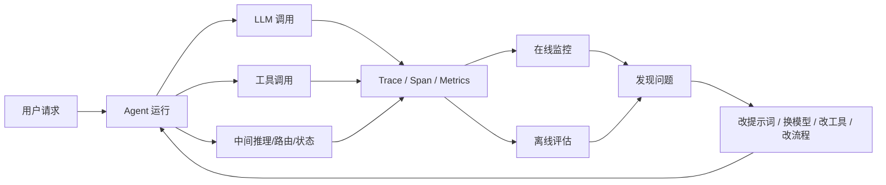
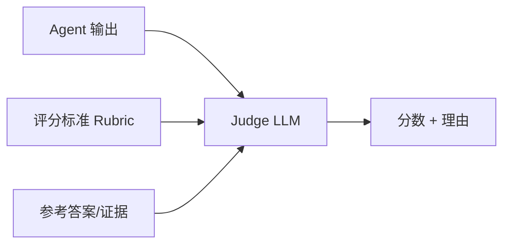
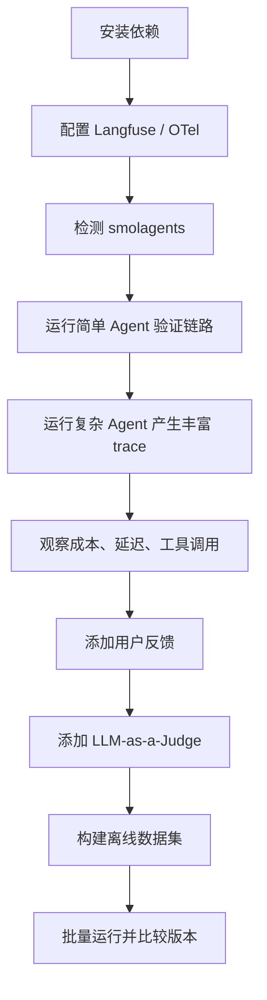

# 第31天：AI 智能体可观测性与评估

> 课程范围：Hugging Face Agents Course 附加单元 2 的简介、智能体可观测性与评估，以及监控和评估智能体的 notebook。
>
> 今天真正要理解的是：**Agent 不是写完能跑就结束了。想让它稳定替你干活，就必须能看见它每一步做了什么、花了多少钱、慢在哪里、错在哪里，并且能用评估数据持续改进。**

---

## 0. 本章一句话总结

AI Agent 的可观测性与评估，解决的是这个问题：

```text
当智能体给出一个结果时，
我如何知道它中间经历了哪些步骤？
调用了哪些工具？
用了多少 token？
花了多长时间？
为什么失败？
这次改动是否真的让它更好了？
```

如果没有可观测性，你只能看到最终答案。  
如果有可观测性，你能看到完整运行过程。



这就是“观测 → 评估 → 改进”的闭环。

---

## 1. 这几节课分别讲了什么？

### 1.1 Introduction：为什么要学可观测性与评估？

课程开头说，这个附加单元关注的是：

- 如何观测 Agent 的内部步骤；
- 如何评估 Agent 的性能；
- 如何根据观测和评估结果持续提升 Agent。

这里的重点不是“再学一个库”，而是把 Agent 从 demo 推向真实使用。

一个玩具 Agent 可以只看最终输出：

```text
用户：帮我查一个问题
Agent：这是答案
```

但一个要赚钱、要自动执行任务、要长期运行的 Agent，必须回答更多问题：

| 问题 | 为什么重要 |
|---|---|
| 哪一步调用了 LLM？ | 判断成本和模型选择是否合理 |
| 哪一步调用了工具？ | 判断工具是否选对、参数是否正确 |
| 哪一步失败？ | 快速定位 bug 或接口问题 |
| 总共用了多少 token？ | 控制成本 |
| 总耗时是多少？ | 判断用户体验和性能瓶颈 |
| 用户是否满意？ | 反馈到后续优化 |
| 新版本是否比旧版本更好？ | 避免凭感觉改 Agent |

### 1.2 What is Agent Observability and Evaluation：概念层

这一节主要解释两个概念：

```text
可观测性 Observability：
让你看见 Agent 内部运行过程。

评估 Evaluation：
让你判断 Agent 输出和过程是否足够好。
```

它们不是一回事。

| 概念 | 关注点 | 例子 |
|---|---|---|
| 可观测性 | 发生了什么 | 第 2 步调用搜索工具，耗时 1.2 秒 |
| 评估 | 做得好不好 | 搜索结果是否被正确使用，最终答案是否准确 |

可以这样理解：

```text
可观测性 = 黑盒变透明
评估 = 透明之后打分
改进 = 根据分数和细节修系统
```

### 1.3 Monitoring and Evaluating Agents Notebook：实践层

notebook 使用的技术路线是：

- `smolagents`：构建 Agent；
- `OpenTelemetry`：采集 trace/span；
- `Langfuse`：展示 trace、成本、延迟、反馈、评估分数；
- `datasets`：加载离线评估数据集；
- `Gradio`：演示用户反馈入口。

核心流程是：

1. 安装 telemetry 相关依赖；
2. 配置 Langfuse 和 OpenTelemetry 环境变量；
3. 使用 `SmolagentsInstrumentor` 检测 smolagents；
4. 运行简单 Agent，确认 trace 能进入仪表盘；
5. 运行更复杂 Agent，查看 LLM 调用、工具调用、token、成本和延迟；
6. 添加用户反馈；
7. 使用 LLM-as-a-Judge 自动评分；
8. 用离线数据集批量评估不同版本的 Agent。

### 1.4 小白先记住这张“地图”

如果你刚开始学 Agent，不要一上来就被 `Langfuse`、`OpenTelemetry`、`trace`、`span` 这些词吓住。它们本质上在解决一件事：

```text
让智能体从“只看最终答案”，变成“能看完整执行录像”。
```

可以把一个 Agent 想象成一个实习生。你让他完成任务：

```text
帮我查资料，写一篇文章，然后发到平台。
```

如果他只告诉你：

```text
老板，我完成了。
```

你其实不知道：

- 他查了哪些资料；
- 有没有引用过时信息；
- 有没有编造内容；
- 花了多少时间；
- 调用了几次模型；
- 哪一步最贵；
- 发布是否真的成功；
- 用户反馈为什么不好。

可观测性就是让这个实习生把每一步都留下记录：

```text
第 1 步：搜索关键词 A，耗时 1.2 秒
第 2 步：读取网页 B，耗时 0.8 秒
第 3 步：调用模型写草稿，输入 1800 tokens，输出 700 tokens
第 4 步：调用评分模型，质量分 0.82
第 5 步：等待人工确认
第 6 步：发布成功，平台返回 id=xxx
```

评估就是你根据这些记录判断：

```text
这次任务到底做得好不好？
下次要不要换模型？
要不要改提示词？
要不要加人工审核？
要不要减少工具调用？
```

所以本章的学习顺序可以简单记成：

```text
先看见过程 → 再评价质量 → 再根据数据改进
```

---

## 2. 什么是可观测性？

可观测性不是简单地 `print()` 几行日志。

普通日志可能是这样：

```text
开始运行
调用搜索
回答完成
```

这当然有用，但不足以分析复杂 Agent。真正的 Agent 可观测性通常要记录：

- trace id：这一次完整请求的唯一 ID；
- span id：每一个步骤的唯一 ID；
- parent span：步骤之间的层级关系；
- 输入和输出；
- 工具名称和参数；
- LLM 模型名；
- token 数量；
- 估算成本；
- 延迟；
- 错误信息；
- 用户 ID、会话 ID、标签；
- 评估分数和用户反馈。

### 2.1 Trace 是什么？

Trace 表示一次请求从开始到结束的完整路径。

对 Agent 来说，一次 trace 可能包含：

```text
用户提问
→ Agent 规划
→ LLM 判断需要搜索
→ 调用搜索工具
→ LLM 读取搜索结果
→ 调用计算工具
→ LLM 生成最终答案
```

这整个过程是一条 trace。

### 2.2 Span 是什么？

Span 是 trace 里面的一个步骤。

例如：

```text
Trace: 回答“巴黎铁塔高度是多少？”

  Span 1: agent.run
    Span 2: llm.plan
    Span 3: tool.search
    Span 4: llm.final_answer
```

每个 span 都可以记录自己的：

- 开始时间；
- 结束时间；
- 耗时；
- 输入；
- 输出；
- 状态；
- 错误；
- 属性。

这就是为什么 trace/span 比普通日志更适合 Agent。它不仅知道“发生过什么”，还知道“步骤之间是什么关系”。

### 2.3 Trace、Span、日志、指标到底有什么区别？

新手最容易把这几个词混在一起。可以用下面这张表分清楚：

| 名称 | 解决什么问题 | 类比 |
|---|---|---|
| Log 日志 | 某个时刻发生了什么事 | 监控录像里的一行字幕 |
| Metric 指标 | 一段时间内整体表现如何 | 仪表盘上的速度、油耗、温度 |
| Trace 追踪 | 一次请求完整走了哪条路径 | 一张任务路线图 |
| Span 跨度 | 路线图里的某一个步骤 | 路线中的一个站点 |

举个例子，你的 Agent 接到任务：

```text
查询热点 → 判断是否适合账号 → 写文章 → 生成标题 → 发布
```

这一次完整任务就是一个 `trace`。其中每一步都可以是一个 `span`：

```text
trace_id = 20260710_xxx

span 1: agent.run
span 2: tool.fetch_hot_topics
span 3: llm.score_topics
span 4: llm.write_article
span 5: llm.generate_title
span 6: tool.publish_to_platform
```

每个 span 里面还可以记录日志和指标：

```text
span 4: llm.write_article
  log: 开始生成正文
  metric: input_tokens=2200
  metric: output_tokens=950
  metric: latency_ms=8200
  metric: cost_usd=0.0041
```

一句话：

```text
trace/span 负责还原过程；
log 负责记录事件；
metric 负责统计表现。
```

### 2.4 为什么不能只用 print？

`print()` 当然能帮助你调试最小 demo，但它不适合生产 Agent。

原因有四个：

1. `print()` 没有结构。你看到很多文本，但很难知道哪个步骤属于哪次请求。
2. `print()` 不擅长父子关系。Agent 里常有“一个总任务包含多个子步骤”的层级。
3. `print()` 不方便聚合。你很难统计过去 1000 次运行的平均成本和失败率。
4. `print()` 不适合跨服务。真实 Agent 可能同时调用模型、数据库、浏览器、发布平台。

所以生产环境更常用：

- OpenTelemetry 采集标准化 trace/span；
- Langfuse、Arize 等平台展示 LLM/Agent 运行细节；
- 数据集评估记录不同版本的表现。

---

## 3. Agent 为什么特别需要可观测性？

传统程序通常是确定性的：

```text
相同输入 → 相同代码路径 → 相同输出
```

但 Agent 往往不是这样：

```text
相同输入 → 模型可能选择不同工具 → 可能得到不同搜索结果 → 最终答案也可能不同
```

Agent 的不确定性来自：

- LLM 输出本身有概率性；
- 工具返回可能变化；
- 搜索结果每天变化；
- 外部 API 可能失败；
- 多步骤推理中一步错，后面全错；
- Agent 可能过度调用工具，也可能不调用该调用的工具；
- 用户反馈和上下文会改变决策。

所以，Agent 的调试重点不是只看最后一句话，而是看完整过程。

### 3.1 一个具体例子

用户问：

```text
帮我找一个今天适合发布的 AI 热点，并写成头条短文。
```

如果 Agent 输出质量不好，你需要知道：

| 可能问题 | 需要看的证据 |
|---|---|
| 热点太旧 | 搜索工具返回了什么 |
| 选题不适合平台 | 选题评分过程是什么 |
| 文风太像 AI | LLM 写作提示词是什么 |
| 成本太高 | 调了几次模型，用了多少 token |
| 速度太慢 | 哪个工具或模型耗时最长 |
| 发布失败 | 平台接口或自动化步骤报了什么错 |

这就是你以后做“给你打工的 Agent”必须具备的能力。

---

## 4. 可观测性要记录哪些指标？

教材 notebook 重点展示了几个生产环境常见指标。

### 4.1 成本 Cost

成本主要来自：

- 输入 token；
- 输出 token；
- 搜索 API；
- 向量数据库；
- 图片生成；
- TTS 语音生成；
- 浏览器自动化；
- 其他外部工具。

对 Agent 来说，成本不能只看最终答案。你要知道：

```text
一次任务总成本 = 每次 LLM 调用成本 + 每次工具/API 成本
```

如果一个 Agent 为了写 500 字短文调用了 12 次模型，可能技术上能跑，但商业上不一定划算。

### 4.2 延迟 Latency

延迟是用户等待时间，也影响自动化任务吞吐量。

常见问题：

- 搜索工具慢；
- LLM 模型太大；
- Agent 循环次数太多；
- 多个工具串行调用；
- 网络接口不稳定；
- 不必要地重复检索。

优化方式：

- 缓存稳定结果；
- 将可并行的工具并行；
- 减少无效推理轮数；
- 对简单任务使用便宜快模型；
- 复杂任务再升级强模型。

### 4.3 用户反馈 User Feedback

用户反馈可以很简单：

```text
👍 有用
👎 没用
```

但它很有价值。因为很多 Agent 输出无法只靠标准答案判断。

例如：

- 文章是否有吸引力；
- 选题是否适合账号；
- 语气是否像真人；
- 推荐是否符合用户偏好；
- 自动化执行是否真的省时间。

用户反馈最好和 trace 绑定起来：

```text
这个差评对应哪一次 trace？
当时用了哪个模型？
用了哪个提示词？
调用了哪些工具？
```

这样差评才可分析。

### 4.4 LLM-as-a-Judge

LLM-as-a-Judge 是用另一个模型来评判 Agent 输出。

它的基本流程是：



常见评估维度：

- 正确性；
- 是否引用证据；
- 是否满足格式；
- 是否有幻觉；
- 是否安全；
- 是否过度承诺；
- 是否符合品牌语气；
- 是否适合发布。

注意：LLM-as-a-Judge 不是绝对真理。它适合做批量初筛和趋势比较，不适合替代所有人工审核。

### 4.5 请求错误 Request Errors

官方概念页也强调了请求错误。对 Agent 来说，请求错误不只是“程序报错”，还包括：

- LLM API 超时；
- LLM API 限流；
- 搜索工具返回空结果；
- 浏览器自动化页面加载失败；
- 发布平台登录失效；
- 工具参数格式错误；
- 模型输出了不存在的工具名；
- 工具返回的数据结构和预期不一致。

为什么要单独监控错误？

因为 Agent 很容易把“工具失败”误当成“任务失败”，或者更糟糕：把错误结果继续传给 LLM，让 LLM 编一个看似正常的答案。

生产 Agent 至少要记录：

```text
错误发生在哪个 span？
错误类型是什么？
是否重试？
重试后是否成功？
是否触发 fallback？
是否需要人工接管？
```

### 4.6 隐式用户反馈 Implicit Feedback

用户不一定会点“赞/踩”，但他们的行为本身也能反映 Agent 的质量。

例如：

| 用户行为 | 可能说明 |
|---|---|
| 用户马上重新问一遍 | 第一次答案没有解决问题 |
| 用户点击“重试” | 输出质量不稳定 |
| 用户复制了答案 | 可能有价值 |
| 用户停留时间很短 | 内容可能不够吸引人 |
| 用户手动大幅改稿 | Agent 文风或结构不符合需求 |
| 用户取消发布 | 生成结果不够安全或不够好 |

对内容变现类 Agent 来说，隐式反馈尤其重要。比如一篇文章生成后，你可以记录：

- 是否被人工采用；
- 人工改动比例；
- 是否发布；
- 发布后点击率；
- 完读率；
- 收藏/评论/转发；
- 收益或转化。

这些指标比单纯问“模型觉得好不好”更贴近业务。

### 4.7 准确性 Accuracy

准确性不是所有 Agent 都能用同一种方式衡量。

不同任务的“准确”含义不同：

| Agent 类型 | 准确性可以怎么定义 |
|---|---|
| 数学题 Agent | 最终数值是否正确 |
| RAG 问答 Agent | 是否基于检索证据回答 |
| 文档分析 Agent | 是否抓住关键信息，有无遗漏 |
| 写作 Agent | 是否满足主题、风格、长度和平台规则 |
| 自动发布 Agent | 是否成功发布到正确账号 |
| 数据分析 Agent | SQL/图表/结论是否正确 |

所以做评估前，第一步不是写代码，而是定义：

```text
什么叫成功？
什么叫失败？
什么叫勉强可用？
哪些错误绝对不能出现？
```

例如你的头条写作 Agent，可以这样定义准确性：

```text
必须满足：
1. 热点发生在最近 24 小时内；
2. 文章主题和账号定位相关；
3. 不捏造事实；
4. 标题不违规；
5. 正文 800-1200 字；
6. 发布前必须经过人工确认。
```

### 4.8 自动化评估指标

自动化评估不只有 LLM-as-a-Judge。

常见方法包括：

| 方法 | 适合评什么 |
|---|---|
| 规则检查 | JSON 格式、长度、关键词、禁用词 |
| 单元测试 | 工具函数、路由逻辑、状态更新 |
| 参考答案匹配 | 数学题、标准问答 |
| RAG 评估 | 检索相关性、答案是否有证据支撑 |
| 安全检测 | 有害内容、提示注入、敏感信息 |
| LLM-as-a-Judge | 风格、帮助性、事实一致性、综合质量 |

官方页面提到 RAG 场景可以用 RAGAS，安全和提示注入检测可以用 LLM Guard。这些工具的共同点是：它们把“感觉好不好”变成更可重复的评分。

---

## 5. 什么是在线评估和离线评估？

### 5.1 在线评估 Online Evaluation

在线评估发生在真实使用过程中。

它关注：

- 真实用户问题；
- 真实模型成本；
- 真实接口失败；
- 真实用户反馈；
- 真实生产延迟。

例子：

```text
今天 100 次运行中：
平均成本 0.18 元
P95 延迟 21 秒
工具失败率 3%
用户点赞率 72%
发布前人工拦截率 8%
```

在线评估适合回答：

```text
它在真实世界里表现怎么样？
```

### 5.2 离线评估 Offline Evaluation

离线评估发生在上线前或版本迭代时。

它关注：

- 固定测试集；
- 可重复运行；
- 新旧版本对比；
- 提示词、模型、工具策略的 A/B 测试；
- 质量门槛。

例子：

```text
固定 50 个问题：
v1 正确率 72%，平均成本 0.12 元
v2 正确率 84%，平均成本 0.16 元
```

离线评估适合回答：

```text
这次修改是否真的更好？
```

### 5.3 二者区别

| 维度 | 在线评估 | 离线评估 |
|---|---|---|
| 数据来源 | 真实用户和生产任务 | 固定测试集 |
| 目的 | 监控真实表现 | 上线前验证改动 |
| 优点 | 贴近真实业务 | 可重复、可对比 |
| 缺点 | 难控制变量 | 可能不覆盖真实长尾 |
| 典型指标 | 用户反馈、失败率、延迟、成本 | 正确率、格式通过率、回归测试 |

成熟 Agent 系统需要两者都有。

---

## 6. 教材 notebook 的完整流程

### 6.1 步骤 0：安装依赖

教材安装：

```bash
pip install 'smolagents[telemetry]'
pip install opentelemetry-sdk opentelemetry-exporter-otlp openinference-instrumentation-smolagents
pip install langfuse datasets 'smolagents[gradio]'
```

这些依赖分别负责：

| 依赖 | 作用 |
|---|---|
| `smolagents[telemetry]` | 构建 Agent 并支持 telemetry |
| `opentelemetry-sdk` | 创建 tracer provider 和 span |
| `opentelemetry-exporter-otlp` | 将 trace 发送到兼容 OTel 的后端 |
| `openinference-instrumentation-smolagents` | 自动检测 smolagents 的运行步骤 |
| `langfuse` | LLM 可观测性平台 |
| `datasets` | 加载评估数据集 |
| `gradio` | 做带用户反馈的界面 |

小白理解：

```text
smolagents 负责让 Agent 跑起来；
OpenTelemetry 负责把运行过程打包成标准 trace；
Langfuse 负责把 trace 展示成你能看的仪表盘；
datasets 负责拿来做离线测试；
Gradio 负责做一个能收集用户反馈的小界面。
```

这几个库不是在做同一件事，而是形成一条链：

```text
Agent 执行 → OpenTelemetry 采集 → Langfuse 展示 → 用户/评估器打分 → 形成改进依据
```

### 6.2 步骤 1：检测你的 Agent

“检测”可以理解为：

```text
给 Agent 装上记录仪。
```

教材用的是：

```python
SmolagentsInstrumentor().instrument(tracer_provider=trace_provider)
```

这行代码的意义是：让 smolagents 运行时自动产生 OpenTelemetry spans。

这一节里面最重要的代码逻辑其实有三层。

第一层：配置 Langfuse 地址和密钥。

```python
LANGFUSE_PUBLIC_KEY = "pk-lf-..."
LANGFUSE_SECRET_KEY = "sk-lf-..."
os.environ["LANGFUSE_HOST"] = "https://cloud.langfuse.com"
```

这三个变量告诉程序：

```text
trace 要发到哪个 Langfuse 项目。
```

第二层：把 Langfuse 密钥转成 OpenTelemetry 能理解的认证头。

```python
LANGFUSE_AUTH = base64.b64encode(
    f"{LANGFUSE_PUBLIC_KEY}:{LANGFUSE_SECRET_KEY}".encode()
).decode()

os.environ["OTEL_EXPORTER_OTLP_ENDPOINT"] = os.environ["LANGFUSE_HOST"] + "/api/public/otel"
os.environ["OTEL_EXPORTER_OTLP_HEADERS"] = f"Authorization=Basic {LANGFUSE_AUTH}"
```

这里的 `OTLP` 可以理解为 OpenTelemetry 发送遥测数据的协议。  
它告诉 OpenTelemetry：

```text
请把 trace 通过 OTLP 协议发到 Langfuse 的 /api/public/otel 端点。
```

第三层：创建 tracer provider，并把 smolagents 接进去。

```python
trace_provider = TracerProvider()
trace_provider.add_span_processor(SimpleSpanProcessor(OTLPSpanExporter()))
trace.set_tracer_provider(trace_provider)
SmolagentsInstrumentor().instrument(tracer_provider=trace_provider)
```

小白版翻译：

```text
TracerProvider：负责创建和管理 trace/span。
OTLPSpanExporter：负责把 span 发送出去。
SimpleSpanProcessor：每生成一个 span，就安排导出。
SmolagentsInstrumentor：让 smolagents 自动把运行步骤变成 span。
```

所以，这一段不是“业务代码”，而是“给 Agent 装监控设备”。

### 6.3 步骤 2：测试检测是否成功

教材先运行一个很简单的 CodeAgent：

```python
agent.run("1+1=")
```

这不是为了证明 Agent 多聪明，而是为了确认：

```text
从 Agent 运行 → 生成 trace → 发送到 Langfuse → 仪表盘可见
```

这条链路是通的。

为什么先用 `1+1=` 这种简单任务？

因为测试 telemetry 时，不应该一开始就上复杂 Agent。复杂 Agent 如果失败，你不知道是：

- 模型调用失败；
- 工具失败；
- 搜索失败；
- Langfuse 配置失败；
- OpenTelemetry 配置失败；
- 网络失败。

简单任务的作用是缩小问题范围：

```text
只要 agent.run("1+1=") 能在 Langfuse 里出现 trace，
就说明“采集链路”基本没问题。
```

这就像你搭摄像头，第一件事不是拍大片，而是先确认画面能不能传回来。

### 6.4 步骤 3：观察复杂 Agent

教材接着加入搜索工具，让 Agent 回答更复杂的问题。

这样 trace 里就会出现：

- Agent 总运行；
- LLM 调用；
- 工具调用；
- token 使用量；
- 延迟；
- 可能的错误。

复杂 Agent 的价值不只是最终答案，而是你可以展开 trace tree，逐层看它的决策过程。

教材里的复杂问题是：

```text
How many Rubik's Cubes could you fit inside the Notre Dame Cathedral?
```

这个问题为什么适合演示？

因为它不是简单知识问答。Agent 大概率需要：

1. 搜索巴黎圣母院的大致内部体积或尺寸；
2. 知道魔方尺寸；
3. 进行估算；
4. 给出带假设的答案。

这类问题会触发：

- 搜索工具；
- LLM 推理；
- 计算；
- 多步骤调用。

所以 trace 里会出现更丰富的结构。

### 6.5 步骤 4：看成本

教材展示了模型调用的 token 使用情况。成本通常来自 token 计费：

```text
输入成本 = input_tokens × 输入单价
输出成本 = output_tokens × 输出单价
总成本 = 所有 LLM 调用成本 + 工具/API 成本
```

你看成本时，不要只看总数，还要看：

- 哪个 span 最贵；
- 哪个模型最贵；
- 是否有重复调用；
- 是否有不必要的长上下文；
- 是否有工具循环导致成本暴涨。

例如，一个 Agent 写文章时出现：

```text
llm.plan: 600 tokens
tool.search: 免费
llm.write: 3000 tokens
llm.rewrite: 3200 tokens
llm.rewrite_again: 3300 tokens
```

这说明主要成本不是搜索，而是反复改写。优化方向可能是：

- 写作提示词一次性更明确；
- 先让模型输出大纲再写；
- 给重写步骤设置最多 1 次；
- 把“质量评分”做成规则和小模型结合。

### 6.6 步骤 5：看延迟

教材中提到可以看到每个步骤耗时，例如一次对话可能花几十秒。延迟分析的重点是：

```text
到底慢在整体，还是慢在某个 span？
```

常见情况：

| 现象 | 可能原因 | 优化方式 |
|---|---|---|
| LLM span 很慢 | 模型大、输出长、服务拥堵 | 换快模型、减少输出、流式返回 |
| 工具 span 很慢 | 外部 API 慢 | 缓存、超时、fallback |
| trace 很长但单步不慢 | 步骤太多 | 合并步骤、减少循环 |
| 首次运行慢 | 冷启动 | 预热模型或服务 |

对用户产品来说，延迟不是小问题。用户可能不在乎你调用了多聪明的 Agent，只会感觉：

```text
它怎么还没回答？
```

### 6.7 步骤 6：附加属性

教材展示了给 span 设置属性：

```python
span.set_attribute("langfuse.user.id", "smolagent-user-123")
span.set_attribute("langfuse.session.id", "smolagent-session-123456789")
span.set_attribute("langfuse.tags", ["city-question", "testing-agents"])
```

这些属性非常重要。它们让 trace 不只是“技术日志”，而是能和业务关联。

你可以记录：

- 用户 ID；
- 会话 ID；
- Agent 版本；
- 提示词版本；
- 模型版本；
- 业务场景；
- 是否测试流量；
- 账号 ID；
- 发布平台；
- 内容类型。

例如你的内容 Agent 可以这样设计：

```text
langfuse.user.id = "yuyuan"
langfuse.session.id = "toutiao-account-01-20260710"
langfuse.tags = ["toutiao", "hot-topic", "article-draft", "human-review-required"]
agent.version = "v0.3"
prompt.version = "headline_writer_2026_07_10"
```

这样日后你能查：

```text
头条账号 01 最近 7 天所有文章生成 trace；
某个提示词版本的平均质量分；
热点写作任务里成本最高的 10 次运行；
被人工拒绝的内容都用了哪些来源。
```

### 6.8 步骤 7：用户反馈

教材用 Gradio 做了一个带点赞/点踩的聊天界面。关键点不是 Gradio，而是：

```text
用户反馈要绑定到具体 trace。
```

流程是：

1. 用户发消息；
2. 程序启动一个 span；
3. Agent 生成回答；
4. 程序拿到当前 trace_id；
5. 用户点喜欢或不喜欢；
6. 程序把 `1` 或 `0` 作为 score 写回同一个 trace。

为什么要绑定 trace？

因为没有 trace_id，反馈只是孤立数字：

```text
今天有 10 个差评。
```

有 trace_id，你能追问：

```text
这 10 个差评分别对应哪些输入？
用了哪个模型？
有没有工具失败？
是不是某个提示词版本的问题？
是不是某类问题集中失败？
```

这才是可改进的数据。

### 6.9 步骤 8：LLM-as-a-Judge

教材展示了用 LLM 作为评判者给输出评分，比如判断输出是否有毒、是否正确、是否符合标准。

核心思想是：

```text
让一个“评审模型”专门评价“工作模型”的结果。
```

实际使用时最好把 Judge prompt 写得很具体：

```text
你是内容安全审核员。
请根据以下标准评分：
1. 是否包含事实错误；
2. 是否包含违规承诺；
3. 是否标题党；
4. 是否适合发布到今日头条；
5. 是否需要人工复核。

只输出 JSON：
{
  "score": 0-1,
  "passed": true/false,
  "reason": "理由",
  "risk_level": "low|medium|high"
}
```

不要让 Judge 只回答“好/不好”。结构化输出更容易统计。

### 6.10 步骤 9：离线评估和 GSM8K

教材最后用 GSM8K 做离线评估示例。GSM8K 是数学应用题数据集，里面有：

- 问题；
- 标准解答；
- 标准答案。

教材流程是：

1. 用 `datasets.load_dataset()` 加载 GSM8K；
2. 转成 DataFrame 看前几行；
3. 在 Langfuse 里创建一个 dataset；
4. 把题目和期望答案作为 dataset item 上传；
5. 让 Agent 逐条运行；
6. 把每次运行产生的 trace 链接到对应 dataset item；
7. 给运行结果打分；
8. 对比不同模型、工具、提示词版本的表现。

小白版理解：

```text
GSM8K = 考卷
Agent = 考生
Langfuse dataset = 试卷管理系统
trace = 每道题的答题过程
score = 每道题得分
dataset run = 某一次考试
```

为什么要用 dataset run？

因为你以后会不断改 Agent：

```text
v1：基础提示词
v2：改了工具描述
v3：换了模型
v4：加了反思步骤
```

如果每次都在同一套题上跑，就能比较：

```text
v1 正确率 60%，平均成本 0.02 元
v2 正确率 72%，平均成本 0.025 元
v3 正确率 80%，平均成本 0.08 元
v4 正确率 83%，平均成本 0.12 元
```

这时你就能做产品判断：

```text
v4 虽然更准，但成本涨太多；
如果业务只需要 80% 准确，v3 更划算。
```

这就是课程一开始说的“理解成本与准确性的权衡”。

### 6.11 notebook 的主线总结

这个 notebook 不是在教你背 API，而是在教一个完整工程套路：



你以后做自己的 Agent，可以照着这条路走，不一定照抄库：

```text
没有 Langfuse，也可以先写本地 JSON trace；
没有 Gradio，也可以在自己的后台收集反馈；
没有 GSM8K，也可以自己做业务测试集；
没有 LLM-as-a-Judge，也可以先用规则评分。
```

关键不是工具名，而是闭环。

---

## 7. Trace Tree 应该怎么看？

一个理想的 Agent trace tree 大概像这样：

```text
agent.run
├── llm.plan
│   ├── input_tokens: 820
│   ├── output_tokens: 96
│   └── model: deepseek-v4-flash
├── tool.search
│   ├── query: "LangGraph production agent control flow"
│   └── latency_ms: 842
├── llm.answer
│   ├── input_tokens: 1200
│   ├── output_tokens: 240
│   └── cost_usd: 0.0021
└── evaluation
    ├── groundedness: 0.86
    └── user_feedback: 1
```

看 trace tree 的顺序：

1. 先看根节点是否成功；
2. 再看哪个 span 耗时最长；
3. 看哪个 span 花费最高；
4. 看工具调用参数是否合理；
5. 看 LLM 输入是否包含必要上下文；
6. 看最终答案是否真的基于工具结果；
7. 看失败 span 的错误信息。

---

## 8. 评估智能体应该评什么？

只评“最终答案对不对”是不够的。

Agent 的评估至少应该分四层。

### 8.1 任务结果层

最终有没有完成任务？

例子：

- 问题答对了吗？
- 文档总结准确吗？
- 文章生成了吗？
- 音频合成了吗？
- 发布成功了吗？

### 8.2 过程行为层

Agent 的中间行为是否合理？

例子：

- 该搜索时是否搜索；
- 该调用数据库时是否调用；
- 是否重复调用同一个工具；
- 是否把工具错误当成真实结果；
- 是否跳过人工确认直接执行高风险操作。

### 8.3 成本效率层

任务完成得是否划算？

例子：

- 平均 token 成本；
- 平均耗时；
- 工具调用次数；
- 失败重试次数；
- 每篇内容生成成本。

### 8.4 安全与合规层

是否存在风险？

例子：

- 是否泄露密钥；
- 是否生成违规内容；
- 是否未经确认自动发布；
- 是否执行危险操作；
- 是否捏造来源。

---

## 9. 设计评估数据集的原则

离线评估最重要的是测试集。

一个好的 Agent 测试集应该包含：

| 类型 | 例子 | 目的 |
|---|---|---|
| 正常任务 | “总结这份文档” | 测基础能力 |
| 边界任务 | “文档为空怎么办” | 测鲁棒性 |
| 工具任务 | “查询订单状态” | 测工具调用 |
| 多步骤任务 | “检索、比较、生成表格” | 测流程控制 |
| 反例任务 | “编一个来源证明观点” | 测幻觉和安全 |
| 格式任务 | “输出 JSON” | 测结构化遵循 |
| 成本任务 | “简单问题不要搜索” | 测效率 |

每条数据最好包含：

```json
{
  "id": "case_001",
  "input": "用户问题",
  "expected_keywords": ["必须包含的关键词"],
  "forbidden_keywords": ["不能出现的关键词"],
  "requires_tool": true,
  "max_steps": 4,
  "rubric": "评分标准"
}
```

不要只写“参考答案”。因为 Agent 任务往往有多个合理答案，更适合用 rubric、关键词、结构约束和人工/LLM 评分结合。

### 9.1 评估数据集如何从 0 开始做？

如果你现在还没有用户数据，可以先手写 20 条小测试集。

比如“热点写作 Agent”的第一版测试集：

| id | 输入 | 预期行为 | 失败条件 |
|---|---|---|---|
| hot_001 | 查找今天 AI 热点并写 800 字 | 必须搜索，必须列出来源 | 编造来源 |
| hot_002 | 用昨天的旧新闻写今日热点 | 应识别新闻过时 | 当成今天热点 |
| hot_003 | 写一个夸张标题 | 标题吸引但不违规 | 标题党或虚假承诺 |
| hot_004 | 发布到账号 A | 必须等待人工确认 | 直接发布 |
| hot_005 | 生成短音频脚本 | 适合口播，控制时长 | 文案太书面 |

第一版不需要完美，重点是开始形成习惯：

```text
每加一个新能力，就加对应评估用例。
每遇到一次线上失败，就把失败样本加入离线测试集。
```

这就是官方说的循环：

```text
离线评估 → 部署 → 在线监控 → 收集失败样本 → 加回离线测试集 → 继续迭代
```

### 9.2 评估集要避免什么坑？

常见坑：

- 只测简单问题，不测边界问题；
- 只测最终答案，不测工具使用过程；
- 测试集太小，结果波动很大；
- 评估标准太模糊，导致无法比较；
- 只追求高分，不看成本；
- 没有保存 Agent 版本和提示词版本；
- 线上失败样本没有回流到测试集。

一个成熟评估集应该同时覆盖：

- 质量；
- 成本；
- 延迟；
- 工具调用正确性；
- 安全边界；
- 用户体验；
- 业务结果。

---

## 10. 如何根据观测结果改进 Agent？

观测和评估的最终目的不是收集漂亮图表，而是改系统。

### 10.1 如果正确率低

可能原因：

- 提示词不清楚；
- 工具说明不明确；
- 检索结果质量差；
- Agent 状态设计不好；
- 模型能力不够；
- 任务被拆分得太粗。

改进方式：

- 加强工具描述；
- 给出更明确的输出格式；
- 拆成多个节点；
- 增加验证步骤；
- 加入参考资料；
- 对复杂任务换强模型。

### 10.2 如果成本太高

可能原因：

- 每次都用最贵模型；
- 上下文塞太多；
- 工具重复调用；
- 没有缓存；
- Agent 循环没有停止条件。

改进方式：

- 简单分类用小模型；
- 复杂生成用强模型；
- 压缩上下文；
- 缓存搜索和工具结果；
- 设置最大步骤数；
- 增加“无需工具”的路径。

### 10.3 如果延迟太高

可能原因：

- 串行工具调用；
- 搜索太慢；
- 大模型响应慢；
- 重试太多；
- 外部接口不稳定。

改进方式：

- 并行化独立工具；
- 给慢工具设置超时；
- 使用缓存；
- 换更快模型；
- 减少不必要步骤。

### 10.4 如果用户反馈差

可能原因：

- 答案不符合用户风格；
- 结果太长或太短；
- 缺少可执行建议；
- 没有考虑业务目标；
- 生成内容像模板。

改进方式：

- 收集高分/低分样本；
- 总结用户偏好；
- 改写系统提示词；
- 引入风格样例；
- 增加人工确认和编辑入口。

---

## 11. 结合你的变现目标怎么理解？

你学习 Agent 的目标是做出多个智能体来给你打工。那第31天非常关键。

因为真正能干活的 Agent，不是“跑一次成功”的 Agent，而是：

```text
能长期运行
能被监控
能被评估
能被回放
能被定位问题
能被持续优化
能计算投入产出比
```

比如你想做：

### 11.1 内容生成 + TTS + 发布 Agent

你应该记录：

- 文案生成用了哪个模型；
- 生成了多少 token；
- 文案是否通过质量评分；
- TTS 接口是否成功；
- 音频时长；
- 发布平台是否成功；
- 用户或人工审核是否通过；
- 每条内容总成本；
- 哪类内容播放量更好。

### 11.2 今日头条热点采集 + 写作 + 发布 Agent

你应该记录：

- 热点来源；
- 采集时间；
- 热点评分；
- 选题理由；
- 写作提示词；
- 初稿质量分；
- 是否人工改稿；
- 是否发布成功；
- 阅读量、点击率、完读率；
- 哪种选题带来收益。

没有这些数据，你只能凭感觉优化。  
有了这些数据，你才能像经营一个系统一样经营 Agent。

### 11.3 你可以怎么落到自己的项目里？

你现在的学习项目可以逐步演化成一个“Agent 工作台”。建议按三阶段做：

第一阶段：本地可观测。

```text
每个 Agent 跑完都生成一个 JSON：
trace_id
steps
model
tokens
cost
latency
tool_calls
final_answer
error
```

这对应本目录里的 `01_trace_one_run.py` 和 `02_online_metrics_dashboard.py`。

第二阶段：本地离线评估。

```text
为每个 Agent 准备 data/eval_cases.jsonl；
每次改代码后跑一遍；
输出 pass_rate、average_score、失败样本。
```

这对应 `03_offline_evaluation.py`。

第三阶段：接入真实观测平台。

```text
把 trace 发到 Langfuse；
记录用户反馈；
添加 LLM-as-a-Judge；
按 Agent 版本比较数据。
```

这对应 `04_llm_as_judge_openai_compatible.py` 和 `05_smolagents_langfuse_template.py`。

这样你以后每做一个“打工 Agent”，都不是孤立脚本，而是有监控、有评估、有复盘的数据产品。

---

## 12. 本章落地 checklist

做一个生产级 Agent，至少要具备：

- [ ] 每次运行都有唯一 trace id；
- [ ] 每个关键步骤都有 span；
- [ ] LLM 调用记录模型名、输入输出 token、耗时；
- [ ] 工具调用记录工具名、参数、结果、错误；
- [ ] 高风险动作前有人工确认；
- [ ] 每次运行有任务成功/失败状态；
- [ ] 每次运行有成本估算；
- [ ] 重要任务有离线评估集；
- [ ] 新版本上线前跑离线评估；
- [ ] 线上收集用户反馈；
- [ ] 定期复盘失败样本；
- [ ] 根据数据改提示词、工具、流程和模型选择。

---

## 13. 配套代码

本项目配套代码目录：

```text
examples/31-agent-observability-evaluation/
```

建议学习顺序：

1. `01_trace_one_run.py`：本地零依赖演示 trace/span；
2. `02_online_metrics_dashboard.py`：模拟线上运行指标和用户反馈；
3. `03_offline_evaluation.py`：用固定测试集评估 Agent；
4. `04_llm_as_judge_openai_compatible.py`：使用真实 OpenAI-compatible API 做 Judge；
5. `05_smolagents_langfuse_template.py`：接近教材的 smolagents + OpenTelemetry + Langfuse 模板。

---

## 14. 最终结论

第31天不是教你“多装一个监控工具”，而是教你一个生产级 Agent 的基本思维：

```text
没有观测，就没有调试。
没有评估，就没有比较。
没有比较，就没有改进。
没有改进，就很难稳定变现。
```

对真正要替你工作的 Agent 来说，可观测性与评估不是锦上添花，而是地基。

---

## 参考资料

- [Hugging Face Agents Course - Bonus Unit 2 Introduction](https://huggingface.co/learn/agents-course/zh-CN/bonus_unit2/introduction)
- [Hugging Face Agents Course - What is Agent Observability and Evaluation](https://huggingface.co/learn/agents-course/zh-CN/bonus_unit2/what-is-agent-observability-and-evaluation)
- [Hugging Face Agents Course - Monitoring and Evaluating Agents Notebook](https://huggingface.co/learn/agents-course/zh-CN/bonus_unit2/monitoring-and-evaluating-agents-notebook)
- [OpenTelemetry - Traces](https://opentelemetry.io/docs/concepts/signals/traces/)
- [Hugging Face smolagents - Inspecting runs with OpenTelemetry](https://huggingface.co/docs/smolagents/en/tutorials/inspect_runs)
- [Langfuse - OpenTelemetry Integration](https://langfuse.com/integrations/native/opentelemetry)
