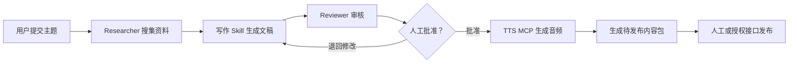

# Day32-73：Context Engineering 与 Agent 业务工程学习纲领

> [!abstract] 这份文档的定位
> 这是完成 Hugging Face Agents Course 后的下一阶段学习指导纲领。主线教材是 [Hugging Face Context Course](https://huggingface.co/learn/context-course/unit0/introduction)，学习方式是“课程知识 + 可执行代码 + 真实业务项目 + 测试评估”。
>
> 最终目标不是看完课程，而是具备独立分析、设计、开发、测试、部署和维护 Agent 业务系统的能力。

---

## 1. 总目标

### 1.1 长期目标

成为能够扛起 Agent 业务的应用工程师，具体表现为：

- 能把模糊的业务需求拆成 Agent、工作流、工具和人工审批节点；
- 能判断一个需求是否真的需要 Agent，而不是为了使用 Agent 而使用 Agent；
- 能设计状态、上下文、工具协议、错误处理和权限边界；
- 能使用 LangGraph 构建可恢复、可追踪、可人工介入的工作流；
- 能使用 Skills 固化业务知识和标准作业流程；
- 能使用 MCP 接入 API、数据库、文件系统和第三方服务；
- 能通过 Plugins 分发和复用 Agent 能力；
- 能合理使用 Subagents，而不是盲目堆叠多智能体；
- 能使用 Hooks 实现日志、守卫和自动化检查；
- 能建立测试集、评估指标、Tracing、告警和成本分析；
- 能将 Agent 部署到生产环境，并对成功率、成本和业务结果负责。

### 1.2 本阶段目标

完成 Day32–Day73 后，应达到：

```text
理解 Context Engineering
→ 能独立编写 Agent Skill
→ 能独立开发 MCP Server
→ 能将 Skills 与 MCP 打包为 Plugin
→ 能设计多 Agent 协作流程
→ 能通过 Hooks 观测和约束 Agent
→ 能解释 Agent Loop 与沙箱边界
→ 完成一个真实的音频内容 Agent MVP
```

### 1.3 对“学会”的定义

以下行为不算学会：

- 只看完网页；
- 只复制教材代码；
- 代码只能运行一次；
- 只会调用框架，不理解失败后如何处理；
- 没有测试、日志、错误处理和验收标准。

真正学会必须满足：

1. 能不用教材重新讲清核心概念；
2. 能从空目录开始写出最小实现；
3. 能接入真实业务接口或真实数据；
4. 能处理超时、无效参数、接口失败等异常；
5. 能用测试数据证明实现有效；
6. 能说明设计取舍、成本和风险；
7. 能把当天成果提交到 Git。

---

## 2. 学习路线总览

| 阶段 | 天数 | 官方单元 | 核心能力 | 阶段产物 |
|---|---:|---|---|---|
| 第一阶段 | Day32–38 | Unit 0 | Context Engineering 基础与项目规划 | 基线实验、业务需求和架构草图 |
| 第二阶段 | Day39–45 | Unit 1 | Agent Skills | 音频文稿创作 Skill |
| 第三阶段 | Day46–52 | Unit 2 | MCP | 可真实调用的 TTS MCP Server |
| 第四阶段 | Day53–59 | Unit 3 | Plugins | 可安装的音频内容 Agent Plugin |
| 第五阶段 | Day60–66 | Unit 4 | Subagents | 研究、写作、审核协作流程 |
| 第六阶段 | Day67–70 | Unit 5 | Hooks | 日志、守卫与自动检查 |
| 第七阶段 | Day71–73 | Unit 6 | Nano Harness 与综合验收 | 音频内容 Agent MVP |

官方课程目录：

- [Unit 0：Welcome to the Context Course](https://huggingface.co/learn/context-course/unit0/introduction)
- [Unit 1：Agent Skills](https://huggingface.co/learn/context-course/unit1/introduction)
- [Unit 2：Model Context Protocol](https://huggingface.co/learn/context-course/unit2/introduction)
- [Unit 3：Plugins](https://huggingface.co/learn/context-course/unit3/introduction)
- [Unit 4：Subagents](https://huggingface.co/learn/context-course/unit4/introduction)
- [Unit 5：Hooks](https://huggingface.co/learn/context-course/unit5/introduction)
- [Unit 6：Nano Harness](https://huggingface.co/learn/context-course/unit6/introduction)

> [!important] 平台选择
> 课程同时介绍 Codex、Claude Code、OpenCode 等平台。本项目以 **Codex 为主线**。其他平台的章节需要理解概念和差异，但不要求把同一案例在所有平台重复实现。

---

## 3. 贯穿课程的业务项目

### 3.1 项目名称

**音频内容生产 Agent**

### 3.2 业务目标

输入一个主题后，系统能够：

1. 搜集和整理可靠资料；
2. 根据平台、受众、时长和风格要求生成文稿；
3. 审核事实、结构、合规性和表达质量；
4. 等待人工确认；
5. 调用真实 TTS 接口生成音频；
6. 生成标题、简介、标签、封面提示词和音频文件；
7. 保存为待发布内容包；
8. 后续通过官方 API 或经过授权的方式发布。

### 3.3 技术职责划分

| 组件 | 在项目中的职责 |
|---|---|
| LangGraph | 控制状态、流程、条件路由、重试和人工审批 |
| Skills | 保存写作规范、审核规则、平台要求和业务经验 |
| MCP | 提供搜索、TTS、存储和平台 API 等动态能力 |
| Plugins | 打包 Skills、MCP 配置和扩展能力 |
| Subagents | 分别承担研究、写作、事实审核和质量审核 |
| Hooks | 记录行为、阻止危险操作、运行自动检查 |
| Tracing/Evaluation | 衡量成功率、延迟、质量、成本和失败原因 |



---

## 4. 每日学习计划

### 4.1 第一阶段：Context Engineering 基础（Day32–38）

#### Day32：课程导航与环境检查

- [ ] 阅读 Unit 0；
- [ ] 理解课程六个核心单元之间的关系；
- [ ] 确认 Codex、Python、Git 和 Hugging Face 账号可用；
- [ ] 建立 Day32 的笔记和示例目录。

**验收：** 能独立说明 Skills、MCP、Plugins、Subagents、Hooks 分别解决什么问题。

#### Day33：什么是 Context Engineering

- [ ] 理解上下文不是单纯的 Prompt；
- [ ] 区分指令、消息历史、工具结果、检索资料、Skills 和 Memory；
- [ ] 分析上下文不足、上下文污染和上下文过载。

**验收：** 能解释为什么强模型在错误上下文下仍会产生错误结果。

#### Day34：上下文对比实验

- [ ] 让 Agent 在没有项目说明的情况下完成一个任务；
- [ ] 添加结构化上下文后重新执行；
- [ ] 比较正确率、返工次数、工具调用次数和 Token 消耗。

**验收：** 形成一份包含数据的实验记录，而不是只写主观感受。

#### Day35：复习 Agent 基础

- [ ] 不看旧代码手写一个最小工具调用循环；
- [ ] 复习 LangGraph 的 State、Node、Edge 和条件路由；
- [ ] 复习结构化输出、工具参数校验和错误处理。

**验收：** 最小 Agent 能真实调用一个工具，并正确处理无效参数。

#### Day36：确定真实业务需求

- [ ] 编写音频内容 Agent 的用户故事；
- [ ] 明确输入、输出、参与者和边界；
- [ ] 区分 MVP 功能与后续功能；
- [ ] 写出可能失败的环节。

**验收：** 形成一页可以交给开发人员实施的需求说明。

#### Day37：设计系统与项目结构

- [ ] 绘制业务流程图；
- [ ] 设计状态字段和数据模型；
- [ ] 规划 `skills/`、`mcp/`、`workflows/`、`tests/` 等目录；
- [ ] 准备 `.env.example`，但不得写入真实密钥。

**验收：** 能说明每个目录和状态字段存在的理由。

#### Day38：第一阶段复盘

- [ ] 不看笔记讲解 Context Engineering；
- [ ] 完成阶段自测；
- [ ] 整理遗留问题；
- [ ] 提交本周代码和笔记。

**阶段标准：** 能从业务目标反推 Agent 需要的上下文，而不是先选框架再找需求。

### 4.2 第二阶段：Agent Skills（Day39–45）

#### Day39：Skills 的定位

- [ ] 学习 Skills 的作用、发现和按需加载；
- [ ] 区分 Skill、Prompt、Tool 和 MCP；
- [ ] 分析哪些业务知识适合做成 Skill。

**验收：** 能用“如何做”与“执行什么动作”解释 Skill 和 Tool 的区别。

#### Day40：`SKILL.md` 规范

- [ ] 学习 YAML frontmatter；
- [ ] 理解 `name`、`description` 和触发场景；
- [ ] 编写最小可用 `SKILL.md`；
- [ ] 检查描述是否明确说明何时使用。

**验收：** 从空目录创建一个格式合法的 Skill。

#### Day41：渐进式上下文加载

- [ ] 理解 `SKILL.md`、`scripts/`、`references/`、`assets/` 的职责；
- [ ] 将大段背景资料移入 references；
- [ ] 避免 Skill 内容过大和职责过多。

**验收：** 能说明 Agent 在什么时候才应该读取参考资料或执行脚本。

#### Day42：安装和测试 Skill

- [ ] 将 Skill 安装或链接到 Codex；
- [ ] 编写应该触发与不应该触发的测试问题；
- [ ] 检查 Skill 是否加载正确的资料。

**验收：** 10 个测试请求中至少 8 个触发判断正确。

#### Day43：音频文稿创作 Skill

- [ ] 定义受众、平台、时长、语气和结构；
- [ ] 规定事实引用、标题、开头、正文和结尾要求；
- [ ] 输出结构化文稿结果。

**验收：** 同一主题可根据不同受众和时长生成明显不同的文稿。

#### Day44：Skill 辅助脚本与资料

- [ ] 编写文稿长度和结构检查脚本；
- [ ] 添加平台规则和写作风格参考；
- [ ] 添加文稿模板；
- [ ] 为检查脚本编写测试。

**验收：** 检查脚本可执行，并能识别至少三类文稿问题。

#### Day45：Skills 阶段验收

- [ ] 完成官方测验；
- [ ] 不看教材重建一个小型 Skill；
- [ ] 对音频文稿 Skill 做 10 条样本评测；
- [ ] 记录问题并升级版本。

**阶段标准：** 能把个人经验和业务 SOP 变成 Agent 可发现、可加载、可测试的 Skill。

### 4.3 第三阶段：MCP（Day46–52）

#### Day46：MCP 架构

- [ ] 理解 Host、Client、Server；
- [ ] 理解 MCP 解决的 M×N 集成问题；
- [ ] 画出一次工具调用的完整链路。

**验收：** 能说明 MCP 和普通 Python 函数调用的差别。

#### Day47：Tools、Resources 与 Prompts

- [ ] 理解三种能力的用途和控制方；
- [ ] 为搜索、TTS、平台规则和写作模板选择正确类型；
- [ ] 练习设计清晰的工具名称和描述。

**验收：** 面对一个新需求时能够正确选择 MCP 能力类型。

#### Day48：协议与传输

- [ ] 理解 JSON-RPC 的请求和响应结构；
- [ ] 理解 stdio 与 Streamable HTTP；
- [ ] 分析本地开发和远程部署的安全差异。

**验收：** 能读懂一条 MCP 工具调用消息，并判断适合的传输方式。

#### Day49：第一个 FastMCP Server

- [ ] 使用 Python 编写 MCP Server；
- [ ] 实现至少两个真实工具；
- [ ] 使用 Inspector 或客户端完成调用测试。

**验收：** MCP Server 可启动、可发现工具、可返回结构化结果。

#### Day50：生产级工具设计

- [ ] 添加 Pydantic 参数校验；
- [ ] 添加超时、重试和结构化错误；
- [ ] 设计幂等键；
- [ ] 限制过大的工具输出。

**验收：** 模拟参数错误、网络超时和重复请求时，服务不会失控或重复执行副作用。

#### Day51：真实 TTS MCP Server

- [ ] 接入已经配置好的真实 TTS 接口；
- [ ] 实现生成音频、查询状态和保存文件；
- [ ] 记录请求 ID、耗时和错误；
- [ ] 避免在日志中输出密钥。

**验收：** 输入一段真实文稿后能生成可播放的音频文件。

#### Day52：MCP 阶段验收

- [ ] 将 MCP Server 接入 Codex；
- [ ] 完成正常、异常、超时和重复请求测试；
- [ ] 完成官方测验；
- [ ] 编写安装、启动和调用文档。

**阶段标准：** 能独立设计、实现、测试和接入一个真实 MCP 服务。

### 4.4 第四阶段：Plugins（Day53–59）

#### Day53：Plugin 的定位

- [ ] 理解 Prompt → Skill → MCP → Plugin 的演进；
- [ ] 理解 Plugin 作为能力分发单元的价值；
- [ ] 分析 Plugin 与普通 Python 包的区别。

**验收：** 能说明为什么团队需要 Plugin，而不只是复制配置文件。

#### Day54：Plugin 结构与 Manifest

- [ ] 学习 manifest 元数据；
- [ ] 理解版本、依赖、Skills 和 MCP 配置；
- [ ] 设计音频 Agent Plugin 目录。

**验收：** Manifest 结构合法，不包含密钥和机器相关的绝对路径。

#### Day55：创建第一个 Plugin

- [ ] 创建最小 Plugin；
- [ ] 在本地安装；
- [ ] 检查发现和卸载流程。

**验收：** 在一个干净测试项目中可以安装和识别 Plugin。

#### Day56：打包音频文稿 Skill

- [ ] 将 Day43–44 的 Skill 加入 Plugin；
- [ ] 检查路径和引用；
- [ ] 验证安装后 Skill 能正确触发。

**验收：** Plugin 安装后无需手动复制 Skill。

#### Day57：集成 TTS MCP

- [ ] 在 Plugin 中提供或引用 MCP 配置；
- [ ] 使用环境变量注入 API 配置；
- [ ] 验证真实音频生成链路。

**验收：** Plugin 同时提供写作知识和 TTS 执行能力。

#### Day58：版本与分发

- [ ] 使用语义化版本；
- [ ] 编写变更记录；
- [ ] 测试升级和回退；
- [ ] 编写安装说明。

**验收：** 另一名使用者只读 README 就能完成安装。

#### Day59：Plugins 阶段验收

- [ ] 在全新目录执行完整安装；
- [ ] 运行写稿和 TTS 流程；
- [ ] 完成官方测验；
- [ ] 修复安装过程中的隐含依赖。

**阶段标准：** 能把 Agent 的知识、工具和配置整理成可复用、可安装、可升级的能力包。

### 4.5 第五阶段：Subagents（Day60–66）

#### Day60：什么时候使用 Subagent

- [ ] 理解独立上下文、工具权限和执行成本；
- [ ] 学习不适合使用 Subagent 的情况；
- [ ] 对比单 Agent、工作流和多 Agent。

**验收：** 能根据任务复杂度给出使用或不使用 Subagent 的理由。

#### Day61：协作模式

- [ ] 学习 Pipeline；
- [ ] 学习 Fan-out/Fan-in；
- [ ] 学习并行 Review；
- [ ] 学习 Supervisor/Worker 的适用边界。

**验收：** 能为三个不同业务场景选择不同协作模式。

#### Day62：Researcher Agent

- [ ] 限制为只读和检索工具；
- [ ] 规定可靠信源、引用和输出格式；
- [ ] 输出研究摘要和证据列表。

**验收：** 研究结果可追溯到来源，不把推测当事实。

#### Day63：Writer 与 Reviewer

- [ ] Writer 使用文稿 Skill；
- [ ] Reviewer 检查事实、结构、风格和合规；
- [ ] 两者使用不同上下文和权限。

**验收：** Reviewer 能指出具体问题并给出可执行修改意见。

#### Day64：多 Agent 工作流

- [ ] 实现 Research → Write → Review；
- [ ] 设计各阶段结构化输入输出；
- [ ] 记录每个 Agent 的状态和结果。

**验收：** 上一阶段的输出能够稳定成为下一阶段的输入。

#### Day65：失败与成本控制

- [ ] 模拟子 Agent 超时和返回无效结构；
- [ ] 设置最大轮数和预算；
- [ ] 处理部分失败；
- [ ] 避免循环委派和重复工作。

**验收：** 一个子 Agent 失败时，主流程能够重试、降级或请求人工处理。

#### Day66：Subagents 阶段验收

- [ ] 比较单 Agent 与多 Agent 的质量、耗时和成本；
- [ ] 完成官方测验；
- [ ] 删除没有带来价值的子 Agent；
- [ ] 固化最终协作模式。

**阶段标准：** 能用数据证明多 Agent 的价值，而不是因为概念高级就使用多 Agent。

### 4.6 第六阶段：Hooks（Day67–70）

#### Day67：Hook 生命周期

- [ ] 理解 UserPromptSubmit、PreToolUse、PostToolUse 和 Stop；
- [ ] 区分模型指令与确定性 Hook；
- [ ] 画出 Hook 在 Agent 生命周期中的位置。

**验收：** 能判断日志、拦截和自动测试分别应该放在哪个事件。

#### Day68：可观测性 Hooks

- [ ] 记录 session、工具、参数摘要、耗时、结果和错误；
- [ ] 对不同事件转换成统一日志格式；
- [ ] 确保敏感字段被脱敏。

**验收：** 可以根据日志还原一次任务的主要执行过程。

#### Day69：Guardrail 与自动化 Hooks

- [ ] 在执行前拦截危险命令和敏感路径；
- [ ] 在文件修改后运行格式化、检查和测试；
- [ ] 测试允许、拒绝和异常三种路径。

**验收：** 守卫规则由代码强制执行，不依赖模型“记住”。

#### Day70：Hooks 阶段验收

- [ ] 构建最小 Agent Activity Dashboard 或日志查看器；
- [ ] 模拟危险操作，证明 Hook 能够阻止；
- [ ] 完成官方测验；
- [ ] 将 Hooks 接入音频 Agent 项目。

**阶段标准：** 能通过 Hooks 观察和约束 Agent，而不修改 Agent 的核心业务逻辑。

### 4.7 第七阶段：Nano Harness 与综合项目（Day71–73）

#### Day71：Agent Loop 深入理解

- [ ] 阅读 Nano Harness；
- [ ] 理解模型调用、代码解析、工具执行、Observation 和终止条件；
- [ ] 理解消息历史如何成为短期记忆；
- [ ] 理解最大步骤数和上下文限制。

**验收：** 能画出最小 Agent Loop，并指出每一步可能失败的位置。

#### Day72：工具与沙箱

- [ ] 理解路径限制、命令白名单、超时和输出裁剪；
- [ ] 理解错误如何转成 Observation；
- [ ] 添加一个受限制的新工具；
- [ ] 说明为什么 Nano Harness 不应直接用于生产环境。

**验收：** 尝试目录穿越、危险命令和超大输出时均被正确限制。

#### Day73：毕业项目验收

- [ ] 串联研究、写作、审核、人工确认和 TTS；
- [ ] 运行 20 条端到端测试任务；
- [ ] 统计成功率、质量、延迟和成本；
- [ ] 编写部署和使用文档；
- [ ] 完成阶段总结并提交 GitHub。

**阶段标准：** 交付一个能真实生成文稿和音频、可追踪、可重试、需要人工审批的 Agent MVP。

---

## 5. 每日固定学习模板

### 5.1 时间分配

```text
20 分钟：不看笔记回忆昨天内容
30–40 分钟：阅读当天官方教材
60–90 分钟：独立写代码和调试
20–30 分钟：测试、评估和记录问题
10–20 分钟：整理 Obsidian 笔记并提交 Git
```

总体原则：

```text
理论阅读 30%
代码与业务实践 70%
```

### 5.2 每日完成清单

- [ ] 我能用自己的话解释今天的核心概念；
- [ ] 我完成了一个可以执行的代码产物；
- [ ] 我测试了正常、边界和异常情况；
- [ ] 我记录了至少一个失败案例；
- [ ] 我写清楚了代码的设计理由；
- [ ] 我没有把 API Key 提交到 Git；
- [ ] 我更新了当天的 Obsidian 笔记；
- [ ] 我完成了一次 Git 提交。

### 5.3 每日笔记结构

```markdown
# DayXX：主题

## 一句话总结
## 今天解决了什么问题
## 核心概念
## 运行流程
## 代码说明
## 测试结果
## 失败案例
## 我的理解
## 仍未解决的问题
## 明日计划
```

---

## 6. 最终验收指标

### 6.1 功能指标

- [ ] 能根据主题生成符合指定平台、受众、风格和时长的文稿；
- [ ] 能调用真实 TTS 服务生成可播放音频；
- [ ] 能保存文稿、音频和发布元数据；
- [ ] 对外发布前必须经过人工确认；
- [ ] 同一个任务重复执行不会重复产生外部副作用。

### 6.2 质量指标

- [ ] 20 条端到端测试的流程成功率不低于 90%；
- [ ] 文稿自动规则检查通过率不低于 90%；
- [ ] 人工内容验收通过率不低于 80%；
- [ ] Skill 在 10 个触发测试中至少判断正确 8 个；
- [ ] 关键事实能够追溯到资料来源。

### 6.3 工程指标

- [ ] API 超时后能够重试或进入可恢复状态；
- [ ] 所有任务都有唯一 ID、状态、日志和错误信息；
- [ ] 日志中没有 API Key 和完整敏感数据；
- [ ] 危险操作能够被权限或 Hook 拦截；
- [ ] README 足以指导新环境完成安装和运行；
- [ ] 核心模块具备自动化测试；
- [ ] 能统计每次任务的 Token、时间和接口成本。

### 6.4 能力答辩

完成本阶段后，必须能够回答：

1. 为什么这个业务需要 Agent，而不是普通脚本？
2. 为什么使用 LangGraph？状态如何设计？
3. 哪些知识放进 Skill，哪些能力放进 MCP？
4. 为什么使用或不使用 Subagents？
5. 如何避免重复发布、无限循环和成本失控？
6. 如何观测一次失败任务？
7. 如何判断新版 Agent 比旧版更好？
8. 哪些操作必须人工审批？
9. 如果接口不可用，系统如何降级？
10. 系统如何部署、维护和持续改进？

---

## 7. 完成课程后的生产工程路线

> [!warning] 必须明确
> 完成 Context Course 代表具备 Context Engineering 和 Agent 原型开发能力，不等于已经能独立承担所有生产业务。要成为能扛业务的 Agent 工程师，还需要完成下面的生产工程训练。

| 周次 | 学习主题 | 必须完成的业务产物 |
|---|---|---|
| 第 1 周 | FastAPI、Pydantic、REST API | 为音频 Agent 提供任务创建和状态查询 API |
| 第 2 周 | PostgreSQL、Redis、任务队列 | 任务持久化、后台执行和失败恢复 |
| 第 3 周 | LangGraph Checkpoint、幂等、HITL | 可暂停、恢复、审批和重试的工作流 |
| 第 4 周 | 测试集、Tracing、Evaluation | 自动回归评测和可观测性面板 |
| 第 5 周 | 权限、密钥、内容安全 | 密钥管理、最小权限和敏感内容拦截 |
| 第 6 周 | Docker、部署、监控 | 可重复部署的服务、健康检查和告警 |
| 第 7 周 | 平台集成与合规 | 通过官方 API 或授权方式准备发布流程 |
| 第 8 周 | 真实用户试运行 | 让 1–3 名用户使用并完成问题复盘 |

后续真实项目顺序：

1. 音频内容生产 Agent；
2. 双账号热点采集与头条内容 Agent；
3. 企业知识库或垂直行业 Agent；
4. 将稳定能力产品化并寻找付费用户。

---

## 8. 学习边界与决策原则

### 8.1 当前不应投入过多时间的内容

- 同时学习多个功能高度重叠的 Agent 框架；
- 在没有数据和业务需求时进行大模型微调；
- 为简单任务设计复杂多 Agent 系统；
- 在没有评测前反复修改 Prompt；
- 在没有官方接口或授权时强行实现全自动发布；
- 只追求 Demo 效果，不处理错误、权限和成本。

### 8.2 技术选择原则

```text
固定业务知识和 SOP         → Skills
实时数据和外部动作          → MCP / Tools
流程、状态、重试和人工审批   → LangGraph
能力打包和团队分发          → Plugins
独立上下文或可并行的复杂任务 → Subagents
确定性日志、守卫和自动检查   → Hooks
质量、延迟、成本持续改进     → Tracing + Evaluation
```

### 8.3 是否需要继续学新课程

每次准备学习一门新课程前，先回答：

1. 它是否解决当前项目中的真实问题？
2. 现有知识是否真的不足以解决？
3. 学完是否有可交付产物？
4. 是否可以通过查文档按需学习，而不必完整学课？

如果四个问题都无法给出明确答案，优先继续做项目。

---

## 9. 里程碑看板

- [ ] M1：完成 Context Engineering 基线实验；
- [ ] M2：完成可测试的音频文稿 Skill；
- [ ] M3：完成真实 TTS MCP Server；
- [ ] M4：完成可安装的音频 Agent Plugin；
- [ ] M5：完成研究、写作、审核 Subagents；
- [ ] M6：完成日志、守卫和自动检查 Hooks；
- [ ] M7：完成音频内容 Agent MVP；
- [ ] M8：完成 20 条端到端评测；
- [ ] M9：完成 Docker 化和生产部署；
- [ ] M10：获得首批真实用户反馈；
- [ ] M11：完成第一个付费验证。

---

## 10. 最终提醒

> [!quote] 学习原则
> Agent 能力不是由“学过多少框架”决定的，而是由“能否把业务需求变成稳定、可评测、可部署、可维护并产生价值的系统”决定的。

本阶段的行动顺序：

```text
先完成 Context Course 主线
→ 每个单元都接入音频 Agent 项目
→ 完成可真实运行的 MVP
→ 补齐生产工程能力
→ 交给真实用户使用
→ 根据运行数据持续改进
→ 验证商业价值
```
