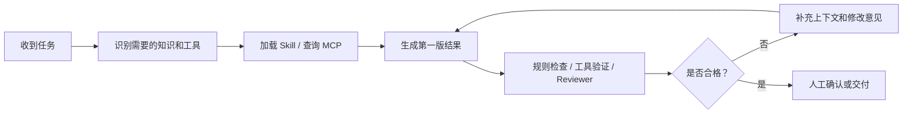
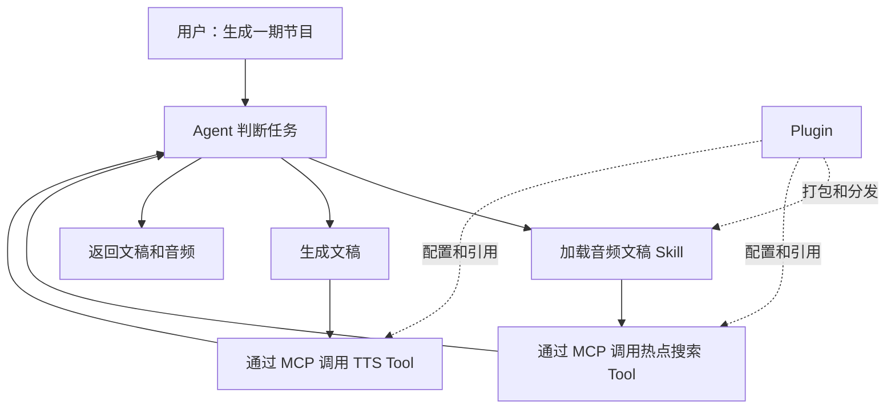

# 第32天：Context Engineering 课程介绍与环境准备

> [!abstract] 本章定位
> 第32天是 Hugging Face Context Course 的 Unit 0。今天不急着写复杂代码，重点是理解：为什么一个能力很强的模型，仍然需要经过良好的上下文工程，才能稳定完成真实业务。

## 0. 学习资料

- 在线教材：[Welcome to The Context Course](https://huggingface.co/learn/context-course/unit0/introduction)
- GitHub 原文：[introduction.mdx](https://github.com/huggingface/context-course/blob/main/units/en/unit0/introduction.mdx)
- 课程源代码仓库：[huggingface/context-course](https://github.com/huggingface/context-course)
- 本阶段代码目录：`context-course/`

---

## 1. 本章一句话总结

```text
模型能力决定 Agent 的智力上限，
上下文工程决定 Agent 在当前任务中能否找到正确资料、遵守正确规则，并使用正确工具。
```

一个模型很聪明，不代表它天然知道：

- 你的项目目录是什么样；
- 你的业务规则是什么；
- 应该调用哪个 API；
- API 参数如何填写；
- 哪些操作必须人工确认；
- 生成结果要符合什么格式；
- 刚刚执行的工具返回了什么；
- 当前任务已经执行到了哪一步。

这些信息都属于 Agent 完成当前任务所需要的**上下文**。

---

## 2. 什么是 Context？

### 2.1 大白话解释

可以把大模型想象成一名刚入职但学习能力很强的员工。

他可能懂编程、写作、分析和推理，但第一天来到你的公司时，并不知道：

- 公司的业务流程；
- 项目的代码结构；
- 领导喜欢什么格式；
- 哪些数据可以访问；
- 哪些操作不能执行；
- 当前客户提出了什么具体要求。

你在他工作前和工作过程中提供的材料，就是上下文。

```text
大模型 = 员工的大脑和通用能力
上下文 = 员工当前桌面上的任务单、制度、资料、工具结果和工作记录
Agent = 能根据任务思考并使用工具完成工作的员工
```

### 2.2 上下文包含什么？

上下文不只是 Prompt，还可能包含：

| 上下文类型 | 示例 |
|---|---|
| 系统指令 | 角色、目标、安全限制和输出格式 |
| 用户需求 | 当前需要完成的任务 |
| 对话历史 | 用户之前说过什么、Agent 做过什么 |
| 项目说明 | `README.md`、`AGENTS.md`、架构文档 |
| Agent Skills | 某项任务的标准作业流程和参考资料 |
| 检索结果 | RAG 找到的企业知识和文档片段 |
| MCP 数据 | 数据库记录、API 返回值、实时网页数据 |
| 工具执行结果 | 命令输出、测试结果、错误信息 |
| 工作流状态 | 当前步骤、已完成内容、失败次数 |
| 人工反馈 | 批准、退回、修改意见 |

所以：

```text
Prompt Engineering 主要关心“怎么写指令”；
Context Engineering 关心“Agent 在每一步应该看到哪些信息，信息从哪里来，什么时候加载，如何更新”。
```

---

## 3. 问题一：什么是“构建知识结构”？

教材的核心意思是：把 Agent 可能需要的知识整理好，让它在执行具体任务时能够快速找到相关部分，而不是把所有资料一次性全部塞给它。

### 3.1 什么是知识结构？

知识结构不是一个神秘的新数据库，也不单指文件夹结构。

它是下面几件事情的组合：

1. **知识放在哪里**：项目说明、Skills、参考资料、数据库或 API；
2. **知识如何分类**：按业务、任务、平台或风险分类；
3. **知识如何描述**：清楚说明内容是什么、什么时候使用；
4. **知识什么时候加载**：常驻上下文、按需加载或动态查询；
5. **知识如何更新**：工具返回、人工反馈、状态变化和版本升级；
6. **知识如何验证**：通过规则、测试或 Reviewer 检查是否正确使用。

### 3.2 用图书馆理解知识结构

假设把一万本书随意堆在仓库里：

- 书虽然都在，但找一本书可能需要一天；
- 有些书已经过期；
- 同一本书可能有多个冲突版本；
- 员工不知道应该先看哪一本。

整理后的图书馆会有：

- 分类目录；
- 书名和摘要；
- 索引和检索系统；
- 借阅规则；
- 版本和更新时间；
- 管理员推荐。

Agent 的知识结构也是如此：

```text
文件目录       = 书架
Skill 描述     = 书名和摘要
references     = 专业参考书
MCP            = 图书馆检索和借阅接口
工具返回值     = 刚刚取回的资料
工作流状态     = 当前读到了哪里
Hooks          = 借阅规则和安全检查
```

### 3.3 好的知识结构是什么样？

以音频内容 Agent 为例：

```text
audio-content-agent/
├── AGENTS.md                         # 项目级固定规则
├── skills/
│   └── audio-script-writing/
│       ├── SKILL.md                  # 什么时候使用、执行步骤
│       ├── references/
│       │   ├── ximalaya-rules.md     # 喜马拉雅平台要求
│       │   └── writing-style.md      # 文稿风格
│       └── scripts/
│           └── validate_script.py    # 文稿检查器
├── mcp/
│   ├── search_server.py              # 获取实时资料
│   └── tts_server.py                 # 生成音频
└── workflows/
    └── audio_graph.py                # 控制业务流程和状态
```

这时 Agent 不需要一开始就读取所有平台规则。

当任务是“生成喜马拉雅音频文稿”时，它才加载：

- 音频文稿 Skill；
- 喜马拉雅平台规则；
- 指定的写作风格；
- 搜索工具返回的最新资料。

这就是“高效地找到它需要的东西”。

---

## 4. “在需要时改进输出”是什么意思？

### 4.1 不是重新训练模型

这里的“改进”通常不是：

```text
任务做错一次 → 立刻重新训练大模型 → 模型参数永久改变
```

课程主要讨论的是：

```text
在当前任务中，给 Agent 补充正确上下文，
再根据工具结果、校验结果或人工反馈修改当前输出。
```

这属于运行时改进，不一定会改变模型参数。

### 4.2 改进输出的完整过程



常见的改进方式：

| 改进方式 | 例子 |
|---|---|
| 补充业务规则 | 告诉 Agent 文稿必须控制在 1500 字以内 |
| 加载参考资料 | 读取平台规则和写作风格示例 |
| 获取实时数据 | 通过 MCP 搜索当天热点，而不是依赖模型旧知识 |
| 使用工具校验 | 脚本发现文稿时长超过要求 |
| 获取 Reviewer 意见 | 审核 Agent 指出事实没有来源 |
| 获取人工反馈 | 用户要求开头更有吸引力 |
| 保留工作流状态 | 修改时保留已经确认的标题和资料 |

### 4.3 音频文稿的例子

第一次生成：

```text
Agent 生成了一篇 3000 字文稿。
```

检查脚本返回：

```text
目标时长：5 分钟
预计时长：11 分钟
问题：文稿过长，开头缺少主题钩子，没有引用资料来源。
```

Agent 将这段检查结果加入上下文，再生成第二版：

```text
压缩到 1400 字；
增加开头钩子；
保留三条核心信息；
添加资料来源；
重新通过检查。
```

模型的大脑没有重新训练，但输出因为上下文和反馈更完整而改善了。

### 4.4 上下文越多越好吗？

不是。

上下文过多可能导致：

- 重要规则被淹没；
- 无关资料干扰判断；
- 旧资料与新资料冲突；
- Token 和费用增加；
- 模型注意不到真正重要的信息。

Context Engineering 的目标不是“塞得最多”，而是：

```text
在正确的时间，给 Agent 正确、足够、可信且格式清晰的信息。
```

---

## 5. 问题二：Agent、Skill、Tool、MCP、Plugin 是什么关系？

### 5.1 先用公司员工来比喻

| 概念 | 公司比喻 | 实际含义 |
|---|---|---|
| Model | 员工的大脑 | 提供语言理解、生成和推理能力 |
| Agent | 能自主干活的员工 | 接收目标、判断步骤、调用工具、观察结果 |
| Context | 员工当前看到的工作材料 | 指令、历史、文档、状态和工具结果 |
| Skill | 标准作业手册 | 教 Agent 在特定场景下如何完成任务 |
| Tool | 电话、电脑、打印机 | 真正执行查询、写入或外部操作的函数 |
| MCP | 统一规格的插座和接线标准 | 用统一协议把 Agent 与工具、数据连接起来 |
| Plugin | 装好说明书和工具的工作箱 | 将 Skill、MCP 配置等能力打包、安装和分发 |
| Subagent | 专业同事 | 在独立上下文中处理研究、审核等子任务 |
| Hook | 门禁、监控和自动质检 | 在固定生命周期节点记录、阻止或自动执行动作 |

### 5.2 Agent 是什么？

普通大模型调用通常是：

```text
输入问题 → 模型生成答案 → 结束
```

Agent 通常是：

```text
接收目标
→ 判断下一步
→ 选择工具
→ 执行工具
→ 观察结果
→ 更新状态
→ 决定继续、修改、询问或结束
```

所以 Agent 不只是“会聊天的模型”，而是模型加上循环、工具、状态和约束形成的执行系统。

### 5.3 Skill 是什么？

Skill 主要告诉 Agent：**这项工作应该怎样做。**

例如“音频文稿写作 Skill”可以规定：

- 什么时候应该使用这个 Skill；
- 先确认受众、平台和时长；
- 如何搜集资料；
- 文稿使用什么结构；
- 结束时如何检查；
- 需要读取哪些参考资料；
- 需要运行哪些辅助脚本。

Skill 本身通常不是远程 API，也不等同于执行工具。它更像可复用的业务知识和操作说明。

### 5.4 Tool 是什么？

Tool 是 Agent 可以实际调用的函数或能力，例如：

```text
search_web(query)
read_file(path)
query_database(sql)
generate_audio(text, voice)
get_weather(city)
save_draft(title, content)
publish_content(account_id, content)
```

Skill 可能告诉 Agent“先搜索可靠资料”，真正执行搜索的是 Tool。

### 5.5 MCP 是什么？

MCP 全称是 Model Context Protocol，可以理解为 Agent 连接工具和数据的统一协议。

没有 MCP 时：

- Codex 连接搜索 API，要写一套适配代码；
- Claude Code 连接同一个搜索 API，可能又要写一套；
- 另一个 Agent 再连接，又要重新开发。

有 MCP 时：

- 开发一个符合 MCP 规范的 Server；
- MCP 兼容的 Agent 可以通过统一方式发现和调用它提供的能力。

> [!important] MCP 没有固定工具清单
> MCP 是协议，不是一组预先写死的工具。一个 MCP Server 可以暴露什么工具，由开发者根据业务定义。

常见 MCP 工具包括：

- 文件：读取、搜索、创建和修改文件；
- 数据库：查询订单、用户、内容和任务状态；
- 搜索：网页搜索、知识库检索和热点检索；
- 开发平台：GitHub Issues、Pull Requests 和 Actions；
- 办公平台：Slack、Jira、Notion、Google Drive；
- AI 服务：TTS、ASR、图像生成和内容审核；
- 业务系统：创建草稿、查询发布状态、发送通知；
- 运维系统：读取日志、查询监控指标和触发部署。

### 5.6 Plugin 是什么？

Plugin 是把可以复用的 Agent 能力整理成一个可安装、可升级、可分发的包。

一个 Plugin 可能包含：

```text
audio-content-plugin/
├── plugin manifest          # 名称、版本和能力声明
├── skills/                  # 文稿写作和审核方法
├── MCP 配置或服务引用        # 搜索、TTS 和存储能力
├── app/integration 配置     # 外部应用连接
└── 使用说明                 # 安装、认证和触发方式
```

不同 Agent 平台的 Plugin 具体结构可能不同，但思想相同：把经过整理和测试的知识、工具与配置作为一个完整能力交付。

### 5.7 为什么打包成 Plugin？

如果不打包：

- 每个项目都要重新复制 Prompt 和配置；
- 团队成员使用的版本可能不同；
- 安装步骤容易遗漏；
- 升级后不知道哪些项目需要同步；
- Skill、MCP 和说明文档散落在不同地方。

打包后可以获得：

| 价值 | 说明 |
|---|---|
| 一次安装 | 不需要手工复制多个文件 |
| 统一版本 | 团队使用相同的规则和工具 |
| 可复用 | 多个项目可以复用同一能力 |
| 可升级 | 可以通过版本管理发布修复和新功能 |
| 可测试 | 发布前对一个完整能力包进行测试 |
| 可分发 | 可以交付给同事、客户或社区 |
| 可商业化 | 稳定的垂直业务能力可以形成产品资产 |

### 5.8 它们如何协作？

以“生成一条音频节目”为例：



一句话记忆：

```text
Agent 负责判断和执行；
Skill 教 Agent 如何做；
Tool 真正完成动作；
MCP 用统一方式连接 Tool 和数据；
Plugin 把这些能力整理成可安装的完整包。
```

---

## 6. 问题三：`curl -fsSL ... | bash` 是什么意思？

教材给出了下面的命令：

```bash
curl -fsSL https://claude.ai/install.sh | bash
```

### 6.1 逐段拆解

#### `curl`

`curl` 是终端中的网络请求工具，可以下载网页、脚本和 API 数据。

这里用于从：

```text
https://claude.ai/install.sh
```

下载安装脚本内容。

#### `-f`

请求遇到 HTTP 错误时返回失败，例如服务器返回 404 或 500 时，不继续把错误页面当安装脚本执行。

#### `-s`

静默模式，不显示普通进度条。

#### `-S`

虽然使用了静默模式，但如果出错仍然显示错误信息。

#### `-L`

如果下载地址发生重定向，继续跟随新的地址。

#### `|`

竖线叫做 Pipe，中文通常称为管道。

它把左边命令的输出直接交给右边命令作为输入：

```text
curl 下载脚本
        ↓
   直接交给 bash
```

#### `bash`

`bash` 是一种 Shell，也就是执行终端命令和脚本的程序。

因此整条命令的意思是：

```text
从 Claude 官方地址下载安装脚本，
然后立即使用 bash 执行这个脚本，安装 Claude Code CLI。
```

### 6.2 什么是 CLI？

CLI 全称是 Command Line Interface，即命令行界面。

GUI 是通过窗口、菜单和按钮操作：

```text
点击图标 → 打开窗口 → 点击按钮
```

CLI 是在终端里输入命令操作：

```bash
cd project
git status
python app.py
codex
```

CLI 不是“更低级的界面”，它特别适合开发工作：

- 可以精确指定路径和参数；
- 可以组合多个命令；
- 可以写成脚本自动执行；
- 容易和 Git、Python、Docker、服务器配合；
- Code Agent 可以直接读取项目、运行测试和修改文件；
- 在没有桌面界面的服务器上也能使用。

### 6.3 Claude Code CLI 安装后做什么？

安装完成后，一般可以在项目目录执行：

```bash
claude
```

它会启动 Claude Code 的命令行 Agent，让 Agent 在当前项目上下文中辅助读取代码、编辑文件和执行命令。

### 6.4 我们需要执行这条命令吗？

当前不需要。

本课程要求至少选择一个 Code Agent。我们已经在使用 Codex，因此后续以教材中的 **Codex 路线**为主。

学习 Claude Code、Codex 和 OpenCode 的共同概念即可，没有必要同时安装和付费使用所有平台。

### 6.5 这条命令安全吗？

这条命令来自教材给出的官方地址，但从安全习惯上看：

```bash
curl 某个网址 | bash
```

代表“下载后立即执行”，你没有在执行前看到脚本内容。因此，只应对确认可信的官方地址使用。

更谨慎的方式是先下载和检查：

```bash
curl -fsSL https://claude.ai/install.sh -o install.sh
less install.sh
bash install.sh
```

三步分别表示：

1. 下载脚本到 `install.sh`；
2. 阅读脚本内容；
3. 确认无误后再执行。

> [!warning] 不要照抄陌生网站的安装命令
> 安装脚本拥有执行命令、下载文件和修改本机配置的能力。链接来源不明时，不要直接执行。

---

## 7. Context Course 完整地图

| 单元 | 主题 | 解决的问题 |
|---|---|---|
| Unit 0 | Onboarding | 课程范围、环境、先修知识和学习方法 |
| Unit 1 | Agent Skills | 如何把业务知识和操作方法做成可复用 Skill |
| Unit 2 | MCP | 如何用统一协议连接外部工具、API 和数据 |
| Unit 3 | Plugins | 如何打包、安装、升级和分发 Agent 能力 |
| Unit 4 | Subagents | 如何让多个专业 Agent 分工和协作 |
| Unit 5 | Hooks | 如何观察、阻止和自动化 Agent 生命周期事件 |
| Unit 6 | Nano Harness | 最小 Agent Loop、工具执行和沙箱在底层如何工作 |

官方建议每个单元用一周、约 2–3 小时，并强调动手完成示例，而不是只浏览课件。

本项目的目标高于“看懂课程”，所以会为每个单元增加：

- 真实业务案例；
- 可执行代码；
- 异常处理；
- 自动化测试；
- 评测指标；
- 音频内容 Agent 集成。

---

## 8. 课程证书要求

根据 Unit 0 当前说明：

- Context Fundamentals Certificate：Unit 1–2 测验达到 70% 或以上；
- Context Engineering Certificate：Unit 1–5 测验达到 70% 或以上，并完成 Capstone Project。

本项目不把 70% 当作最终学习标准。

我们的标准是：

```text
概念能够独立解释
代码能够独立重建
工具能够接入真实服务
异常能够被处理
质量能够被评测
系统能够交给别人运行
```

---

## 9. Day32 应完成什么？

### 9.1 今日任务

- [x] 阅读 Unit 0 教材；
- [x] 了解 Context Course 的课程结构；
- [x] 理解 Context Engineering 的基本含义；
- [x] 区分 Agent、Skill、Tool、MCP 和 Plugin；
- [x] 理解 CLI 和教材安装命令；
- [x] 创建 `context-course/` 代码主目录；
- [x] 创建 Day32 Obsidian 学习笔记；
- [ ] 用自己的话重新讲一遍本章内容；
- [ ] 完成下面的自测题。

### 9.2 今日无需完成

- 不需要安装 Claude Code；
- 不需要同时学习多个 Code Agent；
- 不需要开发 MCP Server；
- 不需要提前创建所有空目录；
- 不需要为了今天有代码而编写没有业务意义的脚本。

### 9.3 今日验收标准

不看笔记，能够清楚回答：

1. Context Engineering 和 Prompt Engineering 有什么区别？
2. 什么是知识结构？
3. 为什么不是上下文越多越好？
4. Skill、Tool 和 MCP 分别负责什么？
5. Plugin 为什么有助于团队协作和商业交付？
6. CLI 和 GUI 有什么区别？
7. `curl ... | bash` 为什么需要谨慎执行？

七道题至少能独立回答五道，Day32 才算完成。

---

## 10. 自测题

### 10.1 基础题

1. 大模型很强，为什么还需要 Context Engineering？
2. 请列举五种可能进入 Agent 上下文的信息。
3. 知识存在硬盘中，为什么不代表 Agent 能正确使用它？
4. Skill 和普通长 Prompt 有什么区别？
5. MCP 是否自带固定的搜索、数据库和 TTS 工具？
6. Plugin 可以包含哪些内容？
7. 什么情况下应该使用 CLI？

### 10.2 场景题

假设要构建一个“热点音频节目 Agent”，请回答：

1. 哪些知识应该做成 Skill？
2. 哪些外部能力应该通过 MCP 提供？
3. 哪些内容应该保存在工作流状态中？
4. 哪一步需要人工审批？
5. 如何检查第一次生成的文稿是否需要改进？

---

## 11. 我的学习结论

### 11.1 今天最重要的认识

```text
Agent 出错不一定是模型不够聪明，
也可能是我们没有在正确时间提供正确的资料、规则、状态和工具。
```

### 11.2 Context Engineering 的核心动作

```text
选择：当前步骤需要什么信息？
组织：信息应该以什么结构提供？
检索：从哪里按需找到信息？
更新：工具结果和反馈如何进入上下文？
压缩：哪些旧信息应该总结或移除？
验证：Agent 是否正确使用了这些信息？
```

### 11.3 五个概念的最终记忆

```text
Agent  = 干活的人
Skill  = 干活的方法和操作手册
Tool   = 真正执行动作的工具
MCP    = 连接 Agent、工具和数据的统一标准
Plugin = 将知识、工具和配置打包成可安装的能力
```

---

## 12. 下一步

Day33 将继续完成 Context Engineering 的深入理解和对比实验：

1. 选择一个相同任务；
2. 先让 Agent 在缺少项目上下文时完成；
3. 再提供结构化项目上下文；
4. 比较错误数量、工具调用、返工次数和输出质量；
5. 用数据观察“好上下文”究竟带来了什么变化。
