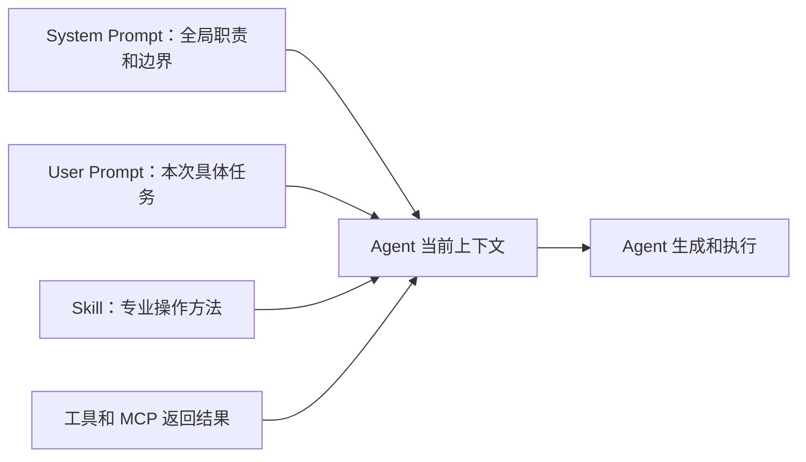

# 第33天：Agent Skills 概念、背景、规范与设计原则

> [!abstract] 本章定位
> 第33天进入 Hugging Face Context Course 的 Unit 1。今天重点理解 Skills 是什么、为什么出现、它和 Prompt 有什么区别，以及一份高质量 Skill 应该遵守哪些规范和设计原则。

## 0. 学习资料

- 在线教材：[Unit 1: Agent Skills](https://huggingface.co/learn/context-course/unit1/introduction)
- GitHub 原文：[introduction.mdx](https://github.com/huggingface/context-course/blob/main/units/en/unit1/introduction.mdx)
- 深入阅读：[What Are Agent Skills?](https://huggingface.co/learn/context-course/unit1/what-are-skills)
- 格式说明：[The SKILL.md Format](https://huggingface.co/learn/context-course/unit1/skill-format)
- 官方开放规范：[Agent Skills Specification](https://agentskills.io/specification)
- 官方编写建议：[Best practices for skill creators](https://agentskills.io/skill-creation/best-practices)

---

## 1. 本章一句话总结

```text
Skill 是一个可发现、可按需加载、可复用、可版本管理的专业任务包，
它把完成某类任务所需的方法、规则、参考资料、脚本和验收方式交给 Agent。
```

Skill 解决的核心问题不是“让模型突然变聪明”，而是：

```text
让 Agent 在遇到特定任务时，
知道应该加载哪套专业经验，并按照稳定的方法完成工作。
```

---

## 2. 问题一：Skill 是不是 Agent 的岗位职责说明书？

### 2.1 简短答案

**可以这样入门理解，但不够准确。**

Skill 更像是：

```text
岗位培训手册 + 标准作业流程 SOP + 参考资料 + 辅助脚本 + 验收清单
```

岗位职责说明书通常只回答：

- 你是谁；
- 你负责什么；
- 你不能做什么；
- 你向谁汇报。

一份 Skill 还要回答：

- 什么时候需要使用这套能力；
- 完成任务应该按什么步骤；
- 应该优先使用什么工具；
- 哪些资料需要按需读取；
- 常见错误是什么；
- 输出必须符合什么格式；
- 如何检查任务是否真的完成。

### 2.2 哪个概念更像岗位职责说明书？

系统提示词或 Agent 定义通常更像岗位职责说明书：

```text
你是一名内容审核 Agent。
你的职责是检查事实、风格和合规风险。
你不能直接发布内容。
```

Skill 更像具体工作的操作手册：

```text
当任务涉及音频文稿审核时：
1. 读取平台规则；
2. 检查事实来源；
3. 估算口播时长；
4. 运行文稿检查脚本；
5. 按指定格式输出问题和修改建议。
```

### 2.3 公司员工类比

| Agent 概念 | 公司中的对应物 |
|---|---|
| System Prompt | 岗位职责、公司制度和行为边界 |
| User Prompt | 今天收到的具体工作任务 |
| Skill | 专项培训手册和 SOP |
| Tool | 真正执行工作的软件和设备 |
| MCP | 连接软件、设备和业务系统的统一接口 |
| Workflow | 公司规定的完整业务流程 |
| Hook | 门禁、监控、审计和自动质检 |

### 2.4 一个 Agent 可以拥有多个 Skills 吗？

可以。

例如“内容生产 Agent”可能拥有：

- `hot-topic-research`：热点搜集；
- `audio-script-writing`：音频文稿创作；
- `fact-checking`：事实核验；
- `title-optimization`：标题优化；
- `content-compliance-review`：内容合规审核。

Agent 接到任务后，不需要一次性读取所有 Skill，而是根据任务加载相关部分。

---

## 3. Skill 到底是什么？

### 3.1 官方概念的大白话版本

Skill 是一个文件夹，最少包含一个 `SKILL.md` 文件。

`SKILL.md` 中通常有：

1. 元数据：它叫什么、做什么、什么时候使用；
2. 操作说明：完成任务的步骤、规则和验收方法。

它还可以带上：

- 可以直接执行的脚本；
- 需要按需读取的参考资料；
- 输出模板、配置模板、图片或数据文件。

### 3.2 最小目录结构

```text
my-skill/
└── SKILL.md
```

### 3.3 完整常见结构

```text
my-skill/
├── SKILL.md              # 必需：元数据和核心操作说明
├── scripts/              # 可选：可执行脚本
├── references/           # 可选：参考资料和领域文档
└── assets/               # 可选：模板、图片、配置和静态数据
```

### 3.4 Skill 的四个关键特征

#### 可发现 Discoverable

Agent 可以先读取 Skill 的名称和描述，判断它是否适合当前任务。

#### 可按需加载 On-demand

只有任务匹配时，Agent 才加载完整 `SKILL.md`，需要详细资料时再读取 references 或运行 scripts。

#### 可复用 Reusable

同一个 Skill 可以在多个任务、项目或兼容的 Agent 中使用。

#### 可组合 Composable

复杂任务可以组合多个职责清晰的 Skills，而不需要维护一个无限膨胀的大 Prompt。

---

## 4. 问题二：Skills 和 Prompt 有什么区别？

### 4.1 Prompt 是什么？

Prompt 是当前发送给模型的指令或输入。

例如：

```text
请为刚开始学习 Agent 的读者写一篇 1200 字文章，
使用中文，包含三个小标题，不要编造数据。
```

它解决的是：**这一次具体要模型做什么。**

### 4.2 Skill 是什么？

Skill 是针对一类任务沉淀下来的可复用知识和工作方法。

例如，`audio-script-writing` Skill 可以长期规定：

- 如何确认受众、平台和时长；
- 如何将书面语言改成口语；
- 如何设计开头钩子；
- 如何估算口播时长；
- 哪些表达容易产生合规风险；
- 应该运行哪个检查脚本；
- 交付结果应采用什么结构。

它解决的是：**遇到这类任务时，应该遵循什么专业方法。**

### 4.3 核心区别表

| 对比项 | Prompt | Skill |
|---|---|---|
| 主要作用 | 描述当前任务 | 提供某类任务的专业方法 |
| 生命周期 | 通常服务当前对话或请求 | 长期保存和复用 |
| 发现方式 | 用户或系统主动发送 | Agent 可根据元数据自动发现 |
| 加载方式 | 通常直接进入上下文 | 匹配任务后按需加载 |
| 结构 | 自由文本为主 | 标准目录、YAML 元数据和 Markdown |
| 附加资源 | 通常没有统一结构 | 可带 scripts、references、assets |
| 版本管理 | 经常散落在聊天或代码里 | 作为文件进入 Git 版本管理 |
| 团队共享 | 容易复制出多个不同版本 | 可以集中维护和分发 |
| 组合能力 | 长 Prompt 容易冲突和膨胀 | 多个职责清晰的 Skills 可以组合 |
| 测试方式 | 多关注最终回答 | 可测试触发、流程、脚本和输出质量 |

### 4.4 Skill 里面还有 Prompt 吗？

有。Skill 的 Markdown 正文本质上仍包含给 Agent 阅读的自然语言指令。

区别不在于 Skill “没有 Prompt”，而在于 Skill 把这些指令进行了工程化包装：

```text
Prompt 内容
+ 规范元数据
+ 自动发现机制
+ 按需加载机制
+ 目录和资源
+ 脚本和模板
+ 版本管理
+ 测试与评估
= Skill
```

### 4.5 它们不是互相替代

一次真实任务中，它们通常共同工作：



正确的关系是：

```text
Prompt 告诉 Agent 这次要做什么；
Skill 告诉 Agent 这类工作怎样做得专业、稳定和完整。
```

---

## 5. 问题三：Skills 产生的背景是什么？

### 5.1 背景一：模型懂通用知识，但不懂你的业务

大模型可能知道什么是数据库、API、内容写作和模型训练，但它不知道：

- 你们公司的表结构；
- 项目真正使用哪个库；
- 团队约定的代码风格；
- 某个平台最新的发布要求；
- 过去发生过哪些故障；
- 哪些步骤必须人工确认。

这会导致 Agent 看起来很聪明，却在具体业务细节上不断猜测。

### 5.2 背景二：任务越长，缺失上下文造成的错误越多

简单问答缺少一条信息，可能只错一个地方。

多步骤任务缺少上下文时，错误会逐步放大：

```text
认证方式猜错
→ 工具调用失败
→ 改用错误的替代方案
→ 输出格式不符合要求
→ 虽然任务“完成”，但缺少必要文档
```

因此复杂 Agent 需要稳定的领域知识和标准流程。

### 5.3 背景三：超长 Prompt 不能解决所有问题

最初的常见做法，是把所有规则写进一个很长的 Prompt。

问题包括：

- 每次对话都要重复粘贴；
- 团队成员各自维护副本；
- 修改规则时需要到处更新；
- Agent 无法自动发现它；
- 多个领域规则混在一起容易冲突；
- 全部放进上下文会浪费 Token；
- 不能方便地携带脚本、模板和参考资料；
- 缺少统一的版本和验证方式。

### 5.4 背景四：Agent 需要按需加载知识

一个成熟 Agent 可能安装几十个甚至更多 Skills。

如果每次任务都加载所有 Skill：

- 上下文会迅速膨胀；
- 重要信息会被无关说明淹没；
- 成本和延迟增加；
- 不相关 Skill 可能干扰决策。

Skills 通过渐进式披露解决这个问题。

### 5.5 背景五：团队知识需要成为工程资产

许多真正有价值的经验散落在：

- 老员工脑中；
- 聊天记录中；
- Wiki 中；
- 故障复盘中；
- 代码评审意见中；
- 临时脚本中。

Skill 可以把这些知识整理成：

```text
可读 + 可执行 + 可测试 + 可共享 + 可迭代 + 可版本管理
```

### 5.6 标准化的出现

为了让 Skill 不只绑定某一个 Agent 产品，生态需要统一格式：

- 目录应该怎样组织；
- 哪个文件是入口；
- 名称和描述怎样填写；
- Agent 如何发现和加载；
- 脚本、参考资料和模板放在哪里。

Agent Skills Specification 就是为这类兼容和工具生态提供开放规范。

---

## 6. Agent 如何发现和加载 Skill？

这套机制叫做 **Progressive Disclosure，渐进式披露**。

### 6.1 第一阶段：Discovery

Agent 启动时只读取每个 Skill 的少量元数据：

```text
name + description
```

这相当于只看书名和简介，不把所有书全文背下来。

### 6.2 第二阶段：Activation

当用户任务与 description 匹配时，Agent 才把完整 `SKILL.md` 加入当前上下文。

### 6.3 第三阶段：Execution

Agent 按照 `SKILL.md` 工作，并在确有需要时：

- 读取 `references/` 中的详细资料；
- 运行 `scripts/` 中的脚本；
- 使用 `assets/` 中的模板或数据。


### 6.4 为什么 description 特别重要？

因为 Agent 在决定是否加载 Skill 时，首先看到的主要就是 name 和 description。

description 太模糊：

```yaml
description: Helps with audio.
```

Agent 不知道它适用于音频剪辑、TTS、文稿创作还是发布。

description 太宽泛，又会让 Skill 在不相关任务中误触发。

较好的写法：

```yaml
description: >-
  Create and revise spoken-word scripts for podcasts and audio platforms.
  Use when a user needs an audio script, narration draft, spoken-language
  rewrite, duration adjustment, opening hook, or pre-TTS script validation.
```

它同时说明：

- 做什么；
- 什么时候使用；
- 用户可能用哪些方式表达需求。

---

## 7. 问题四：Skills 的规范有哪些？

> [!important] 规范与建议要区分
> “规范”是格式是否合法的硬要求；“建议”是为了让 Skill 更有效的设计方法。一个格式合法的 Skill，不一定是一个好用的 Skill。

### 7.1 目录规范

```text
skill-name/
├── SKILL.md              # 必需
├── scripts/              # 可选
├── references/           # 可选
└── assets/               # 可选
```

核心要求：

- Skill 至少是一个包含 `SKILL.md` 的目录；
- `SKILL.md` 必须位于 Skill 根目录；
- 相对路径从 Skill 根目录计算；
- `scripts/`、`references/`、`assets/` 是可选目录。

### 7.2 `SKILL.md` 结构规范

`SKILL.md` 由两部分组成：

```text
YAML frontmatter
+
Markdown 正文
```

最小示例：

```markdown
---
name: audio-script-writing
description: Create spoken-word scripts. Use for podcast or audio narration writing.
---

# Audio Script Writing

## Workflow

1. Confirm the target audience and duration.
2. Collect reliable source material.
3. Draft the script in spoken language.
4. Validate structure, facts, and estimated duration.
```

### 7.3 必填字段

#### `name`

当前官方规范要求：

- 长度为 1–64 个字符；
- 只能使用小写英文字母、数字和连字符；
- 不能以连字符开头或结尾；
- 不能包含连续连字符 `--`；
- 必须和父目录名称完全一致。

正确示例：

```yaml
name: audio-script-writing
```

错误示例：

```yaml
name: Audio-Script       # 包含大写字母
name: -audio-script      # 以连字符开头
name: audio--script      # 连续连字符
```

#### `description`

规范要求：

- 必须非空；
- 最多 1024 个字符；
- 说明 Skill 做什么；
- 说明什么时候应该使用；
- 最好包含用户意图和领域关键词，帮助 Agent 判断是否触发。

### 7.4 可选字段

| 字段 | 作用 | 注意事项 |
|---|---|---|
| `license` | 说明许可证或引用许可证文件 | 对分发和商业使用很重要 |
| `compatibility` | 声明环境、系统依赖、网络要求 | 最多 500 字符；没有特殊要求时可省略 |
| `metadata` | 保存作者、版本等自定义信息 | 键值应保持简单和稳定 |
| `allowed-tools` | 声明预批准工具 | 实验性字段，不是所有 Agent 都支持 |

示例：

```yaml
---
name: audio-script-writing
description: >-
  Create and revise spoken-word scripts for podcasts and audio platforms.
  Use for narration drafts, spoken-language rewrites, duration adjustment,
  opening hooks, and pre-TTS script validation.
license: MIT
compatibility: Requires Python 3.11+ to run optional validation scripts.
metadata:
  author: yuyuan
  version: "0.1.0"
---
```

### 7.5 Markdown 正文规范

官方规范没有强制正文必须采用固定章节，但建议包括：

- 分步骤操作说明；
- 输入和输出示例；
- 常见边界情况；
- 何时读取某个参考文件；
- 何时运行某个脚本；
- 如何验证最终结果。

### 7.6 `scripts/` 规范

脚本应该：

- 能独立运行，或者清楚说明依赖；
- 对输入做校验；
- 给出有帮助的错误信息；
- 正确处理常见边界情况；
- 避免输出密钥和敏感数据；
- 尽量确定性地完成重复逻辑。

适合放入 scripts 的内容：

- 文稿长度和时长检查；
- 数据格式验证；
- 报告生成；
- 固定格式转换；
- 经常被 Agent 重复实现的逻辑。

### 7.7 `references/` 规范

适合保存：

- API 文档；
- 平台规则；
- 数据结构；
- 领域知识；
- 故障排查指南；
- 详细示例。

参考文件应该职责单一、长度适中，并在 `SKILL.md` 中明确说明何时读取。

较好的指令：

```text
当 TTS API 返回非 2xx 状态码时，读取 references/tts-errors.md。
```

不够好的指令：

```text
需要时查看 references 目录。
```

### 7.8 `assets/` 规范

适合保存：

- Markdown 或 HTML 模板；
- 配置模板；
- JSON Schema；
- 图片和示例资源；
- 查询表和静态数据。

### 7.9 渐进式披露规范

官方规范当前建议：

1. 启动阶段只加载 `name` 和 `description`；
2. Skill 被激活时加载完整 `SKILL.md`；
3. 其他资源只在需要时读取；
4. `SKILL.md` 尽量控制在 500 行以内；
5. 正文建议不超过约 5000 tokens；
6. 详细资料拆到 references；
7. 文件引用尽量只深入一层，避免引用套引用。

### 7.10 格式验证

官方规范提供参考验证方式：

```bash
skills-ref validate ./my-skill
```

它可以检查 frontmatter 和命名规则，但不能证明 Skill 的业务质量足够好。

---

## 8. 问题五：Skills 为什么如此重要？

### 8.1 减少 Agent 猜测

没有 Skill 时，Agent 容易根据通用知识猜测你的环境和业务规则。

Skill 可以明确：

- 使用什么库；
- 遵守什么流程；
- 哪些值不能猜；
- 哪些操作需要确认；
- 哪些错误需要怎样恢复。

### 8.2 提高任务的一致性

同类任务不再每次临时发挥，而是遵守相同流程和验收标准。

### 8.3 节省上下文和成本

通过渐进式披露，不相关 Skill 不加载，详细资料只在需要时读取。

### 8.4 沉淀团队经验

把老员工经验、故障案例和评审标准写成 Skill 后，Agent 和新成员都能复用。

### 8.5 便于维护和版本管理

Skill 作为文件进入 Git：

- 可以查看修改历史；
- 可以代码评审；
- 可以回滚错误版本；
- 可以给不同项目使用稳定版本。

### 8.6 支持跨项目和跨 Agent 复用

遵循开放规范的 Skill 不再只是某个聊天窗口中的一次性 Prompt。

需要注意：可移植不代表所有平台行为完全相同。不同 Agent 对目录位置、工具授权和实验字段的支持仍可能有差异，需要实际测试。

### 8.7 让业务经验成为可以交付的资产

对于希望通过 Agent 变现的人，Skill 的价值非常直接：

```text
普通 Prompt = 一次性的个人使用技巧
成熟 Skill = 可维护、可测试、可安装、可复用的业务能力模块
```

例如音频内容 Skill 可以逐步积累：

- 平台规则；
- 高播放文稿结构；
- 标题和开头模式；
- 事实审核流程；
- TTS 前检查；
- 用户反馈和失败案例。

这些内容比单纯调用某个模型更接近真正的业务竞争力。

### 8.8 Skills 不是万能的

Skill 不能替代：

- 实时 API 和数据库查询；
- 需要确定执行结果的工具；
- 工作流状态和持久化；
- 权限控制；
- 测试和可观测性；
- 人工审批。

应该这样配合：

```text
Skill 教 Agent 如何做；
MCP/Tool 给 Agent 执行能力；
LangGraph 管理状态和流程；
Hooks 负责确定性的观察与约束；
Evaluation 判断它做得好不好。
```

---

## 9. 问题六：如何写出一份好的 Skill？

### 9.1 原则一：从真实专业经验出发

不要只对模型说：

```text
帮我生成一个专业的音频文稿 Skill。
```

这样容易得到“注意质量”“遵循最佳实践”之类空泛内容。

更好的素材包括：

- 实际完成过的任务；
- 真实修改意见；
- 平台官方规则；
- API 规范和数据结构；
- 失败案例及解决方法；
- 用户喜欢和不喜欢的结果；
- 过去的代码评审和故障复盘。

### 9.2 原则二：一个 Skill 解决一个完整且连贯的问题

Skill 的范围应类似设计一个职责清晰的函数。

太窄：

```text
write-title-word-one
write-title-word-two
```

Agent 完成一次任务需要加载过多碎片 Skill。

太宽：

```text
all-content-business
```

它同时负责选题、写作、TTS、发布、账号运营和数据分析，难以准确触发，也容易产生冲突。

较合理：

```text
audio-script-writing
```

它负责从需求和资料生成、修改并验证音频口播文稿。

### 9.3 原则三：把 description 当作路由规则

description 决定 Skill 是否能够在正确时间被发现。

应说明：

- 用户想完成什么；
- 哪些场景应该使用；
- 用户可能不会直接说出哪些专业词；
- 与相邻 Skill 的边界是什么。

不要只描述内部实现：

```yaml
description: Uses Python scripts and Markdown references.
```

用户不会说“请用 Markdown references”，Agent 也无法据此判断用户意图。

### 9.4 原则四：写操作步骤，不写空洞口号

不够好：

```text
确保内容高质量。
注意处理错误。
遵循写作最佳实践。
```

更好：

```text
1. 确认平台、受众和目标时长；
2. 如果缺少任一项，先向用户询问；
3. 仅使用带来源的事实进入文稿；
4. 生成后运行 scripts/validate_script.py；
5. 如果预计时长超出目标 10%，压缩后重新验证。
```

### 9.5 原则五：只写 Agent 不知道或容易做错的内容

上下文空间有限，不需要解释常识。

高价值内容包括：

- 项目特有约定；
- 领域流程；
- 非直觉边界情况；
- 必须使用的 API 或库；
- 过去经常出现的错误；
- 不允许违反的业务规则。

判断方法：

```text
如果删掉这条指令，Agent 是否更容易犯错？
```

如果答案是否定的，就考虑删除。

### 9.6 原则六：给默认方案，而不是扔出一堆选项

不够好：

```text
你可以使用 A、B、C、D 任意工具。
```

更好：

```text
默认使用 A。只有输入是扫描件且 A 无法提取文本时，才切换到 B。
```

默认方案可以减少 Agent 来回试错和不必要决策。

### 9.7 原则七：根据任务风险调整控制强度

创造性任务可以保留一定自由：

```text
在保持事实准确的前提下，根据受众调整叙事方式。
```

高风险或脆弱操作必须更严格：

```text
发布前必须生成预览并等待人工确认。
没有明确批准，不得调用发布工具。
```

### 9.8 原则八：使用渐进式披露

`SKILL.md` 只保留每次执行都需要的核心方法。

详细资料拆分：

```text
SKILL.md                         # 核心流程
references/ximalaya-rules.md    # 平台详细规则
references/tts-errors.md        # TTS 错误处理
assets/script-template.md       # 长文稿模板
scripts/validate_script.py      # 确定性检查
```

同时写清楚每个文件的加载条件。

### 9.9 原则九：提供具体模板、清单和 Gotchas

模板比“请按专业格式输出”更稳定。

检查清单可以防止跳过步骤。

Gotchas 用于记录不符合常识但业务中真实存在的问题：

```text
## Gotchas

- 平台简介不等于文稿摘要，两者字数限制不同；
- TTS 接口成功返回 task_id 不代表音频已生成完成；
- 发布接口超时后必须先查询任务状态，不能直接重复发布；
- 预计口播时长需要按实际主播语速计算，不能只看字数。
```

### 9.10 原则十：建立验证循环

一份成熟 Skill 不应该只说“生成结果”，还应该说明怎样检查和修复。

```text
执行任务
→ 运行验证器
→ 阅读错误信息
→ 修复问题
→ 再次验证
→ 通过后才交付
```

### 9.11 原则十一：用测试证明它有用

至少测试两类问题：

#### 应该触发

```text
帮我写一篇五分钟的喜马拉雅口播稿。
把这篇文章改成更自然的播客文稿。
这份文稿生成音频后太长，请压缩到八分钟。
```

#### 不应该触发

```text
帮我把 MP3 文件转换成 WAV。
修复这个 TTS 接口的 Python 请求代码。
统计本月音频节目的播放量。
```

负面测试不能全是毫不相关的问题，应该选择“看起来相近但职责不同”的请求，才能测出 Skill 边界是否准确。

建议准备约 20 条触发测试：

- 8–10 条应该触发；
- 8–10 条不应该触发；
- 包含正式、口语、简写、错别字和长上下文表达；
- 同一个问题运行多次，观察触发是否稳定。

### 9.12 原则十二：根据真实 Trace 迭代

不要只看最终回答，还要观察 Agent 的执行过程：

- 是否加载了不相关资料；
- 是否在多个工具之间来回尝试；
- 是否跳过关键检查；
- 是否重复编写同一种临时脚本；
- 是否误解了某条规则；
- 是否在不相关任务上触发。

每次出现稳定的错误模式，就调整：

- description；
- 核心步骤；
- Gotchas；
- 默认工具；
- 参考文件；
- 验证脚本。

---

## 10. 写 Skill 的十二步方法

### 第一步：选择真实、重复出现的任务

不要从“我想写一个 Skill”出发，要从“Agent 在哪个重复任务上经常出错或需要我反复指导”出发。

### 第二步：明确输入和输出

写清楚：

- 用户会提供什么；
- 哪些输入必须询问；
- 最终交付什么；
- 输出格式是什么。

### 第三步：收集真实专业材料

包括规范、样例、故障记录、修改意见和成功案例。

### 第四步：划定边界

写清楚 Skill 负责什么、不负责什么，以及需要与哪些 Tool 或 Skill 协作。

### 第五步：命名目录和 `name`

使用简短、明确、符合规范的 kebab-case 名称，并确保目录名与 `name` 完全一致。

### 第六步：编写 description

同时描述“做什么”和“什么时候使用”，围绕用户意图而不是内部技术实现。

### 第七步：编写核心流程

使用编号步骤，明确前置条件、判断点、默认方案和停止条件。

### 第八步：添加边界情况和 Gotchas

重点写 Agent 靠常识容易猜错的地方。

### 第九步：拆分资源

- 可重复、确定性逻辑放 `scripts/`；
- 详细知识放 `references/`；
- 模板和静态资源放 `assets/`。

### 第十步：加入验证循环

规定完成后如何检测、失败后如何修改、什么条件下才算通过。

### 第十一步：测试触发与输出

既测试 Skill 是否正确触发，也测试触发后结果是否真的更好。

### 第十二步：基于执行记录迭代

删除无效内容，补充真实错误，升级版本并记录变更。

---

## 11. 音频文稿 Skill 设计示例

> [!note] 说明
> 下面是用于理解结构的简化设计。后续实践课会在 `context-course/unit1-agent-skills/` 中创建真实可调用的 Skill、检查脚本和测试集。

### 11.1 目录

```text
audio-script-writing/
├── SKILL.md
├── scripts/
│   └── validate_script.py
├── references/
│   ├── writing-style.md
│   ├── platform-rules.md
│   └── fact-checking.md
└── assets/
    └── script-template.md
```

### 11.2 `SKILL.md` 骨架

```markdown
---
name: audio-script-writing
description: >-
  Create and revise spoken-word scripts for podcasts and audio platforms.
  Use for narration drafts, spoken-language rewrites, duration adjustment,
  opening hooks, and pre-TTS script validation.
license: MIT
compatibility: Requires Python 3.11+ for optional validation scripts.
metadata:
  author: yuyuan
  version: "0.1.0"
---

# Audio Script Writing

## Scope

Use this skill to create or revise scripts intended to be spoken aloud.
Do not use it for audio file conversion, TTS API debugging, or analytics.

## Required Inputs

- Topic
- Target audience
- Platform
- Target duration
- Tone

Ask for missing required inputs before drafting.

## Workflow

1. Confirm the required inputs.
2. Collect reliable source material.
3. Read `references/platform-rules.md` for the selected platform.
4. Create an outline with one central message.
5. Draft using natural spoken language.
6. Run `python scripts/validate_script.py <draft-path>`.
7. Fix every validation error and run the validator again.
8. Deliver the script only after validation passes.

## Output

Use the structure in `assets/script-template.md`.

## Gotchas

- Do not treat a TTS task ID as proof that audio generation completed.
- Do not invent statistics or sources.
- Do not publish content without explicit human approval.
```

### 11.3 为什么这个示例比长 Prompt 好？

- 有明确名称和触发描述；
- 有职责边界；
- 有必需输入；
- 有按步骤执行的 SOP；
- 有参考资料加载条件；
- 有确定性验证脚本；
- 有输出模板；
- 有业务中容易踩坑的 Gotchas；
- 可以进入 Git，持续测试和升级。

---

## 12. 常见错误与反模式

### 12.1 description 太模糊

```yaml
description: Helps with content.
```

问题：几乎无法准确判断何时触发。

### 12.2 一个 Skill 包办所有事情

问题：职责过宽、误触发、上下文膨胀、规则冲突。

### 12.3 只有原则，没有步骤

```text
保证专业、准确、高质量。
```

问题：无法执行，也无法验收。

### 12.4 把整套文档复制进 `SKILL.md`

问题：浪费上下文，Agent 难以找到重点。

### 12.5 没有说明何时读取 references

问题：Agent 可能从不读取，或者每次全部读取。

### 12.6 提供太多平级选择

问题：Agent 花费大量步骤试错，应提供默认方案和明确切换条件。

### 12.7 没有验证

问题：格式正确不代表业务结果正确。

### 12.8 只测试应该触发的问题

问题：无法发现过度触发和 Skill 边界不清。

### 12.9 在 Skill 中保存密钥

问题：Skill 可能进入 Git 或被分享。密钥应通过环境变量、密钥管理或受控认证机制提供。

### 12.10 第一次写完就不再维护

问题：真正高质量的 Skill 来自真实执行、失败复盘和持续迭代。

---

## 13. 高质量 Skill 检查清单

### 13.1 规范检查

- [ ] Skill 目录中存在根级 `SKILL.md`；
- [ ] 目录名和 `name` 完全一致；
- [ ] `name` 符合小写字母、数字和连字符规则；
- [ ] `description` 同时说明做什么和何时使用；
- [ ] YAML frontmatter 可以正确解析；
- [ ] 所有文件引用使用相对路径；
- [ ] 实验字段没有被当成跨平台保证。

### 13.2 设计检查

- [ ] Skill 解决一个连贯、可复用的任务；
- [ ] 职责边界清楚；
- [ ] 核心流程是可执行步骤；
- [ ] 规定了必需输入和输出格式；
- [ ] 提供默认工具或默认方案；
- [ ] 高风险操作有明确审批或停止条件；
- [ ] 记录了真实 Gotchas；
- [ ] 详细资料被拆分并按需加载；
- [ ] 重复逻辑被写成经过测试的脚本；
- [ ] 有验证和修复循环。

### 13.3 评测检查

- [ ] 至少有 8–10 条应该触发的测试；
- [ ] 至少有 8–10 条不应该触发的近似测试；
- [ ] 测试包含不同表达、细节程度和任务复杂度；
- [ ] 同一测试运行多次观察稳定性；
- [ ] 比较安装 Skill 前后的输出质量；
- [ ] 阅读执行 Trace，而不只看最终答案；
- [ ] 根据失败案例更新 description、步骤或 Gotchas。

---

## 14. Day33 自测题

### 14.1 基础题

1. 为什么说 Skill 不只是岗位职责说明书？
2. System Prompt、User Prompt 和 Skill 分别负责什么？
3. Skill 相比长 Prompt 多了哪些工程能力？
4. 为什么复杂任务更需要 Skills？
5. 渐进式披露分为哪三个阶段？
6. 为什么 description 是最关键的字段之一？
7. `scripts/`、`references/`、`assets/` 分别放什么？
8. 为什么格式合法不代表 Skill 质量优秀？

### 14.2 场景题

假设你要创建一个“今日头条文章创作 Skill”：

1. 它应该负责哪些任务？
2. 哪些任务应该明确排除？
3. description 应该覆盖哪些用户意图？
4. 哪些内容放入 references？
5. 哪些确定性检查适合写入 scripts？
6. 请写三条应该触发和三条不应该触发的测试请求。

---

## 15. Day33 学习任务与验收标准

### 15.1 今日任务

- [x] 阅读 Unit 1 Introduction；
- [x] 理解 Skill 的核心概念；
- [x] 区分 Skill、岗位职责和 Prompt；
- [x] 了解 Skills 出现的背景；
- [x] 了解 Agent Skills Specification；
- [x] 掌握高质量 Skill 的主要设计原则；
- [x] 建立 `context-course/unit1-agent-skills/`；
- [ ] 不看笔记回答六个用户问题；
- [ ] 完成 Day33 自测题。

### 15.2 今日验收标准

Day33 完成时，应该能独立做到：

1. 用三分钟向小白解释什么是 Skill；
2. 说清 Skill 与 Prompt 的差异；
3. 写出一个合法的最小 `SKILL.md`；
4. 判断一段 description 是太宽、太窄还是合适；
5. 为一个业务 Skill 划定职责边界；
6. 设计至少三条正面和三条负面触发测试。

六项中至少完成五项，才算掌握 Day33。

---

## 16. 最终结论

### 16.1 对问题一的回答

Skill 可以类比岗位培训手册或 SOP，但不只是岗位职责说明书。它还包含触发时机、操作步骤、资料、脚本、边界情况和验收方法。

### 16.2 对问题二的回答

Prompt 描述当前任务，Skill 沉淀某类任务的长期专业方法。Skill 内部包含 Prompt 式指令，但增加了标准结构、自动发现、按需加载、资源、版本和评测能力。

### 16.3 对问题三的回答

Skills 出现是因为 Agent 缺少项目和领域上下文，长 Prompt 又难以复用、共享、维护、组合和按需加载。开放规范进一步解决跨 Agent 使用和工具生态问题。

### 16.4 对问题四的回答

Skill 至少是一个包含根级 `SKILL.md` 的目录。`SKILL.md` 必须包含 YAML frontmatter 和 Markdown 正文，`name` 与 `description` 必填，并可以使用 scripts、references 和 assets 扩展。

### 16.5 对问题五的回答

Skills 能减少猜测、提高一致性、节省上下文、沉淀团队经验、支持版本管理和跨项目复用，并让业务经验逐渐成为可测试、可交付的资产。

### 16.6 对问题六的回答

好 Skill 必须来源于真实经验，职责边界清楚，description 准确，步骤可执行，默认方案明确，资料按需加载，包含 Gotchas 和验证循环，并通过正反触发测试与真实 Trace 持续迭代。

一句话记住：

```text
好的 Skill 不是写得最多，而是在正确任务中被正确触发，
用尽可能少但足够准确的上下文，让 Agent 稳定完成工作并通过验证。
```

---

## 17. 下一步

下一节继续深入 Agent Skills：

1. 研究 Skills 的加载过程和渐进式披露；
2. 学习 `SKILL.md` 每个字段的写法；
3. 设计音频文稿 Skill 的职责边界和 description；
4. 准备正面与负面触发测试集；
5. 为后续编写真正可调用的 Skill 做准备。
