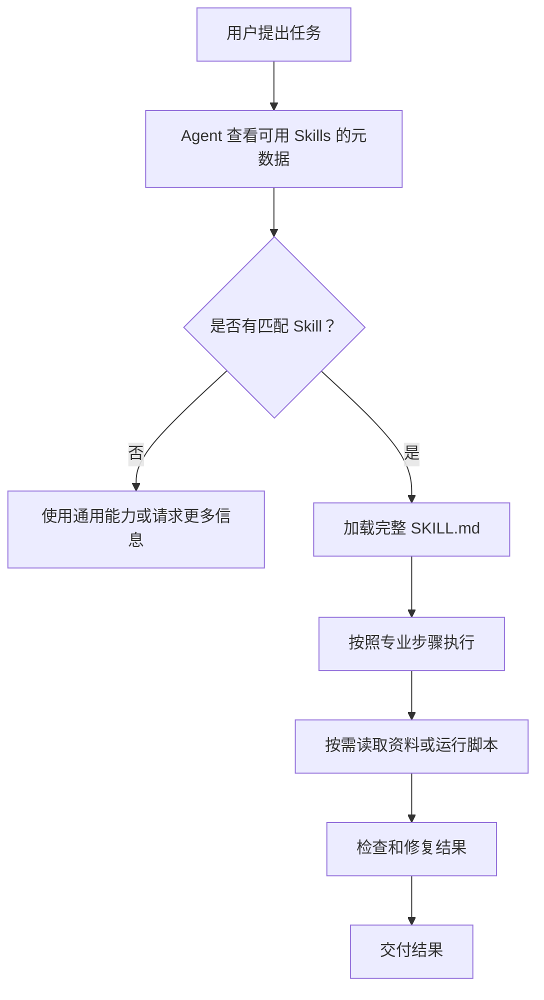
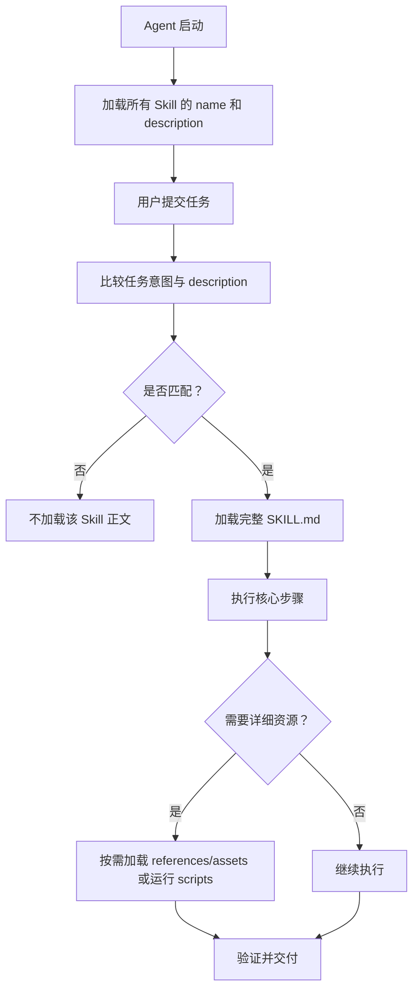

# 第34天：Agent Skills 解决方案、加载机制与真实案例

> [!abstract] 本章定位
> 第34天继续学习 Hugging Face Context Course Unit 1。第33天回答了“Skill 是什么、为什么重要”；今天进一步回答：Skill 能封装哪些能力、传统长 Prompt 为什么不适合规模化、Skill 方案怎样工作、Agent 如何按需加载 Skill，以及真实 Skill 项目如何组织专业知识。

## 0. 学习资料

- 在线教材：[What Are Agent Skills?](https://huggingface.co/learn/context-course/unit1/what-are-skills)
- GitHub 原文：[what-are-skills.mdx](https://github.com/huggingface/context-course/blob/main/units/en/unit1/what-are-skills.mdx)
- Agent Skills 概览：[Agent Skills Overview](https://agentskills.io/home)
- 官方真实案例：[huggingface/skills](https://github.com/huggingface/skills)
- 论文案例：[huggingface-papers](https://github.com/huggingface/skills/tree/main/skills/huggingface-papers)
- 模型训练案例：[huggingface-llm-trainer](https://github.com/huggingface/skills/tree/main/skills/huggingface-llm-trainer)
- Gradio 案例：[huggingface-gradio](https://github.com/huggingface/skills/tree/main/skills/huggingface-gradio)

---

## 1. 本章一句话总结

```text
传统 Prompt 是每次临时告诉 Agent 应该怎么做；
Skill 是把一类任务的专业知识和工作流程打包成可发现、可复用、可组合、可版本管理的能力模块。
```

Skill 真正有价值的地方，不只是把 Prompt 换成 Markdown 文件，而是形成完整工作机制：

```text
先发现相关 Skill
→ 匹配任务后加载操作说明
→ 按需读取参考资料或运行脚本
→ 按专业流程完成任务
→ 检查错误并验证结果
```

---

## 2. 教材从什么问题开始？

教材使用了一个比“发布数据集”更长的任务：

```text
在这个数据集上训练模型，完成后发布它。
```

这句话看上去很简单，实际上隐含很多决策：

1. 使用什么认证方式？
2. 数据集是什么格式？
3. 数据字段是否符合训练要求？
4. 选择什么模型和训练方法？
5. 使用什么超参数？
6. 使用本地 GPU 还是云端任务？
7. 训练过程如何监控？
8. 结果保存在哪里？
9. 发布时需要哪些元数据？
10. 是否需要 README、模型卡、许可证和示例代码？

模型可能知道“训练模型”这个通用概念，但未必知道当前项目和平台要求。

### 2.1 失败一：认证问题

Agent 知道上传需要认证，却不知道你的环境使用哪个变量、令牌放在哪里、需要什么权限。

可能出现：

```text
无法登录 Hugging Face Hub
```

### 2.2 失败二：配置和数据格式问题

Agent 可能假设输入是 CSV 或 Parquet，但实际数据是 `.npy`；也可能不知道训练方法要求哪些字段。

可能出现：

```text
数据集格式无法识别
```

### 2.3 失败三：任务看似完成，但交付不完整

模型可能上传成功，却遗漏：

- README；
- 模型卡；
- 训练数据说明；
- 性能指标；
- 许可证；
- 使用示例。

这类错误很危险，因为程序没有报错，但业务任务并没有真正完成。

### 2.4 错误为什么会累积？

多步骤任务中的每一步都依赖前一步：


如果认证、数据格式或配置在前面就错了，后续步骤会不断补救、绕路或者生成不完整结果。

因此，复杂 Agent 最需要的往往不是更多自由发挥，而是一套可靠的专业任务方案。

---

## 3. 问题一：Skills 的“技能”有哪些？

这个问题可以从两个角度理解。

### 3.1 角度一：一个 Skill 可以提供哪些能力？

#### 领域知识

让 Agent 了解某个行业、平台或项目中特有的事实与规则。

例如：

- Hugging Face 模型发布要求；
- 公司数据库字段约定；
- 喜马拉雅音频内容规范；
- 法律合同审核规则；
- 团队代码评审标准。

#### 分步骤工作流程

把复杂任务拆成稳定、可执行的步骤。

例如：

```text
检查认证
→ 验证数据
→ 选择配置
→ 执行训练
→ 监控结果
→ 生成模型卡
→ 发布并验证
```

#### 决策规则

告诉 Agent 在什么条件下选择什么方案。

例如：

```text
如果本地没有 GPU，则使用云端训练；
如果数据是扫描 PDF，则使用 OCR；
如果文稿超过目标时长 10%，则压缩后重新验证。
```

#### 工具使用方法

告诉 Agent 应该调用哪个工具、参数如何准备、返回结果如何理解。

需要注意：Skill 主要提供使用方法；真正执行动作的仍然是 Tool、MCP 或本地脚本。

#### 确定性辅助脚本

Skill 可以携带脚本，完成模型不适合凭语言推理重复处理的工作：

- 数据格式验证；
- 文稿长度检查；
- 成本估算；
- 配置生成；
- 文件转换；
- 报告生成。

#### 参考资料

Skill 可以附带按需加载的文档：

- API 说明；
- 数据 Schema；
- 平台规则；
- 故障排查；
- 示例代码；
- 领域术语。

#### 输出模板

Skill 可以规定交付结果的结构：

- 模型卡；
- 审核报告；
- 音频文稿；
- 数据分析报告；
- 发布清单。

#### 故障排查和恢复方案

Skill 可以记录常见失败原因和恢复顺序：

```text
遇到 401 → 检查认证和权限；
遇到 404 → 检查资源是否存在或使用备用来源；
遇到超时 → 先查询任务状态，禁止直接重复提交副作用操作。
```

#### 验证和验收

Skill 还能要求 Agent 在交付前：

- 执行检查脚本；
- 对照清单；
- 核实来源；
- 验证文件存在；
- 检查接口最终状态；
- 确认人工审批。

### 3.2 角度二：现实中可以有哪些 Skill 类型？

| Skill 类型 | 示例 |
|---|---|
| 调研类 | 论文检索、竞品分析、热点搜集 |
| 开发类 | Gradio UI、API 开发、代码评审 |
| 数据类 | 数据清洗、Schema 验证、报表生成 |
| 模型类 | 模型训练、评估、转换和发布 |
| 内容类 | 文稿创作、标题优化、事实审核 |
| 文档类 | PDF 处理、合同审核、知识提取 |
| 运维类 | 故障排查、部署检查、日志分析 |
| 业务类 | 客服处理、销售跟进、订单审核 |

### 3.3 Skill 不是什么？

Skill 本身不是：

- 一个新的基础模型；
- 对模型参数的微调；
- 必然独立运行的程序；
- 工具调用协议；
- 数据库；
- 完整工作流引擎。

它主要是一个**可移植的专业知识和流程包**。

---

## 4. 问题二：Skills 的解决方案是什么？

### 4.1 解决方案的核心

把领域知识从临时对话中抽出来，整理成 Agent 可以自动发现和按需加载的标准目录。

```text
skill-name/
├── SKILL.md              # 元数据 + 核心说明
├── scripts/              # 可执行辅助脚本
├── references/           # 详细参考资料
└── assets/               # 模板和静态资源
```

### 4.2 Skill 方案的四层结构

#### 第一层：文件结构

统一目录让 Agent 和工具知道入口在哪里、辅助资源放在哪里。

#### 第二层：元数据

`name` 和 `description` 帮助 Agent 判断 Skill 是什么、什么时候使用。

#### 第三层：发现和加载机制

Agent 不需要一开始加载全部内容，而是先看元数据，匹配任务后再读取正文和资源。

#### 第四层：兼容和工具生态

统一规范使不同 Agent 客户端可以实现相似的发现、验证、安装和加载能力。

### 4.3 从业务问题到执行的完整链路



### 4.4 数据集训练发布 Skill 会怎样工作？

当用户说“训练并发布模型”时：

1. Agent 从 description 判断训练发布 Skill 相关；
2. 加载认证、数据要求和完整流程；
3. 运行数据验证脚本；
4. 读取训练方法参考资料；
5. 使用规定的工具提交训练任务；
6. 监控任务状态；
7. 保存模型和指标；
8. 根据模板生成模型卡；
9. 发布后验证仓库内容完整。

### 4.5 Skill 方案的真正价值

Skill 不是只提供“正确答案”，而是提供一套可重复的方法：

```text
输入可能变化，
具体结果可能变化，
但处理原则、关键步骤和验收标准可以稳定复用。
```

---

## 5. 问题三：传统基于 Prompt 的 Context 有哪些问题？

### 5.1 传统方案是什么？

每次向 Agent 提交任务时，把专业规则全部写进一个很长的 Prompt：

```text
你是 Hugging Face 专家。
先检查认证，然后验证数据格式……
训练时使用……
发布时必须创建……
出现错误时……
```

这对一次简单实验可能有效，但随着任务和团队规模扩大，会出现系统性问题。

### 5.2 问题一：不能方便复用

同样的规则每次都要重新粘贴。

后果：

- 容易漏掉某一段；
- 每次版本不一致；
- 用户需要记住全部规则；
- 重复消耗时间和 Token。

### 5.3 问题二：难以分享

团队成员只能复制聊天记录或 Prompt 文档。

复制后很快出现多个版本：

```text
张三使用 v1
李四修改成 v2
王五仍然使用半年前的副本
```

### 5.4 问题三：难以维护

规则变化时，需要找到所有副本逐个修改。

如果平台认证方式或 API 已更新，旧 Prompt 仍可能继续被使用。

### 5.5 问题四：不可发现

Agent 不知道公司某个文件夹里有一份 Prompt，也不知道当前任务应该去哪里找。

知识虽然存在，但 Agent 找不到，等于没有进入可用上下文。

### 5.6 问题五：难以组合

复杂任务可能需要：

- 数据验证 Prompt；
- 模型训练 Prompt；
- 模型发布 Prompt；
- 文档生成 Prompt；
- 安全检查 Prompt。

把它们直接拼接可能产生：

- 重复规则；
- 冲突指令；
- 顺序混乱；
- 上下文过长；
- Agent 不知道当前步骤该遵守哪一段。

### 5.7 问题六：缺少版本管理

聊天中的 Prompt 通常没有明确版本、修改历史和回滚机制。

出现质量下降时，很难回答：

```text
是哪次修改导致的？
旧版本是什么？
哪些项目仍在使用旧版本？
```

### 5.8 进一步的问题：所有内容一次性加载

长 Prompt 通常会把所有细节直接放进当前上下文，即使大部分与本次任务无关。

结果包括：

- Token 成本增加；
- 模型注意力被分散；
- 无关规则可能误导当前任务；
- 对话历史留给真正任务的信息变少。

### 5.9 进一步的问题：不能自然携带工程资源

一个 Prompt 可以描述脚本，但不适合管理：

- 可测试的 Python 文件；
- 大型 API 参考资料；
- 输出模板；
- JSON Schema；
- 示例数据；
- 依赖和许可证。

### 5.10 什么时候普通 Prompt 仍然合适？

Skill 并不意味着以后不使用 Prompt。

普通 Prompt 适合：

- 一次性任务；
- 简单问题；
- 临时偏好；
- 当前任务的具体参数；
- 不值得长期维护的要求。

例如：

```text
这次文稿面向刚入门的读者，控制在 1000 字以内。
```

长期稳定的方法适合进入 Skill；本次特有要求仍由 Prompt 提供。

---

## 6. 问题四：基于 Skills 的方法是什么？

### 6.1 将知识从会话变成资产

Skill 把知识保存为标准文件，可以进入 Git：

- 集中维护；
- 审查修改；
- 查看历史；
- 标记版本；
- 回滚错误；
- 分发给项目和团队。

### 6.2 结构化而不是堆砌

Skill 通过清晰职责分层：

| 内容 | 放置位置 |
|---|---|
| 触发描述 | YAML `description` |
| 核心步骤 | `SKILL.md` 正文 |
| 确定性逻辑 | `scripts/` |
| 详细知识 | `references/` |
| 模板和静态资源 | `assets/` |

### 6.3 自动发现

兼容 Agent 可以根据任务和 description 判断 Skill 是否相关，而不要求用户每次手动粘贴整套说明。

### 6.4 按需加载

不相关 Skill 不进入完整上下文；相关 Skill 的详细资源也只在需要时读取。

### 6.5 可以组合

复杂业务可以由多个职责清晰的 Skill 协作：

```text
dataset-validation
+ model-training
+ model-publishing
```

或者在内容业务中：

```text
hot-topic-research
+ audio-script-writing
+ fact-checking
+ content-compliance-review
```

### 6.6 可以与 Tool、MCP 配合

例如模型训练 Skill 可以要求 Agent 使用指定 MCP Tool 提交云端训练任务。

```text
Skill = 规定正确方法
MCP Tool = 真正执行训练任务
```

### 6.7 基于 Skill 方法的优势

| 优势 | 说明 |
|---|---|
| 可复用 | 同一 Skill 可服务多个任务和项目 |
| 可共享 | 可以通过仓库、团队注册表或插件分发 |
| 可维护 | 规则集中在一个位置 |
| 可组合 | 不同领域能力可以协作 |
| 可发现 | Agent 可以根据任务自动匹配 |
| 可版本化 | 可以追踪、评审和回滚 |
| 节省上下文 | 详细内容按需加载 |
| 可执行 | 可以携带脚本和模板 |
| 可审计 | 流程、规则和修改记录可检查 |

### 6.8 这不是免费午餐

Skill 方法也有成本：

- 需要设计职责边界；
- description 需要测试；
- 参考资料需要维护；
- 脚本需要测试；
- Agent 平台支持程度可能不同；
- 多个 Skill 之间仍可能冲突；
- 规则过时会稳定地产生过时结果。

所以 Skill 需要像代码一样维护，而不是写完永远不动。

---

## 7. 问题五：Agent 如何加载 Skills？

Agent Skills 使用 **Progressive Disclosure，渐进式披露**。

### 7.1 第一阶段：Discovery，发现

Agent 启动或扫描 Skills 时，只读取每个 Skill 的：

```text
name + description
```

这一步成本很低，目的是建立“可用能力目录”。

类比：

```text
只看书名和简介，不阅读全文。
```

### 7.2 第二阶段：Activation，激活

收到任务后，Agent 比较用户意图与 description。

如果匹配，则把完整 `SKILL.md` 加入当前上下文。

例如：

```text
用户：帮我解释 arXiv 论文 2602.08025。
```

Agent 看到 `huggingface-papers` 的 description 涉及 arXiv ID、论文总结与分析，于是激活该 Skill。

### 7.3 第三阶段：Execution，执行

Agent 按 `SKILL.md` 的步骤工作，并根据条件：

- 读取 references；
- 运行 scripts；
- 使用 assets；
- 调用 MCP 或其他 Tool；
- 处理错误和备用方案。

### 7.4 加载流程图



### 7.5 三层上下文成本

按照当前官方规范的建议，可以理解为：

| 层级 | 加载时机 | 典型内容 |
|---|---|---|
| 元数据层 | Agent 启动或发现阶段 | name、description，约百级 Token |
| 指令层 | Skill 激活后 | 完整 `SKILL.md`，建议控制在 5000 Token 内 |
| 资源层 | 执行中确有需要时 | scripts、references、assets |

### 7.6 用户是否需要手动说“启用某 Skill”？

通常不需要。兼容 Agent 可以根据上下文自动发现并加载。

但现实中仍有几个条件：

- Skill 必须安装在 Agent 能扫描的位置；
- `SKILL.md` 格式必须合法；
- description 必须足够准确；
- 当前 Agent 客户端必须支持 Skills；
- 工具权限和依赖必须可用。

### 7.7 为什么会加载失败？

常见原因：

1. description 太模糊，Agent 没判断出相关性；
2. description 太窄，用户换一种说法就不匹配；
3. Skill 安装路径错误；
4. `name` 与目录不一致；
5. YAML 无法解析；
6. Agent 认为自己不需要额外专业知识；
7. 多个 Skill 的描述过于相似，发生竞争；
8. 所需工具、脚本或依赖不可用。

### 7.8 为什么需要测试触发？

Skill 只有两种触发错误：

```text
漏触发：该用时没用；
误触发：不该用时却加载了。
```

因此需要同时准备：

- 应该触发的问题；
- 不应该触发但表面相近的问题。

---

## 8. 问题六：真实 Skills 案例分析

教材列出了三个 Hugging Face 官方 Skills。它们分别代表三种不同的知识封装方式。

### 8.1 案例一：`huggingface-papers`

### 它解决什么问题？

处理 Hugging Face Paper 页面、arXiv URL 或论文 ID，并完成：

- 获取论文 Markdown；
- 查询结构化元数据；
- 查找作者、模型、数据集和 Space；
- 搜索论文；
- 总结、解释或分析论文；
- 在信息不足时使用备用来源。

### 它怎样触发？

description 明确覆盖：

- Hugging Face Paper URL；
- arXiv URL；
- arXiv ID；
- 用户要求总结、解释或分析 AI 论文。

这比“帮助阅读论文”准确得多。

### 它封装了哪些专业知识？

- 如何从多种 URL 解析论文 ID；
- Markdown 论文页面地址；
- 结构化 Papers API；
- 模型、数据集和 Space 的关联查询；
- 哪些接口需要认证；
- 404 时如何回退到 arXiv；
- 什么时候优先使用 Markdown，什么时候需要 JSON。

### 这个案例说明什么？

Skill 不一定必须包含脚本。`huggingface-papers` 主要通过一个内容完整的 `SKILL.md`，把分散的 API、参数、错误和回退方案变成可执行操作手册。

### 对我们项目的启发

可以设计 `hot-topic-research` Skill：

- 规定可靠来源；
- 解析不同热点链接；
- 区分正文、元数据和互动数据；
- 页面不可用时使用备用来源；
- 输出来源清单和可信度。

---

### 8.2 案例二：`huggingface-llm-trainer`

### 它解决什么问题？

在 Hugging Face 云端基础设施上训练或微调模型，涉及：

- SFT；
- DPO；
- GRPO；
- Reward Modeling；
- Unsloth；
- 数据验证；
- 硬件选择；
- 成本估算；
- 训练监控；
- 保存到 Hub；
- GGUF 转换和本地部署。

### 它的目录为什么更复杂？

它不仅有 `SKILL.md`，还包含：

- `references/`：不同训练方法和工具的详细知识；
- `scripts/`：成本估算、数据检查、训练示例等可执行代码；
- 许可证说明。

训练业务复杂、昂贵而且有副作用，不能只靠几段文字。

### 它如何连接 MCP？

Skill 中明确要求使用指定的 Hugging Face Jobs MCP Tool 提交训练任务。

这体现了：

```text
Skill 负责训练方法、选择规则和操作顺序；
MCP Tool 负责真正提交云端任务和查询状态。
```

### 它有哪些强约束？

- 必须使用规定的任务工具；
- 必须包含监控；
- 提交后返回任务 ID、监控地址和预计时间；
- 未知数据集必须先验证；
- 临时训练环境中的结果必须持久保存；
- 凭证必须通过安全方式传入。

### 这个案例说明什么？

当任务昂贵、步骤多、失败代价高时，Skill 应该更严格：

- 明确前置检查；
- 提供默认方案；
- 使用经过测试的脚本；
- 给出错误恢复方式；
- 强制结果持久化；
- 记录成本和任务状态。

### 对我们项目的启发

音频内容 Agent 的 TTS 与发布流程也有外部成本和副作用：

- TTS 前先验证文稿；
- 生成前估算字符成本；
- 保存 task ID；
- 超时后先查状态，不能直接重复调用；
- 发布前必须人工确认；
- 发布成功后保存平台返回 ID。

---

### 8.3 案例三：`huggingface-gradio`

### 它解决什么问题？

帮助 Agent 使用 Python 构建或修改 Gradio Web UI，包括：

- Interface；
- Blocks；
- 事件监听器；
- 布局；
- 聊天界面；
- 组件参数；
- 流式输入输出；
- 分享和部署。

### 它如何组织知识？

它使用：

- `SKILL.md`：核心 API、模式和组件签名；
- `examples.md`：更长的示例，避免所有案例挤进主文件；
- 外部官方指南链接：需要更详细内容时读取。

### description 有什么特点？

它直接围绕用户意图：

```text
构建或编辑 Gradio 应用、组件、事件、布局或聊天机器人。
```

没有把内部文件结构写进 description。

### 这个案例说明什么？

开发框架类 Skill 的价值不是解释“什么是网页”，而是提供：

- 当前正确 API；
- 组件参数；
- 推荐代码模式；
- 可直接修改的示例；
- 常见功能的实现路径。

它减少了 Agent 猜测库 API 和使用过时写法的概率。

### 对我们项目的启发

未来可以设计一个音频任务管理 UI Skill：

- 规定 FastAPI/Gradio 的项目模式；
- 提供任务状态组件；
- 提供音频播放器和文稿预览；
- 提供人工批准、退回按钮；
- 复用经过验证的界面示例。

---

### 8.4 三个案例对比

| 案例 | 核心任务 | 主要资源形态 | 关键价值 |
|---|---|---|---|
| huggingface-papers | 论文检索与分析 | 以 `SKILL.md` 为主 | API、解析规则、错误回退 |
| huggingface-llm-trainer | 模型训练与发布 | SKILL + references + scripts + MCP | 复杂流程、强约束、成本和持久化 |
| huggingface-gradio | 构建 Gradio UI | SKILL + examples + 外部文档 | 框架 API、代码模式和示例复用 |

共同点：

- description 清楚说明使用场景；
- 不是只描述角色，而是提供具体操作知识；
- 写入 Agent 靠通用知识容易猜错的细节；
- 根据任务复杂度选择不同资源结构；
- 让知识从一次对话变成长期维护的文件资产。

---

## 9. 将本节映射到音频内容 Agent

### 9.1 传统 Prompt 方案

每次都输入：

```text
你是一名音频内容专家，请先……
平台要求是……
标题必须……
文稿时长……
生成后检查……
TTS 调用……
```

问题：规则长、容易遗漏、无法集中更新、每个账号可能复制出不同版本。

### 9.2 Skill 方案

```text
skills/
├── hot-topic-research/
├── audio-script-writing/
├── fact-checking/
└── content-compliance-review/
```

用户只需要描述本次任务：

```text
根据今天的 AI 热点写一篇 6 分钟的喜马拉雅口播稿，面向 Agent 初学者。
```

系统负责：

1. 发现热点研究和音频文稿 Skills；
2. 加载对应操作说明；
3. 通过 MCP 查询实时热点；
4. 按文稿 Skill 生成内容；
5. 运行时长和结构检查；
6. 进行事实和合规审核；
7. 等待人工确认；
8. 再调用 TTS。

### 9.3 这说明了什么？

Skill 不是替用户做所有决定。

用户仍然提供本次任务特有信息：

- 今天的主题；
- 目标受众；
- 目标时长；
- 特殊风格。

Skill 提供长期稳定的方法：

- 如何研究；
- 如何写口播稿；
- 如何检查；
- 如何避免常见错误。

---

## 10. 六个问题的直接回答

### 10.1 Skills 的技能有哪些？

Skill 可以封装领域知识、分步骤流程、决策规则、工具使用方法、辅助脚本、参考资料、输出模板、故障排查和验收流程。现实中可以构建调研、开发、数据、模型、内容、文档、运维和业务类 Skills。

### 10.2 Skills 的方案是什么？

把领域知识整理成带 `SKILL.md` 的标准目录，通过元数据让 Agent 发现，通过渐进式披露按需加载，再结合 scripts、references、assets 和外部工具完成并验证任务。

### 10.3 传统 Prompt 方案有什么问题？

难复用、难共享、难维护、不可自动发现、难组合、缺少版本管理；此外还会一次性占用大量上下文，难以携带脚本、模板和大型参考资料。

### 10.4 基于 Skills 的方法是什么？

把一次性的长 Prompt 变成结构化、可发现、可复用、可组合、可版本化和可执行的专业能力包。用户 Prompt 只描述本次任务，Skill 提供长期稳定的方法。

### 10.5 Skills 如何加载？

通过三个阶段：启动时只发现 name 和 description；任务匹配时激活并加载完整 `SKILL.md`；执行过程中按需读取 references/assets、运行 scripts 或调用工具。

### 10.6 真实案例告诉了我们什么？

论文 Skill 展示 API 与回退规则的封装；训练 Skill 展示复杂流程、脚本、MCP 和强约束；Gradio Skill 展示框架 API、代码模式与示例的复用。Skill 的结构应由任务复杂度决定，不是所有 Skill 都需要相同数量的文件。

---

## 11. 常见误解

### 11.1 “装了 Skill，模型参数就升级了”

错误。Skill 主要在运行时提供上下文，没有修改基础模型权重。

### 11.2 “Skill 就是一段保存在文件中的 Prompt”

不完整。Skill 确实包含提示式指令，但还具有元数据、发现、加载、目录资源、脚本、版本和评测机制。

### 11.3 “Agent 会永远自动正确加载 Skill”

错误。路径、格式、description、客户端支持和任务表达都会影响加载，需要测试。

### 11.4 “所有规则都应该做成 Skill”

错误。全局安全规则更适合系统指令或 Hooks；实时数据应由 MCP/Tool 获取；一次性要求保留在用户 Prompt；状态由工作流管理。

### 11.5 “Skill 越大越专业”

错误。过大的 Skill 会浪费上下文并增加冲突。应保持职责连贯，通过按需资源拆分细节。

### 11.6 “有 Skill 就不需要工具”

错误。Skill 告诉 Agent 怎样使用能力，工具才真正读取数据库、提交任务、生成音频或发布内容。

---

## 12. Day34 自测题

### 12.1 基础题

1. 一个 Skill 可以封装哪九类内容？
2. 为什么多步骤任务中的上下文错误会累积？
3. 长 Prompt 方案的六个主要工程问题是什么？
4. Skill 方案由哪四层组成？
5. 渐进式披露分为哪三个阶段？
6. description 在加载过程中承担什么职责？
7. Skill 和 MCP Tool 如何分工？
8. 格式正确的 Skill 为什么仍可能没有价值？

### 12.2 案例题

1. `huggingface-papers` 为什么不一定需要 scripts 目录？
2. `huggingface-llm-trainer` 为什么需要更多强约束和脚本？
3. `huggingface-gradio` 为什么把长示例拆到独立文件？
4. 三个 Skill 的 description 分别覆盖什么用户意图？
5. 如果设计 `audio-script-writing`，哪些规则在 `SKILL.md`，哪些资料放 references，哪些检查放 scripts？

### 12.3 判断题

- [ ] 用户每次都必须手动输入 Skill 名称才能使用；
- [ ] Agent 启动时会把所有 Skill 的完整正文放入上下文；
- [ ] Skill 可以引用 MCP Tool，但不等于 MCP Tool；
- [ ] 一次性风格要求适合留在用户 Prompt；
- [ ] 只要 description 包含更多关键词，Skill 就一定更好；
- [ ] 不应该触发的近似请求也是重要测试数据。

参考答案：前两项错误；第三、第四和第六项正确；第五项错误。

---

## 13. Day34 学习任务与验收

### 13.1 今日任务

- [x] 阅读 `what-are-skills` 教材；
- [x] 理解教材中的训练发布失败链；
- [x] 总结传统 Prompt 方案的问题；
- [x] 理解基于 Skill 的解决方案；
- [x] 掌握渐进式披露的三个阶段；
- [x] 阅读三个 Hugging Face 官方 Skill 案例；
- [x] 将案例映射到音频内容 Agent；
- [ ] 不看笔记回答六个用户问题；
- [ ] 完成自测题。

### 13.2 今日验收标准

完成 Day34 后，应能够：

1. 用流程图解释 Skill 如何加载；
2. 列出传统 Prompt 方案至少六个问题；
3. 判断一个需求应留在 Prompt 还是沉淀为 Skill；
4. 说明 Skill、scripts、references、assets 和 MCP 的分工；
5. 从真实 Skill 中找出触发、流程、工具和错误处理设计；
6. 为音频内容 Agent 规划至少三个职责清晰的 Skills。

六项至少能独立完成五项，Day34 才算掌握。

---

## 14. 我的学习结论

### 14.1 Skills 的本质

```text
Skill 不是给模型增加永久记忆，
而是把专业知识变成 Agent 在需要时能发现和加载的外部能力包。
```

### 14.2 Skills 的加载哲学

```text
先知道“有哪些能力”，
再判断“当前需要哪一个”，
最后只加载“完成当前任务所需的细节”。
```

### 14.3 判断是否应该创建 Skill

一个任务满足以下条件时，值得考虑做成 Skill：

- 重复出现；
- 需要专业知识；
- Agent 容易在同一位置犯错；
- 有稳定的处理流程；
- 有可复用的脚本或模板；
- 可以定义明确的验收标准；
- 对团队或多个项目都有价值。

如果只是一次性要求，一条清晰 Prompt 往往更合适。

### 14.4 最终记忆

```text
Prompt：告诉 Agent 这次具体做什么。
Skill：告诉 Agent 这类工作长期应该怎样专业地做。
Tool：真正执行外部动作。
MCP：用标准协议连接 Tool 和数据。
```

---

## 15. 下一步

下一节将正式学习 `SKILL.md` 格式：

1. 目录和命名规范；
2. YAML frontmatter；
3. `name` 与 `description`；
4. scripts、references 和 assets；
5. 文件引用与渐进式披露；
6. 从空目录写出第一个符合规范的 Skill。
