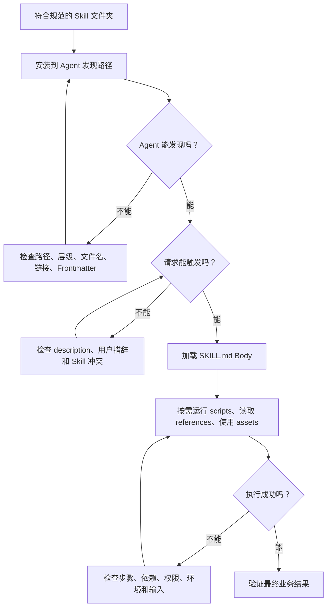

# 第36天：在代码 Agent 中安装、调用与排查 Skills

> [!abstract] 本章定位
> 第35天解决了“一个 Skill 文件夹内部应该怎样组织”；第36天继续解决“写好的 Skill 怎样被 Claude Code、Codex、OpenCode、Pi 等代码 Agent 找到、安装、触发和排错”。本节真正要理解的不是几个目录名，而是 Skill 从磁盘文件变成 Agent 可用能力的完整链路。

## 0. 学习资料

- 在线教材：[Using Skills with Code Agents](https://huggingface.co/learn/context-course/unit1/using-skills)
- GitHub 原文：[using-skills.mdx](https://github.com/huggingface/context-course/blob/main/units/en/unit1/using-skills.mdx)
- 上一节：[The SKILL.md Format](https://huggingface.co/learn/context-course/unit1/skill-format)
- Agent Skills 开放规范：[Agent Skills Specification](https://agentskills.io/specification)
- 课程示例 Skill：[Hugging Face Skills](https://github.com/huggingface/skills)

> [!note] GitHub 地址说明
> 本节对应的课程源文件是 `units/en/unit1/using-skills.mdx`。本文中的产品目录和命令以课程当前内容为主；代码 Agent 的安装方式可能继续更新，实际操作时还应核对所用产品的最新说明。

---

## 1. 本章一句话总结

```text
Agent Skills 规范统一了“Skill 长什么样”，
不同代码 Agent 决定了“去哪里找、怎样安装、怎样显式调用”。
```

一个 Skill 真正被用起来，需要依次通过五个环节：

```text
Skill 文件存在
→ 位于 Agent 会扫描的目录
→ Agent 发现 name 和 description
→ 用户请求触发匹配或显式点名
→ Agent 加载正文并按需使用脚本、参考资料和素材
```

如果 Skill 没生效，问题通常不在同一个层面。可能是：

- 文件根本不在发现路径中；
- `SKILL.md` 文件名或目录结构错误；
- `description` 太模糊，Agent 没有选中它；
- 多个 Skills 描述重叠，Agent 无法正确路由；
- Skill 已触发，但正文或脚本执行失败。

排错时必须先判断故障发生在哪一层。

---

## 2. 这节课与第35天是什么关系？

第35天研究 Skill 内部：

```text
my-skill/
├── SKILL.md
├── scripts/
├── references/
└── assets/
```

第36天研究 Skill 外部：

```text
这个 my-skill 文件夹应该放在哪里？
Agent 怎样发现它？
如何把它安装给一个或多个 Agent？
用户怎样触发它？
没有触发时怎样排查？
多个 Skills 冲突时怎样处理？
```

两节内容组合以后，才是一套完整的 Skill 使用知识：

| 阶段 | 核心问题 | 主要责任 |
|---|---|---|
| 编写 | Skill 内部怎样组织？ | Skill 作者 |
| 安装 | Skill 放在哪个发现路径？ | 用户、项目维护者或安装器 |
| 发现 | Agent 能否扫描到元数据？ | Agent 运行时 |
| 触发 | 当前请求是否匹配 description？ | Agent 路由机制 |
| 执行 | 正文、脚本和资料能否完成任务？ | Agent 与 Skill 共同决定 |
| 验证 | 结果是否满足目标？ | Agent、测试和用户 |

---

## 3. 最重要的区别：格式可移植，不等于安装方式相同

### 3.1 什么是格式可移植？

Agent Skills Specification 规定了共同的文件形式：

```text
skill-name/
└── SKILL.md
```

`SKILL.md` 使用 YAML Frontmatter 加 Markdown Body：

```markdown
---
name: hf-cli
description: Use the Hugging Face Hub CLI to download, upload, and manage model, dataset, and Space repositories.
---

# Hugging Face CLI

Follow the workflow below...
```

因此，一个符合规范的 Skill 可以被多个兼容 Agent 理解，不需要为每个 Agent 重写一套核心知识。

### 3.2 什么不统一？

不同 Agent 仍然可以自行决定：

- 扫描哪些本地目录；
- 项目级和用户级 Skill 如何区分；
- 同名 Skill 的优先级；
- 是否支持插件或市场；
- 显式调用使用什么语法；
- 修改 Skill 后是否立即热加载；
- 是否提供内置安装器；
- 是否允许项目配置控制 Skill 权限。

所以“兼容 Agent Skills”通常表示能理解 `SKILL.md`，不表示所有命令和目录都完全相同。

### 3.3 一个类比

```text
SKILL.md 规范 ≈ PDF 文件格式
Agent 的发现目录 ≈ 每个软件默认打开文件的位置
安装器 ≈ 把 PDF 放到正确书架的工具
显式调用 ≈ 直接告诉软件打开哪一个文件
隐式触发 ≈ 软件根据任务自动挑选相关文件
```

文件格式相同，软件的查找方式和界面仍然可以不同。

---

## 4. Skills 存放在哪里？

### 4.1 为什么位置很重要？

Agent 不会毫无边界地扫描整块硬盘。它只会检查约定好的 Skills 目录。

因此：

```text
文件存在 ≠ Agent 能发现
文件格式正确 ≠ Agent 能发现
只有放进受支持的发现路径，Agent 才可能加载它
```

### 4.2 Skill 必须是“命名子目录 + SKILL.md”

正确：

```text
.agents/skills/
└── hf-cli/
    └── SKILL.md
```

常见错误：

```text
# 错误一：把文件直接丢在 skills 根目录
.agents/skills/SKILL.md

# 错误二：文件名不正确
.agents/skills/hf-cli/skill.md

# 错误三：目录名和 name 不一致
.agents/skills/huggingface-cli/SKILL.md
# 但 Frontmatter 中写 name: hf-cli
```

Agent Skills 规范要求目录名和 `name` 对应，入口文件名必须是大写的 `SKILL.md`。

---

## 5. 两种最重要的作用域：项目级与个人级

### 5.1 项目级 Skill

项目级 Skill 放在仓库内部，只服务当前项目。

适合：

- 当前公司的代码规范；
- 当前仓库的发布流程；
- 当前项目的数据库 Schema；
- 团队共同维护的测试和验收标准；
- 与代码一起版本管理的专业工作流。

优点：

- 可以和项目代码一起提交 Git；
- 团队成员拿到仓库就能获得相同能力；
- Skill 与项目版本保持同步；
- 修改记录可以审查和回滚。

缺点：

- 只能在相关项目中使用；
- 如果多个项目各复制一份，容易出现版本分叉。

### 5.2 个人级 Skill

个人级 Skill 位于用户主目录，对多个项目生效。

适合：

- 个人常用的写作风格；
- 通用 PDF、表格或图片处理；
- 跨项目使用的 GitHub 工作流；
- 个人维护的研究、学习和内容创作方法。

优点：

- 安装一次，多项目复用；
- 不污染每个项目仓库；
- 适合个人生产力工具。

缺点：

- 团队成员不会自动获得；
- 本地环境差异可能导致“我这里能用，你那里不能用”；
- 不适合保存项目必须共享的规则。

### 5.3 如何选择？

```text
这个 Skill 是项目正确运行或协作所必需的吗？
是 → 优先项目级
否 → 继续判断

它是否需要跨多个项目复用？
是 → 优先个人级
否 → 项目级或按需安装
```

有些 Agent 还提供管理员级目录，用于组织统一下发的能力与政策。它通常比个人级更稳定，但优先级可能更低，具体以产品规则为准。

---

## 6. 课程中的不同 Agent 发现路径

### 6.1 Claude Code

| 作用域 | 路径 | 影响范围 |
|---|---|---|
| 个人级 | `~/.claude/skills/<name>/SKILL.md` | 用户的所有项目 |
| 项目级 | `.claude/skills/<name>/SKILL.md` | 当前项目 |

课程还指出，Claude Code 会监视 Skill 的增加、修改和删除，因此通常不需要重启当前会话就能看到变化。

### 6.2 Codex

课程 GitHub 原文列出的路径是：

| 作用域 | 路径 |
|---|---|
| 仓库级 | `.agents/skills/<name>/SKILL.md` |
| 用户级 | `~/.agents/skills/<name>/SKILL.md` |
| 管理员级 | `/etc/codex/skills/<name>/SKILL.md` |

当相同名称出现在多个位置时，课程给出的优先顺序是：

```text
仓库级
→ 用户级
→ 管理员级
```

这表示项目可以覆盖个人默认值，个人配置又可以覆盖系统管理员提供的基础版本。

> [!important] 关于当前 Codex 环境
> 不同 Codex 版本或发行方式还可能使用 `~/.codex/skills`、插件缓存或其他技能根目录。课程讲的是跨 Agent 使用原则；真实安装前应查看当前 Codex 暴露的 Skills 列表和产品文档，不能只凭记忆复制路径。

### 6.3 OpenCode

课程列出的项目级发现路径包括：

```text
.opencode/skills/<name>/SKILL.md
.claude/skills/<name>/SKILL.md
.agents/skills/<name>/SKILL.md
```

全局路径包括：

```text
~/.config/opencode/skills/<name>/SKILL.md
~/.claude/skills/<name>/SKILL.md
~/.agents/skills/<name>/SKILL.md
```

OpenCode 会从当前工作目录向上遍历到 Git 仓库根目录，在各层检查受支持的 Skill 路径。

这意味着它具有较强的兼容发现能力，但也更容易因为多个位置存在同名 Skill 而产生范围和冲突问题。

### 6.4 Pi

Pi 同样支持 Agent Skills 规范。当前常见发现位置包括：

```text
~/.pi/agent/skills/<name>/SKILL.md
~/.agents/skills/<name>/SKILL.md
.pi/skills/<name>/SKILL.md
.agents/skills/<name>/SKILL.md
```

Pi 可显式调用 Skill，也可以根据任务自动加载。由于产品更新较快，具体安装命令应以当前 Pi 文档为准。

### 6.5 不要机械记忆路径

更重要的是记住通用模型：

```text
产品专属目录：.claude、.opencode、.pi、.codex 等
跨 Agent 共享目录：.agents/skills
项目级：放在仓库内部
用户级：放在用户主目录
管理员级：由系统统一提供
```

目录只是不同 Agent 对“作用域”的实现。

---

## 7. 同名 Skill 的覆盖和优先级怎么理解？

假设存在三份同名 Skill：

```text
项目：.agents/skills/code-review/SKILL.md
用户：~/.agents/skills/code-review/SKILL.md
系统：/etc/codex/skills/code-review/SKILL.md
```

如果当前 Agent 采用课程中列出的 Codex 优先级，它会优先使用项目版本。

这样设计的目的：

1. 系统管理员可以提供组织默认能力；
2. 用户可以建立个人常用版本；
3. 具体项目可以覆盖通用规则，适应仓库实际要求。

可以理解为配置继承：

```text
系统默认
→ 个人定制
→ 项目专用
```

但覆盖也带来风险：

- 你以为正在修改用户级 Skill，实际被项目级同名 Skill 覆盖；
- 不同目录中的版本内容不同，导致行为难以解释；
- 同名但用途不同，造成触发混乱。

排错时不仅要问“有没有这个 Skill”，还要问：

```text
Agent 最终发现的是哪一份？
这份 Skill 来自哪个作用域？
是否被更高优先级版本覆盖？
```

---

## 8. 安装 Skill 到底是在做什么？

### 8.1 安装不是把内容写进模型参数

Skill 安装通常只是完成以下动作之一：

- 把 Skill 文件夹复制到发现目录；
- 在发现目录创建指向 Skill 真源的符号链接；
- 通过插件系统注册并启用 Skill；
- 通过包管理器下载 Skill 并加入搜索路径。

模型本身没有被重新训练。Agent 只是在运行时多了一个可发现、可按需加载的能力包。

### 8.2 复制与符号链接的区别

#### 复制

```text
源 Skill ──复制──> Agent 的 skills 目录
```

优点：

- 简单；
- 目标目录中的版本独立；
- 原始目录被移动后不受影响。

缺点：

- 修改源文件后，副本不会自动更新；
- 多 Agent、多目录容易产生多个不一致版本。

#### 符号链接

```text
Claude 目录 ─┐
Codex 目录  ─┼─> 同一份 Skill 真源
OpenCode 目录─┘
```

优点：

- 只维护一份真源；
- 修改立即反映到多个 Agent；
- 适合本地开发和跨 Agent 共用。

缺点：

- 原始目录移动后链接会失效；
- Windows 上的创建方式不同；
- 某些沙箱或分发方式可能不接受链接。

### 8.3 什么是“真源”？

真源（Source of Truth）是唯一被正式维护的 Skill 目录。

推荐方式：

```text
~/skills/hf-cli/                  # 唯一真源
├── SKILL.md
├── scripts/
└── references/

~/.claude/skills/hf-cli          # 链接到真源
~/.agents/skills/hf-cli          # 链接到真源
```

不要在多个安装目录分别修改副本，否则以后无法判断哪一份才是最新版。

---

## 9. 课程示例：安装 hf-cli Skill

课程使用 `hf-cli` 作为真实例子。这个 Skill 教 Agent 使用 Hugging Face Hub CLI：

- 下载模型或数据集；
- 上传文件；
- 管理 Hub 仓库；
- 处理与模型、数据集和 Space 相关的 CLI 操作。

### 9.1 使用 Hugging Face CLI 跨 Agent 安装

项目本地安装：

```bash
hf skills add
```

给特定 Agent 创建链接：

```bash
hf skills add --claude
hf skills add --codex --opencode --global
```

这些参数表达两个维度：

```text
安装给哪个 Agent？
安装到项目级还是全局级？
```

### 9.2 Claude Code 插件方式

课程示例：

```text
/plugin marketplace add huggingface/skills
/plugin install hf-cli@huggingface-skills
```

插件中的 Skill 使用命名空间，例如：

```text
/hf-cli:download-model
```

命名空间的作用是防止不同插件出现相同 Skill 名称。

### 9.3 Codex 安装方式

课程给出的 Codex 方式包括使用内置 Skill 安装器：

```text
$skill-installer hf-cli
```

也可以在插件界面选择 Hugging Face 插件进行安装。实际界面与命令可能随 Codex 版本变化。

### 9.4 手动安装也完全成立

只要把完整 Skill 文件夹放进 Agent 支持的发现目录，就是安装：

```text
.agents/skills/hf-cli/
├── SKILL.md
├── scripts/
└── references/
```

安装器的价值主要是：

- 自动选择正确目录；
- 减少手动复制错误；
- 管理全局与项目作用域；
- 创建跨 Agent 符号链接；
- 处理插件命名空间和更新。

---

## 10. Skills 的两种调用方式

Skill 安装后，可以通过隐式和显式两种方式触发。

### 10.1 隐式触发

用户只描述真实任务，不点名 Skill：

```text
Download the latest version of meta-llama/Llama-4-Scout-17B-16E.
```

Agent 会比较用户请求和各 Skill 的 `description`，自动选择 `hf-cli`。

隐式触发的优点：

- 用户不需要记住 Skill 名称；
- 交互更自然；
- Agent 可以组合多个相关 Skills；
- Skill 像真正的后台能力，而不是菜单命令。

隐式触发的缺点：

- description 写得不好就可能漏触发；
- 多个 Skills 重叠时可能选错；
- 调试时不容易确认是“没发现”还是“没匹配”。

### 10.2 显式调用

用户直接点名 Skill。

课程中的 Codex 示例：

```text
$hf-cli
```

Claude Code 插件示例：

```text
/hf-cli:download-model
```

显式调用适合：

- 调试一个新 Skill；
- 明确要求使用某个流程；
- 多个 Skills 功能相似；
- 用户已经知道准确名称；
- 需要排除自动路由的不确定性。

### 10.3 显式调用不是隐式触发的替代品

一个设计良好的 Skill 应该同时满足：

```text
普通用户自然描述任务时，能够自动触发；
专家或调试者点名时，能够明确调用。
```

如果只能靠显式调用才能工作，通常说明 description 的触发覆盖仍需改进。

---

## 11. description 为什么是 Skill 的“路由接口”？

Agent 在选择 Skill 时，最先看到的通常不是完整 Body，而是：

```yaml
name: hf-cli
description: Hugging Face Hub CLI for downloading, uploading, and managing repositories.
```

因此 description 同时承担三项任务：

1. **能力说明**：这个 Skill 会做什么；
2. **触发说明**：什么任务应该使用它；
3. **路由区分**：它和其他 Skills 有什么边界。

### 11.1 太模糊的 description

```yaml
description: Helps with Hugging Face.
```

问题：

- 不知道是训练、下载、上传还是评估；
- 没有具体动作关键词；
- 与其他 Hugging Face Skills 容易重叠；
- Agent 无法判断什么时候不该使用。

### 11.2 更有效的 description

```yaml
description: Use the Hugging Face Hub CLI to download, upload, and manage model, dataset, and Space repositories. Use when the user mentions hf CLI, Hub repositories, downloading models, uploading datasets, or managing repository files.
```

它包含：

- 工具：Hugging Face Hub CLI；
- 动作：download、upload、manage；
- 对象：model、dataset、Space repositories；
- 场景关键词：hf CLI、Hub、repository files。

### 11.3 description 不是关键词堆砌

不要写成：

```text
download upload model dataset hub file repo push pull sync CLI HF Hugging Face...
```

好的 description 应是可读、准确的任务边界，而不是搜索引擎标签列表。关键词应该自然地出现在能力与使用场景描述中。

---

## 12. Skill 没有触发，怎样排查？

### 12.1 先区分三个完全不同的问题

```text
Skill Not Found
Agent 根本没有发现这个 Skill

Skill Doesn't Activate
Agent 发现了 Skill，但当前请求没有匹配

Skill Execution Failed
Skill 已经触发，但执行步骤失败
```

如果不先分类，容易出现错误修复：

- 文件放错位置，却不断修改 description；
- description 太模糊，却反复重装 Skill；
- 脚本依赖缺失，却以为 Agent 没有触发。

### 12.2 推荐排查顺序

```text
第一步：文件是否存在？
第二步：目录是否是当前 Agent 的发现路径？
第三步：SKILL.md 和 Frontmatter 是否合法？
第四步：Agent 是否列出了该 Skill？
第五步：显式调用能否成功？
第六步：明显匹配的请求能否隐式触发？
第七步：真实但较模糊的请求能否触发？
第八步：触发后执行链路是否成功？
```

这个顺序从最机械的问题逐步进入语义问题，排错效率最高。

---

## 13. 问题一：Skill 已安装，但没有激活

现象：Agent 可以找到 Skill，但普通请求没有使用它。

主要原因：

- description 没有写清任务动作；
- 用户请求用词与 description 差异过大；
- Skill 边界太宽或太抽象；
- 另一个 Skill 的描述更匹配；
- 请求本身太含糊，缺少对象和目标。

课程中的例子：

```text
较容易匹配：
Upload this dataset to Hugging Face Hub.

较难匹配：
Push my files somewhere.
```

第二句话既没有说明平台，也没有说明文件类型和任务目标。即使 description 很好，Agent 也未必应该武断地选择 Hugging Face Skill。

解决方法：

1. 检查 description 是否包含能力、对象和使用场景；
2. 使用与真实用户接近的表达测试；
3. 必要时显式点名 Skill；
4. 如果多次出现同类漏触发，再调整 description；
5. 不要为了单个极端模糊请求把 description 扩大到无边界。

---

## 14. “Did Your Skill Fire?”：怎样测试触发压力？

课程给出一个非常实用的三步法：

1. 使用一个明显应该匹配的请求；
2. 使用一个真实用户可能写出的、更模糊的请求；
3. 如果只有第一个成功，就收紧或补全 description。

### 14.1 更完整的四级触发测试

#### A. 明确正例

```text
Use the Hugging Face CLI to upload this dataset to the Hub.
```

目的：确认 Skill 可以被发现，description 基本有效。

#### B. 自然正例

```text
把 data/train.parquet 发布到我的 Hugging Face 数据集仓库。
```

目的：确认真实用户语言也能触发。

#### C. 边界负例

```text
帮我检查这个数据集是否有空值。
```

这更应该触发 dataset validation，而不是 hf-cli publishing。

目的：确认 Skill 不会因为看到“数据集”就误触发。

#### D. 冲突例

```text
先检查数据集，再上传到 Hub。
```

目的：观察 Agent 是否能组合 validation 和 publishing 两个 Skills，或至少正确选择主流程。

### 14.2 测试目标不是让所有句子都触发

高质量触发需要同时控制：

```text
召回率：应该触发的请求不要漏掉
精确率：不应该触发的请求不要误选
```

只追求召回率，会把 description 写得无限宽；只追求精确率，又会导致正常用户稍微换个说法就无法触发。

### 14.3 Codex 中的 skill-creator 有什么用？

课程指出，可以把以下信息交给 `$skill-creator`：

- 当前 Skill；
- 没有成功触发的 Prompt；
- 期望发生的行为。

然后重点优化 description，而不必推翻整个 Skill 正文。

这说明“触发问题”和“执行说明问题”应该分开迭代。

---

## 15. 问题二：Skill Not Found

现象：Agent 完全找不到 Skill，显式调用也不可用。

检查内容：

### 15.1 检查路径

```bash
ls .agents/skills/hf-cli/SKILL.md
ls ~/.agents/skills/hf-cli/SKILL.md
```

对应其他 Agent 时，替换成该 Agent 支持的目录。

### 15.2 检查文件名大小写

```text
正确：SKILL.md
错误：skill.md
错误：Skill.md
错误：SKILLS.md
```

在大小写敏感的文件系统中，这些是不同文件。

### 15.3 检查目录层级

Agent 通常寻找：

```text
skills/<name>/SKILL.md
```

不要无意中多套一层：

```text
skills/hf-cli/huggingface-skills/hf-cli/SKILL.md
```

### 15.4 检查符号链接

如果使用链接：

```bash
ls -l .agents/skills/hf-cli
```

确认链接目标真实存在，没有因为移动或删除源目录而失效。

### 15.5 检查 Frontmatter

即使文件存在，非法 YAML、缺少 name 或 description，也可能导致发现失败。

### 15.6 检查 Agent 的已安装列表

如果产品提供 Skill 或插件列表，应确认目标 Skill 是否显示、启用，以及来自哪个位置。

---

## 16. 问题三：Skill Conflicts

现象：多个 Skills 功能重叠，Agent 选错或行为不稳定。

例如：

```text
dataset-validation
dataset-publishing
hf-cli
hub-repository-management
```

如果四个 description 都写成“处理 Hugging Face 数据集”，Agent 很难区分。

### 16.1 用动作和任务阶段划分边界

```yaml
# 验证 Skill
description: Validate local dataset files and schemas before training or publishing. Use when checking columns, types, nulls, duplicates, or format compliance.

# 发布 Skill
description: Publish validated datasets to Hugging Face Hub. Use when creating Hub dataset repositories, uploading files, and generating dataset cards.
```

前者关注“发布前质量检查”，后者关注“发布动作和 Hub 交付”。

### 16.2 用输入和输出划分边界

| Skill | 输入 | 输出 |
|---|---|---|
| dataset-validation | 本地数据文件、Schema | 验证报告 |
| dataset-publishing | 已验证数据、仓库配置 | Hub 仓库与数据集卡 |

### 16.3 用否定边界辅助设计

在设计阶段要明确：

```text
这个 Skill 不负责什么？
什么任务应该交给另一个 Skill？
两者是否需要组成连续工作流？
```

不一定要把全部否定条件塞入 description，但作者必须先想清楚边界，才能写出可区分的描述。

### 16.4 同名冲突与语义冲突不同

```text
同名冲突：多个目录中存在 name 相同的 Skill
语义冲突：name 不同，但 description 覆盖同一类任务
```

同名冲突靠检查路径和优先级解决；语义冲突靠重新划分职责和 description 解决。

---

## 17. Skill 已触发但执行失败怎么办？

虽然课程重点是安装和触发，但完整排错不能停在“Skill Fire”。

Skill 触发后还可能因为以下原因失败：

- Body 步骤不完整；
- 脚本依赖没有安装；
- 文件引用路径错误；
- 环境缺少网络或权限；
- API 凭证未配置；
- 脚本与操作系统不兼容；
- 用户输入不满足前置条件。

排查思路：

```text
触发日志或行为是否表明 Skill 已加载？
→ 已加载：检查 Body、脚本、依赖和环境
→ 未加载：回到发现与 description
```

不要把所有执行失败都归咎于“Skill 没触发”。

---

## 18. 最佳实践一：按领域组织，但按任务拆分

课程示例：

```text
.agents/skills/
├── hf-cli/
│   └── SKILL.md
├── dataset-validation/
│   └── SKILL.md
├── model-training/
│   └── SKILL.md
└── model-evaluation/
    └── SKILL.md
```

这里体现两个原则：

### 18.1 领域相关

这些 Skills 都属于 Hugging Face 和机器学习工作流，名称和目录让维护者容易查找。

### 18.2 职责独立

验证、训练、评估和 CLI 管理没有被塞进一个巨型 Skill。

一个 Skill 聚焦一个任务的好处：

- description 更容易写准确；
- 触发冲突更少；
- Body 更短；
- 测试范围更清楚；
- 可以按需组合；
- 更新一个流程不会影响所有能力。

---

## 19. 最佳实践二：SKILL.md 超过500行怎么办？

课程建议：如果 `SKILL.md` 超过 500 行，应考虑：

1. 拆成多个职责清晰的 Skills；
2. 把详细资料移到支持文件；
3. 把重复且确定的逻辑移到脚本；
4. 把产出模板移到 assets。

判断“拆 reference 还是拆 Skill”：

```text
仍然是同一任务，只是资料太详细
→ 拆到 references/

已经包含多个可以独立触发的任务
→ 拆成多个 Skills
```

例如：

```text
一个 dataset-publishing Skill 中有很长的 API 错误码表
→ 错误码表移入 references/api-errors.md

一个 Skill 同时负责清洗、训练、评估、部署
→ 拆成四个独立 Skills
```

---

## 20. 多 Agent 共用 Skill 的推荐工程方式

### 20.1 方案一：使用 `.agents/skills`

如果目标 Agent 都支持 `.agents/skills`，优先使用共享目录：

```text
project/
├── .agents/
│   └── skills/
│       └── dataset-validation/
│           └── SKILL.md
└── ...
```

优点：一份文件服务多个 Agent。

### 20.2 方案二：真源加符号链接

```text
project/skills/dataset-validation/       # 真源
.claude/skills/dataset-validation        # 链接
.agents/skills/dataset-validation        # 链接
.opencode/skills/dataset-validation      # 链接
```

适合需要兼容多个产品专属路径的项目。

### 20.3 方案三：安装器统一管理

使用 `hf skills add` 或目标 Agent 的安装器，让工具负责目录和链接。

适合：

- 不想手动管理路径；
- 同时安装给多个 Agent；
- 需要全局和项目级切换；
- 希望未来由工具处理更新。

### 20.4 不推荐：手工维护多个独立副本

```text
.claude/skills/my-skill/SKILL.md      # 版本 A
.agents/skills/my-skill/SKILL.md      # 版本 B
.opencode/skills/my-skill/SKILL.md    # 版本 C
```

除非它们本来就需要不同产品行为，否则这种方式会迅速产生版本漂移。

---

## 21. 一个完整案例：为什么 dataset-validation 没触发？

### 场景

项目中已经创建：

```text
skills/dataset-validation/SKILL.md
```

用户请求：

```text
帮我看看 train.csv 有没有问题。
```

Agent 没有使用 Skill。

### 第一步：检查发现路径

普通的 `skills/` 不一定是 Agent 支持的路径。移动或链接到：

```text
.agents/skills/dataset-validation/SKILL.md
```

### 第二步：显式调用测试

显式调用 `dataset-validation`。如果仍找不到，继续检查路径、文件名和 Frontmatter。

### 第三步：明确正例测试

```text
使用 dataset-validation 检查 train.csv 的字段、空值和重复记录。
```

如果能够触发，说明发现和基础执行链路正常。

### 第四步：检查 description

原描述：

```yaml
description: Helps with data.
```

改为：

```yaml
description: Validate CSV and Parquet datasets for schema errors, missing values, duplicate rows, and invalid field types. Use when checking dataset quality before training or publishing.
```

### 第五步：自然语言回归测试

```text
帮我检查 train.csv 有没有空值、重复数据或字段类型错误。
```

### 第六步：负例测试

```text
把 train.csv 上传到 Hugging Face Hub。
```

这应由 publishing 或 hf-cli Skill 处理，而不是 validation。

这个案例说明：

```text
先解决“能不能找到”，
再解决“会不会触发”，
最后解决“是否选对以及执行得好不好”。
```

---

## 22. 安装和触发的测试矩阵

| 测试 | 示例 | 验证目标 |
|---|---|---|
| 文件存在 | `ls <path>/SKILL.md` | 安装产物存在 |
| Frontmatter 合法 | 运行 Skill 校验器 | Agent 能解析元数据 |
| 显式调用 | `$skill-name` | 发现和加载链路正常 |
| 明确正例 | 使用 description 中的核心任务 | 基础隐式触发正常 |
| 自然正例 | 使用真实用户语言 | description 有足够召回 |
| 边界负例 | 相似对象、不同动作 | 不会误触发 |
| 冲突例 | 同时涉及两个 Skills | 路由或组合合理 |
| 执行测试 | 使用真实输入 | Body 和资源能工作 |
| 验收测试 | 检查最终结果 | Skill 真正完成业务目标 |

只有显式调用成功，不能证明自动触发设计良好；只有触发成功，也不能证明任务执行正确。

---

## 23. 真实操作流程

### 第一步：确认目标 Agent 和作用域

回答：

```text
安装给哪个 Agent？
只给当前项目，还是给所有项目？
是否需要团队共享？
是否需要多个 Agent 共用？
```

### 第二步：确定唯一真源

选择项目仓库、个人 skills 仓库或插件作为正式维护位置。

### 第三步：安装到发现路径

使用安装器、复制或符号链接。

### 第四步：检查发现结果

确认 Agent 的 Skill 列表中出现正确的 name 和 description。

### 第五步：显式调用

用 Skill 名称确认安装和加载链路。

### 第六步：测试隐式触发

至少覆盖明确正例、自然正例和负例。

### 第七步：处理冲突

如果选错 Skill，调整职责边界和 description，不要只增加更多关键词。

### 第八步：验证真实执行

检查脚本、依赖、引用文件、权限和最终产出。

### 第九步：记录安装方式

团队项目应通过仓库结构、安装脚本或项目文档让其他成员可以复现，而不是依赖某台电脑上的手工状态。

---

## 24. 常见误区

### 误区一：符合 SKILL.md 规范就一定会自动出现

格式正确只是前提，还必须放进目标 Agent 的发现路径。

### 误区二：安装等于训练模型

安装只是让 Agent 能在运行时发现和加载文件，不会改变模型参数。

### 误区三：显式调用成功就说明 Skill 设计完成

显式调用主要验证发现链路。正常使用还要测试隐式触发和负例。

### 误区四：为了提高触发率，把 description 写得越宽越好

过宽会造成误触发和 Skill 冲突。目标是准确覆盖任务边界。

### 误区五：多个 Agent 各复制一份，然后分别修改

这会形成多个真源。优先使用共享目录、符号链接或统一安装器。

### 误区六：Skill 没生效就立即重装

应先区分 Not Found、Doesn't Activate 和 Execution Failed。

### 误区七：同名覆盖和语义重叠是一回事

同名覆盖由路径优先级决定；语义重叠由 description 和职责边界导致。

### 误区八：把 Agent 产品的路径当成规范本身

开放规范定义文件格式，产品决定发现路径。产品升级后路径和安装命令可能变化。

### 误区九：Skill 越大越万能

巨型 Skill 更难触发、更难维护、更占上下文，也更容易与其他能力冲突。

---

## 25. 最终检查清单

### 安装前

- [ ] Skill 目录中存在合法的 `SKILL.md`
- [ ] Frontmatter 中的 name 与目录名一致
- [ ] description 写清“做什么”和“什么时候使用”
- [ ] 已决定项目级、个人级或管理员级作用域
- [ ] 已确认目标 Agent 支持的发现路径
- [ ] 已确定 Skill 的唯一真源

### 安装后

- [ ] Skill 位于命名子目录中
- [ ] 路径没有多套或少套一层
- [ ] 符号链接目标有效
- [ ] Agent 能列出或显式调用该 Skill
- [ ] 确认没有被同名高优先级 Skill 覆盖

### 触发测试

- [ ] 明确正例可以触发
- [ ] 真实自然语言正例可以触发
- [ ] 相似但不相关的负例不会触发
- [ ] 与其他 Skills 的冲突例行为合理
- [ ] description 没有沦为关键词堆砌

### 执行测试

- [ ] Skill Body 能指导完整流程
- [ ] scripts 依赖已满足并能运行
- [ ] references 和 assets 路径正确
- [ ] 权限、网络和凭证符合要求
- [ ] 最终产出通过验收

### 维护

- [ ] 没有多个被分别修改的副本
- [ ] 项目级 Skill 已纳入版本管理
- [ ] 安装方法可以被其他成员复现
- [ ] `SKILL.md` 保持聚焦，接近500行时考虑拆分
- [ ] 产品升级后重新确认路径和安装方式

---

## 26. 本章知识地图



---

## 27. 本章结论

本节真正讲清楚了三个层次：

```text
第一层：可移植格式
不同 Agent 可以共同理解 SKILL.md。

第二层：产品发现机制
不同 Agent 使用不同目录、作用域、优先级和安装方式。

第三层：语义触发机制
Agent 主要依靠 name 和 description 判断是否加载 Skill。
```

最重要的实践原则是：

```text
先把 Skill 放对位置，
再用显式调用验证发现，
然后用正例、自然例和负例测试 description，
最后验证脚本和真实业务结果。
```

Skill 的“可用”不是指硬盘上存在一个 `SKILL.md`，而是它能够：

```text
被正确发现，
在正确任务中触发，
不与其他能力混淆，
按说明完成工作，
并产出可验证的结果。
```
