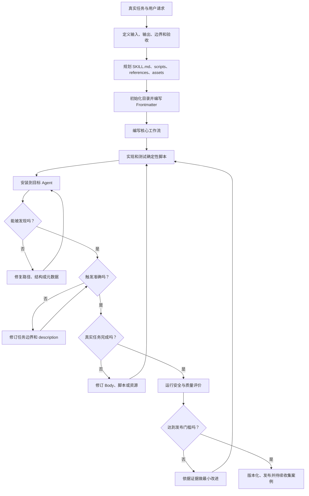

# 第37天：从零创建 Skill 的完整步骤与评价标准

> [!abstract] 本章定位
> 第35天学习了 Skill 的文件格式，第36天学习了 Skill 的安装、发现与调用。第37天把前面的知识真正串起来：从一个具体任务出发，设计、实现、测试、安装和迭代一份可运行的 Skill。本章以课程中的 `hf-dataset-validation` 为主案例，并进一步建立一套可操作、可打分的 Skill 评价标准。

## 0. 学习资料

- 在线教材：[Building Your First Skill](https://huggingface.co/learn/context-course/unit1/building-skills)
- GitHub 原文：[building-skills.mdx](https://github.com/huggingface/context-course/blob/main/units/en/unit1/building-skills.mdx)
- 格式规范：[The SKILL.md Format](https://huggingface.co/learn/context-course/unit1/skill-format)
- 安装与调用：[Using Skills with Code Agents](https://huggingface.co/learn/context-course/unit1/using-skills)
- 开放规范：[Agent Skills Specification](https://agentskills.io/specification)

---

## 1. 本章一句话总结

```text
创建 Skill 不是先写一篇很长的 SKILL.md，
而是先定义一个可检查的任务边界，
再把 Agent 容易猜错的流程写成指令，
把需要确定性的部分写成脚本，
最后通过格式、触发、执行和结果四层测试不断迭代。
```

完整生命周期是：

```text
定义任务
→ 收集真实请求
→ 划定边界和验收标准
→ 规划资源
→ 初始化目录
→ 编写 SKILL.md
→ 实现脚本与参考资料
→ 测试代码
→ 安装给 Agent
→ 测试触发
→ 测试真实任务
→ 评价、修订和版本管理
```

真正成熟的 Skill 必须同时做到：

```text
找得到
→ 叫得准
→ 做得对
→ 错得明白
→ 结果可验证
→ 后续可维护
```

---

## 2. 课程要创建什么 Skill？

课程从零创建一个 Hugging Face 数据集验证 Skill：

```text
hf-dataset-validation
```

它的目标是：

- 检查数据集文件格式；
- 检查字段和数据类型；
- 检查空值、重复值和空字符串；
- 汇总行数、列数和内存占用；
- 输出机器可读和人类可读的验证报告；
- 在数据集发布、训练或分享前发现质量问题。

### 2.1 为什么这是一个合适的入门案例？

因为它同时包含 Skill 的关键组件：

| 组件 | 在案例中的体现 |
|---|---|
| 触发元数据 | `name` 和 `description` |
| 核心流程 | 检查格式、加载数据、验证 Schema、检查质量、生成报告 |
| 确定性脚本 | `validate_dataset.py`、`generate_report.py` |
| 参考资料 | `references/examples.md` |
| 依赖声明 | `requirements.txt` |
| 测试输入 | `test_data/sample.csv` |
| Agent 集成 | 链接到 Agent 的 Skills 目录 |
| 触发迭代 | 明确 Prompt 与自然 Prompt 的对照测试 |

它既不是纯 Prompt，也不是纯 Python 项目，而是“任务知识 + 可执行程序 + Agent 路由”的组合。

---

## 3. 先理解：什么样的任务值得做成 Skill？

并不是所有 Prompt 都应该做成 Skill。

### 3.1 适合做成 Skill 的任务

- 会重复出现；
- 有相对稳定的工作流程；
- 需要专业领域知识；
- Agent 经常在相同步骤上出错；
- 需要调用固定工具或脚本；
- 有明确的输出格式；
- 有可以检查的完成标准；
- 需要在多个项目或多人之间复用。

例如：

```text
发布 Hugging Face 数据集
审查合同风险
创建品牌一致的演示文稿
检查短视频文稿时长和逻辑
根据团队规范进行代码评审
生成微信公众号排版 HTML
```

### 3.2 不一定需要 Skill 的任务

- 只做一次且非常简单；
- 没有稳定方法，每次都完全不同；
- 通用模型已经能稳定完成；
- 没有可复用知识、脚本或模板；
- 只是一句临时输出要求。

例如：

```text
把这句话翻译成英文
计算 15 × 28
给这个变量换个名字
```

### 3.3 判断公式

```text
Skill 价值
≈ 重复频率
× 专业差异
× 错误成本
× 可复用程度
```

四项都很低时，没有必要为了形式而创建 Skill。

---

## 4. 课程开始前还缺少一个步骤：先定义问题

课程直接从创建目录开始，因为它已经替我们选好了任务。真实项目不能跳过“任务定义”。

### 4.1 写出一句任务定义

推荐格式：

```text
帮助谁，在什么场景下，对什么输入，执行什么任务，产出什么结果。
```

本案例可以写成：

```text
帮助使用 Hugging Face 数据集的开发者，
在发布、训练或分享之前，
检查本地 CSV 等数据文件的结构和质量，
并生成包含错误、警告、统计信息和修复建议的报告。
```

### 4.2 明确输入

```text
必需输入：数据集文件路径
可选输入：期望字段、字段类型、允许的格式、质量阈值
环境输入：Python、pandas、datasets、numpy
```

### 4.3 明确输出

```text
机器可读报告：JSON
人类可读报告：文本或 Markdown
退出状态：成功为 0，错误为非 0
```

### 4.4 明确“完成”的含义

```text
文件成功读取；
格式被识别；
Schema 被检查；
空值、重复值和空字符串被统计；
所有发现都有严重级别；
报告能够说明下一步；
出现致命问题时脚本返回失败状态。
```

### 4.5 明确不负责什么

第一版可以明确不负责：

- 自动修改或删除数据；
- 判断业务标签是否语义正确；
- 自动上传到 Hub；
- 对超大规模分布式数据做完整扫描；
- 替代隐私、版权和合规审查。

边界越清楚，Skill 越容易触发准确、测试完整和长期维护。

---

## 5. 创建 Skill 前先收集真实使用示例

Skill 的 description、Body 和测试都应该从真实请求反推。

### 5.1 应该触发的请求

```text
验证 test_data/sample.csv，看看能不能用于训练。

帮我检查这个数据集有没有空值、重复数据或字段问题。

Can you check whether this CSV is ready to share?

发布到 Hugging Face Hub 之前，先检查数据质量。
```

### 5.2 不应该触发的请求

```text
把这个数据集上传到 Hugging Face Hub。

用这个数据集训练一个分类模型。

帮我解释 pandas 的 DataFrame 是什么。

把 CSV 转成 Excel。
```

这些请求分别属于发布、训练、知识解释和格式转换，不是数据质量验证。

### 5.3 边界请求

```text
帮我看看这个文件有没有问题。

这个数据能用吗？
```

这类请求过于模糊。Agent 应先结合文件上下文判断，必要时询问，而不是仅凭“文件”“数据”就触发。

### 5.4 为什么要在写 description 前做这一步？

因为 description 本质上是一条路由规则。没有正例和负例，作者很容易写成：

```yaml
description: Helps validate data.
```

它既不知道要覆盖哪些真实说法，也不知道要排除哪些相邻任务。

---

## 6. 先规划资源，再创建目录

对每个任务步骤提出三个问题：

```text
这一步需要 Agent 推理吗？
这一步需要稳定执行吗？
这一步需要查询详细知识或使用模板吗？
```

### 6.1 资源规划表

| 任务内容 | 最适合的位置 | 原因 |
|---|---|---|
| 验证总体流程 | `SKILL.md` | 每次触发都必须遵守 |
| 缺少字段的判断 | `scripts/` | 机械、确定、需要复现 |
| 空值和重复值统计 | `scripts/` | 适合程序执行 |
| 格式和 Schema 说明 | `references/` | 只在需要时读取 |
| 使用示例和示例输出 | `references/` | 不必每次占用主上下文 |
| 报告版式 | `assets/` | 用于最终产出 |
| Python 依赖 | `requirements.txt` | 方便环境安装和复现 |
| 临时缓存 | `.gitignore` | 不应进入版本控制 |

### 6.2 自由度设计

不同环节需要不同自由度：

```text
高自由度：如何解释异常和给出修复建议
中自由度：根据格式选择加载器
低自由度：统计空值、检查字段、设置退出码
```

原则：

```text
任务越脆弱、错误成本越高，指令和脚本越具体；
任务越开放、依赖上下文越多，越应该保留 Agent 判断空间。
```

---

## 7. 步骤一：创建目录结构

课程命令：

```bash
mkdir hf-dataset-validation
cd hf-dataset-validation

mkdir -p scripts references assets
touch SKILL.md .gitignore requirements.txt
```

目标结构：

```text
hf-dataset-validation/
├── SKILL.md
├── requirements.txt
├── .gitignore
├── scripts/
│   ├── validate_dataset.py
│   └── generate_report.py
├── references/
│   └── examples.md
└── assets/
    └── validation-template.txt
```

### 7.1 哪些是规范必需的？

最小必需项只有：

```text
hf-dataset-validation/
└── SKILL.md
```

其他目录和文件都应按实际需要创建。

### 7.2 为什么课程一次建出所有目录？

因为这个教学案例后续确实会使用脚本、参考资料、依赖和测试。但真实项目不要为了“目录看起来完整”创建空壳。

### 7.3 Codex 中更稳妥的初始化方式

当前 Codex 的 skill-creator 提供初始化脚本时，应优先使用模板初始化：

```bash
scripts/init_skill.py hf-dataset-validation \
  --path <skills-directory> \
  --resources scripts,references,assets
```

它可以减少目录名、Frontmatter 和 UI 元数据的机械错误。具体参数以当前 Codex skill-creator 为准。

### 7.4 命名检查

`hf-dataset-validation`：

- 全部小写；
- 使用连字符；
- 没有连续连字符；
- 不以连字符开头或结尾；
- 与 Frontmatter 的 `name` 一致；
- 能直接看出任务对象和动作。

---

## 8. 步骤二：编写 Frontmatter

课程示例：

```yaml
---
name: "hf-dataset-validation"
description: "Validate Hugging Face datasets for schema, format, and data quality issues. Use when checking datasets before publishing, training, or sharing."
license: "MIT"
compatibility: "Python 3.8+, requires pandas and datasets"
metadata:
  author: "your-username"
  version: "1.0.0"
  created: "2026-04-13"
---
```

### 8.1 `name` 的评价标准

好的 name 应当：

- 合法；
- 简短；
- 稳定；
- 能表达领域和动作；
- 不与现有 Skill 混淆。

`hf-dataset-validation` 比 `data-helper` 更好，因为它明确了 Hugging Face、数据集和验证任务。

### 8.2 `description` 的四个组成部分

推荐检查：

```text
动作：Validate
对象：Hugging Face datasets
检查内容：schema、format、data quality
使用时机：before publishing、training、sharing
```

description 是触发接口，不能只写一句介绍。

### 8.3 description 的改进版本

为了覆盖课程后面的自然 Prompt，可以写得更贴近真实语言：

```yaml
description: Validate local Hugging Face dataset files for schema, format, missing values, duplicates, empty strings, and other data-quality issues. Use when checking whether CSV or dataset files are ready for training, publishing, sharing, or further processing.
```

### 8.4 通用规范与产品约束的差异

课程依据开放 Agent Skills Specification，因此使用：

- `license`；
- `compatibility`；
- `metadata`。

而当前 Codex skill-creator 约定 Frontmatter 只保留 `name` 和 `description`，其他 UI 信息可能放在 `agents/openai.yaml`。

因此真实创建时必须先确认目标 Agent：

```text
课程示例告诉你开放规范允许什么；
目标 Agent 规则决定你最终应该写什么。
```

---

## 9. 步骤三：编写 SKILL.md Body

Body 要回答：Skill 被触发后，Agent 应该怎么做？

课程的主要结构：

```text
# Dataset Validation Skill
## Overview
## Prerequisites Checklist
## Step-by-Step Guide
## Common Issues and Solutions
## Helper Scripts
```

### 9.1 Overview

说明能力范围：

- Schema validation；
- Data quality；
- Format compliance；
- Size checks。

Overview 的作用是帮助已经加载 Skill 的 Agent 快速建立任务地图，不是替代 description 的触发信息。

### 9.2 Prerequisites

课程列出：

```text
Python 3.8+
pandas
datasets
本地可访问的数据集文件
```

前置条件应当可检查，而不是写成“环境准备好”。

### 9.3 Step-by-Step Guide

课程流程：

```text
安装依赖
→ 识别格式
→ 加载并查看基本信息
→ 验证 Schema
→ 检查数据质量
→ 生成验证报告
```

这是 Skill 的主干。每一步应说明：

- 输入；
- 动作；
- 使用的工具或脚本；
- 判断条件；
- 成功结果；
- 失败后怎么做。

### 9.4 Common Issues and Solutions

课程覆盖：

- CSV 编码错误；
- 大文件内存错误；
- 列名大小写或空格不一致。

故障排查不能只列错误名，还应告诉 Agent：

```text
如何识别
→ 先尝试什么
→ 什么情况下停止
→ 修复是否会改变原始数据
```

### 9.5 写作风格

Skill 指令应使用命令式、动作导向表达：

```text
好：Inspect the file extension before selecting a loader.
差：The file extension can perhaps be inspected.

好：Stop and report missing required columns before publishing.
差：Missing columns may be problematic.
```

Agent 需要行动规则，不需要模糊的知识陈述。

---

## 10. Body 应该写多详细？

### 10.1 必须留在 Body 的内容

- 每次任务都需要的核心流程；
- 关键决策规则；
- 高风险限制；
- 资源读取和脚本运行条件；
- 验收标准；
- 常见错误恢复入口。

### 10.2 应移出 Body 的内容

```text
长篇 API 文档 → references/
完整代码实现 → scripts/
报告模板 → assets/
大量使用示例 → references/examples.md
测试数据 → test_data/ 或测试夹具
```

### 10.3 课程案例中可以进一步优化的地方

课程为便于教学，把许多 Python 代码直接放进 `SKILL.md`，同时又提供脚本。真实 Skill 中不应重复维护同一逻辑。

更好的做法：

```text
SKILL.md：说明何时运行脚本、输入和成功标准
scripts/validate_dataset.py：保存唯一实现
references/examples.md：保存调用示例和示例输出
```

避免 Body 和脚本出现两个版本，未来修改一个却忘记另一个。

---

## 11. 步骤四：实现确定性验证脚本

课程创建两个脚本：

```text
scripts/validate_dataset.py
scripts/generate_report.py
```

### 11.1 `validate_dataset.py`

职责：

- 检查文件是否存在；
- 读取 CSV；
- 记录行数、字段和类型；
- 统计空值；
- 检查重复行；
- 检查字符串字段中的空字符串；
- 输出 JSON；
- 有错误时返回非零退出状态。

JSON 输出适合 Agent 和其他程序继续处理：

```json
{
  "filepath": "data/my_dataset.csv",
  "format": "csv",
  "errors": [],
  "warnings": ["Found 2 duplicate rows"],
  "metadata": {
    "rows": 1000,
    "columns": ["text", "label", "split"]
  }
}
```

### 11.2 `generate_report.py`

职责：

- 输出面向人的报告；
- 显示基本统计；
- 显示字段信息；
- 汇总空值和重复值；
- 给出修复建议。

它与前一个脚本的输出对象不同：

```text
validate_dataset.py → Agent / 程序
generate_report.py → 人类读者
```

### 11.3 为什么适合用脚本？

字段集合运算、空值计数、重复行统计和退出码都应稳定复现，不应该每次依赖语言模型临时生成代码。

### 11.4 高质量脚本的最低标准

- 职责单一；
- 输入明确；
- 输出结构稳定；
- 成功和失败退出码正确；
- 错误信息具体；
- 不吞掉异常；
- 不覆盖原始数据；
- 不把路径和凭证写死；
- 依赖有声明；
- 正常、错误和边界输入都经过测试。

---

## 12. 仔细审视课程脚本：教学示例不等于生产版本

课程脚本足以演示 Skill，但还存在可改进空间。

### 12.1 描述支持多格式，脚本实际只实现 CSV

Frontmatter 和 Body 提到 CSV、Parquet、Arrow、JSON，但示例的 `validate_csv()` 只读取 CSV。

评价时要检查：

```text
description 承诺的能力
是否真的由 Body 和 scripts 实现？
```

解决方案二选一：

1. 缩小 description，明确第一版只支持 CSV；
2. 为 Parquet、JSON、Arrow 实现加载器和测试。

### 12.2 Schema 验证没有进入最终辅助脚本

Body 示例检查 `text`、`label`、`split`，但 `validate_dataset.py` 没有接收期望 Schema，也没有把缺少字段加入 errors。

更合理的设计：

```bash
python scripts/validate_dataset.py data.csv \
  --schema references/text-classification-schema.json
```

或者在 Skill 中明确：通用质量检查不等于任务专属 Schema 验证。

### 12.3 `except:` 过于宽泛

编码尝试示例使用裸 `except:`，会把键盘中断、程序错误等一并吞掉。

应捕获具体异常，例如 `UnicodeDecodeError`，并在全部编码失败后报告清楚。

### 12.4 大文件处理只给出建议，没有集成到主脚本

主脚本仍然一次性读取整个 CSV。生产版本应：

- 先检查文件大小；
- 超过阈值时分块读取；
- 说明分块后哪些统计仍精确；
- 避免用高内存操作计算全量重复行。

### 12.5 dtype 判断可能过度依赖 pandas 表示

只判断 `int64` 或 `object` 会漏掉 nullable integer、category、string dtype 等情况。应根据业务 Schema 使用更稳健的类型检查。

### 12.6 修复建议不应自动修改原始数据

例如标准化字段名可能改变下游兼容性。默认应报告建议，只有用户明确授权时才写出修复后的新文件。

这些不是否定课程，而是在理解：

```text
课程代码证明最小工作链路；
评价标准决定它距离可靠生产工具还有多远。
```

---

## 13. 步骤五：添加 references 文档

课程创建：

```text
references/examples.md
```

其中包含：

- CLI 调用示例；
- JSON 示例输出；
- 在 Python 中导入验证函数的方式。

### 13.1 reference 的作用

`SKILL.md` 告诉 Agent 核心流程，reference 提供需要时才读取的详细信息。

### 13.2 好的 reference 应该满足

- 一个文件聚焦一个主题；
- 文件名清晰；
- 示例可复制；
- 输出与实际脚本一致；
- 在 `SKILL.md` 中明确何时读取；
- 不与 Body 重复维护同一内容；
- 长文档有目录；
- 文件引用保持一层深度。

### 13.3 可以继续增加哪些 reference？

```text
references/examples.md
references/supported-formats.md
references/schema-format.md
references/error-codes.md
references/large-files.md
```

只有真实需要时再添加，不要提前堆满目录。

---

## 14. 步骤六：创建 requirements.txt

课程内容：

```text
pandas>=1.3.0
datasets>=2.0.0
numpy>=1.20.0
```

### 14.1 为什么依赖必须显式声明？

否则 Agent 只能在失败后猜测缺什么包，也无法复现作者的测试环境。

### 14.2 依赖评价标准

- 每个依赖确实被使用；
- 最低版本有依据；
- 不加入无关大包；
- 兼容性说明与 requirements 一致；
- 安装命令不会静默修改不相关环境；
- 必要时使用虚拟环境；
- 重要版本组合经过测试。

### 14.3 课程示例中的一个检查点

如果脚本只使用 pandas 和 pathlib，`datasets`、`numpy` 是否是实际必需依赖，需要根据最终实现核查。不要因为计划支持就把未使用依赖永久加入。

---

## 15. 步骤七：测试辅助脚本

课程先创建一个最小 CSV：

```csv
text,label,split
Hello world,0,train
Great job,1,train
This is bad,0,test
```

然后运行：

```bash
python scripts/validate_dataset.py test_data/sample.csv
python scripts/generate_report.py test_data/sample.csv
```

期望输出包括：

- 行数和列数；
- 数据类型；
- 空值；
- 重复行；
- 质量建议。

### 15.1 只测试正常样例远远不够

至少应覆盖：

| 测试类型 | 输入 | 期望 |
|---|---|---|
| 正常文件 | 合法 CSV | 成功，统计正确 |
| 文件不存在 | 错误路径 | 非零退出，明确错误 |
| 空文件 | 0 字节 | 明确说明无法解析 |
| 只有表头 | 无数据行 | 警告或错误符合约定 |
| 缺少字段 | 少 `label` | Schema error |
| 多余字段 | 额外列 | Warning 或按策略处理 |
| 空值 | 某列含 NaN | 计数准确 |
| 空字符串 | 值为 `"   "` | 识别为空字符串 |
| 重复行 | 重复记录 | 数量准确 |
| 编码问题 | 非 UTF-8 | 明确错误或安全回退 |
| 损坏 CSV | 引号未闭合 | 解析错误清楚 |
| 大文件 | 超过阈值 | 分块或提前提示 |
| 不支持格式 | `.xlsx` | 明确说明支持范围 |

### 15.2 测试三个层面

```text
代码正确性：统计值对不对？
接口稳定性：JSON 字段、退出码是否稳定？
用户可理解性：错误和建议是否清楚？
```

### 15.3 不只看“有没有输出”

应该断言具体结果：

```text
rows == 3
columns == [text, label, split]
errors == []
duplicates == 0
process exit code == 0
```

错误案例则断言：

```text
errors 非空
错误类型正确
退出码非 0
没有生成误导性的成功结论
```

---

## 16. 步骤八：版本控制与工程卫生

课程将其标记为可选步骤：

```bash
git init
git add .
git commit -m "Initial dataset validation skill"
```

如果 Skill 会持续迭代、共享或发布，版本控制实际上非常重要。

### 16.1 `.gitignore`

应排除：

```text
__pycache__/
*.pyc
.venv/
.DS_Store
临时输出
大型测试数据
本地密钥文件
```

### 16.2 不应提交

- API Token；
- 用户真实私密数据；
- 本地绝对路径；
- 无法合法分发的数据；
- 生成缓存；
- 与 Skill 无关的辅助文件。

### 16.3 版本管理的价值

- description 的修改可以审查；
- 脚本回归可以定位；
- 发布版本可以复现；
- 团队可以讨论任务边界；
- 失败后可以回滚。

---

## 17. 步骤九：安装到 Agent 并进行集成测试

课程建议本地开发时使用符号链接：

```bash
mkdir -p .agents/skills
ln -s /absolute/path/to/hf-dataset-validation \
  .agents/skills/hf-dataset-validation
```

不同 Agent 的具体发现目录不同，应使用第36天学习的对应路径。

### 17.1 为什么开发期推荐符号链接？

```text
编辑真源
→ Agent 看到同一份更新
→ 不必反复复制
→ 避免测试旧副本
```

### 17.2 集成测试期望链路

Agent 应该：

1. 发现 Skill；
2. 读取 name 和 description；
3. 把任务匹配到 Skill；
4. 加载 `SKILL.md`；
5. 按说明运行辅助脚本；
6. 理解脚本输出；
7. 给用户返回清楚的验证结果。

### 17.3 不能只手工运行脚本

脚本测试成功只证明程序可用，不证明：

- Agent 能找到 Skill；
- description 能触发；
- Body 能指导正确调用；
- Agent 能解释结果；
- 最终回答满足用户目标。

这就是为什么必须再做 Agent 集成测试。

---

## 18. 步骤十：调试触发并优化 description

课程给出两个 Prompt：

```text
Prompt 1:
Validate my dataset at test_data/sample.csv before I use it for training.

Prompt 2:
Can you check whether this CSV is ready to share?
```

### 18.1 两个 Prompt 各验证什么？

| Prompt | 特点 | 验证目标 |
|---|---|---|
| Prompt 1 | 直接使用 validate、dataset、training | 明确触发是否成功 |
| Prompt 2 | 自然表达，没有直接说 validate | description 的语义覆盖是否足够 |

如果 Prompt 1 成功而 Prompt 2 失败，说明：

```text
Skill 已经被发现，
但 description 太依赖显式关键词，
没有覆盖真实用户的自然说法。
```

### 18.2 触发测试不能只有两个正例

完整触发集合应包括：

```text
明确正例
自然正例
中英文变体
边界正例
明确负例
相邻任务负例
多 Skill 冲突例
```

### 18.3 优化目标

```text
召回率：应该触发的任务有多少成功触发？
精确率：触发的任务中有多少真的应该使用它？
```

不能通过无限增加关键词只提高召回率，否则会造成大量误触发。

---

## 19. 步骤十一：真实任务验收

格式通过、脚本通过、触发成功后，还要回答：Skill 是否真的解决了用户问题？

### 19.1 验收一个正常数据集

检查：

- 是否识别格式；
- 是否显示正确统计；
- 是否给出“可以继续”的结论；
- 是否避免虚构问题；
- 是否说明验证范围和未覆盖项。

### 19.2 验收一个有问题的数据集

检查：

- 是否发现预先植入的问题；
- 严重级别是否合理；
- 是否遗漏关键错误；
- 建议是否可执行；
- 是否避免未经授权直接改数据。

### 19.3 验收一个超出能力范围的数据集

例如 Excel 或超大数据：

- 是否明确说明不支持；
- 是否提出安全下一步；
- 是否没有伪装成验证成功；
- 是否需要请求用户选择转换、抽样或升级处理方式。

### 19.4 验收结论必须可检查

差的验收：

```text
看起来工作正常。
```

好的验收：

```text
10 个设计测试中通过 10 个；
6 个应触发 Prompt 中触发 6 个；
5 个负例中误触发 0 个；
正常 CSV 的统计与预期一致；
缺少字段时返回非零退出码并列出字段；
不支持格式不会输出成功结论。
```

---

## 20. 步骤十二：迭代，而不是一次写完

Skill 的第一次可运行版本只是起点。

### 20.1 迭代循环

```text
运行真实任务
→ 记录失败或绕路
→ 判断问题属于触发、指令、脚本还是资源
→ 做最小修改
→ 重跑相关测试和回归测试
→ 更新版本记录
```

### 20.2 不同问题改哪里？

| 问题 | 优先修改 |
|---|---|
| 应触发却没触发 | `description` |
| 不该触发却触发 | 任务边界和 `description` |
| Agent 不知道下一步 | Body 工作流 |
| 重复生成相同代码 | `scripts/` |
| 主文件太长 | `references/` 或拆 Skill |
| 报告格式不稳定 | script 或 asset template |
| 特定环境运行失败 | dependencies、compatibility、错误处理 |
| 多个 Skills 冲突 | 职责划分和 descriptions |

### 20.3 避免大改造成无法归因

一次只修改一个主要变量，例如先改 description，再重测触发。不要同时重写 description、Body 和脚本，否则无法知道是哪项修改带来改善或退化。

---

## 21. Skill 评价不能只看一个维度

一份 Skill 至少要通过四层评价：

```text
第一层：规范合法性
文件和元数据能否被 Agent 解析？

第二层：发现与触发
Agent 能否在正确任务中选择它？

第三层：执行可靠性
Agent 和脚本能否稳定完成流程？

第四层：业务结果
输出是否准确、完整、有用并可验证？
```

再加上长期质量：

```text
上下文效率
安全性
可移植性
可维护性
```

只通过 YAML 校验，不能证明它是好 Skill；只写出漂亮说明，也不能证明它能运行。

---

## 22. 一票否决项

出现以下任意问题，不论总分多高，都不应判定为可发布：

1. `SKILL.md` 缺失或 Frontmatter 无法解析；
2. `name` 非法或与目录不一致；
3. description 承诺的核心能力根本没有实现；
4. 脚本在正常样例上无法运行；
5. 默认执行会破坏、覆盖或泄露用户数据；
6. 包含明文密钥、Token 或敏感数据；
7. 高风险操作没有授权、确认或安全边界；
8. 错误时仍输出误导性的成功结果；
9. 引用的关键脚本或 reference 文件不存在；
10. 没有任何真实 Agent 触发和执行测试。

这些问题属于“门槛失败”，不是靠其他优点抵消的小扣分项。

---

## 23. 100分 Skill 评价量表

> [!important] 量表来源说明
> Hugging Face 本节课程提供了创建、脚本测试和触发调试流程，但没有发布一套官方100分评分表。下面的量表是基于课程步骤、Agent Skills 规范和实际工程验收要求整理的实践框架，用于自查和团队评审，不应误认为 Hugging Face 官方认证标准。

| 评价维度 | 分值 | 核心问题 |
|---|---:|---|
| 任务定义与边界 | 10 | 做什么、不做什么是否清楚？ |
| 格式与可发现性 | 10 | Agent 能否合法解析并找到？ |
| 触发准确性 | 15 | 应触发和不应触发是否分得清？ |
| 工作流与指令质量 | 15 | Agent 是否知道按什么顺序做？ |
| 脚本与资源可靠性 | 15 | 程序、references、assets 是否可靠？ |
| 输出与业务正确性 | 15 | 最终结果是否准确完整？ |
| 错误处理与安全性 | 10 | 失败是否安全、清楚、可恢复？ |
| 上下文效率与可维护性 | 10 | 是否精简、可复用、可迭代？ |
| **总计** | **100** | 通过一票否决项后再计分 |

### 23.1 任务定义与边界：10分

| 标准 | 分值 |
|---|---:|
| 用户、场景、输入、动作和输出明确 | 3 |
| 明确前置条件 | 2 |
| 明确不负责的相邻任务 | 2 |
| 有可检查的完成定义 | 3 |

### 23.2 格式与可发现性：10分

| 标准 | 分值 |
|---|---:|
| 目录和 `SKILL.md` 结构合法 | 2 |
| name 合法且一致 | 2 |
| description 非空、具体 | 2 |
| 相对路径有效 | 2 |
| 通过通用及目标 Agent 校验 | 2 |

### 23.3 触发准确性：15分

| 标准 | 分值 |
|---|---:|
| 明确正例稳定触发 | 3 |
| 自然表达正例稳定触发 | 4 |
| 明确负例不触发 | 3 |
| 相邻任务负例不误触发 | 3 |
| 多 Skill 冲突时路由合理 | 2 |

建议量化：

```text
正例召回率 = 成功触发的正例数 / 正例总数
触发精确率 = 正确触发数 / 全部触发数
```

基础合格线可设为：

```text
正例召回率 ≥ 90%
负例误触发率 ≤ 10%
```

具体阈值应根据误触发成本调整。

### 23.4 工作流与指令质量：15分

| 标准 | 分值 |
|---|---:|
| 步骤顺序明确 | 3 |
| 每步输入、动作和结果明确 | 3 |
| 决策条件清楚 | 3 |
| 脚本和 reference 使用时机明确 | 3 |
| 验收与停止条件明确 | 3 |

### 23.5 脚本与资源可靠性：15分

| 标准 | 分值 |
|---|---:|
| 正常、错误和边界测试通过 | 4 |
| 输入、输出和退出码稳定 | 3 |
| 依赖明确且最小 | 2 |
| 错误信息具体 | 2 |
| reference 与实际实现一致 | 2 |
| assets 可直接用于产出 | 2 |

### 23.6 输出与业务正确性：15分

| 标准 | 分值 |
|---|---:|
| 关键事实和计算正确 | 5 |
| 必需内容完整 | 3 |
| 输出格式稳定 | 2 |
| 建议具体可执行 | 2 |
| 说明限制和未覆盖项 | 1 |
| 结果可被独立验证 | 2 |

### 23.7 错误处理与安全性：10分

| 标准 | 分值 |
|---|---:|
| 失败不会被伪装成成功 | 2 |
| 默认不破坏原始数据 | 2 |
| 高风险动作需要授权 | 2 |
| 不暴露密钥和隐私数据 | 2 |
| 给出安全恢复路径 | 2 |

### 23.8 上下文效率与可维护性：10分

| 标准 | 分值 |
|---|---:|
| SKILL.md 只保留核心流程 | 2 |
| 详细知识按需放入 references | 2 |
| 重复确定逻辑进入 scripts | 2 |
| 没有重复真源和无关文件 | 2 |
| 有版本控制和回归测试 | 2 |

---

## 24. 分数等级怎么解释？

| 分数 | 等级 | 解释 |
|---:|---|---|
| 90–100 | 优秀 | 可稳定复用和分享，仍需持续监控真实表现 |
| 80–89 | 良好 | 可投入日常使用，有少量边界或维护问题 |
| 70–79 | 基本可用 | 适合受控试用，不宜直接用于高风险任务 |
| 60–69 | 需要改进 | 有明显漏触发、执行或验证问题 |
| 0–59 | 不合格 | 不能作为可靠 Skill 使用 |

前提：没有触发一票否决项。

### 24.1 不同任务要调整权重

```text
创意写作 Skill：提高输出质量和风格一致性权重
数据迁移 Skill：提高正确性、安全和回滚权重
合规审查 Skill：提高召回率、来源和人工复核权重
图片生成 Skill：提高视觉验收和资产一致性权重
代码发布 Skill：提高权限、副作用和验证权重
```

评分表不是固定真理，而是让团队明确“好”的定义。

---

## 25. 评价时需要保存哪些证据？

不要只给一个主观分数，要保留证据：

- Skill 目录快照；
- 校验器输出；
- 正例和负例 Prompt 集；
- Agent 是否触发的记录；
- 脚本测试日志；
- 预期输出与实际输出；
- 失败案例；
- 修改前后对比；
- 最终评分依据。

建议评价记录：

```markdown
## Evaluation Run

- Skill version: 1.0.0
- Agent: Codex
- Date: 2026-07-16
- Positive prompts: 10
- Positive activations: 9
- Negative prompts: 10
- False activations: 1
- Script tests: 12/12 passed
- Task acceptance tests: 4/5 passed
- Known limitation: Parquet not yet supported
```

评价要能复现，而不是“我试了一下感觉不错”。

---

## 26. 建议的完整测试目录

```text
hf-dataset-validation/
├── SKILL.md
├── requirements.txt
├── scripts/
│   ├── validate_dataset.py
│   └── generate_report.py
├── references/
│   ├── examples.md
│   └── schema-format.md
├── assets/
│   └── validation-template.txt
└── tests/
    ├── fixtures/
    │   ├── valid.csv
    │   ├── missing-column.csv
    │   ├── duplicates.csv
    │   ├── missing-values.csv
    │   └── malformed.csv
    ├── test_validate_dataset.py
    ├── activation-prompts.md
    └── acceptance-cases.md
```

需要注意：`tests/` 是工程实践扩展，不是 Agent Skills Specification 要求的标准目录。是否包含它，要看 Skill 的复杂度和分发方式。

---

## 27. 一套可直接使用的触发评测集

### 27.1 应触发

```text
验证 data/train.csv 能不能用于训练。
检查这个 CSV 是否适合分享。
看看数据集有没有缺失值和重复行。
发布到 Hub 之前先做质量检查。
Inspect the schema and quality of this dataset.
Can you check whether this CSV is ready to share?
```

### 27.2 不应触发

```text
把 train.csv 上传到 Hugging Face Hub。
用 train.csv 训练文本分类模型。
把 CSV 转成 Parquet。
解释一下什么是数据集 Schema。
给数据集写一个 README。
删除所有重复行并覆盖原文件。
```

最后一个请求涉及修改数据。验证 Skill 可以识别问题和提出建议，但未经授权不应自动覆盖源文件。

### 27.3 冲突测试

```text
检查数据集，确认没问题后上传到 Hub。
```

理想行为：

```text
先使用 validation Skill
→ 如果存在错误则停止
→ 验证通过后再使用 publishing 或 hf-cli Skill
```

---

## 28. 一套可直接使用的任务验收标准

给定 `missing-and-duplicates.csv`，预先植入：

- 2 个空值；
- 1 个空字符串；
- 2 行重复；
- 缺少 `split` 字段。

验收要求：

```text
1. 脚本退出码非 0，因为缺少必需字段；
2. JSON errors 中包含 missing column: split；
3. warnings 中包含重复行数量；
4. metadata 中空值统计正确；
5. 能区分 NaN 与空字符串；
6. 报告不声称数据“ready for training”；
7. 建议说明如何修复，但不覆盖原文件；
8. Agent 的最终回答与脚本数据一致；
9. Agent 说明验证范围和未覆盖项；
10. 输出中不泄露其他本地文件信息。
```

这比“运行没有报错”更接近真实质量评价。

---

## 29. Skill 创建过程中的常见误区

### 误区一：先写几百行正文，再想用途

应先定义真实请求、边界和验收标准。

### 误区二：description 只写功能，不写使用时机

Agent 无法可靠路由。

### 误区三：description 承诺比脚本实现更多

支持范围必须与真实能力一致。

### 误区四：所有内容都塞进 SKILL.md

会浪费上下文，也造成重复维护。

### 误区五：脚本能跑就算 Skill 完成

还要测试发现、触发、Agent 调用和最终业务结果。

### 误区六：只测试一个正常样例

错误和边界输入才最能暴露设计问题。

### 误区七：只测试应该触发的 Prompt

负例和冲突例决定 Skill 是否会误用。

### 误区八：为了自然触发堆砌关键词

应优化任务语义和边界，不是写标签列表。

### 误区九：发生错误时仍返回一份完整报告

报告必须清楚区分成功、警告和失败。

### 误区十：默认修改用户输入

验证与修复应分开；副作用需要明确授权。

### 误区十一：多个安装目录各维护一份副本

应建立唯一真源，并使用链接或安装器。

### 误区十二：把课程演示代码直接当生产方案

课程建立概念和最小链路，生产使用还需要更完整的测试、安全和维护设计。

---

## 30. 从零创建 Skill 的标准作业流程

### 阶段A：定义

1. 写一句任务定义；
2. 明确用户、输入、输出和场景；
3. 明确不负责什么；
4. 写出可检查的完成标准；
5. 收集正例、负例和边界例。

### 阶段B：设计

6. 提炼稳定工作流；
7. 标记高、中、低自由度步骤；
8. 规划 `SKILL.md`、scripts、references 和 assets；
9. 选择合法且稳定的名称；
10. 设计 description 的触发边界。

### 阶段C：实现

11. 初始化 Skill 目录；
12. 编写 Frontmatter；
13. 编写核心 Body；
14. 实现确定性脚本；
15. 添加必要 references 和 assets；
16. 声明依赖；
17. 删除空目录、占位符和重复内容。

### 阶段D：验证

18. 运行格式校验；
19. 测试脚本正常输入；
20. 测试错误和边界输入；
21. 安装或链接到目标 Agent；
22. 测试显式调用；
23. 测试正例和自然正例；
24. 测试负例和冲突例；
25. 运行真实任务验收。

### 阶段E：评价与发布

26. 检查一票否决项；
27. 使用100分量表评分；
28. 保存评测证据；
29. 修复低分项并做回归测试；
30. 建立版本控制；
31. 记录已知限制；
32. 发布或共享。

### 阶段F：持续迭代

33. 收集漏触发、误触发和失败案例；
34. 判断问题层级；
35. 做最小修改；
36. 重跑相关测试与完整回归；
37. 更新版本和评价记录。

---

## 31. 创建完成后的总检查清单

### 任务定义

- [ ] 能用一句话说明 Skill 解决什么问题
- [ ] 输入、输出和用户明确
- [ ] 前置条件可检查
- [ ] 不负责的相邻任务清楚
- [ ] 完成标准可以验证

### 结构与元数据

- [ ] `SKILL.md` 位于根目录
- [ ] name 合法且与目录一致
- [ ] description 覆盖能力与使用时机
- [ ] 可选字段符合目标 Agent 规则
- [ ] 所有相对路径存在

### Body

- [ ] 核心流程有明确顺序
- [ ] 决策条件和停止条件清楚
- [ ] 脚本、reference、asset 的使用时机清楚
- [ ] 错误处理和验收标准明确
- [ ] 没有与外部文件重复维护大量内容

### Scripts

- [ ] 职责单一
- [ ] 输入输出稳定
- [ ] 退出码正确
- [ ] 错误信息具体
- [ ] 不覆盖原始数据
- [ ] 不包含密钥和绝对路径
- [ ] 正常、错误和边界测试通过

### Resources

- [ ] references 按需加载、主题清晰
- [ ] 示例与实际实现一致
- [ ] assets 确实用于最终产出
- [ ] requirements 只包含真实依赖
- [ ] 没有无用空目录和占位文件

### Agent 测试

- [ ] Agent 能发现 Skill
- [ ] 显式调用成功
- [ ] 明确正例触发
- [ ] 自然正例触发
- [ ] 负例不触发
- [ ] 冲突例路由合理
- [ ] Agent 能正确调用脚本并解释结果

### 评价与发布

- [ ] 没有一票否决项
- [ ] 评分达到计划的发布门槛
- [ ] 保存评测证据
- [ ] 已知限制写清楚
- [ ] 纳入版本控制
- [ ] 安装和复现方式明确

---

## 32. 本章知识地图



---

## 33. 本章结论

课程通过 `hf-dataset-validation` 展示了创建 Skill 的八个实操步骤：

```text
创建目录
→ 编写 SKILL.md
→ 添加 reference
→ 声明依赖
→ 测试脚本
→ 使用版本控制
→ 安装给 Agent
→ 调试触发并优化 description
```

把它扩展成真实工程流程，还需要在前面增加：

```text
任务定义、真实请求、边界和验收标准
```

在后面增加：

```text
负例与冲突测试、真实任务验收、安全检查、量化评分和持续回归
```

最终判断一份 Skill 好不好，不是看它写了多少内容，而是看：

```text
它是否只在正确场景出现，
是否能让 Agent 少猜、少错、少绕路，
是否把确定性工作可靠执行，
是否在失败时安全且清楚，
是否产出准确、完整、可验证的业务结果，
以及是否能够被下一位维护者继续改进。
```

最简评价公式：

```text
高质量 Skill
= 准确的任务边界
+ 可靠的触发
+ 清晰的流程
+ 确定性的工具
+ 可验证的结果
+ 安全的失败方式
+ 可持续的迭代机制
```
