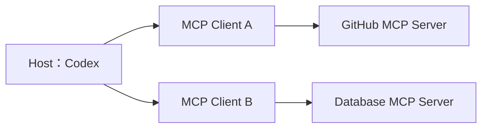
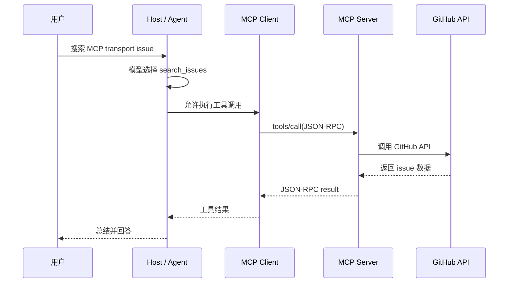
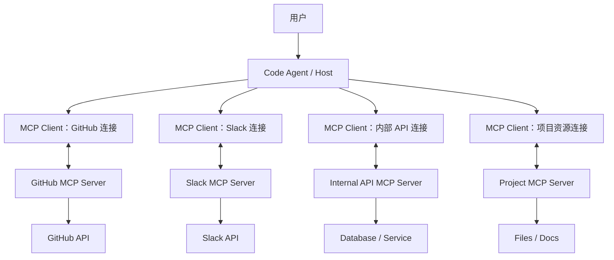
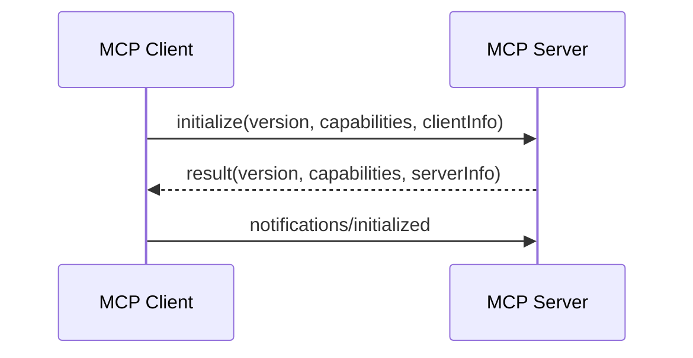

# 第39天：MCP 关键概念、架构、JSON-RPC、传输与生命周期

> [!abstract] 本章定位
> 第38天回答了为什么需要 MCP。第39天进入 MCP 的内部结构：Host、Client、Server 怎样分工，Tools、Resources、Prompts 怎样定义，JSON-RPC 消息怎样表达调用，stdio 与 Streamable HTTP 怎样搬运同一类消息，以及一个 MCP 连接从配置到关闭经历什么过程。本章还提供一个零依赖 Python Demo，用代码证明“协议与传输层分离”。

## 0. 学习资料与代码

- 在线教材：[MCP Key Concepts and Architecture](https://huggingface.co/learn/context-course/unit2/key-concepts)
- GitHub 原文：[key-concepts.mdx](https://github.com/huggingface/context-course/blob/main/units/en/unit2/key-concepts.mdx)
- MCP 传输规范：[Transports](https://modelcontextprotocol.io/specification/2025-11-25/basic/transports)
- MCP 生命周期规范：[Lifecycle](https://modelcontextprotocol.io/specification/2025-11-25/basic/lifecycle)
- 本地代码：[examples/39-mcp-key-concepts](../examples/39-mcp-key-concepts/README.md)

> [!note] 版本说明
> MCP 规范会演进。课程介绍了当前主流的 stdio 与 Streamable HTTP，并指出旧的 HTTP+SSE 已被弃用。本笔记用带日期的 `2025-11-25` 规范链接核对协议边界。实际开发必须让 Client 与 Server 在初始化时协商版本，不能假设所有实现永远使用同一版。

---

## 1. 本章一句话总结

```text
Host 承载 Agent 和用户体验，
Client 负责说 MCP，
Server 负责提供能力；

Tools、Resources、Prompts 定义 Server 提供什么，
JSON-RPC 定义消息长什么样，
Transport 决定消息怎样移动，
Lifecycle 规定双方何时可以做什么。
```

最小结构可以记成：

```text
用户
  ↓
Host（运行 Agent）
  ↓
MCP Client（协议连接）
  ↓ JSON-RPC over Transport
MCP Server（能力提供者）
  ↓
文件 / 数据库 / API / 业务系统
```

---

## 2. 把课程动态图拆成一组静态画面

课程动态图想表达的不是“几只方框在移动”，而是一次连接中角色、消息和状态怎样逐步变化。

### 2.1 第一幕：Host 读取配置

用户启动 Codex 等代码 Agent。Host 读取 MCP 配置，得知有哪些 Server：

```text
Host
├── filesystem server
├── GitHub server
└── company database server
```

此时只是“知道应该连接谁”，还没有把工具交给模型。

### 2.2 第二幕：为每个 Server 建立 Client 连接

一个 Host 可以同时管理多个 MCP Client。通常每个 Client 与一个 Server 保持一条逻辑连接：



Client 不是另一个 Agent，它是 Host 中负责协议通信的组件。

### 2.3 第三幕：初始化与能力协商

Client 先发送 `initialize`：

```text
Client：我支持这个协议版本和这些 Client 能力，你是谁？
Server：我选择这个协议版本，我叫某某 Server，并支持这些能力。
Client：notifications/initialized，初始化完成。
```

双方先确认版本和能力，再进入正常操作阶段。

### 2.4 第四幕：能力发现

Client 可以查询 Server 提供什么：

```text
tools/list
resources/list
prompts/list
```

Server 返回名称、描述、参数 Schema、URI 等元数据。Host 再决定哪些内容要提供给模型或用户。

### 2.5 第五幕：模型提出工具调用

用户说：

```text
搜索 GitHub 中和 MCP transport 有关的 issue。
```

Host 把合适的工具描述放入模型上下文。模型输出结构化调用意图，Host 检查权限后，通过 Client 发出 `tools/call`。

### 2.6 第六幕：Server 执行并返回结果



### 2.7 第七幕：关闭连接

Host 退出或移除 Server 时，Client 停止请求并关闭 Transport。本地 stdio Server 通常作为子进程一起退出；远程 HTTP Server 通常继续运行，等待其他 Client。

---

## 3. MCP 每次互动中的三个角色

课程把 MCP 架构划分为：

```text
Host
Client
Server
```

划分依据不是“部署在三台机器上”，而是职责。

### 3.1 Host：承载用户、Agent 和安全策略

Host 是 Agent 运行的应用环境，例如：

- Codex；
- Claude Code；
- OpenCode；
- 带 AI SDK 的自定义 Python 应用；
- 支持 MCP 的桌面 AI 应用。

Host 主要负责：

- 接收用户请求；
- 调用模型；
- 管理会话和上下文；
- 管理 MCP Server 配置；
- 创建和管理 MCP Client；
- 选择向模型暴露哪些能力；
- 执行权限、安全和确认策略；
- 把工具结果放回模型上下文；
- 向用户展示最终结果。

Host 可以理解成“总工作台”。

### 3.2 Client：负责一条 MCP 协议连接

Client 是 Host 内的协议处理组件，不是最终用户，也不是大模型。

它主要负责：

- 与 Server 建立连接；
- 发送初始化请求；
- 协商协议版本和能力；
- 发现 Server 提供的功能；
- 发送 `tools/call`、`resources/read` 等请求；
- 通过 `id` 匹配请求和响应；
- 处理通知、错误和连接生命周期；
- 在远程场景中配合身份认证。

一个 Host 通常可以拥有多个 Client：

```text
Codex Host
├── GitHub MCP Client  ↔ GitHub MCP Server
├── Slack MCP Client   ↔ Slack MCP Server
└── Files MCP Client   ↔ Files MCP Server
```

### 3.3 Server：暴露能力并执行真实工作

Server 是通过 MCP 提供能力的程序，可以是：

- 本机 Python 子进程；
- 容器中的服务；
- 部署在 Hugging Face Spaces 的应用；
- 企业内部远程服务；
- 嵌入 Gradio 应用的 MCP Server。

Server 主要负责：

- 声明自身支持的能力；
- 定义工具名称、描述和参数 Schema；
- 暴露可读取的资源；
- 提供提示模板；
- 接收并校验 Client 请求；
- 调用文件、数据库或底层 API；
- 返回结构化结果或协议错误；
- 执行权限检查、限流和业务规则。

### 3.4 三个角色怎样划分？

可以用三个问题判断：

| 判断问题 | 对应角色 |
|---|---|
| 谁承载用户、模型、上下文和总策略？ | Host |
| 谁负责按照 MCP 规范建立连接和交换消息？ | Client |
| 谁定义并执行外部能力？ | Server |

### 3.5 三个容易犯的错误

错误一：Host 就是模型。

```text
Host 包含或调用模型，但 Host 还负责 UI、上下文、Client 和权限控制。
```

错误二：Client 就是用户客户端。

```text
这里的 Client 特指 MCP 协议 Client，不是泛指浏览器或最终用户。
```

错误三：Server 必须在云端。

```text
Server 是能力提供角色，可以只是本机的一个 Python 进程。
```

---

## 4. MCP Server 公开的三种功能怎样定义？

课程将 Server 侧的三种主要能力概括为：

```text
Tools
Resources
Prompts
```

### 4.1 Tools：可调用的函数

Tool 用于执行动作或动态计算。一个 Tool 通常包括：

- 唯一名称；
- 清晰描述；
- 输入参数的 JSON Schema；
- 实际执行函数；
- 文本或结构化返回结果；
- 错误处理；
- 可选的行为提示和输出 Schema。

例如：

```json
{
  "name": "add",
  "description": "Add two numbers.",
  "inputSchema": {
    "type": "object",
    "properties": {
      "a": {"type": "number"},
      "b": {"type": "number"}
    },
    "required": ["a", "b"]
  }
}
```

调用：

```text
tools/list → 发现工具
tools/call → 调用工具
```

Tool 被称为 **model-controlled**：通常由模型根据任务决定是否调用。但真正执行仍受 Host 权限、用户确认和 Server 校验约束。

Tool 可以只读，也可以修改状态：

```text
search_issues  → 只读查询
post_message   → 发送消息，有副作用
delete_file    → 删除文件，高风险副作用
```

### 4.2 Resources：通过 URI 标识的上下文数据

Resource 是供应用读取的上下文数据，通常包含：

- URI；
- 名称；
- 描述；
- MIME Type；
- 文本或二进制内容。

例如：

```text
file:///project/README.md
memo://course/day39
db://schema/orders
```

调用：

```text
resources/list → 列出资源
resources/read → 按 URI 读取资源
```

Resource 被称为 **application-controlled**：通常由 Host 或应用决定选择、读取和展示哪些资源，而不是任由模型执行任意读操作。

> [!important] 关于“资源始终可用”
> 课程中的表达容易让人误以为所有 Resource 会自动塞进模型上下文。更准确地说，Resource 可以由 Server 声明并通过 URI 读取；是否读取、何时读取以及是否放进模型上下文，由 Client、Host 和具体产品行为决定。资源可发现不等于资源内容已加载。

### 4.3 Prompts：可复用的提示模板

Prompt 是 Server 提供的提示模板，通常包含：

- 名称；
- 描述；
- 可选参数；
- 实例化后的消息内容。

例如：

```text
name: code_review
arguments: language, focus
```

调用：

```text
prompts/list → 列出提示
prompts/get  → 传入参数并获得具体提示消息
```

Prompt 被称为 **user-controlled**：它通常作为用户显式选择的工作流入口，而不是像 Tool 一样由模型自行执行。

### 4.4 三者对比

| 维度 | Tools | Resources | Prompts |
|---|---|---|---|
| 核心用途 | 执行函数、查询或动作 | 提供数据和上下文 | 提供指令模板 |
| 典型控制方 | 模型提出调用 | 应用选择资源 | 用户选择模板 |
| 是否可修改状态 | 可以 | 通常只读 | 不执行动作 |
| 标识方式 | Tool name | URI | Prompt name |
| 典型方法 | `tools/list`、`tools/call` | `resources/list`、`resources/read` | `prompts/list`、`prompts/get` |
| 例子 | 发 Slack 消息 | 读取项目文档 | 获取代码审查模板 |

### 4.5 “三种功能”不是整个 MCP 的全部能力

课程这里专注于 Server 向 Client 提供的三个主要 Primitive。完整 MCP 协议还包含 Client 侧能力和其他机制，例如 Roots、Sampling、Elicitation、Logging、Notifications 等。

所以准确表达应当是：

```text
Tools、Resources、Prompts 是本课程当前介绍的三种 Server 侧主要能力，
不是 MCP 规范中所有可能消息和能力的完整清单。
```

---

## 5. JSON-RPC 到底是什么？

JSON-RPC 2.0 是一种远程过程调用消息格式。它规定：

- 请求长什么样；
- 响应怎样关联请求；
- 成功结果放在哪里；
- 错误怎样表达；
- 不需要响应的通知怎样表达。

它不负责：

- 消息通过管道还是网络传输；
- 用户怎样登录；
- Tool、Resource、Prompt 的业务语义；
- Server 如何执行底层函数；
- Host 是否允许模型执行操作。

### 5.1 JSON-RPC 请求

```json
{
  "jsonrpc": "2.0",
  "id": 3,
  "method": "tools/call",
  "params": {
    "name": "add",
    "arguments": {
      "a": 7,
      "b": 5
    }
  }
}
```

字段解释：

| 字段 | 含义 |
|---|---|
| `jsonrpc` | 固定为 `"2.0"`，声明消息版本 |
| `id` | 请求标识，用于把响应与请求对应起来 |
| `method` | 要执行的方法名称 |
| `params` | 方法参数，可以省略 |

### 5.2 成功响应

```json
{
  "jsonrpc": "2.0",
  "id": 3,
  "result": {
    "content": [
      {"type": "text", "text": "12"}
    ],
    "structuredContent": {"sum": 12},
    "isError": false
  }
}
```

响应中的 `id` 与请求相同。Client 因此知道这是第 3 号请求的结果。

### 5.3 错误响应

```json
{
  "jsonrpc": "2.0",
  "id": 3,
  "error": {
    "code": -32602,
    "message": "a must be a number"
  }
}
```

成功响应有 `result`，失败响应有 `error`，二者不应同时出现。

常见 JSON-RPC 错误码：

| 错误码 | 含义 |
|---:|---|
| `-32700` | JSON 解析失败 |
| `-32600` | 请求结构无效 |
| `-32601` | 方法不存在 |
| `-32602` | 参数无效 |
| `-32603` | Server 内部错误 |

### 5.4 Notification

通知没有 `id`：

```json
{
  "jsonrpc": "2.0",
  "method": "notifications/initialized"
}
```

没有 `id` 表示发送方不等待结果，接收方也不返回 JSON-RPC 响应。

### 5.5 JSON-RPC 与 MCP 的关系

```text
JSON-RPC：定义通用消息信封
MCP：规定信封中有哪些方法、参数、结果、能力和生命周期语义
Transport：把信封从一端送到另一端
```

只实现一个 `tools/call` 风格的 JSON-RPC 方法，并不等于已经完整实现 MCP。完整 MCP 还要求遵守初始化、版本协商、能力协商、方法 Schema、Transport 行为和安全约束。

---

## 6. Demo：同一组 JSON-RPC 消息走两种 Transport

代码目录：

```text
examples/39-mcp-key-concepts/
├── README.md
├── protocol.py
├── stdio_server.py
├── stdio_client.py
├── http_server.py
└── http_client.py
```

### 6.1 为什么把 `protocol.py` 单独拆出来？

`protocol.py` 只关心：

```text
收到什么 JSON-RPC method
→ 校验 params
→ 执行什么功能
→ 返回 result 或 error
```

它不关心消息来自 stdin 还是 HTTP。这就是协议逻辑与 Transport 逻辑解耦。

### 6.2 stdio Server 做什么？

核心循环可以简化为：

```python
for line in sys.stdin:
    message = json.loads(line)
    response = handle_message(message)
    if response is not None:
        print(json.dumps(response), flush=True)
```

数据流：

```text
Client 写入子进程 stdin
→ Server 从 sys.stdin 读取一行 JSON
→ protocol.py 处理
→ Server 把一行 JSON 写到 sys.stdout
→ Client 从子进程 stdout 读取
```

stdio 的关键规则：stdout 属于协议消息，调试日志应该写到 stderr，否则 Client 可能把日志误当成 JSON-RPC 消息。

### 6.3 运行 stdio Demo

```bash
python3 examples/39-mcp-key-concepts/stdio_client.py
```

Client 会依次发送：

```text
initialize
notifications/initialized
tools/list
tools/call
resources/read
prompts/get
```

### 6.4 HTTP Server 做什么？

HTTP 版本把同一个 JSON-RPC 对象放入 POST Body：

```text
POST /mcp
Content-Type: application/json

{"jsonrpc":"2.0","id":2,"method":"tools/call",...}
```

Server 处理后，把 JSON-RPC Response 放进 HTTP Response Body。

### 6.5 运行 HTTP Demo

终端一：

```bash
python3 examples/39-mcp-key-concepts/http_server.py
```

终端二：

```bash
python3 examples/39-mcp-key-concepts/http_client.py
```

### 6.6 两种 Transport 中什么变了，什么没变？

没有改变：

```text
jsonrpc
id
method
params
result
error
```

发生改变：

```text
stdio：消息通过父子进程的 stdin / stdout 搬运
HTTP：消息通过 HTTP request / response body 搬运
```

### 6.7 为什么 HTTP Demo 不是完整 Streamable HTTP？

为了让协议与 Transport 的区别一眼可见，Demo 只实现最小 `POST /mcp`。它没有完整实现：

- MCP 初始化状态机；
- 协议版本 Header；
- Session 管理；
- SSE 流式消息；
- GET 与 DELETE 行为；
- Origin 安全校验；
- 认证和授权；
- 断线恢复。

真实项目应该使用官方 MCP SDK 或 FastMCP，而不是复制这个教学 HTTP Server 上线。

---

## 7. 怎样理解协议与传输层分离？

课程原文：

```text
协议（JSON-RPC）与传输层（消息怎样在 Client 和 Server 之间移动）是分离的。
```

可以用“快递单与运输工具”类比：

```text
JSON-RPC = 快递单格式
规定寄件编号、业务名称、参数、成功结果和错误。

Transport = 运输工具
可以走本地传送带，也可以走公路网络。

MCP = 这家业务网络的完整规则
规定有哪些业务、怎样握手、双方具有什么能力、何时可操作。
```

同一张快递单可以上不同运输工具，单据的业务含义不变。

### 7.1 stdio Transport

stdio 适合本地连接：

```text
Host 启动 Server 子进程
Client 写 Server stdin
Server 写 stdout 返回
```

优点：

- 配置相对简单；
- 没有网络暴露；
- 延迟低；
- 适合本机文件和开发工具。

限制：

- 通常服务于本机单个 Host；
- Server 生命周期常与 Host 绑定；
- 环境、命令和本地路径需要正确；
- stdout 不能混入普通日志。

### 7.2 Streamable HTTP Transport

Streamable HTTP 适合远程或共享服务：

```text
Client 通过 HTTP POST 向 MCP endpoint 发送消息
Server 返回普通 JSON 或 SSE 流
```

优点：

- 可以跨机器和互联网访问；
- Server 可长期运行并服务多个 Client；
- 支持认证 Header、Session 和流式响应；
- 适合团队与云部署。

代价：

- 有网络延迟和故障；
- 必须处理认证、授权、TLS 和 Origin；
- 需要部署、监控、限流和扩容；
- Session 和重连更复杂。

### 7.3 对比表

| 维度 | stdio | Streamable HTTP |
|---|---|---|
| 位置 | 通常本地 | 通常远程 |
| 载体 | stdin / stdout | HTTP POST、JSON、SSE |
| Server 形态 | Host 启动的子进程 | 长期运行的网络服务 |
| 网络开销 | 无 | 有 |
| 共享能力 | 较弱 | 适合多用户与团队 |
| 身份认证 | 常依赖本地环境和进程权限 | 通常需要网络认证授权 |
| 典型场景 | 本地文件、个人开发工具 | SaaS、企业 API、云服务 |

### 7.4 为什么要分离？

分离带来三个好处：

1. Server 的业务方法不必为每种 Transport 重写；
2. Client 可以根据本地或远程场景选择连接方式；
3. 协议语义可以独立演进，Transport 只负责可靠搬运消息。

但“消息格式相同”不等于两个 Transport 的安全、连接和 Session 行为完全相同。

---

## 8. 怎样理解 MCP 架构图？

课程架构图的中心不是 Server，而是 Host：



读图时注意六点：

1. 用户与 Host 交互，不直接操作 Server；
2. 模型在 Host 内参与推理，不负责底层 Transport；
3. Host 可以同时连接多个 Server；
4. 每个 Server 只暴露自己负责的能力；
5. Client 与 Server 之间交换 JSON-RPC 消息；
6. Server 后面往往还有真实文件、API 或数据库。

架构的价值在于解耦：

```text
Host 不必知道 Slack API 的全部细节；
Slack MCP Server 不必知道 Host 使用哪个模型；
双方只需共同遵守 MCP。
```

---

## 9. 怎样理解 MCP 生命周期？

课程给出的是方便学习的五步使用流程：

```text
Configuration
→ Connection
→ Discovery
→ Operation
→ Shutdown
```

### 9.1 Configuration：配置

Host 先知道怎样找到或启动 Server，例如：

```text
stdio：command + args + env
HTTP：url + authentication config
```

配置属于产品和部署层面的准备工作，还不是 JSON-RPC 协议消息。

### 9.2 Connection：建立 Transport

```text
stdio：Host 启动子进程并连接管道
HTTP：Client 准备连接远程 endpoint
```

连接建立后，还必须进行 MCP 初始化。

### 9.3 Initialization：正式协议生命周期的第一阶段

正式协议生命周期强调三个阶段：

```text
Initialization
→ Operation
→ Shutdown
```

初始化握手：



在 Server 返回 `initialize` 结果前，Client 不应发送普通操作请求。初始化的目的包括：

- 协商协议版本；
- 声明双方能力；
- 交换实现名称和版本；
- 建立后续通信规则。

### 9.4 Discovery：发现能力

初始化完成后，Client 查询：

```text
tools/list
resources/list
prompts/list
```

Discovery 是操作阶段中的常见动作，不是正式生命周期之外的另一套协议阶段。

### 9.5 Operation：正常操作

双方可以：

- 调用 Tools；
- 读取 Resources；
- 获取 Prompts；
- 发送 Notification；
- 返回进度、日志或错误；
- 根据已协商能力使用其他协议功能。

### 9.6 Shutdown：关闭

关闭方式依赖 Transport：

```text
stdio：关闭 stdin、等待进程退出，必要时终止进程
HTTP：关闭连接或结束 Session，远程 Server 通常继续运行
```

关闭时要考虑：

- 正在执行的工具是否取消；
- 副作用操作是否已完成；
- 是否需要释放文件或数据库连接；
- 是否需要保存审计记录；
- Client 能否安全重连。

### 9.7 把课程流程与正式生命周期对齐

| 课程五步 | 正式协议位置 | 说明 |
|---|---|---|
| Configuration | 协议外准备 | Host 配置 Server |
| Connection | 初始化前 | 建立 stdio 或 HTTP Transport |
| Discovery | Operation 内 | 列出 Tools、Resources、Prompts |
| Operation | Operation | 调用、读取、通知和错误处理 |
| Shutdown | Shutdown | 结束连接和清理资源 |

还必须补上的一步是：

```text
Connection 与 Discovery 之间存在 Initialization。
```

这一步负责版本和能力协商，不能省略。

---

## 10. 从配置到一次工具调用的完整链路

```text
1. Host 读取 Server 配置
2. Host 创建 MCP Client
3. Client 启动本地 Server 或连接远程 Server
4. Client 发送 initialize
5. Server 返回版本、能力和 serverInfo
6. Client 发送 notifications/initialized
7. Client 请求 tools/list
8. Server 返回 Tool 描述和 inputSchema
9. Host 选择合适工具并提供给模型
10. 用户提出任务
11. 模型生成工具调用意图
12. Host 检查权限，必要时让用户确认
13. Client 发送 tools/call
14. Server 校验参数并执行底层函数/API
15. Server 返回 JSON-RPC result 或 error
16. Host 把工具结果加入上下文
17. 模型继续推理并回答用户
18. Host 退出时关闭连接
```

这条链路中没有任何一步是“模型直接访问数据库”。

---

## 11. 课程内容需要补充的边界

### 11.1 Server 能力发现不等于全部注入模型

Host 可以根据任务、权限和上下文预算选择只暴露一部分工具或资源。

### 11.2 model-controlled 不等于模型拥有最终权限

模型可以建议调用 Tool，但 Host 和用户仍应控制高风险操作，Server 也必须独立校验权限。

### 11.3 stdio 没有网络暴露，不等于绝对安全

本地 Server 可能继承用户权限，仍然可以读文件、访问网络或执行程序。只安装可信 Server，并限制环境变量、目录和系统权限。

### 11.4 Streamable HTTP 不只是“POST 一个 JSON”

完整实现还涉及 Header、Session、SSE、协议版本、安全校验和恢复行为。本章 HTTP Demo 只证明 Transport 分离。

### 11.5 JSON-RPC 是基础，不是 MCP 全部

MCP 在 JSON-RPC 之上增加方法语义、Schema、版本协商、能力协商和生命周期。

### 11.6 一个 Host 连接多个 Server 会产生治理问题

需要处理：

- 重名工具；
- 工具描述占用上下文；
- 不同 Server 的信任级别；
- 跨 Server 数据泄露；
- 多步副作用；
- 调用日志和故障定位。

---

## 12. 面试题

### 12.1 MCP 的 Host、Client、Server 分别负责什么？

参考回答：

> Host 承载用户、Agent、模型上下文和总体安全策略；Client 是 Host 内负责 MCP 连接、版本能力协商和消息交换的协议组件；Server 定义并执行 Tools、Resources、Prompts 等外部能力。三者按职责划分，不要求部署在三台机器上。

### 12.2 Tools、Resources、Prompts 有什么区别？

参考回答：

> Tools 是可调用函数，可以查询或修改状态，通常由模型提出调用；Resources 是通过 URI 读取的上下文数据，通常由应用控制选择；Prompts 是参数化提示模板，通常由用户选择。模型控制、应用控制和用户控制描述的是典型交互方式，不会绕过 Host 和 Server 的权限校验。

### 12.3 为什么说 JSON-RPC 与 Transport 分离？

参考回答：

> JSON-RPC 定义请求、响应、通知和错误的 JSON 结构，而 Transport 只负责搬运这些消息。同一个 `tools/call` JSON-RPC 对象既可以作为 stdio 中的一行 JSON，也可以放进 Streamable HTTP 的请求体。改变 Transport 不必改变方法和参数的业务语义。

### 12.4 JSON-RPC 和 MCP 是同一个东西吗？

参考回答：

> 不是。JSON-RPC 是 MCP 使用的消息格式基础；MCP 在其上规定初始化、版本与能力协商、Tools、Resources、Prompts 的方法和数据结构、Transport 行为及完整生命周期。实现任意 JSON-RPC Server 不代表实现了 MCP Server。

### 12.5 MCP 的生命周期是什么？

参考回答：

> 正式协议生命周期包括 Initialization、Operation 和 Shutdown。Client 先通过 `initialize` 与 Server 协商协议版本和能力，再发送 `notifications/initialized`，之后才能进行发现和调用等正常操作，最后按 Transport 方式关闭连接。课程中的 Configuration 和 Connection 是协议开始前的准备，Discovery 属于 Operation 阶段。

### 12.6 stdio 与 Streamable HTTP 怎样选择？

参考回答：

> 本地、单用户、低延迟工具通常适合 stdio，由 Host 启动 Server 子进程并通过 stdin/stdout 通信；远程、共享和云服务适合 Streamable HTTP，但需要额外处理认证、授权、TLS、Session、网络故障和监控。

---

## 13. 今日检查清单

- [ ] 能画出 Host、Client、Server 的关系；
- [ ] 知道三个角色按职责而不是机器数量划分；
- [ ] 能说明一个 Host 为什么会有多个 MCP Client；
- [ ] 能区分 Tools、Resources、Prompts；
- [ ] 知道三种能力的典型控制方；
- [ ] 知道三种 Server Primitive 不是完整 MCP 能力清单；
- [ ] 能读懂 JSON-RPC Request、Response、Error、Notification；
- [ ] 能解释 `id` 的作用；
- [ ] 能解释为什么 Notification 没有响应；
- [ ] 能说明 JSON-RPC、MCP、Transport 分别负责什么；
- [ ] 能运行 stdio Demo；
- [ ] 能运行 HTTP Demo；
- [ ] 能指出教学 HTTP Demo 与 Streamable HTTP 的差距；
- [ ] 能比较 stdio 与 Streamable HTTP；
- [ ] 能解释课程五步流程和正式协议生命周期的关系；
- [ ] 知道 Connection 与 Discovery 之间必须初始化；
- [ ] 知道模型不直接连接 Server；
- [ ] 知道工具调用仍需权限校验和高风险确认。

---

## 14. 最终总结

MCP 架构可以压缩成四个问题：

```text
谁承载 Agent？       Host
谁负责说 MCP？       Client
谁提供外部能力？     Server
消息怎样过去？       JSON-RPC over Transport
```

Server 侧三种主要能力是：

```text
Tools      = 执行函数和动作
Resources  = 提供可读取的上下文数据
Prompts    = 提供可复用的指令模板
```

协议与 Transport 的关系是：

```text
JSON-RPC 规定消息形状；
MCP 规定消息的业务语义和生命周期；
stdio 或 Streamable HTTP 负责搬运消息。
```

生命周期是：

```text
配置
→ 建立 Transport
→ 初始化并协商版本与能力
→ 发现能力
→ 正常调用
→ 关闭连接
```

一句话收尾：

> MCP 的可复用性来自清晰分层：角色各管一件事，协议定义共同语言，Transport 只负责把这门语言送到对方。
