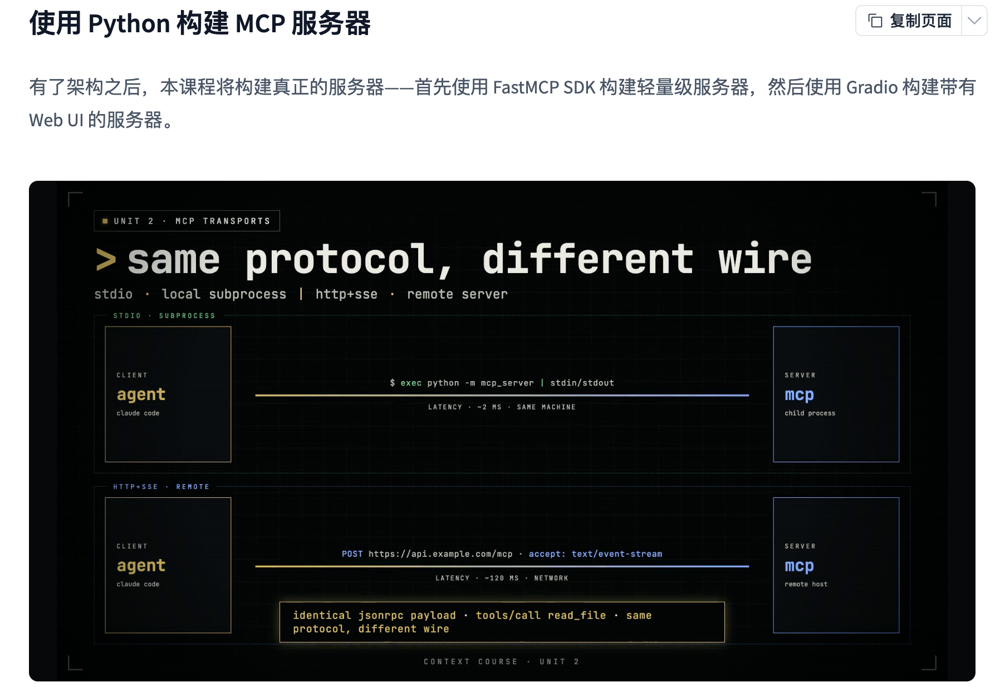
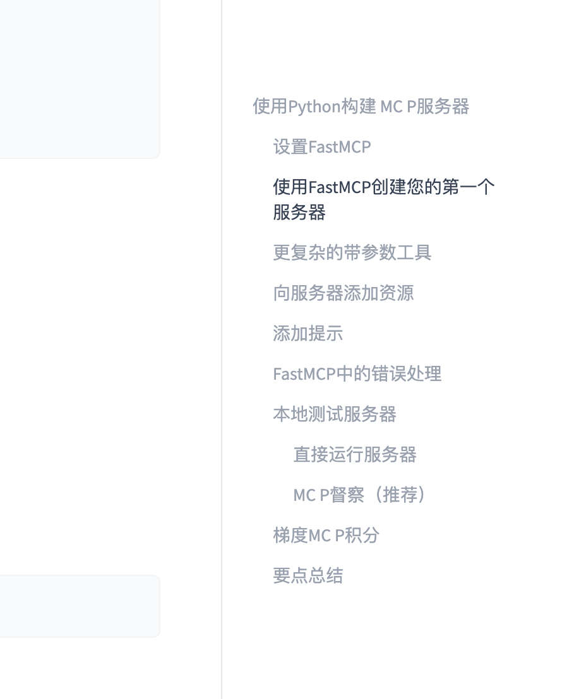
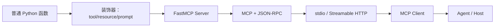

# 第40天：使用 Python 和 FastMCP 构建第一个 MCP 服务器

> [!abstract] 本章定位
> 第38天理解了 MCP 为什么存在，第39天理解了 Host、Client、Server、JSON-RPC 和 Transport。第40天开始真正写 Server。本章面向第一次接触 MCP 的学习者：先读懂课程两张图，再安装 FastMCP，最后亲手创建、运行和测试一个同时包含 Tool、Resource、Prompt 与错误处理的真实 MCP Server。

## 0. 学习资料、图片和代码

- 在线教材：[Building MCP Servers with Python](https://huggingface.co/learn/context-course/unit2/building-servers)
- GitHub 原文：[building-servers.mdx](https://github.com/huggingface/context-course/blob/main/units/en/unit2/building-servers.mdx)
- MCP Python SDK 稳定版：[PyPI - mcp](https://pypi.org/project/mcp/)
- MCP 官方构建教程：[Build an MCP server](https://modelcontextprotocol.io/docs/develop/build-server)
- 本地示例：[examples/40-fastmcp-server](../examples/40-fastmcp-server/README.md)

课程图片已经保存到仓库：

- [图片1：same protocol, different wire](assets/day40/01-same-protocol-different-wire.png)
- [图片2：课程章节大纲](assets/day40/02-course-outline.png)

---

## 1. 今天到底要学会什么？

今天不是继续手写 JSON-RPC，而是学习使用 SDK 把普通 Python 函数转换成标准 MCP 能力。

完成后应该能够：

```text
安装 MCP Python SDK
→ 创建 FastMCP 实例
→ 使用装饰器注册 Tool、Resource、Prompt
→ 依靠类型注解生成参数 Schema
→ 处理可预期错误
→ 使用 stdio 启动 Server
→ 使用官方 Client 或 Inspector 测试
→ 理解什么时候需要 Gradio Web UI
```

最重要的转变是：

```text
Day39：理解协议内部怎样工作
Day40：让 SDK 替我们正确完成协议工作
```

---

## 2. 图片1详细讲解：same protocol, different wire



图片标题是：

```text
same protocol, different wire
同一种协议，不同的传输线路
```

这里的：

```text
protocol = MCP 使用的 JSON-RPC 消息和方法语义
wire     = 消息实际经过的运输通道
```

### 2.1 图片上下两部分分别是什么？

上半部分表示本地 stdio：

```text
Agent / Client
      ↕ stdin / stdout
本机 MCP Server 子进程
```

下半部分表示远程 HTTP：

```text
Agent / Client
      ↕ HTTP 网络请求
远程 MCP Server
```

两边都可以传递同一种 MCP 调用，例如：

```json
{
  "jsonrpc": "2.0",
  "id": 10,
  "method": "tools/call",
  "params": {
    "name": "read_file",
    "arguments": {"path": "README.md"}
  }
}
```

改变的是它怎样到达 Server，而不是它要表达的业务含义。

### 2.2 上半部分：stdio + local subprocess

图片上方写着：

```text
stdio · local subprocess
```

意思是 Host 在本机启动一个 MCP Server 子进程：

```text
Host 执行：python calculator_server.py
```

然后通过两条标准流通信：

```text
Client → Server stdin：发送 JSON-RPC Request
Server → Client stdout：返回 JSON-RPC Response
```

特点：

- Client 和 Server 通常在同一台电脑；
- Server 经常由 Host 自动启动；
- 不需要开放网络端口；
- 延迟通常较低；
- 适合个人开发、本地文件和本机工具；
- Host 退出后，子进程通常也会退出。

图片中的 `~2 ms` 只是示意值，不是 MCP 保证的固定延迟。真实延迟取决于机器、代码、文件、数据库和底层 API。

### 2.3 为什么 stdio Server 直接运行后像“卡住”？

执行：

```bash
python calculator_server.py
```

终端可能没有继续输出，也不返回提示符。这通常不是卡死，而是：

```text
Server 正在等待 Client 从 stdin 发来 JSON-RPC 消息。
```

就像电话已经接通，但对方还没有说话。

### 2.4 stdio 为什么不能随便 print？

stdout 是协议专用通道。如果写：

```python
print("Server started")
```

Client 可能把这句话当成 JSON-RPC 消息解析，随后报 JSON 格式错误。

正确做法：

```python
import sys

print("Server started", file=sys.stderr)
```

或者使用确保输出到 stderr / 文件的 logging 配置。

### 2.5 下半部分：远程 HTTP

图片下方表示：

```text
Client 通过网络 POST 到远程 /mcp endpoint
Server 通过 JSON 或事件流返回消息
```

特点：

- Client 和 Server 可以不在同一台机器；
- Server 可以长期运行；
- 多个用户或 Agent 可以共享同一个服务；
- 适合公司 API、SaaS 和云部署；
- 需要处理认证、授权、TLS、网络超时和监控。

图片中的 `~120 ms` 同样只是示意，真实网络延迟可能更低，也可能高很多。

### 2.6 图片中的 HTTP+SSE 要怎样准确理解？

这里需要补充版本知识。

当前 MCP 远程标准主要是：

```text
Streamable HTTP
```

它使用统一 MCP endpoint，Client 通过 HTTP POST 发送消息，Server 可以返回：

- 普通 JSON Response；
- `text/event-stream` 的 SSE 流。

不要把它和早期、现已弃用的独立 `HTTP+SSE Transport` 完全等同。图片中的 `http+sse` 更适合看成“HTTP 远程传输可以使用 SSE 流”的简化视觉表达。

### 2.7 图片最下方为什么强调 identical JSON-RPC payload？

因为无论走 stdio 还是 HTTP，这些字段的意义不变：

```text
jsonrpc
id
method
params
result
error
```

所以 Server 的 Tool 业务逻辑不必为两个 Transport 各写一遍。FastMCP 负责协议与 Transport，开发者主要关注 Python 函数。

### 2.8 一张表看懂图片1

| 对比项 | stdio | Streamable HTTP |
|---|---|---|
| Server 位置 | 通常在本机 | 通常在远程 |
| 启动方式 | Host 启动子进程 | Server 独立部署运行 |
| 消息载体 | stdin / stdout | HTTP 请求、JSON 或 SSE |
| 是否开放端口 | 否 | 是 |
| 典型用户 | 单机、单用户 | 团队、多用户 |
| 认证 | 常依赖本机权限 | 通常需要 OAuth 或 Token |
| 网络故障 | 较少 | 必须考虑 |
| 协议业务语义 | MCP | MCP |

---

## 3. FastMCP 是什么？

FastMCP 是 MCP Python SDK 提供的高层 Server API。它把普通 Python 函数转换成 MCP 能力，并替开发者处理大量协议细节。

可以类比 FastAPI：

```text
FastAPI：把 Python 函数变成 HTTP API
FastMCP：把 Python 函数变成 MCP Tool / Resource / Prompt
```

这个类比只用于理解，不代表二者的协议和使用场景相同。

### 3.1 不使用 SDK 时需要处理什么？

如果手写 MCP Server，需要处理：

- JSON-RPC 解析；
- Request、Response、Notification；
- 初始化与版本协商；
- 能力声明；
- `tools/list`；
- `tools/call`；
- `resources/list` 和 `resources/read`；
- `prompts/list` 和 `prompts/get`；
- 参数 Schema；
- 错误格式；
- stdio 或 HTTP Transport；
- 生命周期。

### 3.2 FastMCP 自动做什么？

FastMCP 能够：

- 从函数名称得到能力名称；
- 从 docstring 得到描述；
- 从类型注解生成 JSON Schema；
- 使用 Pydantic 校验调用参数；
- 注册 Tool、Resource 和 Prompt；
- 处理 MCP 初始化和方法分发；
- 序列化返回结果；
- 默认通过 stdio 运行；
- 也可以运行 Streamable HTTP。

### 3.3 FastMCP 不会自动做什么？

它不会替你决定：

- 业务函数应该做什么；
- 谁有权限调用；
- 是否允许删除和写入；
- 外部 API Key 怎样管理；
- 怎样重试和限流；
- 日志是否泄露隐私；
- 返回结果是否过大；
- 工具描述是否足够清楚；
- 生产环境怎样部署和监控。

SDK 减少协议样板代码，但不会自动解决业务与安全设计。

---

## 4. 安装 FastMCP：小白完整步骤

### 4.1 第一步：确认 Python

```bash
python3 --version
```

MCP Python SDK 要求 Python 3.10 或更高。这个项目推荐 Python 3.11；本次示例也已在 Python 3.14 环境验证。

### 4.2 第二步：创建虚拟环境

macOS / Linux：

```bash
python3 -m venv .venv
source .venv/bin/activate
```

Windows PowerShell：

```powershell
py -m venv .venv
.venv\Scripts\Activate.ps1
```

激活后可以检查：

```bash
which python
python --version
```

Windows 可以使用：

```powershell
where python
```

### 4.3 第三步：安装 SDK 和 CLI

课程命令：

```bash
python -m pip install "mcp[cli]"
```

这里包含两部分：

```text
mcp       = Python SDK 与 FastMCP
[cli]     = 额外安装 mcp 命令行开发工具
```

只写：

```bash
pip install mcp
```

可能能运行 Server，但缺少课程后面使用的部分 CLI 依赖。因此学习阶段使用 `mcp[cli]` 更方便。

### 4.4 为什么本项目要锁定版本？

截至 2026-07-20：

- PyPI 稳定版为 `mcp 1.28.1`；
- Hugging Face 课程使用 1.x 的 `FastMCP` API；
- MCP Python SDK 2.0 仍处于 beta，主 API 正在变化。

所以本项目使用：

```text
mcp[cli]==1.28.1
```

安装：

```bash
python -m pip install -r examples/40-fastmcp-server/requirements.txt
```

以后升级到 v2 时，应阅读官方迁移指南，不要只修改版本号后假设代码完全兼容。

### 4.5 第四步：确认安装成功

```bash
python -c "import mcp; print('mcp import ok')"
mcp --help
python -m pip show mcp
```

如果出现 `mcp: command not found`，常见原因是：

- 虚拟环境没有激活；
- 安装的是 `mcp` 而不是 `mcp[cli]`；
- 执行命令的 Python 与安装包的 Python 不是同一个；
- IDE 选择了错误解释器。

优先使用：

```bash
python -m pip install ...
```

而不是单独写 `pip`，这样更容易保证 pip 属于当前 Python。

### 4.6 uv 用户怎样安装？

如果使用 uv：

```bash
uv add "mcp[cli]>=1.28,<2"
```

运行：

```bash
uv run python calculator_server.py
uv run mcp dev calculator_server.py
```

本项目为了让初学者先掌握 Python 原生虚拟环境，示例以 `venv + pip` 为主。

---

## 5. 使用 FastMCP 创建第一个 Server

最小代码：

```python
from mcp.server.fastmcp import FastMCP

mcp = FastMCP("calculator")


@mcp.tool()
def add(a: int, b: int) -> int:
    """Add two numbers together."""
    return a + b


if __name__ == "__main__":
    mcp.run(transport="stdio")
```

### 5.1 第一行：导入 FastMCP

```python
from mcp.server.fastmcp import FastMCP
```

这条导入路径对应稳定版 MCP Python SDK 1.x。

### 5.2 创建 Server 实例

```python
mcp = FastMCP("calculator")
```

`calculator` 是 Server 名称，用来：

- 标识当前 MCP Server；
- 帮助 Client 和日志识别它；
- 区分同时连接的多个 Server。

它不是 Tool 名称，也不是网络域名。

### 5.3 使用装饰器注册 Tool

```python
@mcp.tool()
def add(a: int, b: int) -> int:
    """Add two numbers together."""
    return a + b
```

`@mcp.tool()` 会在函数定义时完成注册。FastMCP 会读取：

```text
函数名 add        → Tool 名称
docstring         → Tool 描述
a: int, b: int    → 输入 JSON Schema
-> int            → 返回值信息
函数体            → 实际执行逻辑
```

大致生成：

```json
{
  "name": "add",
  "description": "Add two numbers together.",
  "inputSchema": {
    "type": "object",
    "properties": {
      "a": {"type": "integer"},
      "b": {"type": "integer"}
    },
    "required": ["a", "b"]
  }
}
```

### 5.4 启动 Server

```python
if __name__ == "__main__":
    mcp.run(transport="stdio")
```

这里完成：

1. 启动 FastMCP Server；
2. 使用 stdio Transport；
3. 等待 MCP Client 连接；
4. 处理初始化、发现和调用；
5. 把结果转换成 MCP Response。

课程代码使用 `mcp.run()`，在 FastMCP v1 中默认也是 stdio。初学阶段显式写 `transport="stdio"` 更容易理解。

---

## 6. 图片2详细讲解：第40天课程大纲



图片2列出了完整学习路线。部分中文是网页机器翻译，下面同时给出准确含义。

### 6.1 使用 Python 构建 MCP 服务器

这是本章总目标：从“理解 MCP”进入“实现 MCP”。

今天不会继续手写底层 JSON-RPC Server，而是使用 FastMCP 构建符合协议的真实 Server。

### 6.2 设置 FastMCP

这一节回答环境问题：

- Python 版本；
- 虚拟环境；
- `mcp[cli]` 是什么；
- 怎样验证安装；
- 怎样避免安装到错误解释器；
- 怎样处理 v1 与 v2 API 差异。

### 6.3 使用 FastMCP 创建第一个服务器

从最小计算器开始：

```text
FastMCP 实例
→ @mcp.tool()
→ Python 函数
→ mcp.run()
```

目标是先跑通最小闭环，不要一开始连接数据库和复杂 API。

### 6.4 更复杂的带参数工具

课程用文件读取、行数统计和目录列表说明：

- 函数参数怎样变成 Tool 参数；
- 类型注解怎样变成 Schema；
- docstring 怎样帮助模型正确调用；
- 返回类型怎样影响结果；
- 怎样捕获文件错误。

本项目使用计算与 JSON 解析，避免示例默认获得任意文件读取权限。

#### 类型注解的价值

```python
def add(a: int, b: int) -> int:
```

如果 Client 传入：

```json
{"a": "hello", "b": 5}
```

FastMCP/Pydantic 会在进入函数前发现类型不符合要求。业务函数无需自己写一堆 `isinstance`。

#### Literal 限制枚举参数

```python
from typing import Literal

def calculate(
    operation: Literal["add", "subtract", "multiply", "divide"],
    a: float,
    b: float,
) -> dict:
```

模型只能从四种操作中选择，Schema 更明确，错误调用更少。

### 6.5 向服务器添加资源

使用：

```python
@mcp.resource("course://day40/guide")
def day40_guide() -> str:
    return "..."
```

Resource 适合：

- 只读文档；
- 配置说明；
- 项目状态；
- 数据库 Schema；
- 半静态上下文。

它通过 URI 标识，而不是像 Tool 一样使用名称和 arguments 执行动作。

#### 课程中“Resource 不需要参数”需要补充

固定 Resource 确实不需要参数：

```python
@mcp.resource("course://day40/guide")
```

但 FastMCP 也支持 Resource Template：

```python
@mcp.resource("greeting://{name}")
def greeting(name: str) -> str:
    return f"Hello, {name}!"
```

其中 `{name}` 来自 URI 模板。它不是 `tools/call` 的 arguments，但 Resource 也可以具有动态 URI 参数。因此“所有 Resource 都不能带参数”并不准确。

### 6.6 添加提示

使用：

```python
@mcp.prompt()
def explain_fastmcp(topic: str, level: str = "beginner") -> str:
    return f"Explain {topic} to a {level} learner."
```

Prompt 适合保存：

- 代码审查模板；
- 安全审计步骤；
- 内容写作框架；
- 数据分析要求；
- 可复用交互入口。

Prompt 只返回指令或消息，不会像 Tool 一样直接执行外部动作。

### 6.7 FastMCP 中的错误处理

错误可以分成三类：

#### 第一类：参数格式错误

例如 `a` 应当是数字，却传入无法转换的文本。这类问题通常由 FastMCP/Pydantic 自动校验。

#### 第二类：可预期业务错误

例如除数为 0、文件不存在、用户余额不足。可以返回清晰的结构化结果：

```python
return {
    "ok": False,
    "error": "denominator must not be zero",
}
```

这样 Tool 调用本身成功完成，但业务结果告诉 Agent 操作不可执行。

#### 第三类：意外系统错误

例如数据库断开、程序 Bug、依赖服务异常。不要使用一个大而宽泛的 `except Exception` 悄悄返回空列表，这会让 Agent 误以为业务结果真的为空。

应当：

- 记录脱敏日志；
- 返回有限但明确的错误；
- 区分可重试与不可重试；
- 不泄露密钥、堆栈和内部路径；
- 对写操作考虑幂等和补偿。

### 6.8 本地测试服务器

图片下包含两个方法。

#### 方法一：直接运行服务器

```bash
python calculator_server.py
```

它适合确认：

- import 没问题；
- Server 能启动；
- stdio 没被日志污染。

但手工在终端输入 JSON-RPC 很麻烦，所以还需要 Inspector 或自动 Client。

#### 方法二：MCP Inspector（推荐）

图片中的“MCP 督察”指的是：

```text
MCP Inspector
MCP 检查器 / 调试器
```

运行：

```bash
mcp dev examples/40-fastmcp-server/calculator_server.py
```

Inspector 提供浏览器界面，可以：

- 查看 Server 信息；
- 查看 Tool Schema；
- 填参数调用 Tool；
- 读取 Resource；
- 实例化 Prompt；
- 查看成功结果和错误。

`mcp dev` 通常会调用 Node.js / npx 启动 Inspector，因此还需要本机安装 Node.js。

### 6.9 “梯度 MCP 积分”是什么？

这是机器翻译错误，原文是：

```text
Gradio MCP Integration
Gradio 与 MCP 集成
```

Gradio 是快速创建 AI Web UI 的 Python 框架。课程演示：

```python
demo.launch(mcp_server=True)
```

启用后，同一个函数可以同时成为：

- 浏览器里人能点击使用的功能；
- Agent 能通过 MCP 调用的 Tool。

适合：

- 既要给人使用，也要给 Agent 使用；
- 希望快速获得可视化测试界面；
- 要部署到 Hugging Face Spaces。

如果只服务 Agent，不需要 Web UI，FastMCP 通常更简单。

### 6.10 要点总结

图片2最终要让学习者掌握：

```text
类型注解 → 参数 Schema
docstring → Tool / Resource / Prompt 描述
装饰器 → 注册 MCP 能力
mcp.run → 启动协议与 Transport
Inspector / Client → 验证 Server 行为
Gradio → 可选的人类 Web UI
```

---

## 7. 本项目完整 FastMCP 示例

目录：

```text
examples/40-fastmcp-server/
├── README.md
├── requirements.txt
├── calculator_server.py
├── test_client.py
└── gradio_app.py
```

### 7.1 Server 公开了什么？

| 类型 | 名称或 URI | 功能 |
|---|---|---|
| Tool | `add` | 两个数字相加 |
| Tool | `calculate` | 加减乘除与除零业务错误 |
| Tool | `parse_json` | 解析 JSON 并返回明确错误位置 |
| Resource | `course://day40/guide` | 固定学习指南 |
| Resource Template | `greeting://{name}` | 根据 URI 参数生成问候语 |
| Prompt | `explain_fastmcp` | 根据主题和水平生成解释要求 |

### 7.2 为什么同时写简单 Tool 和复杂 Tool？

`add` 用于理解最小结构：

```python
@mcp.tool()
def add(a: float, b: float) -> float:
    return a + b
```

`calculate` 用于理解：

- `Literal` 参数限制；
- 多个分支；
- 结构化字典结果；
- 可预期业务错误；
- Tool 成功与业务成功的区别。

### 7.3 Tool 调用成功不等于业务成功

除以 0 时返回：

```json
{
  "ok": false,
  "error": "denominator must not be zero"
}
```

这表示：

```text
MCP 调用过程正常完成；
函数也正常执行；
但业务规则拒绝了该计算。
```

这与 Server 崩溃或协议错误不同。

---

## 8. 怎样运行和测试？

### 8.1 安装依赖

```bash
python3 -m venv .venv
source .venv/bin/activate
python -m pip install -r examples/40-fastmcp-server/requirements.txt
```

### 8.2 运行自动测试

```bash
python examples/40-fastmcp-server/test_client.py
```

测试程序会：

```text
启动 Server 子进程
→ 建立 stdio
→ initialize
→ tools/list
→ tools/call
→ resources/list
→ resources/read
→ resources/templates/list
→ prompts/list
→ prompts/get
→ 检查结果
→ 关闭 Session 和子进程
```

成功时最后输出：

```text
Day40 FastMCP smoke test passed.
```

### 8.3 为什么自动 Client 比“程序能启动”更可靠？

Server 能启动只能证明语法和 import 基本正确，不能证明：

- Tool 已正确注册；
- Schema 符合预期；
- Tool 能被真实 MCP Client 调用；
- Resource URI 正确；
- Prompt 参数可用；
- 返回内容能够序列化。

自动 Client 测试的是完整协议闭环。

### 8.4 使用 Inspector

```bash
source .venv/bin/activate
mcp dev examples/40-fastmcp-server/calculator_server.py
```

建议依次测试：

1. `add(a=7, b=5)`；
2. `calculate(operation="multiply", a=6, b=8)`；
3. `calculate(operation="divide", a=10, b=0)`；
4. `add(a="hello", b=5)`，观察参数校验；
5. 读取 `course://day40/guide`；
6. 读取 `greeting://Rudy`；
7. 获取 `explain_fastmcp` Prompt。

---

## 9. 可选：Gradio + MCP

安装：

```bash
python -m pip install "gradio[mcp]"
```

运行：

```bash
python examples/40-fastmcp-server/gradio_app.py
```

默认得到：

```text
Web UI：       http://127.0.0.1:7860
MCP endpoint： http://127.0.0.1:7860/gradio_api/mcp/
```

`mcp_server=True` 的含义是：

```text
Gradio 继续提供 Web UI
+
把合适的函数暴露为 MCP Tool
+
自动处理 JSON-RPC 和远程 endpoint
```

今天只需要理解核心思路。Gradio 的 Resource、部署、认证和 Spaces 会在后续专门章节学习。

---

## 10. 初学者最常见的错误

### 10.1 `ModuleNotFoundError: No module named 'mcp'`

原因：当前 Python 环境没有安装 MCP SDK。

检查：

```bash
which python
python -m pip show mcp
```

解决：激活正确虚拟环境后重新安装。

### 10.2 `mcp: command not found`

原因可能是没有安装 `[cli]` 或虚拟环境未激活。

```bash
python -m pip install "mcp[cli]==1.28.1"
```

### 10.3 Import 路径与教材不同

如果以后安装到 MCP SDK v2，可能发现：

```python
from mcp.server.fastmcp import FastMCP
```

不再是新版本主推 API。先运行：

```bash
python -m pip show mcp
```

确认版本，再阅读对应版本文档。不要混用 v1 教材与 v2 示例。

### 10.4 直接运行后没有任何输出

stdio Server 正在等待 Client，属于正常行为。使用 Inspector 或 `test_client.py` 测试。

### 10.5 Inspector 无法启动

检查：

- `mcp[cli]` 是否安装；
- Node.js / npx 是否安装；
- Server 文件路径是否正确；
- Python 是否属于当前虚拟环境。

### 10.6 Server 返回 JSON 解析错误

检查代码是否向 stdout 打印日志。stdio 的 stdout 只能传输协议消息。

### 10.7 Tool 能发现但调用失败

检查：

- 参数名是否一致；
- 参数类型是否符合 Schema；
- `Literal` 是否传入允许值；
- 返回对象是否可序列化；
- 底层文件、网络和 API 是否可访问；
- stderr 日志是否有真实错误。

### 10.8 Resource 找不到

区分：

```text
固定 Resource：course://day40/guide
Resource Template：greeting://{name}
具体模板实例：greeting://Rudy
```

Template 通常出现在 Resource Templates 列表，不一定出现在固定 Resources 列表。

---

## 11. 课程示例之外必须补充的生产意识

### 11.1 不要默认提供任意文件读取

课程的 `read_file(path)` 很适合演示参数 Tool，但直接允许模型读取任意绝对路径风险较大。

真实项目应该：

- 只允许指定根目录；
- 对路径做 `resolve()`；
- 阻止 `../` 越界；
- 限制文件类型和大小；
- 不读取 `.env`、SSH Key 等敏感文件；
- 记录经过脱敏的访问日志。

### 11.2 Tool 描述是路由信息

模型根据名称、描述和 Schema 选择 Tool。描述不能只写：

```text
Process data.
```

应该说明：

- 做什么；
- 什么时候使用；
- 参数含义；
- 是否有副作用；
- 返回什么；
- 不负责什么。

### 11.3 不要用返回空列表掩盖错误

```python
except Exception:
    return []
```

Agent 会把“执行失败”误解成“业务数据为空”。应返回或抛出可区分的错误。

### 11.4 写操作需要额外保护

发送消息、创建工单、删除文件等 Tool 应考虑：

- 最小权限；
- 用户确认；
- 幂等键；
- 超时；
- 重试边界；
- 审计日志；
- 撤销或补偿方案。

### 11.5 返回内容要控制大小

不要一次返回整个数据库或数百 MB 文件。应使用：

- 分页；
- 条数上限；
- 摘要；
- Resource URI；
- 文件引用；
- 明确截断提示。

---

## 12. FastMCP 心智模型



开发者主要负责左侧：

```text
函数业务逻辑
类型注解
docstring
错误和权限设计
```

FastMCP 主要负责中间层：

```text
注册能力
生成 Schema
参数校验
协议方法
序列化
Transport
```

Host 和 Agent 负责右侧：

```text
理解用户目标
选择能力
执行权限策略
把结果交回模型
生成最终回答
```

---

## 13. 面试题

### 13.1 FastMCP 解决什么问题？

参考回答：

> FastMCP 是 MCP Python SDK 的高层 Server API。它根据 Python 函数、类型注解和 docstring 自动生成 Tool 等能力的 Schema，并处理 MCP 初始化、方法分发、参数校验、结果序列化和 Transport，使开发者能把重点放在业务函数与安全边界上。

### 13.2 `@mcp.tool()` 做了什么？

参考回答：

> 它把 Python 函数注册为 MCP Tool。FastMCP 使用函数名作为默认 Tool 名称，使用 docstring 生成描述，使用类型注解生成输入 Schema，并在 Client 调用时完成参数校验和函数执行。

### 13.3 Tool、Resource、Prompt 怎样选择？

参考回答：

> 需要执行计算、查询或副作用操作时使用 Tool；需要通过 URI 提供只读上下文时使用 Resource；需要提供可复用的指令模板或交互入口时使用 Prompt。判断重点是能力的语义和控制方式，而不是哪个装饰器写起来更方便。

### 13.4 为什么 stdio Server 不能随便向 stdout 打日志？

参考回答：

> 因为 stdout 是 stdio Transport 的协议通道，Client 会把其中内容当成 JSON-RPC 消息。普通日志会破坏消息流，应写入 stderr 或日志文件。

### 13.5 为什么需要 MCP Inspector？

参考回答：

> Inspector 是 MCP Server 的交互式调试客户端，可以执行初始化和能力发现，展示 Tool Schema，并手工调用 Tools、读取 Resources、获取 Prompts。它比只观察 Server 是否启动更能验证真实协议行为。

### 13.6 FastMCP 与 Gradio 怎样选择？

参考回答：

> 如果只需要给 Agent 提供 MCP 能力，优先使用 FastMCP，结构更直接；如果同一组函数既要给 Agent 调用，又要给用户通过浏览器操作，可以考虑 Gradio 的 MCP 集成。Web UI 会增加部署、认证和暴露面，不应在没有需求时强行添加。

---

## 14. 今日检查清单

- [ ] 能解释图片1的上下两种 Transport；
- [ ] 知道图片中的延迟只是示意；
- [ ] 能区分 Streamable HTTP 与旧 HTTP+SSE；
- [ ] 知道 FastMCP 自动处理什么；
- [ ] 知道 FastMCP 不负责什么；
- [ ] 能创建并激活虚拟环境；
- [ ] 能安装 `mcp[cli]`；
- [ ] 知道课程使用稳定版 v1 API；
- [ ] 能创建 `FastMCP` 实例；
- [ ] 能编写 `@mcp.tool()`；
- [ ] 能解释类型注解和 docstring 的作用；
- [ ] 能编写固定 Resource；
- [ ] 能编写 Resource Template；
- [ ] 能编写 Prompt；
- [ ] 能区分参数校验、业务错误和系统错误；
- [ ] 能使用官方 Client 运行自动测试；
- [ ] 能使用 Inspector 测试三种能力；
- [ ] 知道 stdio 日志必须避开 stdout；
- [ ] 能解释 Gradio MCP Integration；
- [ ] 知道任意文件读取 Tool 的安全风险。

---

## 15. 最终总结

第40天完成了从“理解 MCP”到“实现 MCP”的跨越。

图片1告诉我们：

```text
同一个 MCP 协议可以运行在不同 Transport 上；
stdio 适合本地子进程，Streamable HTTP 适合远程服务。
```

FastMCP 告诉我们：

```text
Python 函数
+ 类型注解
+ docstring
+ 装饰器
= 可被 Agent 发现和调用的 MCP 能力
```

图片2给出的实现顺序是：

```text
安装 FastMCP
→ 创建第一个 Tool
→ 增加复杂参数
→ 增加 Resource
→ 增加 Prompt
→ 处理错误
→ 直接运行
→ 使用 Inspector 测试
→ 按需增加 Gradio Web UI
```

一句话收尾：

> FastMCP 让我们不再手写协议样板代码，但高质量 MCP Server 仍取决于清晰的能力边界、准确的 Schema、可区分的错误以及可靠的权限与测试设计。
