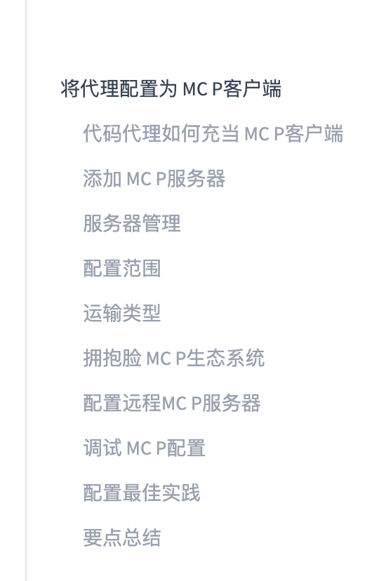

# 第41天：将代码代理配置为 MCP 客户端

> [!abstract] 本章定位
> 第40天我们写好了 MCP Server。第41天换到另一边：让 Codex、Claude Code、OpenCode 或 Pi 成为 MCP Client，知道 Server 在哪里、如何启动或连接它，以及怎样安全地管理配置。本章以 Codex 为主线，同时说明其他客户端的差异，面向第一次配置 MCP 的学习者。

## 0. 学习资料、课程大纲和代码

- 在线教材：[Configuring Agents as MCP Clients](https://huggingface.co/learn/context-course/unit2/mcp-clients)
- GitHub 原文：[mcp-clients.mdx](https://github.com/huggingface/context-course/blob/main/units/en/unit2/mcp-clients.mdx)
- Codex 官方文档：[Model Context Protocol](https://learn.chatgpt.com/docs/extend/mcp)
- 本地示例：[examples/41-mcp-clients](../examples/41-mcp-clients/README.md)
- 上一章：[Day40 - 使用 Python 和 FastMCP 构建第一个 MCP 服务器](Day40-使用Python和FastMCP构建第一个MCP服务器.md)

课程大纲截图已经保存到仓库：



截图里的“运输类型”是机器翻译，更自然、准确的说法是“传输类型”；“拥抱脸 MCP 生态系统”应理解为“Hugging Face MCP 生态系统”。

---

## 1. 今天到底要学会什么？

完成本章后，你应该能够：

```text
分清 Host、Client、Server
→ 选择 stdio 或 Streamable HTTP
→ 把 Server 写入代理配置
→ 查看、停用、删除与认证 Server
→ 让 Agent 发现并调用工具
→ 按顺序排查连接问题
→ 避免把密钥提交到公开仓库
```

一句话概括：

```text
第40天：造一个插座（Server）
第41天：告诉电器插座在哪里、该怎么插（Client 配置）
```

---

## 2. 代码代理如何充当 MCP Client？

### 2.1 三个角色再确认

```text
你
 ↓ 提出任务
Host：Codex / Claude Code / OpenCode 的完整应用
 ↓ 管理会话、模型、权限和一个或多个连接
MCP Client：Host 内部与某个 Server 对话的协议组件
 ↓ JSON-RPC over stdio 或 Streamable HTTP
MCP Server：公开 Tools、Resources、Prompts
```

日常表达中，我们常说“Codex 是 MCP Client”。严格说，Codex 是 Host，内部为每个 MCP Server 建立 Client 连接。初学阶段把整个代码代理简称为 Client 没问题，但理解架构时要知道这层区别。

### 2.2 配置以后发生了什么？

以“让 Codex 用计算器”为例：

```text
1. Host 读取 config.toml
2. Client 启动本地进程，或连接远程 URL
3. 双方 initialize，协商协议版本和能力
4. Client 请求 tools/list、resources/list、prompts/list
5. Server 返回名称、说明和参数 Schema
6. 你说“计算 18 + 24”
7. 模型根据工具说明决定调用 add
8. Client 发送 tools/call
9. Server 执行并返回 42
10. 模型把工具结果组织成自然语言答复
```

“配置成功”只代表地址和启动方式写对了；“连接成功”代表初始化完成；“工具可用”还要求能力发现成功；“Agent 真正使用工具”则还取决于工具描述、模型判断和权限策略。这四层不要混为一谈。

### 2.3 Client 在背后替我们做了什么？

- 建立、保持和关闭连接；
- 完成 MCP 初始化与能力协商；
- 发现 Tools、Resources 和 Prompts；
- 把 Tool 的 JSON Schema 提供给模型；
- 把模型选择转换为 `tools/call`；
- 匹配请求 ID 与响应；
- 处理超时、协议错误、断线和认证；
- 把结果送回模型继续推理。

所以你不需要在日常使用中手写 JSON-RPC。

---

## 3. 添加 MCP Server：先掌握最小模型

不管使用哪一种代码代理，一项 Server 配置都可以归纳为：

```text
名字 + 传输类型 + 启动命令或 URL + 可选认证/环境变量
```

### 3.1 Codex：添加本地 stdio Server

本章提供了 [local_server.py](../examples/41-mcp-clients/local_server.py)。先确保已经安装 Day40 使用的 SDK：

```bash
cd /Users/yuyuan/Desktop/agents-learn
source .venv/bin/activate
python -m pip install "mcp[cli]"
```

添加 Server：

```bash
codex mcp add day41-learning -- \
  /Users/yuyuan/Desktop/agents-learn/.venv/bin/python \
  /Users/yuyuan/Desktop/agents-learn/examples/41-mcp-clients/local_server.py
```

逐段解释：

| 片段 | 含义 |
|---|---|
| `codex mcp add` | 新增 MCP Server 配置 |
| `day41-learning` | 这项配置的唯一名称 |
| `--` | 后面的内容全部属于 Server 启动命令 |
| `.venv/bin/python` | 使用装有 MCP SDK 的 Python |
| `local_server.py` | 要启动的 stdio Server 脚本 |

为什么建议绝对路径？因为 Host 启动时的当前目录未必是项目目录。相对路径在你的终端里能运行，换一个启动位置就可能找不到文件。

### 3.2 Codex：添加远程 Streamable HTTP Server

```bash
codex mcp add my-api --url https://api.example.com/mcp
```

如果 Server 使用 Bearer Token：

```bash
export MY_API_TOKEN="真实令牌只放在本机环境"

codex mcp add my-api \
  --url https://api.example.com/mcp \
  --bearer-token-env-var MY_API_TOKEN
```

这里配置的是“保存令牌的环境变量名称”，不是令牌本身。

如果 Server 支持 OAuth：

```bash
codex mcp login my-api
```

### 3.3 直接编辑 Codex 的 config.toml

本地 stdio：

```toml
[mcp_servers.day41_learning]
command = "/absolute/path/to/.venv/bin/python"
args = ["/absolute/path/to/local_server.py"]
cwd = "/absolute/path/to/project"
startup_timeout_sec = 10
tool_timeout_sec = 60
enabled = true
required = false
```

远程 HTTP：

```toml
[mcp_servers.my_api]
url = "https://api.example.com/mcp"
bearer_token_env_var = "MY_API_TOKEN"
enabled = true
```

本章的完整模板是 [codex-project.example.toml](../examples/41-mcp-clients/configs/codex-project.example.toml)。

> [!warning] 公开仓库安全提醒
> 课程 GitHub 原文有把 `GITHUB_TOKEN = "ghp_xxxxx"` 放在配置中的演示。占位符本身无害，但真实 Token 绝不能这样提交。优先使用 `bearer_token_env_var`、`env_http_headers`，或在仅存于本机且已忽略的文件中注入环境变量。

### 3.4 四种代码代理的配置入口

| 客户端 | 本地 Server | 远程 Server | 常用配置位置 |
|---|---|---|---|
| Claude Code | `claude mcp add --transport stdio ...` | `--transport http` | `~/.claude.json`、项目 `.mcp.json` |
| Codex | `codex mcp add name -- command` | `codex mcp add name --url URL` | `~/.codex/config.toml`、项目 `.codex/config.toml` |
| OpenCode | `type: "local"` | `type: "remote"` | 项目 `opencode.json` |
| Pi | 通过 `pi-mcp-adapter` | 适配器配置 URL | `.mcp.json` 等多级配置 |

语法不同，核心模型始终相同：给 Server 起名字，再给出命令或 URL。

---

## 4. Server 管理

### 4.1 Codex 常用命令

```bash
# 列出所有已配置 Server
codex mcp list

# 查看某个 Server 的详细信息
codex mcp get day41-learning

# 以 JSON 输出，便于程序处理
codex mcp get day41-learning --json

# 删除配置
codex mcp remove day41-learning

# 远程 OAuth 登录与退出
codex mcp login my-api
codex mcp logout my-api
```

在 Codex 会话中可以使用 `/mcp` 查看已连接的 Server。修改配置后，如果当前会话没有刷新，重新进入会话最直接。

### 4.2 暂停和删除有什么区别？

```toml
[mcp_servers.my_api]
url = "https://api.example.com/mcp"
enabled = false
```

- `enabled = false`：配置还在，暂时不连接，适合排障或偶尔使用；
- `codex mcp remove`：删除配置，之后要使用必须重新添加。

### 4.3 required 的含义

```toml
required = true
```

表示这个 Server 初始化失败时，Codex 启动也应失败。只有缺少该 Server 就无法工作的关键流程才适合设为 `true`；普通辅助工具通常保持 `false`，避免一个外部服务故障拖垮整个会话。

### 4.4 控制暴露的工具和审批

```toml
enabled_tools = ["read_issue", "search_docs"]
disabled_tools = ["delete_issue"]
default_tools_approval_mode = "prompt"
```

工具越多，模型选择成本和误用面越大。只开启任务所需能力，写操作要求确认，是更稳妥的默认值。

---

## 5. 配置范围：Global 还是 Project？

Codex 有两个最常用范围：

| 范围 | 位置 | 适合什么 | 是否适合提交 Git |
|---|---|---|---|
| 用户级 / Global | `~/.codex/config.toml` | 每个项目都要用的个人工具 | 否 |
| 项目级 / Project | `<repo>/.codex/config.toml` | 当前仓库和团队共同需要的工具 | 可以，但不能含密钥 |

项目级配置只会在受信任的项目中加载，这是为了避免你打开陌生仓库时，它悄悄启动任意本地命令。

选择方法：

```text
所有项目都用？ → 用户级
只服务当前项目？ → 项目级
团队都应共享？   → 项目级 + 提交无密钥模板
包含个人密钥？   → 不提交，改用环境变量
```

`codex mcp add` 当前没有 `--scope` 参数，通常用于管理用户级配置。要建立仓库共享配置，直接创建 `.codex/config.toml` 更清楚。不要把 Claude Code 的 `--scope` 参数照搬给 Codex。

---

## 6. 传输类型：同一协议，两种接法

### 6.1 stdio

```text
Codex ──stdin/stdout──> 本机 Python/Node MCP 子进程
```

适合：

- 本地开发与学习；
- 读取本机文件、Git 状态、数据库工具；
- 不想开放网络端口；
- 每个用户自行启动一份 Server。

注意：stdout 是 MCP 消息通道，Server 日志应写 stderr。Server 直接运行后一直等待输入通常不是卡死。

### 6.2 Streamable HTTP

```text
Codex ──HTTPS──> 云端或局域网 MCP Server
```

适合：

- Hugging Face Spaces 等云部署；
- 多人共享；
- Server 独立更新；
- 需要 OAuth、Bearer Token 或网关控制。

当前远程标准是 Streamable HTTP。旧版独立 SSE Transport 已弃用；不要把“响应中可以使用 SSE 流”和“旧版 SSE Transport”混成同一件事。

### 6.3 快速选择表

| 问题 | 选 stdio | 选 Streamable HTTP |
|---|---:|---:|
| Server 只在本机 | ✅ | |
| 需要直接访问本机资源 | ✅ | |
| 多人共同使用 | | ✅ |
| 部署在 Hugging Face Spaces | | ✅ |
| 不想运维网络服务 | ✅ | |
| 需要集中认证、更新和监控 | | ✅ |

传输方式不会改变 Tool、Resource、Prompt 的业务定义，它只改变消息怎样抵达 Server。

---

## 7. Hugging Face MCP 生态系统

Hugging Face 官方 MCP Server 可以让 Agent 搜索模型和数据集、读取仓库文件、查询 Model Card，以及浏览 Hub 内容。

Codex 配置示例：

```toml
[mcp_servers.hf_mcp]
url = "https://huggingface.co/mcp?login"
```

或使用 CLI：

```bash
codex mcp add hf-mcp --url "https://huggingface.co/mcp?login"
```

涉及账户权限时，按服务页面提示完成认证。配置前可以访问 [Hugging Face MCP 设置页](https://huggingface.co/settings/mcp) 查看当时最新的官方地址和客户端示例。

不要因为 Server 名为“Hugging Face”就默认它可以访问你账号中的所有内容。实际权限取决于认证方式、授权范围和 Server 暴露的能力。

---

## 8. 配置远程 MCP Server

假设第40天的 Server 已部署到 Hugging Face Space：

```text
https://username-day40-mcp.hf.space/mcp
```

Codex 配置：

```toml
[mcp_servers.day40_remote]
url = "https://username-day40-mcp.hf.space/mcp"
startup_timeout_sec = 20
tool_timeout_sec = 60
enabled = true
```

如果服务需要 Token：

```bash
export HF_TOKEN="你的 Token"
```

```toml
[mcp_servers.day40_remote]
url = "https://username-day40-mcp.hf.space/mcp"
bearer_token_env_var = "HF_TOKEN"
```

需要分清三层地址：

```text
Space 页面：https://username-day40-mcp.hf.space/
MCP endpoint：https://username-day40-mcp.hf.space/mcp
代码仓库：https://huggingface.co/spaces/username/day40-mcp
```

Client 需要的是 MCP endpoint，不能把展示页面或仓库地址代替它。

---

## 9. 调试 MCP 配置：从下往上排查

### 第1步：配置是否被读取？

```bash
codex mcp list
codex mcp get day41-learning --json
```

如果列表里没有：检查文件位置、TOML 语法、Server 名称，以及项目是否已被信任。

### 第2步：本地命令能否启动？

把配置中的 `command + args` 原样放到终端执行：

```bash
/absolute/path/to/.venv/bin/python \
  /absolute/path/to/local_server.py
```

立即报错通常是路径、依赖或 Python 环境问题；一直等待可能是 stdio Server 正常等待 Client。用 `Ctrl+C` 停止。

### 第3步：环境变量是否存在？

不要用 `echo $TOKEN` 把秘密完整打印到录屏或日志。只检查是否设置：

```bash
test -n "$MY_API_TOKEN" && echo "MY_API_TOKEN 已设置" || echo "MY_API_TOKEN 未设置"
```

还要确认变量存在于“启动 Codex 的进程环境”中。你在另一个终端刚执行的 `export`，不会自动进入已经运行的桌面应用。

### 第4步：远程地址是否可达？

```bash
curl -i https://api.example.com/mcp
```

`401` 说明地址可能正确但缺少认证；`404` 常表示 endpoint 写错；连接超时或 DNS 错误属于网络层。MCP endpoint 对方法、请求头和 session 有要求，因此普通 GET 返回 `405` 或 `406` 也不一定代表 Server 坏了。完整验证应使用 MCP Client 或 Inspector。

### 第5步：初始化和能力发现是否成功？

在会话中打开 `/mcp`，观察 Server 是否连接、是否需要 OAuth、工具是否出现。若 Server 能启动却没有工具，检查装饰器注册、协议兼容和初始化日志。

### 第6步：调用失败属于哪一层？

```text
看不到 Server → 配置层
Server 离线   → 进程/网络层
连接但无工具  → 初始化/能力发现层
工具参数报错  → Schema/调用层
工具执行异常  → Server 业务逻辑层
模型没调用它  → 描述、提示或权限决策层
```

按层定位比反复删配置、重装依赖更有效。

---

## 10. 配置最佳实践

1. 本地命令和脚本用绝对路径，并固定到正确虚拟环境。
2. 真实密钥只放环境变量或安全凭据系统，不进 TOML、JSON、README 和 Git 历史。
3. 远程生产地址使用 HTTPS，并验证 Server 来源。
4. 一个 Server 聚焦一个清晰能力域，例如 GitHub、Slack、文档检索分别配置。
5. 使用描述性名称，如 `github-readonly`，不要只叫 `server1`。
6. 默认只启用需要的工具；写操作使用 `prompt` 或更严格审批。
7. 非关键 Server 使用 `required = false`，避免故障阻塞整个 Host。
8. 先在终端验证 Server，再排查 Client 配置；先看连接，再看工具调用。
9. 团队提交项目级配置模板和文档，但不提交密钥、个人路径和 OAuth 凭据。
10. 定期删除不用的 Server，减少启动时间、上下文噪声和供应链风险。

> [!important] MCP Server 不是“只读资料包”
> 它可能运行本机命令、访问文件、调用账号 API，甚至执行删除或发布操作。添加陌生 Server 前要审查来源；看到写操作时要理解参数和影响后再批准。

---

## 11. 动手练习：从 Server 到 Agent 调用

### 练习A：完成一次本地连接

1. 安装 `mcp[cli]`；
2. 使用 `codex mcp add` 添加 [local_server.py](../examples/41-mcp-clients/local_server.py)；
3. 运行 `codex mcp list` 和 `codex mcp get day41-learning`；
4. 新会话中用 `/mcp` 确认工具出现；
5. 让 Agent 调用 `add(18, 24)`；
6. 再让它为“MCP Client”生成 3 天计划。

验收结果：

```text
add 返回 42
make_study_plan 返回 3 项计划
```

### 练习B：比较两种范围

分别回答：

- 为什么个人通用文档 Server 适合放 `~/.codex/config.toml`？
- 为什么团队项目专用 Server 适合放 `.codex/config.toml`？
- 为什么项目级文件只在受信任项目加载？

### 练习C：故意制造并定位错误

依次把脚本路径写错、虚拟环境路径写错、Server 设置为 `enabled = false`，观察 `/mcp` 和命令行的差别，然后复原。不要用真实密钥做实验。

### 练习D：检查配置安全

运行：

```bash
python examples/41-mcp-clients/check_config.py \
  examples/41-mcp-clients/configs/codex-project.example.toml
```

示例路径是占位符，所以检查器会提醒替换。复制一份临时文件，换成真实绝对路径，再确认检查通过。

还可以运行真实协议测试：

```bash
.venv/bin/python examples/41-mcp-clients/test_client.py
```

它不是直接导入并调用函数，而是以 MCP Client 身份通过 stdio 启动 Server，完成初始化、能力发现、Tool 调用，并确认 Resource 和 Prompt 已注册。

---

## 12. 常见误区

### 误区1：安装了 Python 包就等于 Codex 能用

不是。安装只是准备运行环境，还必须把 Server 的命令或 URL 配置给 Client。

### 误区2：Agent 没调用工具就是 MCP 断了

不一定。Server 可能已经连接，但模型认为不需要调用，或工具描述不清、权限未批准。先在 `/mcp` 中确认是否发现工具。

### 误区3：远程 MCP URL 就是普通 REST API URL

不是。它必须实现 MCP 的初始化、能力发现和调用语义。普通 `/api/add` 不能仅靠改名为 `/mcp` 就成为 MCP Server。

### 误区4：项目配置可以放心提交，因为仓库是私有的

不行。仓库可能转为公开、被 fork、进入日志或缓存。密钥一旦进入 Git 历史，删除当前行也不等于彻底清除。

### 误区5：Server 越多，Agent 越强

Server 和工具过多会增加上下文、选择难度、启动故障点和权限面。只连接当前任务真正需要的能力。

---

## 13. 要点总结

```text
MCP Server 提供能力；MCP Client 连接、发现并调用能力。

stdio：command + args，适合本地子进程。
HTTP：url，适合远程共享服务。

Codex 用户级配置：~/.codex/config.toml
Codex 项目级配置：.codex/config.toml（仅受信任项目）

管理：list / get / remove / login / logout / enabled
调试：配置 → 进程/网络 → 初始化 → 能力发现 → 调用 → 业务逻辑
安全：绝不提交真实密钥，只开放需要的工具，谨慎批准写操作。
```

下一章将学习 Gradio 的 MCP 集成：怎样让同一个应用同时拥有给人使用的 Web UI 和给 Agent 使用的 MCP 接口。

---

## 14. 自测题

1. Host 和 Host 内部的 MCP Client 有什么区别？
2. `codex mcp add name -- command args` 中的 `--` 有什么作用？
3. 本机脚本为什么更适合 stdio？云端 Space 为什么更适合 Streamable HTTP？
4. Codex 的全局与项目级配置分别放在哪里？
5. 为什么不应该把 Bearer Token 直接写进公开仓库的 TOML？
6. `curl` 返回 401、404、405 分别能提供什么线索？
7. Server 已连接但模型没调用工具，可能有哪些原因？
8. `enabled = false`、`required = true` 分别影响什么？

能够不用看答案解释清楚这些问题，就完成了第41天的核心学习目标。
