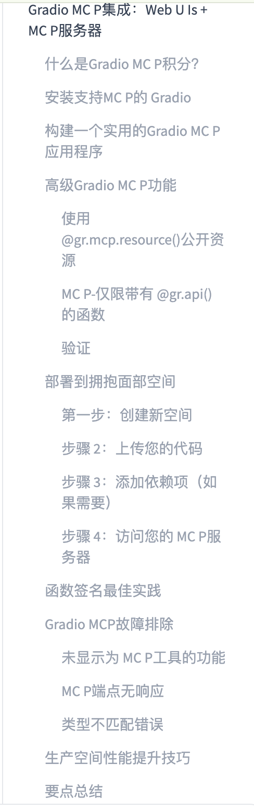

# 第42天：Gradio MCP 集成——一套函数，同时服务人类和 Agent

> [!abstract] 本章定位
> 第40天用 FastMCP 构建 Server，第41天把代码代理配置成 Client。第42天解决一个产品问题：工具既想让普通人通过网页使用，又想让 Agent 通过 MCP 调用，是否要写两套应用？Gradio 的答案是不用。同一个 Python 函数可以同时成为网页按钮背后的逻辑和 MCP Tool。

## 0. 学习资料、图片和代码

- 在线教材：[Gradio MCP Integration: Web UIs + MCP Servers](https://huggingface.co/learn/context-course/unit2/gradio-mcp)
- GitHub 原文：[gradio-mcp.mdx](https://github.com/huggingface/context-course/blob/main/units/en/unit2/gradio-mcp.mdx)
- Gradio 官方指南：[Building an MCP Server with Gradio](https://www.gradio.app/guides/building-mcp-server-with-gradio)
- 本地实践：[examples/42-gradio-mcp](../examples/42-gradio-mcp/README.md)
- 上一章：[Day41 - 将代码代理配置为 MCP 客户端](Day41-将代码代理配置为MCP客户端.md)

课程大纲截图已经保存到仓库：



截图里“什么是 Gradio MCP 积分”是机器翻译错误，原意是“What Is Gradio MCP Integration”，应该译成“什么是 Gradio MCP 集成”。

---

## 1. 先用一个生活类比理解

想象一家餐厅：

```text
厨房里的菜谱和厨师 = Python 业务函数
前台菜单和服务员     = Gradio Web UI
外卖平台接口         = MCP Server
到店顾客             = 人类用户
外卖平台上的机器人   = Agent / MCP Client
```

以前你可能分别开发：

```text
网页版本的一套后端 + Agent 版本的一套 MCP Server
```

这样会出现重复代码、两边结果不一致和双倍维护。Gradio MCP 的核心是：

```text
同一个函数
├── 被网页按钮调用，结果显示在组件里
└── 被转换成 MCP Tool，结果返回给 Agent
```

所以“两种界面”不是两个业务系统，而是同一业务逻辑的两个入口。

---

## 2. 什么是 Gradio MCP 集成？

Gradio 原本是快速构建机器学习和数据处理 Web UI 的 Python 库。开启 MCP 后，它会额外做四件事：

1. 根据函数名、类型注解和 docstring 生成 MCP Tool Schema；
2. 保留给人使用的网页界面；
3. 暴露 Streamable HTTP MCP endpoint；
4. 处理 JSON-RPC、序列化、能力发现和文件转换等协议细节。

最小关键代码只有：

```python
demo.launch(mcp_server=True)
```

启动后，默认会有：

```text
Web UI        http://127.0.0.1:7860/
MCP endpoint  http://127.0.0.1:7860/gradio_api/mcp/
MCP Schema    http://127.0.0.1:7860/gradio_api/mcp/schema
```

### 2.1 一次网页调用怎样流动？

```text
人输入文本
→ 点击 Gradio 按钮
→ Gradio 把组件值传给 Python 函数
→ 函数返回结果
→ Gradio 把结果渲染到输出组件
```

### 2.2 一次 MCP 调用怎样流动？

```text
人向 Agent 提需求
→ 模型选择 Gradio 暴露的 Tool
→ MCP Client 向 /gradio_api/mcp/ 发送 tools/call
→ Gradio 校验参数并执行同一个 Python 函数
→ 函数结果经 MCP 返回 Client
→ 模型解释结果并回复用户
```

两个流程最终进入的是同一个函数，这就是本章最重要的架构思想。

---

## 3. 什么时候适合使用 Gradio MCP？

适合：

- 已经有 Gradio Demo，想快速开放给 Agent；
- 工具既需要人工试用页，也需要机器接口；
- 模型推理、文本处理、图片音频生成等 Python 能力；
- 需要快速部署到 Hugging Face Spaces；
- 原型、课程 Demo、内部工具和中低复杂度服务。

不一定适合：

- 完全不需要 Web UI；
- 需要非常细粒度的 MCP 生命周期、会话和协议控制；
- 复杂的企业认证、多租户权限和审计；
- 极高吞吐、严格 SLA 或大量后台任务；
- 已经有成熟 API 网关和前端体系。

这种情况可以选择 FastMCP、独立后端，或者“Gradio 负责 UI、FastMCP 负责 Agent 接口”。

---

## 4. 安装支持 MCP 的 Gradio

### 4.1 建议使用虚拟环境

```bash
cd /Users/yuyuan/Desktop/agents-learn
python3 -m venv .venv
source .venv/bin/activate
```

### 4.2 安装 MCP extra

```bash
python -m pip install "gradio[mcp]"
```

为什么不是只装 `gradio`？`[mcp]` 是额外依赖组，它会安装 Gradio MCP 所需的 MCP SDK 等依赖。

本章在 2026-07-22 使用以下版本实际验证：

```text
gradio 6.20.0
mcp 1.28.1
```

本地与 Space 使用同一版本：

```text
gradio[mcp]==6.20.0
```

课程示例写 `gradio>=4.0.0`，这个范围过宽。早期 4.x 并不等于拥有当前完整的 MCP 集成与装饰器。教学项目最好固定一个验证过的版本，后续升级时再专门测试。

### 4.3 确认安装成功

```bash
python -c "import gradio; print(gradio.__version__)"
```

---

## 5. 构建一个实用的 Gradio MCP 应用

本章示例是文本工具箱，完整代码在 [app.py](../examples/42-gradio-mcp/app.py)。它包含：

| 能力 | 网页可见 | MCP 可见 | 注册方式 |
|---|---:|---:|---|
| `analyze_text` | ✅ | ✅ | 按钮 `.click()` |
| `reverse_text` | ✅ | ✅ | 按钮 `.click()` |
| `count_vowels` | ✅ | ✅ | 按钮 `.click()` |
| `extract_keywords` | ❌ | ✅ | `@gr.api()` |
| `course_guide` | ❌ | Resource | `@gr.mcp.resource()` |
| `explain_text_analysis` | ❌ | Prompt | `@gr.mcp.prompt()` |

### 5.1 先写纯业务函数

```python
def reverse_text(text: str) -> str:
    """Reverse the order of all characters in text.

    Args:
        text: The text whose character order should be reversed.

    Returns:
        The text with all characters in reverse order.
    """
    return text[::-1]
```

函数本身不知道网页按钮，也不知道 JSON-RPC。这样更容易测试、复用和迁移。

### 5.2 把函数接到 Web UI

```python
with gr.Blocks() as demo:
    text_input = gr.Textbox(label="输入文本")
    text_output = gr.Textbox(label="反转结果")
    button = gr.Button("反转")

    button.click(
        reverse_text,
        inputs=text_input,
        outputs=text_output,
        api_name="reverse_text",
        queue=False,
    )
```

这段配置同时告诉 Gradio：

- 网页点击按钮时调用哪个函数；
- 输入值来自哪个组件；
- 返回值写到哪个组件；
- API/MCP 中工具叫什么；
- 是否走队列和进度通知。

### 5.3 开启 MCP Server

```python
if __name__ == "__main__":
    demo.launch(mcp_server=True)
```

Gradio 会把公开的 API endpoint 转成 MCP Tool。不是文件中的每一个 Python 函数都会自动成为 Tool；它必须作为公开 Gradio endpoint 注册，或者使用 `gr.api()` / MCP 装饰器显式注册。

### 5.4 Tool Schema 是怎样生成的？

Gradio主要读取：

```text
函数名       → Tool 名称
docstring    → Tool 和参数的文字说明
类型注解     → JSON Schema 中的参数类型
默认值       → 参数是否可选以及默认值
返回类型     → 结果的预期类型
```

例如：

```python
def calculate(a: float, b: float, operation: str = "add") -> float:
```

Agent 能看到 `a`、`b` 是数字，`operation` 是可选字符串。如果缺少注解和说明，模型就更容易选错工具或传错参数。

---

## 6. 高级功能一：使用 @gr.mcp.resource() 公开资源

Tool 是“执行动作”，Resource 更像“按 URI 读取资料”。

```python
@gr.mcp.resource("course://day42/guide", mime_type="text/markdown")
def course_guide() -> str:
    """Return the read-only Day 42 guide."""
    return "# Day 42\nHumans use UI; agents use MCP."

with gr.Blocks() as demo:
    gr.api(course_guide, api_name="course_guide", queue=False)
```

在本章验证的 Gradio 6.20.0 中，装饰器负责给函数添加“这是 Resource”的 MCP 元数据，而 `gr.api(...)` 负责把这个函数挂载到具体应用。只写装饰器、不注册 endpoint，`resources/list` 中仍然看不到它。课程代码为了突出概念省略了这层细节，实践时必须用真实 Client 验证。

理解 URI：

```text
course://day42/guide
│        │     └─ 具体资料
│        └────── 资料分组
└─────────────── 自定义 URI scheme，不是网页 URL
```

适合 Resource 的内容：

- 产品说明、帮助文档；
- 当前配置的只读视图；
- 数据字典、Schema；
- 项目状态摘要；
- 模型卡和使用规则。

不适合 Resource 的操作：发送邮件、删除文件、修改数据库。这些是动作，应使用 Tool，并做好审批。

### 6.1 固定资源与模板资源

固定 URI：

```python
@gr.mcp.resource("config://app")
def app_config() -> str:
    return "..."
```

模板 URI：

```python
@gr.mcp.resource("greeting://{name}")
def greeting(name: str) -> str:
    return f"Hello, {name}!"
```

Client 读取 `greeting://Rudy` 时，Gradio 会把 `Rudy` 传给 `name`。

---

## 7. 高级功能二：使用 @gr.api() 创建 MCP/API-only Tool

有些能力不需要网页控件，例如：

- 返回给 Agent 的原始 JSON；
- 内部格式转换；
- 为自动化流程准备的查询函数；
- 不适合普通网页用户直接点击的低层工具。

可以这样注册：

```python
def extract_keywords(text: str, limit: int = 5) -> list[str]:
    """Extract frequent keywords from text.

    Args:
        text: The English text to analyze.
        limit: The maximum number of keywords, from 1 to 20.

    Returns:
        Lowercase keywords ordered by frequency.
    """
    ...

with gr.Blocks() as demo:
    gr.api(extract_keywords, api_name="extract_keywords", queue=False)
```

它没有 Textbox、Button 和 Output，所以主页面上没有操作区域；但它仍是 Gradio API endpoint，并会作为 MCP Tool 被发现。

课程中还展示了模块级装饰器写法 `@gr.api()`。本章实际验证的 Gradio 6.20.0 要求在 `gr.Blocks` 上下文中调用 `gr.api(...)`，否则会报 `Cannot call api() outside of a gradio.Blocks context.`。因此应以本章的上下文内注册方式为准；升级版本后也要通过 Schema 和端到端测试确认行为。

> [!important] “MCP-only”是课程里的便捷说法
> `@gr.api()` 的本质是创建没有 UI 组件的 Gradio API endpoint。开启 MCP 后，它也成为 MCP Tool。因此它通常是“API + MCP 可用、Web UI 不展示”，并不是严格意义上只能通过 MCP 访问。

### 7.1 怎样真正隐藏一个 UI 函数不让 MCP 看到？

当前 Gradio 可以通过 endpoint 的可见性控制，例如将 `api_visibility` 设为 `private`。旧教程常写 `show_api=False`。不同 Gradio 版本参数可能变化，因此升级后要查看 `/gradio_api/mcp/schema`，不能只凭页面上有没有按钮判断。

---

## 8. 高级功能三：MCP Prompt

MCP 不只有 Tools 和 Resources，还有 Prompts：

```python
@gr.mcp.prompt()
def explain_text_analysis(audience: str = "beginner") -> str:
    """Create a reusable explanation prompt."""
    return f"Explain every field to a {audience} with one example."

with gr.Blocks() as demo:
    gr.api(
        explain_text_analysis,
        api_name="explain_text_analysis",
        queue=False,
    )
```

Prompt 不执行外部动作，而是向 Client 提供可复用的提示模板。适合固定输出格式、标准分析流程或团队共同使用的工作说明。

三类能力可以这样记：

| 类型 | 一句话 | 例子 |
|---|---|---|
| Tool | 做一件事 | 分析文本、生成图片 |
| Resource | 读一份资料 | 读取说明、配置、模型卡 |
| Prompt | 提供一套问法 | 生成标准分析提示模板 |

---

## 9. 认证：这里有一个非常重要的坑

```python
demo.launch(mcp_server=True, auth=("admin", "password"))
```

这能保护 Gradio Web UI，但课程明确提醒：它不会自动保护 `/gradio_api/mcp/`。也就是说，浏览器访问需要登录，不代表 Agent endpoint 也安全。

生产环境可选方案：

- 使用私有 Hugging Face Space，并由 Client 发送 HF Token；
- 在反向代理中保护 `/gradio_api/mcp/`；
- 使用实现 MCP Authorization 的 Gateway；
- 根据 `gr.Request` 或 `gr.Header` 读取请求身份，再进行服务端授权；
- 对写操作做二次确认、范围限制和审计。

认证回答“你是谁”，授权回答“你能做什么”。只检查 Token 而不限制工具权限仍然不够。

### 9.1 不要把 Token 写进公开配置

Codex 远程配置应引用环境变量：

```toml
[mcp_servers.day42]
url = "https://username-space.hf.space/gradio_api/mcp/"
bearer_token_env_var = "HF_TOKEN"
```

```bash
export HF_TOKEN="真实 Token"
```

不要把真实 Token 放入 Git、README、截图、终端录屏或公开 Space 代码。

---

## 10. 部署到 Hugging Face Spaces

### 第一步：创建 Space

访问 [Create a new Space](https://huggingface.co/new-space)：

1. 填写 Space 名称；
2. SDK 选择 Gradio；
3. 根据数据安全选择 Public 或 Private；
4. 创建 Space。

### 第二步：准备并上传代码

最少需要：

```text
README.md         Space 元数据
app.py            应用入口
requirements.txt  Python 依赖
```

本章 [examples/42-gradio-mcp](../examples/42-gradio-mcp/README.md) 已经准备好这三个文件，可以作为 Space 根目录内容。

### 第三步：添加依赖

```text
gradio[mcp]==6.20.0
```

每次提交后，Space 会重新构建并安装依赖。等待状态从 Building 变为 Running。

### 第四步：访问 Web 与 MCP

假设：

```text
用户名：rudy
Space：day42-tools
```

常见地址是：

```text
Space 仓库：https://huggingface.co/spaces/rudy/day42-tools
Web 应用：  https://rudy-day42-tools.hf.space/
MCP：       https://rudy-day42-tools.hf.space/gradio_api/mcp/
Schema：    https://rudy-day42-tools.hf.space/gradio_api/mcp/schema
```

Client 必须填写 MCP endpoint，不能误填仓库页或 Web 首页。

Codex：

```bash
codex mcp add day42-gradio \
  --url https://rudy-day42-tools.hf.space/gradio_api/mcp/
```

### 10.1 Public 与 Private Space 的区别

- Public：代码和应用公开，MCP endpoint 通常也可被互联网访问；
- Private：需要身份凭据，适合私有数据或个人配额；
- 无论哪种，都不要在代码里硬编码密钥；使用 Space Secrets。

---

## 11. 函数签名最佳实践

### 11.1 好的函数

```python
def calculate(a: float, b: float, operation: str = "add") -> float:
    """Perform a calculation.

    Args:
        a: The first number.
        b: The second number.
        operation: One of add, subtract, multiply, or divide.

    Returns:
        The calculation result.
    """
```

它清楚说明了输入类型、可选参数、允许值和结果。

### 11.2 差的函数

```python
def process(data):
    return do_something(data)
```

Agent 不知道：

- `data` 是字符串、数字还是文件；
- 这个函数会做什么；
- 是否有副作用；
- 会返回什么；
- 哪种情况会失败。

### 11.3 实际返回类型必须匹配声明

错误：

```python
def double(x: int) -> str:
    return x * 2
```

声明是字符串，实际是整数。网页可能看起来还能展示，MCP 序列化或 Client 校验却可能失败。

### 11.4 优先选择简单明确的类型

初学阶段优先：

```text
str / int / float / bool / list[str]
```

复杂嵌套结果可返回 JSON 字符串，并在 docstring 说明字段。不要为了“高级”而使用 Client 难以理解的任意对象。

### 11.5 输入验证必须放在 Server 端

Agent 生成的参数也可能错误或恶意。必须验证：

- 文本和文件大小；
- 数值范围；
- URL、路径和文件类型；
- SQL 或命令参数；
- 用户权限；
- 超时和资源消耗。

本章示例限制文本最多 20,000 字符，并限制关键词数量为 1～20。

---

## 12. Gradio MCP 故障排除

### 12.1 函数没有显示为 MCP Tool

依次检查：

1. 是否使用 `mcp_server=True` 启动；
2. 函数是否绑定为公开的 Gradio event/API endpoint；
3. 是否有完整参数和返回值类型注解；
4. 是否有清楚的 docstring 与 `Args:`；
5. `api_visibility` 是否设为 private；
6. `/gradio_api/mcp/schema` 中是否出现；
7. Client 是否仍缓存旧 Schema，是否需要重连。

“函数写在 app.py 里”本身不等于 MCP Tool。

### 12.2 MCP endpoint 无响应

```bash
curl -i http://127.0.0.1:7860/gradio_api/mcp/schema
```

排查：

```text
网页也打不开       → 进程、端口或启动错误
网页能开，Schema 404 → endpoint/版本/mcp_server 参数错误
Schema 正常，MCP 失败 → Client、Transport、认证或协议问题
本地正常，Space 失败 → 构建日志、依赖、地址或睡眠状态
```

不要以为对 MCP endpoint 做普通 GET 必须返回 200。Streamable HTTP 有指定方法、请求头和 session 流程；验证存活优先看 Schema，验证协议使用 MCP Client 或 Inspector。

### 12.3 类型不匹配错误

检查三处是否一致：

```text
函数注解 ↔ Gradio 组件值 ↔ 实际返回对象
```

例如 `gr.Number` 可能给出浮点值，而函数只接受整数；文件组件返回的也可能不是你想象的本地字符串路径。先打印类型到服务端日志或写函数测试确认。

### 12.4 Agent 看见工具却不调用

这不一定是连接故障。可能因为：

- Tool 名称含糊；
- docstring 没说明使用时机；
- 多个 Tool 功能重复；
- 用户问题不需要工具；
- Client 的权限策略要求审批；
- 输入 Schema 过于复杂。

改善 Tool 说明，比一味重启 Server 更有效。

### 12.5 网页能登录，MCP 却可以匿名调用

这是 `launch(auth=...)` 只保护 UI 的典型误区。必须单独保护 `/gradio_api/mcp/`，不能把网页登录页当作 MCP 授权方案。

---

## 13. 生产环境性能与可靠性

### 13.1 快函数可以关闭队列

```python
button.click(fn, ..., queue=False)
```

Gradio 官方说明，关闭队列可减少进度订阅开销并提高吞吐，但会失去队列进度通知。文本反转、简单计算适合；模型推理和长任务通常保留队列。

### 13.2 长任务需要明确时间预算

Agent Client 常有几十秒级 Tool timeout。服务端应：

- 提前拒绝过大输入；
- 为外部请求设置超时；
- 缓存昂贵且可复用的结果；
- 对长任务提供进度；
- 必要时采用任务 ID + 查询状态模式。

不能假设“只要最终算完，Agent 就会一直等”。

### 13.3 控制并发与资源

图片、音频和大模型推理可能消耗大量 GPU/内存。应设置并发限制、队列和输入上限，监控失败率、延迟、CPU/GPU、内存与磁盘。

### 13.4 错误要对 Agent 有意义

差的错误：

```text
Internal Server Error
```

好的错误：

```text
limit 必须在 1 到 20 之间；当前收到 50。
```

错误消息应告诉 Agent：哪里错、允许范围是什么、怎样修复，但不要泄露堆栈、文件系统路径或密钥。

### 13.5 保持无状态或明确状态边界

同一个 Space 可能同时服务多个用户和多个 Agent。不要把用户私有数据随手放进全局变量，否则可能串数据。需要状态时，明确用户身份、生命周期、存储位置和清理机制。

---

## 14. 本地验证步骤

### 14.1 测试业务函数

```bash
.venv/bin/python examples/42-gradio-mcp/test_functions.py
```

### 14.2 启动应用

```bash
.venv/bin/python examples/42-gradio-mcp/app.py
```

打开网页和 Schema：

```text
http://127.0.0.1:7860/
http://127.0.0.1:7860/gradio_api/mcp/schema
```

### 14.3 用真实 MCP Client 验证

另开一个终端：

```bash
.venv/bin/python examples/42-gradio-mcp/verify_mcp.py
```

这个验证不是直接调用 Python 函数，而是通过 Streamable HTTP：

```text
initialize
→ tools/list
→ tools/call analyze_text
→ resources/list
→ prompts/list
```

### 14.4 连接 Codex

```bash
codex mcp add day42-gradio \
  --url http://127.0.0.1:7860/gradio_api/mcp/
```

然后在 Codex 会话中用 `/mcp` 查看，并尝试：

```text
使用 day42-gradio：
1. 分析 “Gradio gives humans a UI and agents MCP tools”；
2. 提取前 3 个关键词；
3. 用适合初学者的方式解释分析结果。
```

---

## 15. 要点总结

```text
Gradio MCP = 一套业务函数 + 两种使用入口

人类入口：Web UI
Agent 入口：/gradio_api/mcp/
Schema：/gradio_api/mcp/schema

UI event/API endpoint → MCP Tool
@gr.api()             → 无 UI 的 API/MCP Tool
@gr.mcp.resource()    → URI 标识的只读资料
@gr.mcp.prompt()      → 可复用提示模板

类型注解决定 Schema 类型；docstring 帮模型理解用途。
launch(auth=...) 只保护 UI，不自动保护 MCP endpoint。
Space 部署时固定已验证版本，不提交 Token，并做输入、权限、超时和并发控制。
```

下一章会把前几天的知识串起来，亲手构建并部署一个完整 MCP Server 项目。

---

## 16. 自测题

1. 为什么说 Gradio MCP 是“一套函数、两个入口”？
2. Web UI 地址、MCP endpoint 和 MCP Schema 地址分别是什么？
3. 普通 Python 函数写在文件里，为什么不一定会成为 MCP Tool？
4. `@gr.api()` 为什么更准确地说是“API/MCP-only，而不是 Web UI Tool”？
5. Tool、Resource、Prompt 分别解决什么问题？
6. 类型注解和 docstring 怎样影响 Agent 的调用？
7. `launch(auth=...)` 为什么不能保护 MCP endpoint？
8. 什么时候应该设置 `queue=False`？它牺牲了什么？
9. Space 的仓库页、Web 页面和 MCP endpoint 有什么区别？
10. Schema 中没有某个函数时，应按什么顺序排查？

能不看笔记回答这些问题，并让本章端到端测试通过，就完成了第42天。
