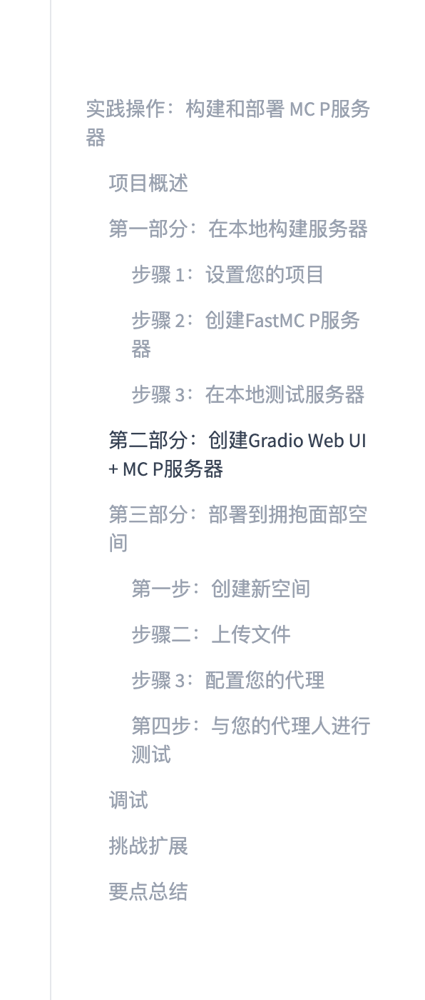

# 第43天：实战——构建、测试并部署完整 MCP Server

> [!abstract] 本章定位
> 前几天分别学习了 MCP 架构、FastMCP Server、Client 配置和 Gradio MCP。第43天把它们连成一个可交付项目：先把文本处理逻辑做成纯 Python 模块，再通过 FastMCP 暴露为本地 stdio Server，通过 Gradio 暴露为 Web UI 和远程 Streamable HTTP Server，最后部署到 Hugging Face Spaces 并连接 Agent。

## 0. 学习资料、图片和代码

- 在线教材：[Hands-On: Build and Deploy an MCP Server](https://huggingface.co/learn/context-course/unit2/hands-on)
- GitHub 原文：[hands-on.mdx](https://github.com/huggingface/context-course/blob/main/units/en/unit2/hands-on.mdx)
- 本地完整项目：[examples/43-text-processor-mcp](../examples/43-text-processor-mcp/README.md)
- 上一章：[Day42 - Gradio MCP 集成](Day42-Gradio-MCP集成-WebUI与MCP服务器.md)

课程大纲截图已经保存到仓库：



截图中“拥抱面部空间”是 Hugging Face Spaces 的错误直译，应该保留产品名，不翻译成中文。

---

## 1. 今天到底要完成什么？

今天不是“再写几个函数”，而是练习一条完整交付链：

```text
定义问题和能力边界
→ 编写与框架无关的业务函数
→ 使用 FastMCP 暴露本地 stdio Server
→ 使用真实 MCP Client 测试
→ 使用 Gradio 同时提供 Web UI 和 HTTP MCP
→ 本地端到端验证
→ 部署到 Hugging Face Spaces
→ 配置 Codex 等 Agent
→ 生产调试与安全检查
```

最终项目是一个文本处理工具箱，提供：

| 能力 | 作用 | 是否调用 LLM | 主要语言限制 |
|---|---|---:|---|
| `analyze_text` | 字符、词、句、行统计 | 否 | 中英文基础统计 |
| `extract_keywords` | 高频英文关键词 | 否 | 英文 |
| `check_reading_level` | Flesch-Kincaid 难度估算 | 否 | 英文 |
| `check_writing_basics` | 重复空格、长句、末尾标点检查 | 否 | 主要是英文 |
| `summarize_text` | 选取开头若干句作为摘要 | 否 | 中英文简单切句 |
| `reverse_text` | 反转字符 | 否 | 通用 |

这里所有结果都是确定性算法产生的，同样输入会得到同样输出，不需要 API Key，也不会产生模型调用费用。

---

## 2. 先看清项目的三层架构

课程原文在 `server.py` 和 `app.py` 里复制了几乎相同的函数。对于短教程可以理解，但真实项目容易出现：修了 Server 忘记修 Web、两边结果不一致、测试重复。

本章改成三层：

```text
┌─────────────────────────────────────────────┐
│ 接口层                                      │
│ server.py：FastMCP + stdio                  │
│ app.py：Gradio UI + Streamable HTTP MCP     │
└──────────────────┬──────────────────────────┘
                   │ 调用
┌──────────────────▼──────────────────────────┐
│ 业务层                                      │
│ text_tools.py：统计、关键词、阅读难度等算法 │
└──────────────────┬──────────────────────────┘
                   │ 被验证
┌──────────────────▼──────────────────────────┐
│ 测试层                                      │
│ test_text_tools.py                          │
│ test_fastmcp.py                             │
│ verify_gradio_mcp.py                        │
└─────────────────────────────────────────────┘
```

文件结构：

```text
examples/43-text-processor-mcp/
├── README.md
├── requirements.txt
├── text_tools.py
├── server.py
├── app.py
├── test_text_tools.py
├── test_fastmcp.py
└── verify_gradio_mcp.py
```

最重要的工程思想是：

```text
业务逻辑不应该依赖它从网页、MCP 还是测试进入。
```

未来即使不用 Gradio 或 FastMCP，`text_tools.py` 仍能复用。

---

## 3. 课程原文有哪些需要补充或纠正的地方？

### 3.1 项目概述与实际代码不完全一致

课程说项目会提供：

- 统计文本；
- 提取关键短语和实体；
- 检查拼写和基础语法；
- 总结文本。

但原始代码实际只有：

- 文本统计；
- 高频词；
- 阅读难度；
- 字符反转。

没有实体提取、拼写检查、语法检查或摘要。本章补充了：

- `check_writing_basics`：明确标注为规则检查，不冒充完整语法工具；
- `summarize_text`：明确标注为首句抽取，不冒充 AI 摘要。

实体提取需要词典、规则或 NLP 模型，拼写/语法也需要语言资源。为了保持项目无外部依赖，本章没有假装实现它们，而是在“挑战扩展”说明升级路线。

### 3.2 原关键词代码的标点与停用词顺序有漏洞

原文逻辑大致是：

```python
filtered = [w.strip(".,!?") for w in words if w.lower() not in stopwords]
```

如果输入是 `the,`，判断停用词时它仍带逗号，因此不等于 `the`；随后才去标点，导致 `the` 错误进入关键词。

正确顺序是：

```text
分词 → 统一大小写 → 清理标点 → 过滤停用词 → 计数
```

本章直接用正则提取英文单词，避免这个顺序错误。

### 3.3 原阅读难度把元音字母数当音节数

课程通过统计 `a/e/i/o/u` 数量估算音节。它适合展示公式，不适合作为准确阅读评估。例如 `queue` 有多个元音字母，却通常只有一个音节。

本章改为统计连续元音组，并对部分结尾 `e` 做修正，但仍只是一种启发式算法，因此返回结果中包含：

```text
This is an English heuristic, not a professional assessment.
```

### 3.4 `python server.py` 不是完整测试

stdio Server 启动后会等待 Client 输入，看起来像“卡住”。这只能证明进程没有立即崩溃，不能证明：

- 初始化成功；
- Tool Schema 正确；
- 工具能够调用；
- Resource 和 Prompt 能读取。

本章使用官方 MCP Client 写了自动测试，真正走一遍协议。

### 3.5 Gradio 安装和版本范围需要更新

课程 Part 2 写 `pip install gradio`，部署依赖写 `gradio>=4.0.0`。当前完整 MCP 集成应安装：

```bash
pip install "gradio[mcp]"
```

本章固定实际验证版本：

```text
gradio[mcp]==6.20.0
```

宽泛的 `>=4.0.0` 可能安装出不具备当前 MCP 装饰器和 endpoint 行为的版本。

---

## 4. 第一部分：设置项目

### 4.1 创建目录和虚拟环境

课程从零开始的命令是：

```bash
mkdir text-processor-mcp
cd text-processor-mcp
python3 -m venv .venv
source .venv/bin/activate
```

在当前学习仓库里，我们复用根目录 `.venv`：

```bash
cd /Users/yuyuan/Desktop/agents-learn
source .venv/bin/activate
python -m pip install -r examples/43-text-processor-mcp/requirements.txt
```

为什么需要虚拟环境？

```text
系统 Python
├── 项目A 需要 Gradio 5
├── 项目B 需要 Gradio 6
└── 没有隔离就会互相覆盖

每个项目的 .venv
└── 只安装这个项目需要的版本
```

### 4.2 为什么固定依赖版本？

`requirements.txt`：

```text
gradio[mcp]==6.20.0
```

这让本地开发、同事电脑和 Space 尽量使用相同环境。等号固定版本不是永远不升级，而是“升级必须是一个主动、可测试的动作”。

---

## 5. 第二部分：编写纯业务逻辑 text_tools.py

完整代码：[text_tools.py](../examples/43-text-processor-mcp/text_tools.py)

### 5.1 输入验证为什么放在业务层？

```python
MAX_TEXT_LENGTH = 50_000

def _validate_text(text: str) -> str:
    if not isinstance(text, str):
        raise ValueError("text 必须是字符串")
    cleaned = text.strip()
    if not cleaned:
        raise ValueError("text 不能为空")
    if len(cleaned) > MAX_TEXT_LENGTH:
        raise ValueError("text 不能超过 50000 个字符")
    return cleaned
```

因为同一个函数可能由网页、MCP、测试或未来的 REST API 调用。如果只在网页组件限制长度，Agent 仍可能直接向 MCP 发送超大文本。安全边界必须在服务端业务函数里。

下划线开头表示这是模块内部辅助函数，不打算暴露为 MCP Tool。

### 5.2 analyze_text 逐段解释

核心流程：

```python
cleaned = _validate_text(text)
words = re.findall(r"\b\w+\b", cleaned, flags=re.UNICODE)
sentences = _sentences(cleaned)
```

- `cleaned`：已验证、去除首尾空白的文本；
- `re.findall`：找出基础词元；
- `_sentences`：按中英文句末标点切句。

统计非空白字符：

```python
characters_without_whitespace = sum(not char.isspace() for char in cleaned)
```

这里统计的不只是普通空格，还排除换行、制表符等空白。课程原文只执行 `replace(" ", "")`，会留下其他空白。

平均词长：

```python
round(sum(len(word) for word in words) / len(words), 2)
```

为什么不能用“非空格字符数 ÷ 单词数”？因为标点也不是空格，会被算进词长。本章直接累加已识别单词长度。

结果使用 JSON 字符串：

```python
return json.dumps(result, ensure_ascii=False, indent=2)
```

- `ensure_ascii=False`：中文不会变成 `\u4e2d`；
- `indent=2`：网页和调试日志更容易读；
- JSON 字符串：不同 Client 更容易稳定处理。

### 5.3 extract_keywords 逐段解释

```python
normalized_words = [word.casefold() for word in _english_words(cleaned)]
```

`casefold()` 比 `lower()` 更适合做不区分大小写的比较。

```python
meaningful_words = [
    word
    for word in normalized_words
    if word not in ENGLISH_STOPWORDS and len(word) > 1
]
```

过滤 `the`、`and` 等高频但信息量低的停用词，同时去掉单字符词。

```python
frequencies = Counter(meaningful_words)
frequencies.most_common(count)
```

`Counter` 就像自动计票箱，`most_common(5)` 返回票数最高的五个词。

这不是语义关键词算法。它不知道 `Model Context Protocol` 是完整短语，也不理解实体，只统计词频。工具说明必须诚实表达能力边界。

### 5.4 check_reading_level 的公式

本章使用 Flesch-Kincaid Grade 近似：

```text
年级 ≈ 0.39 × 每句平均词数
     + 11.8 × 每词平均音节数
     - 15.59
```

直觉：

- 句子越长，阅读难度通常越高；
- 单词音节越多，通常越复杂；
- 最终数字近似美国教育年级。

限制：

- 主要为英文设计；
- 音节是估算；
- 不能判断概念是否抽象；
- 不能替代教育或语言学评估。

因此不能用它分析中文后宣称“适合美国八年级”。

### 5.5 check_writing_basics 为什么不叫 grammar_checker？

它只检查三类可确定规则：

```text
连续多个空格
超过 30 个英文词的长句
最后一句缺少末尾标点
```

真正拼写和语法检查需要词典、语言模型或 LanguageTool 等专门服务。函数名叫 `check_writing_basics`，返回值也带 warning，防止 Agent 夸大结果。

这是 Tool 设计的重要原则：

```text
名称和说明必须描述它真正能做到的事，而不是产品宣传语。
```

### 5.6 summarize_text 为什么是“抽取式”？

```python
sentences = _sentences(cleaned)
selected = sentences[:max_sentences]
```

它选择开头若干句，不重新生成内容，所以：

- 速度快；
- 无费用；
- 可复现；
- 不会产生新的事实；
- 但不一定抓住全文最重要内容。

这叫 lead-sentence extractive summary，不是生成式 AI 摘要。

---

## 6. 第三部分：用 FastMCP 构建本地 Server

完整代码：[server.py](../examples/43-text-processor-mcp/server.py)

### 6.1 创建 Server

```python
from mcp.server.fastmcp import FastMCP
import text_tools

mcp = FastMCP("day43-text-processor")
```

这个名称用于初始化和调试标识，不是用户最终看到的自然语言答案。

### 6.2 注册 Tool

```python
mcp.tool()(text_tools.analyze_text)
mcp.tool()(text_tools.extract_keywords)
```

等价的常见写法是：

```python
@mcp.tool()
def analyze_text(text: str) -> str:
    ...
```

本章业务函数已经在 `text_tools.py`，直接注册可以避免再复制一份算法。FastMCP 会读取函数名、签名、类型注解和 docstring 生成 Tool Schema。

### 6.3 添加 Resource

```python
@mcp.resource("text-processor://guide")
def usage_guide() -> str:
    return "..."
```

它不是执行动作，而是给 Agent 提供这套工具的说明和限制。Agent 可以先读 Guide，再决定怎样组合工具。

### 6.4 添加 Prompt

```python
@mcp.prompt()
def review_text_workflow(goal: str = "improve clarity") -> str:
    return "..."
```

它提供一个标准审稿流程：先统计，再检查阅读难度和基础规则，最后给修改建议。

### 6.5 启动 stdio

```python
if __name__ == "__main__":
    mcp.run(transport="stdio")
```

`if __name__ == "__main__"` 的作用：

- 直接执行 `python server.py` 时启动 Server；
- 测试导入这个模块时不会自动阻塞。

stdio 的 stdout 是协议通道，不能随便 `print()`。日志应写 stderr。

---

## 7. 第四部分：本地测试 FastMCP Server

### 7.1 第一层：测试纯函数

```bash
.venv/bin/python examples/43-text-processor-mcp/test_text_tools.py
```

这层速度最快，定位算法错误最清楚，例如：

- 词数是否正确；
- 关键词排序是否正确；
- 参数越界是否抛错；
- 摘要句数是否正确。

### 7.2 第二层：走真实 MCP 协议

```bash
.venv/bin/python examples/43-text-processor-mcp/test_fastmcp.py
```

测试流程：

```text
测试 Client 启动 server.py 子进程
→ initialize
→ tools/list
→ tools/call analyze_text
→ resources/list
→ prompts/list
→ 正常关闭
```

关键代码：

```python
parameters = StdioServerParameters(
    command=sys.executable,
    args=[str(SERVER_FILE)],
)
```

`sys.executable` 确保子进程使用当前虚拟环境的 Python，不会误用系统 Python。

```python
async with stdio_client(parameters) as (read_stream, write_stream):
    async with ClientSession(read_stream, write_stream) as session:
        await session.initialize()
```

`async with` 会负责连接和关闭资源；`await` 表示等待 I/O 结果时不阻塞整个事件循环。

### 7.3 MCP Inspector

也可以运行：

```bash
mcp dev examples/43-text-processor-mcp/server.py
```

Inspector 适合人工查看 Schema 和试参数，自动测试适合每次修改后重复验证。两者互补，不应二选一。

---

## 8. 第五部分：配置 Codex 使用本地 Server

```bash
codex mcp add day43-local -- \
  /Users/yuyuan/Desktop/agents-learn/.venv/bin/python \
  /Users/yuyuan/Desktop/agents-learn/examples/43-text-processor-mcp/server.py
```

这里每一段的意义：

| 部分 | 作用 |
|---|---|
| `codex mcp add` | 新增配置 |
| `day43-local` | Server 配置名称 |
| `--` | 后面全部是子进程命令 |
| `.venv/bin/python` | 正确 Python 环境 |
| `server.py` | 要启动的 stdio Server |

查看：

```bash
codex mcp list
codex mcp get day43-local
```

尝试：

```text
请使用 day43-local 分析下面英文：
1. 给出统计；
2. 提取 5 个关键词；
3. 估算阅读难度；
4. 说明每个工具的局限。
```

---

## 9. 第六部分：创建 Gradio Web UI + MCP Server

完整代码：[app.py](../examples/43-text-processor-mcp/app.py)

### 9.1 为什么 app.py 仍然写包装函数？

```python
def analyze_text(text: str) -> str:
    return _run_safely(text_tools.analyze_text, text)
```

原因有两个：

1. 将业务层 `ValueError` 转成适合网页和 MCP 的 `gr.Error`；
2. 给 Gradio 提供稳定、完整的签名和 docstring，生成清晰 Schema。

包装层只做接口适配，不复制算法。

### 9.2 _run_safely 做什么？

```python
def _run_safely(function, *args):
    try:
        return function(*args)
    except ValueError as error:
        raise gr.Error(str(error)) from error
```

- `function`：要调用的业务函数；
- `*args`：任意数量参数；
- `try`：执行；
- `except`：捕获预期输入错误；
- `raise gr.Error`：给用户或 Client 清晰错误，而不是整个应用崩溃；
- `from error`：保留内部异常链，方便服务端调试。

不要捕获所有 `Exception` 后假装成功。未知异常应进入日志和监控。

### 9.3 创建 Blocks

```python
with gr.Blocks(title="Day 43 · Text Processor MCP") as demo:
    ...
```

`Blocks` 是页面容器。内部创建 Tab、Textbox、Slider、Button 和 Code 输出组件。

### 9.4 按钮事件怎样同时变成 Tool？

```python
gr.Button("分析").click(
    analyze_text,
    analyze_input,
    analyze_output,
    api_name="analyze_text",
    queue=False,
)
```

参数解释：

- `analyze_text`：点击时调用的函数；
- `analyze_input`：函数参数来自这个组件；
- `analyze_output`：返回值写到这里；
- `api_name`：API/MCP Tool 名称；
- `queue=False`：简单快速函数不需要排队和进度通知。

启动时加：

```python
demo.launch(mcp_server=True, server_name="0.0.0.0")
```

就会把公开 API endpoint 转为 MCP Tools。

### 9.5 reverse_text 为什么没有网页标签页？

```python
with gr.Blocks() as demo:
    gr.api(reverse_text, api_name="reverse_text", queue=False)
```

它被挂载为 API/MCP endpoint，但没有输入输出组件，因此主页面不显示。当前 Gradio 6.20 要求 `gr.api()` 在 `Blocks` 上下文中注册。

### 9.6 Slider 为什么让整数类型变成 number？

Gradio MCP Schema 中 Slider 输入可能显示为 JSON `number`，即使 Python 写 `count: int`。因为网页 Slider 的底层值按数值组件生成 Schema。

本章通过：

- `step=1` 限制网页交互；
- 业务层检查 `1 <= count <= 20`；
- 测试实际调用。

不要只盯 Python 注解，要查看最终 `/gradio_api/mcp/schema`。

---

## 10. 第七部分：本地验证 Gradio MCP

启动：

```bash
.venv/bin/python examples/43-text-processor-mcp/app.py
```

访问：

```text
Web UI： http://127.0.0.1:7860/
MCP：    http://127.0.0.1:7860/gradio_api/mcp/
Schema： http://127.0.0.1:7860/gradio_api/mcp/schema
```

另开终端：

```bash
.venv/bin/python examples/43-text-processor-mcp/verify_gradio_mcp.py
```

它会检查六个 Tool 是否完整，再真实调用 `extract_keywords`。

为什么既测 Web 又测 MCP？

```text
Web 正常只证明网页事件能跑
Schema 正常只证明能力被暴露
MCP 调用正常才证明 Agent 链路可用
```

三者不能互相替代。

---

## 11. 第八部分：部署到 Hugging Face Spaces

### 11.1 创建 Space

访问 [Create a new Space](https://huggingface.co/new-space)：

1. 填写名称，例如 `day43-text-processor`；
2. SDK 选择 Gradio；
3. 选择 Public 或 Private；
4. 创建。

课程让初学者选择 Public 是为了方便连接，但生产环境不能无脑公开。只要 Tool 接触私有数据、收费 API 或写操作，就应重新评估权限。

### 11.2 上传哪些文件？

本章需要四个：

```text
README.md
requirements.txt
app.py
text_tools.py
```

课程只有 `app.py` 是因为把算法全写在其中；本章拆出了共享业务模块，所以必须一并上传 `text_tools.py`。

测试文件可以提交到 Space 仓库，但不是运行必需。

### 11.3 Space README 的 YAML 是什么？

```yaml
---
title: Day43 Text Processor MCP
emoji: 📝
sdk: gradio
sdk_version: 6.20.0
app_file: app.py
---
```

这是 Space 元数据：告诉 Hugging Face 使用哪个 SDK、版本和入口文件。它不是 Python 代码。

### 11.4 等待构建

Space 会执行类似过程：

```text
拉取仓库
→ 创建运行环境
→ 安装 requirements.txt
→ 导入 app.py
→ 启动 Gradio
→ 状态变为 Running
```

失败时先看 Build Logs，不要只刷新网页。

### 11.5 找到正确 endpoint

```text
仓库页：https://huggingface.co/spaces/<user>/<space>
Web：   https://<user>-<space>.hf.space/
MCP：   https://<user>-<space>.hf.space/gradio_api/mcp/
Schema：https://<user>-<space>.hf.space/gradio_api/mcp/schema
```

Agent 配置必须使用 MCP 地址。

---

## 12. 第九部分：配置并测试远程 Agent

Codex：

```bash
codex mcp add day43-remote \
  --url https://<user>-<space>.hf.space/gradio_api/mcp/
```

检查：

```bash
codex mcp list
codex mcp get day43-remote
```

测试提示：

```text
请调用 day43-remote 完成以下任务：
1. 统计这段文字；
2. 提取前 3 个英文关键词；
3. 检查阅读难度和基础写作问题；
4. 生成两句抽取式摘要；
5. 明确哪些结论只是启发式判断。
```

观察 Agent 是否：

- 选择正确 Tool；
- 传递正确参数；
- 没有把规则检查夸大为专业语法结论；
- 能结合多个结果回答；
- 在 Tool 失败时修改参数重试。

---

## 13. 调试：按层定位，不要乱试

### 13.1 第1层：纯函数

```bash
.venv/bin/python examples/43-text-processor-mcp/test_text_tools.py
```

失败说明算法、输入验证或预期值有问题，与 MCP 无关。

### 13.2 第2层：FastMCP stdio

```bash
.venv/bin/python examples/43-text-processor-mcp/test_fastmcp.py
```

失败检查 Python 路径、依赖、Tool 注册和 stdout 污染。

### 13.3 第3层：Gradio Web

如果网页打不开：

- 查看启动终端异常；
- 检查端口占用；
- 检查 `gradio[mcp]` 版本；
- 确认从正确目录运行且能导入 `text_tools.py`。

### 13.4 第4层：Schema

```bash
curl http://127.0.0.1:7860/gradio_api/mcp/schema
```

如果 Tool 缺失，检查：

- 函数是否绑定按钮或 `gr.api()`；
- `api_name` 是否存在；
- 签名、类型和 docstring；
- endpoint 可见性；
- Client 是否缓存旧能力。

### 13.5 第5层：真实 HTTP MCP

```bash
.venv/bin/python examples/43-text-processor-mcp/verify_gradio_mcp.py
```

这层失败通常与 Transport、session、序列化或 Client 兼容性有关。

### 13.6 第6层：Hugging Face Space

本地正常、Space 失败时检查：

- Build Logs；
- `requirements.txt`；
- 是否漏传 `text_tools.py`；
- `app_file` 是否正确；
- Space 是否休眠；
- endpoint 是否写错；
- Private Space 是否缺少 Token。

### 13.7 第7层：Agent 决策

Tool 能手动调用但 Agent 不使用，可能是：

- 名称和 docstring 不清；
- 多个工具重叠；
- 用户问题不需要工具；
- 权限未批准；
- 参数 Schema 复杂；
- Agent 没有刷新能力列表。

这属于 Tool 设计和 Agent 决策层，不一定是 Server 故障。

---

## 14. 安全与生产注意事项

### 14.1 Public Space 等于公开服务

别人可能反复调用你的 Tool、消耗 CPU/GPU 或收费 API。即使网页设置登录，也不能假设 MCP endpoint 自动受保护。

### 14.2 不要信任 Agent 参数

Agent 是 Client，不是安全边界。Server 必须检查：

- 文本长度；
- 数值范围；
- 文件类型和路径；
- URL 白名单；
- 身份与权限；
- 超时和并发；
- 外部 API 费用。

### 14.3 Tool 名称必须诚实

本章使用：

```text
check_writing_basics
summarize_text（返回 method 说明）
```

而不是：

```text
perfect_grammar_checker
intelligent_summary
```

过度承诺会让 Agent 基于错误能力边界做决策。

### 14.4 密钥放 Space Secrets

如果挑战扩展使用模型或第三方 API：

- 本地通过环境变量；
- Space 通过 Settings → Secrets；
- 不写入代码、README、Git 历史或截图；
- Server 返回错误时不泄露密钥和完整堆栈。

### 14.5 设置超时、限流和监控

上线后至少监控：

- 调用次数；
- 延迟；
- 错误率；
- CPU、内存、GPU；
- 外部 API 费用；
- 输入大小和异常来源。

课程 Demo 能运行不等于已经达到生产标准。

---

## 15. 挑战扩展：按难度升级

### Level 1：改进确定性算法

- 中英文停用词；
- 更稳健的句子切分；
- TF-IDF 关键词；
- 重复词和被动语态规则；
- 返回结构化 Pydantic 模型。

### Level 2：引入 NLP 库

- `language-tool-python`：拼写和语法；
- spaCy：实体识别、词性和句法；
- `langdetect` 或 fastText：语言检测；
- TextRank：抽取式摘要。

增加依赖时要考虑模型文件大小、Space 构建时间和内存。

### Level 3：调用大模型

- 生成式摘要；
- 风格改写；
- 语义关键词；
- 多语言解释；
- 事实与原文对齐检查。

必须增加 Token、费用、超时、重试和内容安全控制，并在 Tool 描述中告诉 Agent 这是概率模型结果。

### Level 4：工程化

- OAuth / MCP Gateway；
- 用户级配额；
- 持久缓存；
- 结构化日志和 tracing；
- CI 自动运行三层测试；
- 灰度发布与版本化 Tool Schema。

---

## 16. 完整验收清单

### 本地业务层

- [ ] 空文本会被拒绝；
- [ ] 超长文本会被拒绝；
- [ ] count 与 max_sentences 有范围限制；
- [ ] 结果 JSON 能被解析；
- [ ] 工具限制写进返回结果或说明。

### FastMCP

- [ ] 六个 Tool 都出现在 `tools/list`；
- [ ] `analyze_text` 能调用；
- [ ] Guide Resource 能读取；
- [ ] Workflow Prompt 能获取；
- [ ] stdout 没有调试文本污染。

### Gradio

- [ ] 五个 Web 标签页能用；
- [ ] `reverse_text` 只作为 API/MCP Tool；
- [ ] Schema 有六个 Tool；
- [ ] HTTP MCP Client 调用成功；
- [ ] 输入错误显示清楚。

### Space 与 Agent

- [ ] 四个部署文件上传完整；
- [ ] Space 状态 Running；
- [ ] Web 和 Schema 地址可访问；
- [ ] Agent 配置的是 `/gradio_api/mcp/`；
- [ ] Agent 能组合多个 Tool；
- [ ] 公开范围和认证符合数据安全要求。

---

## 17. 要点总结

```text
1. 先写框架无关的业务逻辑，再连接 FastMCP 和 Gradio。
2. FastMCP stdio 适合本地 Agent；Gradio HTTP MCP 适合共享和云部署。
3. 启动不等于测试，必须验证 initialize、list 和 call。
4. Web、Schema、MCP 调用是三层不同验收。
5. 课程概述中的实体、拼写、语法和摘要并未全部由原代码实现。
6. 阅读难度、关键词、规则检查都要诚实说明语言和算法限制。
7. 部署拆分模块后，不能漏传业务文件。
8. Public Space 是公开服务，不是自动安全的演示页面。
9. Agent 参数必须像外部用户输入一样校验。
10. 一个可分享的 MCP Demo，还需要认证、监控、限流和审计才能走向生产。
```

---

## 18. 自测题

1. 为什么要把算法放进 `text_tools.py`，而不是在 `server.py` 和 `app.py` 各写一遍？
2. `python server.py` 一直等待输入为什么不一定是卡死？
3. 纯函数测试和 MCP 端到端测试分别能发现什么问题？
4. 课程关键词代码为什么可能把 `the,` 当关键词？
5. Flesch-Kincaid Grade 为什么不能直接用于中文？
6. `check_writing_basics` 为什么不能称为完整语法检查？
7. Gradio 按钮事件怎样变成 MCP Tool？
8. 为什么还要查看最终 MCP Schema，而不能只看 Python 类型注解？
9. 本章部署为什么比课程多上传一个 `text_tools.py`？
10. Public Space 中加入收费 API 后，至少需要增加哪些保护？

如果你能让三组测试全部通过，再向别人解释这些问题，就真正完成了 Unit 2 的综合实战。
