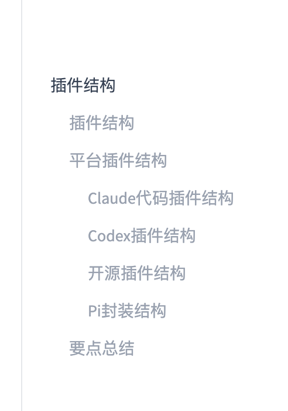
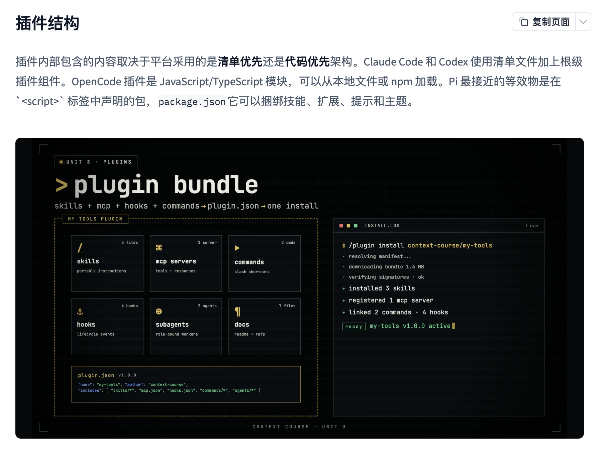

# 第45天：插件结构——一个插件包里到底装了什么？

> [!abstract] 本章目标
> 第44天回答“插件是什么”，第45天回答“插件在磁盘上长什么样”。学完后，你应该能读懂图2、分清 Manifest-first、Code-first 和 Package-based 三种结构，并知道 Claude Code、Codex、OpenCode、Pi 的目录不能直接互相复制。

## 0. 学习资料与课程大纲

- 在线教材：[Plugin Anatomy](https://huggingface.co/learn/context-course/unit3/anatomy)
- GitHub 原文：[unit3/anatomy.mdx](https://github.com/huggingface/context-course/blob/main/units/en/unit3/anatomy.mdx)
- Codex 官方文档：[Build plugins](https://learn.chatgpt.com/docs/build-plugins)
- 上一章：[Day44 - 第三单元插件入门](Day44-第三单元插件入门.md)
- Day44 最小 Codex 插件示例：[examples/44-plugin-introduction](../examples/44-plugin-introduction/README.md)

课程大纲：



```text
插件结构
├── 插件结构
├── 平台插件结构
│   ├── Claude Code 插件结构
│   ├── Codex 插件结构
│   ├── OpenCode 插件结构
│   └── Pi 封装结构
└── 要点总结
```

今天最重要的一句话：

> “插件”是共同的产品概念，但不是所有平台共同遵守的一种文件格式。

---

## 1. 先建立三个结构模型

课程把常见插件分成三种“装箱方式”。

### 1.1 Manifest-first：先看装箱单

Claude Code 和 Codex 属于这一类。

```text
平台先找到 manifest
       ↓
读取名称、版本和组件路径
       ↓
再加载 skills、MCP、hooks 等组件
```

Manifest 可以理解为快递箱外面的装箱单。箱子里即使有十个文件，如果装箱单没有按平台规则指向它们，平台也可能不知道怎样加载。

### 1.2 Code-first：入口本身就是代码

OpenCode 属于这一类。插件是 JavaScript 或 TypeScript 模块：

```text
加载 JS / TS 文件
       ↓
执行插件工厂函数
       ↓
返回 hooks 或注册 custom tools
```

它更像“加载一个程序模块”，而不是“读取一个资源清单”。

### 1.3 Package-based：用语言生态的包管理器装箱

Pi 最接近这一类。它使用 `package.json` 声明一个包，再通过约定目录装入 skills、extensions、prompts 和 themes。

```text
npm package
├── package.json
├── skills/
├── extensions/
├── prompts/
└── themes/
```

它仍然有 Manifest，只是 Manifest 采用 Node.js 生态原本就有的 `package.json`，而不是专门的隐藏插件目录。

---

## 2. 图2逐区精读：它到底在表达什么？



先给结论：

> 图2是一张跨平台的概念图。它把多种平台可能支持的组件画进同一个“理想插件包”，用来说明插件如何把分散能力一起交付；它不是可以直接复制到 Codex 或 Claude Code 的真实目录规范。

### 2.1 标题：`plugin bundle`

`bundle` 的意思是“打包在一起的一组东西”。图中标题下面写着：

```text
skills + mcp + hooks + commands → plugin.json → one install
```

这条公式表达的是：

1. 原来 Skills、MCP、Hooks、Commands 分散存放；
2. Manifest 描述哪些组件属于同一个产品；
3. 使用者安装一次，就能取得一套版本匹配的组件。

这里的 `plugin.json` 应理解为“Manifest 的代表符号”。不同平台的真实文件位置和字段并不相同。

### 2.2 左侧虚线框：一个逻辑插件的边界

黄色虚线框标注 `MY-TOOLS PLUGIN`。框内内容属于同一个可发布单元：

| 图中方块 | 图中数量 | 初学者理解 | 主要作用 |
|---|---:|---|---|
| skills | 3 files | 三本操作手册 | 告诉 Agent 何时做、按什么步骤做 |
| mcp servers | 1 server | 一条通往外部系统的接口 | 提供实时工具和资源 |
| commands | 2 cmds | 两个快捷按钮 | 让用户显式启动常用流程 |
| hooks | 4 hooks | 四个自动触发器 | 在生命周期事件发生时检查或执行 |
| subagents | 2 agents | 两名专职同事 | 把特定任务交给独立角色处理 |
| docs | 7 files | 产品说明书和参考资料 | 帮助安装、使用和维护 |

图里的数字不是规范要求。插件完全可以只有一个 Skill，也可以没有 MCP、Hook 或 Subagent。

### 2.3 Skills：解决“应该怎样做”

Skill 通常保存可复用的流程和知识。例如代码审查 Skill 会规定：

```text
先读项目规则
→ 找到变更范围
→ 检查正确性和安全性
→ 运行验证
→ 按优先级报告问题
```

Skill 本身不等于外部系统的 API。它更像有触发条件的工作说明书。

### 2.4 MCP Servers：解决“怎样取得实时能力”

MCP Server 可以公开 Tools、Resources 和 Prompts。例如：

- 读取 GitHub Pull Request；
- 查询数据库；
- 获取 Slack 消息；
- 调用内部业务系统。

插件一般打包的是 MCP 配置或连接描述，不一定把远程服务器本体也复制到用户机器上。

### 2.5 Commands：解决“用户怎样快速启动”

命令可以把一段常用操作变成短入口，例如：

```text
/review-pr
/prepare-release
```

但命令是否存在、放在哪里、怎样注册，是平台能力，不是通用插件标准。不要因为图里画了 `commands`，就假设 Codex Manifest 一定存在一个同名字段。

### 2.6 Hooks：解决“什么时候自动做”

Hook 监听生命周期事件。例如：

```text
工具调用前  → 阻止危险命令
工具调用后  → 记录结果或检查输出
任务结束前  → 确认测试已运行
```

它与 Skill 的主要区别是：

```text
Skill：在相关任务中被选择和执行
Hook：某个事件发生时自动触发
```

Hook 能运行代码或命令，风险高于普通说明文档。安装成功不代表 Hook 应被盲目信任。

### 2.7 Subagents：解决“谁来专门做”

Subagent 是有特定角色、工具或上下文边界的执行者，例如：

- 安全审查 Agent；
- 测试 Agent；
- 文档 Agent。

图里把它放进插件，表达的是“一个扩展包可以附带专门角色”。具体平台是否把 Subagent 当插件组件，要以该平台当前规范为准。

### 2.8 Docs：解决“人怎样理解和维护”

Docs 常被初学者忽略，但公开插件至少需要说明：

- 插件做什么、不做什么；
- 如何安装和卸载；
- 需要哪些权限、账号和环境变量；
- 如何验证安装；
- 常见错误怎样排查；
- 版本变化是否会破坏兼容性。

Docs 不一定全部注入模型上下文。它们首先是面向使用者和维护者的产品资料。

### 2.9 底部 Manifest：插件的身份证与索引

图中伪代码是：

```json
{
  "name": "my-tools",
  "author": "context-course",
  "includes": ["skills/*", "mcp.json", "hooks.json", "commands/*", "agents/*"]
}
```

逐项理解：

- `name`：机器可识别的插件名称；
- `author`：发布者或维护者；
- `includes`：图作者用来概括“这个包包含哪些文件”的示意字段。

> [!warning] 不要直接复制
> `includes` 是这张概念图里的表达方式，不是课程展示的 Codex Manifest 字段。Codex 使用 `skills`、`mcpServers`、`apps`、`hooks`、`interface` 等字段，而且 Manifest 必须放在 `.codex-plugin/plugin.json`。

### 2.10 右侧安装日志：一次安装背后的流水线

图右侧从上到下模拟了六个阶段：

```text
1. resolving manifest       找到并解析清单
2. downloading bundle      下载指定版本的包
3. verifying signatures    验证来源和完整性
4. installed 3 skills      注册 Skills
5. registered 1 MCP server 注册 MCP 配置
6. linked commands/hooks   连接命令和 Hooks
7. ready                   插件可用
```

这说明“一次安装”不是简单复制一个文件，而是平台依据 Manifest 完成发现、校验、复制、注册和启用准备。

图中的 `/plugin install context-course/my-tools` 和 `verifying signatures` 也是概念化界面；具体平台的安装入口和校验机制可能不同。

### 2.11 `v1.0.0 active` 为什么重要？

版本号让一组组件一起演进：

```text
Skill 需要新版 MCP Tool 参数
MCP 配置指向新版 Server
Hook 按新版输出格式检查
```

如果三者分别手工复制，就可能出现 Skill 已更新但 MCP 仍是旧接口。插件版本把一组经过配套测试的组件绑定在一起。

常见语义化版本：

```text
1.0.0 → 1.0.1  修复问题，通常不破坏兼容
1.0.0 → 1.1.0  新增兼容功能
1.0.0 → 2.0.0  可能包含不兼容变化
```

### 2.12 图2没有画出的安全边界

真正安装前还应回答：

- Hook 会执行什么命令？
- MCP Server 会把数据发到哪里？
- Connector 申请哪些 OAuth 权限？
- 插件是否读取仓库外文件？
- 更新后权限或执行逻辑是否变化？

Codex 官方文档明确指出，插件 Hook 安装或启用后不会因此自动获得信任，用户仍需审查和信任 Hook。也就是说：

> “one install”解决分发效率，不取消权限审查。

---

## 3. Claude Code：Manifest-first 结构

课程给出的目录为：

```text
my-plugin/
├── .claude-plugin/
│   └── plugin.json
├── skills/
│   ├── analyze-text/
│   │   └── SKILL.md
│   ├── extract-keywords/
│   │   └── SKILL.md
│   └── check-reading-level/
│       └── SKILL.md
├── agents/
├── .mcp.json
├── hooks/
│   └── hooks.json
├── .lsp.json
├── settings.json
└── README.md
```

关键规则是：

```text
.claude-plugin/ 里面只放 plugin.json
其他组件都在插件根目录
```

最小 Manifest：

```json
{
  "name": "text-processor-plugin",
  "version": "1.0.0",
  "description": "Text analysis skills powered by an MCP server",
  "author": {
    "name": "Your Name"
  }
}
```

字段作用：

| 字段 | 作用 |
|---|---|
| `name` | 唯一标识，也是 Skill 命名空间的一部分 |
| `version` | 插件版本 |
| `description` | 插件解决什么问题 |
| `author` | 谁维护这个插件 |

课程示例中的 Skill 可以使用类似以下命名空间调用：

```text
/text-processor-plugin:analyze-text
```

`.mcp.json` 放在根目录：

```json
{
  "mcpServers": {
    "text-processor": {
      "url": "https://YOUR-USERNAME-text-processor-mcp.hf.space/gradio_api/mcp/"
    }
  }
}
```

逐层读法：

- `mcpServers`：服务器集合；
- `text-processor`：这条连接的本地名称；
- `url`：远程 MCP 端点。

---

## 4. Codex：Manifest-first，但不是 Claude 格式

课程和 Codex 当前官方文档给出的核心结构是：

```text
my-codex-plugin/
├── .codex-plugin/
│   └── plugin.json
├── skills/
│   ├── analyze-text/
│   │   └── SKILL.md
│   └── extract-keywords/
│       └── SKILL.md
├── .mcp.json
├── .app.json
├── hooks/
├── assets/
└── README.md
```

最容易记错的规则：

> `.codex-plugin/` 目录只放 `plugin.json`；`skills/`、`.mcp.json`、`.app.json`、`hooks/` 和 `assets/` 都留在插件根目录。

课程中的 Manifest：

```json
{
  "name": "text-processor-plugin",
  "version": "1.0.0",
  "description": "Text analysis skills powered by the text-processor MCP server",
  "skills": "./skills/",
  "mcpServers": "./.mcp.json",
  "apps": "./.app.json",
  "interface": {
    "displayName": "Text Processor"
  }
}
```

### 4.1 每个字段怎样读？

```text
name         机器使用的稳定标识
version      这一整套组件的版本
description  插件做什么
skills       从插件根目录出发的 Skills 路径
mcpServers   MCP 配置文件路径
apps         App / Connector 配置文件路径
interface    安装界面展示信息
displayName  给人看的名称，可以包含空格
```

路径以 `./` 开头，表示“从插件根目录开始找”。

例如：

```text
Manifest 位于：my-codex-plugin/.codex-plugin/plugin.json
skills 写成： ./skills/
实际目录是： my-codex-plugin/skills/
```

不是：

```text
my-codex-plugin/.codex-plugin/skills/  ×
```

### 4.2 Manifest 与组件的关系

```text
.codex-plugin/plugin.json
       ├── skills ──────→ skills/
       ├── mcpServers ──→ .mcp.json
       ├── apps ────────→ .app.json
       ├── hooks ───────→ hooks/
       └── interface ───→ 安装界面元数据
```

Manifest 不是把所有内容写进去，而是提供路径索引。

### 4.3 各组件分别做什么？

| 组件 | 作用 | 没有它会怎样？ |
|---|---|---|
| `.codex-plugin/plugin.json` | 声明插件 | 不再是有效 Codex 插件 |
| `skills/` | 工作流和领域知识 | 插件可以只有 App 或 MCP |
| `.mcp.json` | MCP Server 配置 | 没有 MCP 工具，但 Skill 仍可用 |
| `.app.json` | App / Connector 集成 | 没有外部账号连接 |
| `hooks/` | 生命周期自动化 | 没有自动触发逻辑 |
| `assets/` | Logo、图标、截图 | 功能可用，但展示不完整 |
| `README.md` | 人类说明文档 | 机器可能能加载，人却难以正确使用 |

### 4.4 一个常见误区：Manifest 不是权限通行证

Manifest 写了 MCP、App 或 Hook，只代表插件声明包含这些能力，不代表它可以绕过：

- 网络权限；
- 文件系统沙箱；
- OAuth 授权；
- 命令执行审批；
- Hook 信任检查。

Manifest 是“我要什么”的声明，不是“我已经被允许”的证明。

---

## 5. OpenCode：Code-first 结构

课程中的本地结构：

```text
my-opencode-project/
├── .opencode/
│   ├── plugins/
│   │   └── text-processor-plugin.ts
│   └── package.json
├── opencode.json
└── README.md
```

这里没有 `.opencode-plugin/plugin.json`。插件入口就是 TypeScript 文件：

```ts
import type { Plugin } from "@opencode-ai/plugin"

export const TextProcessorPlugin: Plugin = async ({ client }) => {
  await client.app.log({
    body: {
      service: "text-processor-plugin",
      level: "info",
      message: "Text Processor plugin initialized",
    },
  })

  return {
    "tool.execute.before": async (input) => {
      if (input.tool === "read") {
        await client.app.log({
          body: {
            service: "text-processor-plugin",
            level: "info",
            message: "A read tool is about to run",
          },
        })
      }
    },
  }
}
```

按执行顺序理解：

1. `import type` 引入插件类型，让编辑器检查函数结构；
2. 导出一个异步插件工厂函数；
3. 初始化时通过 `client` 写日志；
4. 返回 Hook 集合；
5. `tool.execute.before` 在工具执行前收到输入；
6. 如果工具名是 `read`，记录一条提示。

课程完整示例的工厂函数还能收到：

```text
project   当前项目信息
client    与 OpenCode 运行时通信
$         执行 Shell 命令的辅助对象
directory 当前目录
worktree  当前 Git worktree
```

通过 npm 安装的插件写进 `opencode.json`：

```json
{
  "$schema": "https://opencode.ai/config.json",
  "plugin": ["@your-org/text-processor-plugin"]
}
```

这里的 `plugin` 数组是 npm 包名列表。OpenCode 加载包中的代码，由代码注册 Hook 或 Tool；Skills 和 MCP 通常作为独立配置面处理。

---

## 6. Pi：Package-based 结构

课程把 Pi 的等价物称为 Pi package：

```text
my-pi-package/
├── package.json
├── skills/
│   ├── analyze-text/
│   │   └── SKILL.md
│   └── extract-keywords/
│       └── SKILL.md
├── extensions/
│   └── text-processor.ts
├── prompts/
├── themes/
└── README.md
```

它没有 `.pi-plugin/` 隐藏目录，核心 Manifest 就是 `package.json`：

```json
{
  "name": "text-processor-plugin",
  "version": "1.0.0",
  "keywords": ["pi-package"],
  "pi": {
    "skills": ["./skills"],
    "extensions": ["./extensions"],
    "prompts": ["./prompts"],
    "themes": ["./themes"]
  }
}
```

逐项理解：

- `name`、`version`：沿用 npm 包的标准字段；
- `keywords`：`pi-package` 帮助标识包类型；
- `pi`：Pi 专用配置入口；
- `skills`：工作流知识；
- `extensions`：运行时代码，可增加 Tool、Command、UI 和生命周期处理；
- `prompts`：提示词模板；
- `themes`：界面主题。

如果 Pi 需要 MCP 工具，课程建议把包与 `pi-mcp-adapter` 和 `.mcp.json` 配合使用。MCP 并没有因为使用 Pi package 就自动成为其内建通用字段。

---

## 7. 四个平台放在一起比较

| 问题 | Claude Code | Codex | OpenCode | Pi |
|---|---|---|---|---|
| 核心模型 | Manifest-first | Manifest-first | Code-first | Package-based |
| 入口 | `.claude-plugin/plugin.json` | `.codex-plugin/plugin.json` | JS/TS 模块 | `package.json` |
| Skills | 根目录 `skills/` | 根目录 `skills/` | 与插件代码分开配置 | `skills/` |
| MCP | 根目录 `.mcp.json` | 根目录 `.mcp.json` | 与插件代码分开配置 | 适配器 + `.mcp.json` |
| Hook | 根目录 `hooks/` | Manifest 指向 Hook 配置 | 由 JS/TS 返回事件处理器 | `extensions/` 可处理生命周期 |
| 专属组件 | agents、LSP、settings | apps、interface、assets | custom tools、代码 hooks | prompts、themes、extensions |
| 常见分发方式 | 插件目录 / Marketplace | 插件目录 / Marketplace | 本地文件 / npm | npm package |

### 7.1 哪些东西容易跨平台复用？

```text
业务规则和流程思想       较容易复用
SKILL.md 的主体内容       通常可迁移，但需检查平台规范
远程 MCP Server          协议兼容时可复用
README 和案例            容易复用
```

### 7.2 哪些东西通常需要重写？

```text
Manifest 文件路径和字段  需要按平台改写
Hook 事件与配置格式       经常不同
Commands 注册方式        经常不同
Subagent 配置             经常不同
安装与 Marketplace 元数据 各平台不同
```

跨平台插件工程更合理的分层方式：

```text
共享层
├── 业务文档
├── 测试案例
├── 可复用 Skill 内容
└── 独立部署的 MCP Server

平台适配层
├── Claude Code manifest / hooks
├── Codex manifest / apps / hooks
├── OpenCode TS module
└── Pi package.json / extensions
```

不要追求“一份 Manifest 四个平台直接运行”；应该追求“一套业务能力，四个薄适配层”。

---

## 8. 初学者最容易踩的八个坑

### 坑1：把图2的 `plugin.json` 当成所有平台共同文件

正确做法：先确认平台，再确认 Manifest 的真实位置和字段。

### 坑2：把所有文件塞进隐藏目录

Claude Code 和 Codex 的隐藏目录里都只放各自的 `plugin.json`；组件保留在插件根目录。

### 坑3：复制图中的 `includes` 字段

它是概念图伪代码。Codex 使用组件专用路径字段。

### 坑4：以为插件必须包含所有组件

Skills、MCP、Apps、Hooks 大多是可选的。先做最小插件，再按真实需求增加组件。

### 坑5：以为安装插件就安装了远程 MCP 服务

远程 Server 通常已部署在别处；插件主要提供连接配置。若是本地 Server，则仍需对应运行时和依赖。

### 坑6：把 `displayName` 当成稳定 ID

`name` 用于机器识别，应保持稳定；`displayName` 面向用户，可以更友好。

### 坑7：把“安装成功”当成“可以信任”

先审查 Hook、MCP 地址、OAuth scopes、脚本和更新内容，再授权启用。

### 坑8：跨平台时机械复制目录

先保留可复用业务层，再重写平台入口、配置、Hook 和分发元数据。

---

## 9. 用 Day44 示例验证 Codex 结构

仓库已有一个不会自动安装的最小 Codex 插件：

```text
examples/44-plugin-introduction/day44-hello-plugin/
├── .codex-plugin/
│   └── plugin.json
└── skills/
    └── hello/
        └── SKILL.md
```

运行教学检查：

```bash
python3 examples/44-plugin-introduction/validate_example.py
```

你应该看到：

```text
Plugin: day44-hello-plugin 0.1.0
Skills: ['hello']
✅ Day44 最小插件结构检查通过（未安装插件）
```

观察重点：

1. Manifest 与 `skills/` 是兄弟关系，不是父子关系；
2. `skills` 字段写 `./skills/`；
3. 插件没有 MCP、App 和 Hook，仍然能表达合法的最小结构；
4. 验证只读取文件，不安装、不启用、不授权任何组件。

---

## 10. 自测：你真的看懂图2了吗？

### 题1

图2为什么把六种组件放在同一个虚线框里？

<details>
<summary>查看答案</summary>

它们属于同一个逻辑插件和版本，可以作为一套经过配套的能力分发，而不是说每个插件必须具备六种组件。
</details>

### 题2

图2中的 `includes` 能否直接复制到 Codex Manifest？

<details>
<summary>查看答案</summary>

不能。它是概念图的伪字段。Codex 应按官方规范使用 `skills`、`mcpServers`、`apps`、`hooks` 和 `interface` 等字段。
</details>

### 题3

Claude Code 和 Codex 都是 Manifest-first，为什么目录仍不能直接混用？

<details>
<summary>查看答案</summary>

两者的 Manifest 目录名、支持字段、Hook、App、Agent 等组件规范不同。结构思想相似不等于文件协议相同。
</details>

### 题4

OpenCode 为什么叫 Code-first？

<details>
<summary>查看答案</summary>

插件入口是加载并执行的 JS/TS 模块，模块通过代码返回 Hook 或注册 Tool，而不是先由专用插件 Manifest 枚举所有组件。
</details>

### 题5

“one install”是否代表不再需要安全确认？

<details>
<summary>查看答案</summary>

不是。一次安装只是统一分发。Hook 执行、MCP 网络访问、App OAuth 和文件权限仍需要审查与授权。
</details>

---

## 11. 本章总结

把今天的内容压缩成五句话：

1. 插件是一套能力的分发边界，不是一种全行业统一文件格式。
2. Claude Code 和 Codex 是 Manifest-first，但各自使用不同的隐藏 Manifest 目录和组件规范。
3. OpenCode 是 Code-first，主要加载 JS/TS 模块；Skills 和 MCP 是独立配置面。
4. Pi 使用 `package.json` 和约定目录打包 Skills、Extensions、Prompts 与 Themes。
5. 图2的重点是“多种组件、一个版本、一次分发”，其中的命令、字段和安装日志都是跨平台示意，不能直接当作 Codex 配置复制。

最终心智模型：

```text
Plugin = 版本化的能力包

Manifest-first：先读装箱单，再加载组件
Code-first：先运行模块，再注册行为
Package-based：借助包管理生态声明并加载组件

共享业务能力 + 平台专属适配层 = 更可维护的跨平台插件
```
